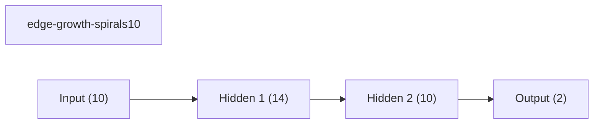
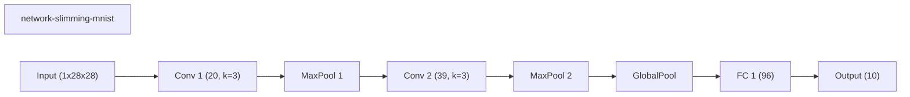
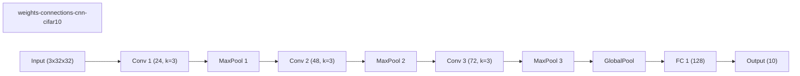

# Official Stadium Benchmark Suite

Suite manifest for official stadium-style track reports once the official protocols have been run and packaged.

## Suite Plots

## Benchmark Inventory

| Benchmark | Track | Tier | Acceptance | Seeds | Methods | Top overall | Top method |
| --- | --- | --- | --- | ---: | ---: | --- | --- |
| track-a-synthetic-official-v1 | synthetic_10d | official | PASS | 5 | 8 | edge-growth-spirals10 (0.6283) | edge-growth-spirals10 (0.6283) |
| track-b-mnist-official-v1 | mnist | official | PASS | 2 | 8 | network-slimming-mnist (0.8398) | network-slimming-mnist (0.8398) |
| track-c-cifar-official-extended | cifar10 | official_extended | PASS | 2 | 16 | wide-cnn-cifar10-bn (0.6789) | weights-connections-cnn-cifar10 (0.6540) |

## Method Coverage

| Method | Type | Appearances | Tracks | Best mean final val acc | Best benchmark |
| --- | --- | ---: | --- | ---: | --- |
| network-slimming-mnist | workflow | 1 | mnist | 0.8398 | track-b-mnist-official-v1 |
| wide-cnn-mnist-bn | baseline | 1 | mnist | 0.8340 | track-b-mnist-official-v1 |
| prunetrain-mnist | workflow | 1 | mnist | 0.8316 | track-b-mnist-official-v1 |
| layermerge-mnist | workflow | 1 | mnist | 0.8046 | track-b-mnist-official-v1 |
| runtime-neural-pruning-mnist | dynamic | 1 | mnist | 0.7975 | track-b-mnist-official-v1 |
| asfp-mnist | dynamic | 1 | mnist | 0.7882 | track-b-mnist-official-v1 |
| weights-connections-cnn-mnist | dynamic | 1 | mnist | 0.7816 | track-b-mnist-official-v1 |
| morphnet-mnist | workflow | 1 | mnist | 0.7473 | track-b-mnist-official-v1 |
| wide-cnn-cifar10-bn | baseline | 1 | cifar10 | 0.6789 | track-c-cifar-official-extended |
| weights-connections-cnn-cifar10 | dynamic | 1 | cifar10 | 0.6540 | track-c-cifar-official-extended |
| runtime-neural-pruning-cifar10 | dynamic | 1 | cifar10 | 0.6438 | track-c-cifar-official-extended |
| deep-cnn-cifar10 | baseline | 1 | cifar10 | 0.6408 | track-c-cifar-official-extended |
| channel-pruning-cifar10 | dynamic | 1 | cifar10 | 0.6390 | track-c-cifar-official-extended |
| edge-growth-spirals10 | dynamic | 1 | synthetic_10d | 0.6283 | track-a-synthetic-official-v1 |
| network-slimming-cifar10 | workflow | 1 | cifar10 | 0.6253 | track-c-cifar-official-extended |
| morphnet-cifar10 | workflow | 1 | cifar10 | 0.6244 | track-c-cifar-official-extended |
| adanet-spirals10 | workflow | 1 | synthetic_10d | 0.6227 | track-a-synthetic-official-v1 |
| layermerge-cifar10 | workflow | 1 | cifar10 | 0.6181 | track-c-cifar-official-extended |
| dynamic-nodes-spirals10 | dynamic | 1 | synthetic_10d | 0.6139 | track-a-synthetic-official-v1 |
| fixed-mlp-spirals10 | baseline | 1 | synthetic_10d | 0.6131 | track-a-synthetic-official-v1 |
| nest-spirals10 | dynamic | 1 | synthetic_10d | 0.6048 | track-a-synthetic-official-v1 |
| gradmax-spirals10 | dynamic | 1 | synthetic_10d | 0.6045 | track-a-synthetic-official-v1 |
| prunetrain-cifar10 | workflow | 1 | cifar10 | 0.6027 | track-c-cifar-official-extended |
| asfp-cifar10 | dynamic | 1 | cifar10 | 0.6007 | track-c-cifar-official-extended |
| den-spirals10 | dynamic | 1 | synthetic_10d | 0.5917 | track-a-synthetic-official-v1 |
| weights-connections-spirals10 | dynamic | 1 | synthetic_10d | 0.5861 | track-a-synthetic-official-v1 |
| dynamic-slimmable-cifar10 | workflow | 1 | cifar10 | 0.5266 | track-c-cifar-official-extended |
| channel-gating-cifar10 | workflow | 1 | cifar10 | 0.4944 | track-c-cifar-official-extended |
| skipnet-cifar10 | workflow | 1 | cifar10 | 0.4806 | track-c-cifar-official-extended |
| conditional-computation-cifar10 | workflow | 1 | cifar10 | 0.4538 | track-c-cifar-official-extended |
| iamnn-cifar10 | workflow | 1 | cifar10 | 0.4457 | track-c-cifar-official-extended |
| instance-wise-sparsity-cifar10 | workflow | 1 | cifar10 | 0.4450 | track-c-cifar-official-extended |

## track-a-synthetic-official-v1

Official Track A synthetic development benchmark.

Source: `D:\uni\asp\sem4\dynanets\reports\track_a_synthetic_official_v1`
Tier: `official`
Acceptance: `PASS`

| Method | Type | Mean final val acc | Std | Mean best val acc | Params | Weight sparsity |
| --- | --- | ---: | ---: | ---: | ---: | ---: |
| edge-growth-spirals10 | dynamic | 0.6283 | 0.0173 | 0.6496 | 326 | 0.0000 |
| adanet-spirals10 | workflow | 0.6227 | 0.0505 | 0.6664 | 420 | 0.0000 |
| dynamic-nodes-spirals10 | dynamic | 0.6139 | 0.0288 | 0.6475 | 242 | 0.0000 |
| fixed-mlp-spirals10 | baseline | 0.6131 | 0.0516 | 0.6603 | 236 | 0.0000 |
| nest-spirals10 | dynamic | 0.6048 | 0.0397 | 0.6229 | 158 | 0.0000 |
| gradmax-spirals10 | dynamic | 0.6045 | 0.0316 | 0.6293 | 184 | 0.0000 |
| den-spirals10 | dynamic | 0.5917 | 0.0366 | 0.6397 | 184 | 0.0000 |
| weights-connections-spirals10 | dynamic | 0.5861 | 0.0188 | 0.5989 | 236 | 0.4722 |

### Representative Graph: edge-growth-spirals10

## track-b-mnist-official-v1

Official Track B MNIST benchmark for the v1 subset.

Source: `D:\uni\asp\sem4\dynanets\reports\track_b_mnist_official_v1`
Tier: `official`
Acceptance: `PASS`

| Method | Type | Mean final val acc | Std | Mean best val acc | Params | Weight sparsity |
| --- | --- | ---: | ---: | ---: | ---: | ---: |
| network-slimming-mnist | workflow | 0.8398 | 0.0170 | 0.8398 | 12187 | 0.0000 |
| wide-cnn-mnist-bn | baseline | 0.8340 | 0.0162 | 0.8473 | 16474 | 0.0000 |
| prunetrain-mnist | workflow | 0.8316 | 0.0026 | 0.8316 | 12466 | 0.0000 |
| layermerge-mnist | workflow | 0.8046 | 0.0060 | 0.8046 | 14586 | 0.0000 |
| runtime-neural-pruning-mnist | dynamic | 0.7975 | 0.0283 | 0.7975 | 10156 | 0.0000 |
| asfp-mnist | dynamic | 0.7882 | 0.0116 | 0.8044 | 8305 | 0.0000 |
| weights-connections-cnn-mnist | dynamic | 0.7816 | 0.0474 | 0.8241 | 16474 | 0.3500 |
| morphnet-mnist | workflow | 0.7473 | 0.0297 | 0.7913 | 10678 | 0.0000 |

### Representative Graph: network-slimming-mnist

## track-c-cifar-official-extended

Official Track C extended CIFAR benchmark.

Source: `D:\uni\asp\sem4\dynanets\reports\track_c_cifar_official_extended`
Tier: `official_extended`
Acceptance: `PASS`

| Method | Type | Mean final val acc | Std | Mean best val acc | Params | Weight sparsity |
| --- | --- | ---: | ---: | ---: | ---: | ---: |
| wide-cnn-cifar10-bn | baseline | 0.6789 | 0.0095 | 0.6789 | 92298 | 0.0000 |
| weights-connections-cnn-cifar10 | dynamic | 0.6540 | 0.0034 | 0.6542 | 53186 | 0.2499 |
| runtime-neural-pruning-cifar10 | dynamic | 0.6438 | 0.0026 | 0.6448 | 32468 | 0.0000 |
| deep-cnn-cifar10 | baseline | 0.6408 | 0.0014 | 0.6447 | 76066 | 0.0000 |
| channel-pruning-cifar10 | dynamic | 0.6390 | 0.0038 | 0.6390 | 24353 | 0.0000 |
| network-slimming-cifar10 | workflow | 0.6253 | 0.0093 | 0.6260 | 38798 | 0.0000 |
| morphnet-cifar10 | workflow | 0.6244 | 0.0022 | 0.6244 | 35561 | 0.0000 |
| layermerge-cifar10 | workflow | 0.6181 | 0.0081 | 0.6187 | 50530 | 0.0000 |
| prunetrain-cifar10 | workflow | 0.6027 | 0.0111 | 0.6084 | 37492 | 0.0000 |
| asfp-cifar10 | dynamic | 0.6007 | 0.0111 | 0.6191 | 15792 | 0.0000 |
| dynamic-slimmable-cifar10 | workflow | 0.5266 | 0.0038 | 0.5266 | 221178 | 0.0000 |
| channel-gating-cifar10 | workflow | 0.4944 | 0.0112 | 0.4953 | 123578 | 0.0000 |
| skipnet-cifar10 | workflow | 0.4806 | 0.0090 | 0.4832 | 123578 | 0.0000 |
| conditional-computation-cifar10 | workflow | 0.4538 | 0.0038 | 0.4538 | 168922 | 0.0000 |
| iamnn-cifar10 | workflow | 0.4457 | 0.0013 | 0.4487 | 138962 | 0.0000 |
| instance-wise-sparsity-cifar10 | workflow | 0.4450 | 0.0146 | 0.4491 | 75754 | 0.0000 |

### Representative Graph: weights-connections-cnn-cifar10

