# Benchmark Summary

Seeds: 7, 42

## Aggregate Plots

| Experiment | Type | Runs | Mean final val acc | Std final val acc | Mean best val acc | Mean adaptations | Mean final hidden dim | Best seed |
| --- | --- | ---: | ---: | ---: | ---: | ---: | ---: | ---: |
| wide-cnn-cifar10-bn | baseline | 2 | 0.6789 | 0.0095 | 0.6789 | 0.00 | 0.0 | 42 |
| weights-connections-cnn-cifar10 | dynamic | 2 | 0.6540 | 0.0034 | 0.6542 | 5.00 | 0.0 | 42 |
| runtime-neural-pruning-cifar10 | dynamic | 2 | 0.6438 | 0.0026 | 0.6448 | 3.00 | 0.0 | 42 |
| deep-cnn-cifar10 | baseline | 2 | 0.6408 | 0.0014 | 0.6447 | 0.00 | 0.0 | 42 |
| channel-pruning-cifar10 | dynamic | 2 | 0.6390 | 0.0038 | 0.6390 | 4.00 | 0.0 | 42 |
| network-slimming-cifar10 | workflow | 2 | 0.6253 | 0.0093 | 0.6260 | 1.00 | 0.0 | 42 |
| morphnet-cifar10 | workflow | 2 | 0.6244 | 0.0022 | 0.6244 | 1.00 | 0.0 | 42 |
| layermerge-cifar10 | workflow | 2 | 0.6181 | 0.0081 | 0.6187 | 1.00 | 0.0 | 7 |
| prunetrain-cifar10 | workflow | 2 | 0.6027 | 0.0111 | 0.6084 | 3.00 | 0.0 | 42 |
| asfp-cifar10 | dynamic | 2 | 0.6007 | 0.0111 | 0.6191 | 9.00 | 0.0 | 7 |
| dynamic-slimmable-cifar10 | workflow | 2 | 0.5266 | 0.0038 | 0.5266 | 0.00 | - | 42 |
| channel-gating-cifar10 | workflow | 2 | 0.4944 | 0.0112 | 0.4953 | 0.00 | - | 42 |
| skipnet-cifar10 | workflow | 2 | 0.4806 | 0.0090 | 0.4832 | 0.00 | - | 42 |
| conditional-computation-cifar10 | workflow | 2 | 0.4538 | 0.0038 | 0.4538 | 0.00 | - | 42 |
| iamnn-cifar10 | workflow | 2 | 0.4457 | 0.0013 | 0.4487 | 0.00 | - | 42 |
| instance-wise-sparsity-cifar10 | workflow | 2 | 0.4450 | 0.0146 | 0.4491 | 0.00 | - | 42 |

## Accuracy-FLOP Pareto Frontier

- `asfp-cifar10`: acc=0.6007, flop_proxy=3122058, params=15792
- `channel-pruning-cifar10`: acc=0.6390, flop_proxy=4753562, params=24353
- `runtime-neural-pruning-cifar10`: acc=0.6438, flop_proxy=6338410, params=32468
- `weights-connections-cnn-cifar10`: acc=0.6540, flop_proxy=10772746, params=53186
- `wide-cnn-cifar10-bn`: acc=0.6789, flop_proxy=18498346, params=92298

## Constraint Summary

| Experiment | Mean params | Mean nonzero params | Mean weight sparsity | Mean FLOP proxy | Mean activation elems |
| --- | ---: | ---: | ---: | ---: | ---: |
| wide-cnn-cifar10-bn | 92298 | 92298 | 0.0000 | 18498346 | 14090 |
| weights-connections-cnn-cifar10 | 53186 | 40036 | 0.2499 | 10772746 | 10578 |
| runtime-neural-pruning-cifar10 | 32468 | 32468 | 0.0000 | 6338410 | 7968 |
| deep-cnn-cifar10 | 76066 | 76066 | 0.0000 | 10818346 | 10738 |
| channel-pruning-cifar10 | 24353 | 24353 | 0.0000 | 4753562 | 6919 |
| network-slimming-cifar10 | 38798 | 38798 | 0.0000 | 7687498 | 8838 |
| morphnet-cifar10 | 35561 | 35561 | 0.0000 | 6996826 | 8403 |
| layermerge-cifar10 | 50530 | 50530 | 0.0000 | 10767466 | 10546 |
| prunetrain-cifar10 | 37492 | 37492 | 0.0000 | 7672938 | 8996 |
| asfp-cifar10 | 15792 | 15792 | 0.0000 | 3122058 | 5546 |
| dynamic-slimmable-cifar10 | 221178 | 221178 | 0.0000 | 52765322 | 24234 |
| channel-gating-cifar10 | 123578 | 123578 | 0.0000 | 28843530 | 17546 |
| skipnet-cifar10 | 123578 | 123578 | 0.0000 | 28843530 | 17546 |
| conditional-computation-cifar10 | 168922 | 168922 | 0.0000 | 39919690 | 20890 |
| iamnn-cifar10 | 138962 | 138962 | 0.0000 | 33348618 | 19082 |
| instance-wise-sparsity-cifar10 | 75754 | 75754 | 0.0000 | 18355594 | 13930 |

## Experiment Notes

- `wide-cnn-cifar10-bn`: device=cuda; requested_device=auto; torch=2.11.0+cu128; cuda_available=True; torch_cuda=12.8; cuda_device=NVIDIA GeForce RTX 4070 Laptop GPU
- `weights-connections-cnn-cifar10`: adaptation=weights_connections; device=cuda; requested_device=auto; torch=2.11.0+cu128; cuda_available=True; torch_cuda=12.8; cuda_device=NVIDIA GeForce RTX 4070 Laptop GPU
- `runtime-neural-pruning-cifar10`: adaptation=runtime_neural_pruning; device=cuda; requested_device=auto; torch=2.11.0+cu128; cuda_available=True; torch_cuda=12.8; cuda_device=NVIDIA GeForce RTX 4070 Laptop GPU
- `deep-cnn-cifar10`: device=cuda; requested_device=auto; torch=2.11.0+cu128; cuda_available=True; torch_cuda=12.8; cuda_device=NVIDIA GeForce RTX 4070 Laptop GPU
- `channel-pruning-cifar10`: adaptation=channel_pruning; device=cuda; requested_device=auto; torch=2.11.0+cu128; cuda_available=True; torch_cuda=12.8; cuda_device=NVIDIA GeForce RTX 4070 Laptop GPU
- `network-slimming-cifar10`: workflow=network_slimming; device=cuda; requested_device=auto; torch=2.11.0+cu128; cuda_available=True; torch_cuda=12.8; cuda_device=NVIDIA GeForce RTX 4070 Laptop GPU
- `morphnet-cifar10`: workflow=morphnet; device=cuda; requested_device=auto; torch=2.11.0+cu128; cuda_available=True; torch_cuda=12.8; cuda_device=NVIDIA GeForce RTX 4070 Laptop GPU
- `layermerge-cifar10`: workflow=layermerge; device=cuda; requested_device=auto; torch=2.11.0+cu128; cuda_available=True; torch_cuda=12.8; cuda_device=NVIDIA GeForce RTX 4070 Laptop GPU
- `prunetrain-cifar10`: workflow=prunetrain; device=cuda; requested_device=auto; torch=2.11.0+cu128; cuda_available=True; torch_cuda=12.8; cuda_device=NVIDIA GeForce RTX 4070 Laptop GPU
- `asfp-cifar10`: adaptation=soft_filter_pruning; device=cuda; requested_device=auto; torch=2.11.0+cu128; cuda_available=True; torch_cuda=12.8; cuda_device=NVIDIA GeForce RTX 4070 Laptop GPU
- `dynamic-slimmable-cifar10`: workflow=dynamic_slimmable; route_summary={'policy': 'dynamic_width', 'routing_family': 'slimmable_pyramid', 'mode': 'eval', 'gate_mode': 'learned', 'gate_metric': 'margin', 'confidence_threshold': 0.22, 'target_cost_ratio': 0.9, 'target_accept_rate': 0.4, 'stage_target_accept_rates': {'0.75': 0.1282, '0.875': 0.24, '1.0': None}, 'route_counts': {'0.75': 25, '0.875': 27, '1.0': 84}, 'trace_samples': [{'sample': 0, 'width': 0.75}, {'sample': 1, 'width': 1.0}, {'sample': 2, 'width': 0.75}, {'sample': 3, 'width': 0.75}, {'sample': 4, 'width': 0.75}, {'sample': 5, 'width': 0.875}, {'sample': 6, 'width': 0.75}, {'sample': 7, 'width': 1.0}], 'mean_width': 0.9292, 'mean_cost_ratio': 0.8731}; device=cuda; requested_device=auto; torch=2.11.0+cu128; cuda_available=True; torch_cuda=12.8; cuda_device=NVIDIA GeForce RTX 4070 Laptop GPU
- `channel-gating-cifar10`: workflow=channel_gating; route_summary={'policy': 'dynamic_width', 'routing_family': 'channel_gate_pyramid', 'mode': 'eval', 'gate_mode': 'learned', 'gate_metric': 'margin', 'confidence_threshold': 0.2, 'target_cost_ratio': 0.88, 'target_accept_rate': 0.44, 'stage_target_accept_rates': {'0.75': 0.1515, '0.875': 0.28, '1.0': None}, 'route_counts': {'0.75': 77, '0.875': 17, '1.0': 42}, 'trace_samples': [{'sample': 0, 'width': 0.75}, {'sample': 1, 'width': 0.75}, {'sample': 2, 'width': 0.75}, {'sample': 3, 'width': 0.75}, {'sample': 4, 'width': 0.75}, {'sample': 5, 'width': 0.75}, {'sample': 6, 'width': 0.875}, {'sample': 7, 'width': 0.75}], 'mean_width': 0.8428, 'mean_cost_ratio': 0.7233}; device=cuda; requested_device=auto; torch=2.11.0+cu128; cuda_available=True; torch_cuda=12.8; cuda_device=NVIDIA GeForce RTX 4070 Laptop GPU
- `skipnet-cifar10`: workflow=skipnet; route_summary={'policy': 'early_exit', 'routing_family': 'skip_cascade', 'mode': 'eval', 'gate_mode': 'learned', 'gate_metric': 'margin', 'confidence_threshold': 0.21, 'target_cost_ratio': 0.9, 'target_accept_rate': 0.1, 'early_exit_fraction': 0.4485, 'eligible_fraction': 0.9485, 'mean_gate_score': 0.2146, 'max_gate_score': 0.5349, 'mean_exit_confidence': 0.5868, 'full_path_fraction': 0.5515, 'trace_samples': [{'sample': 0, 'path': 'early'}, {'sample': 1, 'path': 'early'}, {'sample': 2, 'path': 'full'}, {'sample': 3, 'path': 'full'}, {'sample': 4, 'path': 'early'}, {'sample': 5, 'path': 'early'}, {'sample': 6, 'path': 'early'}, {'sample': 7, 'path': 'early'}], 'mean_width': 1.0, 'mean_cost_ratio': 0.6879}; device=cuda; requested_device=auto; torch=2.11.0+cu128; cuda_available=True; torch_cuda=12.8; cuda_device=NVIDIA GeForce RTX 4070 Laptop GPU
- `conditional-computation-cifar10`: workflow=conditional_computation; route_summary={'policy': 'early_exit', 'routing_family': 'early_exit_cascade', 'mode': 'eval', 'gate_mode': 'learned', 'gate_metric': 'margin', 'confidence_threshold': 0.22, 'target_cost_ratio': 0.92, 'target_accept_rate': 0.08, 'early_exit_fraction': 0.0809, 'eligible_fraction': 0.8456, 'mean_gate_score': 0.04, 'max_gate_score': 0.199, 'mean_exit_confidence': 0.6396, 'full_path_fraction': 0.9191, 'trace_samples': [{'sample': 0, 'path': 'full'}, {'sample': 1, 'path': 'full'}, {'sample': 2, 'path': 'full'}, {'sample': 3, 'path': 'full'}, {'sample': 4, 'path': 'full'}, {'sample': 5, 'path': 'early'}, {'sample': 6, 'path': 'full'}, {'sample': 7, 'path': 'full'}], 'mean_width': 1.0, 'mean_cost_ratio': 0.9245}; device=cuda; requested_device=auto; torch=2.11.0+cu128; cuda_available=True; torch_cuda=12.8; cuda_device=NVIDIA GeForce RTX 4070 Laptop GPU
- `iamnn-cifar10`: workflow=iamnn; route_summary={'policy': 'early_exit', 'routing_family': 'iterative_refine', 'mode': 'eval', 'gate_mode': 'learned', 'gate_metric': 'margin', 'confidence_threshold': 0.2, 'target_cost_ratio': 0.72, 'target_accept_rate': 0.12, 'early_exit_fraction': 0.1176, 'eligible_fraction': 0.9338, 'mean_gate_score': 0.085, 'max_gate_score': 0.2123, 'mean_exit_confidence': 0.6851, 'full_path_fraction': 0.8824, 'trace_samples': [{'sample': 0, 'path': 'full'}, {'sample': 1, 'path': 'full'}, {'sample': 2, 'path': 'full'}, {'sample': 3, 'path': 'full'}, {'sample': 4, 'path': 'early'}, {'sample': 5, 'path': 'full'}, {'sample': 6, 'path': 'full'}, {'sample': 7, 'path': 'full'}], 'mean_width': 1.0, 'mean_cost_ratio': 0.9216}; device=cuda; requested_device=auto; torch=2.11.0+cu128; cuda_available=True; torch_cuda=12.8; cuda_device=NVIDIA GeForce RTX 4070 Laptop GPU
- `instance-wise-sparsity-cifar10`: workflow=instance_wise_sparsity; route_summary={'policy': 'dynamic_width', 'routing_family': 'instance_sparse_pyramid', 'mode': 'eval', 'gate_mode': 'learned', 'gate_metric': 'margin', 'confidence_threshold': 0.18, 'target_cost_ratio': 0.68, 'target_accept_rate': 0.4, 'stage_target_accept_rates': {'0.75': 0.1633}, 'route_counts': {'0.75': 136, '0.875': 0, '1.0': 0}, 'trace_samples': [{'sample': 0, 'width': 0.75}, {'sample': 1, 'width': 0.75}, {'sample': 2, 'width': 0.75}, {'sample': 3, 'width': 0.75}, {'sample': 4, 'width': 0.75}, {'sample': 5, 'width': 0.75}, {'sample': 6, 'width': 0.75}, {'sample': 7, 'width': 0.75}], 'mean_width': 0.75, 'mean_cost_ratio': 0.5631}; device=cuda; requested_device=auto; torch=2.11.0+cu128; cuda_available=True; torch_cuda=12.8; cuda_device=NVIDIA GeForce RTX 4070 Laptop GPU

## Per-Seed Results

### wide-cnn-cifar10-bn
- seed 7: final=0.6694, best=0.6694, adaptations=0, params=92298, nonzero=92298, sparsity=0.0000
- seed 42: final=0.6884, best=0.6884, adaptations=0, params=92298, nonzero=92298, sparsity=0.0000

### weights-connections-cnn-cifar10
- seed 7: final=0.6506, best=0.6506, adaptations=5, params=53186, nonzero=40036, sparsity=0.2499
- seed 42: final=0.6574, best=0.6578, adaptations=5, params=53186, nonzero=40036, sparsity=0.2499

### runtime-neural-pruning-cifar10
- seed 7: final=0.6412, best=0.6432, adaptations=3, params=32468, nonzero=32468, sparsity=0.0000
- seed 42: final=0.6464, best=0.6464, adaptations=3, params=32468, nonzero=32468, sparsity=0.0000

### deep-cnn-cifar10
- seed 7: final=0.6422, best=0.6422, adaptations=0, params=76066, nonzero=76066, sparsity=0.0000
- seed 42: final=0.6394, best=0.6472, adaptations=0, params=76066, nonzero=76066, sparsity=0.0000

### channel-pruning-cifar10
- seed 7: final=0.6352, best=0.6352, adaptations=4, params=24353, nonzero=24353, sparsity=0.0000
- seed 42: final=0.6428, best=0.6428, adaptations=4, params=24353, nonzero=24353, sparsity=0.0000

### network-slimming-cifar10
- seed 7: final=0.6160, best=0.6174, adaptations=1, params=38798, nonzero=38798, sparsity=0.0000
- seed 42: final=0.6346, best=0.6346, adaptations=1, params=38798, nonzero=38798, sparsity=0.0000

### morphnet-cifar10
- seed 7: final=0.6222, best=0.6222, adaptations=1, params=35561, nonzero=35561, sparsity=0.0000
- seed 42: final=0.6266, best=0.6266, adaptations=1, params=35561, nonzero=35561, sparsity=0.0000

### layermerge-cifar10
- seed 7: final=0.6262, best=0.6262, adaptations=1, params=50530, nonzero=50530, sparsity=0.0000
- seed 42: final=0.6100, best=0.6112, adaptations=1, params=50530, nonzero=50530, sparsity=0.0000

### prunetrain-cifar10
- seed 7: final=0.5916, best=0.6030, adaptations=3, params=37492, nonzero=37492, sparsity=0.0000
- seed 42: final=0.6138, best=0.6138, adaptations=3, params=37492, nonzero=37492, sparsity=0.0000

### asfp-cifar10
- seed 7: final=0.5896, best=0.6210, adaptations=9, params=15792, nonzero=15792, sparsity=0.0000
- seed 42: final=0.6118, best=0.6172, adaptations=9, params=15792, nonzero=15792, sparsity=0.0000

### dynamic-slimmable-cifar10
- seed 7: final=0.5228, best=0.5228, adaptations=0, params=221178, nonzero=221178, sparsity=0.0000
- seed 42: final=0.5304, best=0.5304, adaptations=0, params=221178, nonzero=221178, sparsity=0.0000

### channel-gating-cifar10
- seed 7: final=0.4832, best=0.4832, adaptations=0, params=123578, nonzero=123578, sparsity=0.0000
- seed 42: final=0.5056, best=0.5074, adaptations=0, params=123578, nonzero=123578, sparsity=0.0000

### skipnet-cifar10
- seed 7: final=0.4716, best=0.4768, adaptations=0, params=123578, nonzero=123578, sparsity=0.0000
- seed 42: final=0.4896, best=0.4896, adaptations=0, params=123578, nonzero=123578, sparsity=0.0000

### conditional-computation-cifar10
- seed 7: final=0.4500, best=0.4500, adaptations=0, params=168922, nonzero=168922, sparsity=0.0000
- seed 42: final=0.4576, best=0.4576, adaptations=0, params=168922, nonzero=168922, sparsity=0.0000

### iamnn-cifar10
- seed 7: final=0.4470, best=0.4474, adaptations=0, params=138962, nonzero=138962, sparsity=0.0000
- seed 42: final=0.4444, best=0.4500, adaptations=0, params=138962, nonzero=138962, sparsity=0.0000

### instance-wise-sparsity-cifar10
- seed 7: final=0.4304, best=0.4386, adaptations=0, params=75754, nonzero=75754, sparsity=0.0000
- seed 42: final=0.4596, best=0.4596, adaptations=0, params=75754, nonzero=75754, sparsity=0.0000

## Representative Stage Histories

### wide-cnn-cifar10-bn (best seed 42)
- train: epochs=12, range=1..12, adaptation_enabled=False, final_val=0.6883999705314636

### weights-connections-cnn-cifar10 (best seed 42)
- train: epochs=12, range=1..12, adaptation_enabled=True, final_val=0.6574000120162964

### runtime-neural-pruning-cifar10 (best seed 42)
- train: epochs=12, range=1..12, adaptation_enabled=True, final_val=0.646399974822998

### deep-cnn-cifar10 (best seed 42)
- train: epochs=12, range=1..12, adaptation_enabled=False, final_val=0.6394000053405762

### channel-pruning-cifar10 (best seed 42)
- train: epochs=12, range=1..12, adaptation_enabled=True, final_val=0.642799973487854

### network-slimming-cifar10 (best seed 42)
- network_slimming_sparse_train: epochs=7, range=1..7, adaptation_enabled=False, final_val=0.6161999702453613
- network_slimming_finetune: epochs=5, range=8..12, adaptation_enabled=False, final_val=0.6345999836921692

### morphnet-cifar10 (best seed 42)
- morphnet_resource_train: epochs=7, range=1..7, adaptation_enabled=False, final_val=0.6197999715805054
- morphnet_finetune: epochs=5, range=8..12, adaptation_enabled=False, final_val=0.6266000270843506

### layermerge-cifar10 (best seed 7)
- layermerge_pretrain: epochs=8, range=1..8, adaptation_enabled=False, final_val=0.6133999824523926
- layermerge_finetune: epochs=4, range=9..12, adaptation_enabled=False, final_val=0.6262000203132629

### prunetrain-cifar10 (best seed 42)
- prunetrain_segment_1: epochs=4, range=1..4, adaptation_enabled=False, final_val=0.5708000063896179
- prunetrain_segment_2: epochs=4, range=5..8, adaptation_enabled=False, final_val=0.6037999987602234
- prunetrain_segment_3: epochs=2, range=9..10, adaptation_enabled=False, final_val=0.6086000204086304
- prunetrain_segment_4: epochs=2, range=11..12, adaptation_enabled=False, final_val=0.6137999892234802

### asfp-cifar10 (best seed 7)
- train: epochs=12, range=1..12, adaptation_enabled=True, final_val=0.5896000266075134

### dynamic-slimmable-cifar10 (best seed 42)
- dynamic_slimmable_warmup: epochs=4, range=1..4, adaptation_enabled=False, final_val=0.4047999978065491
- dynamic_slimmable_routing: epochs=8, range=5..12, adaptation_enabled=False, final_val=0.5303999781608582

### channel-gating-cifar10 (best seed 42)
- channel_gating_warmup: epochs=4, range=1..4, adaptation_enabled=False, final_val=0.3779999911785126
- channel_gating_routing: epochs=8, range=5..12, adaptation_enabled=False, final_val=0.5055999755859375

### skipnet-cifar10 (best seed 42)
- skipnet_warmup: epochs=4, range=1..4, adaptation_enabled=False, final_val=0.37299999594688416
- skipnet_routing: epochs=8, range=5..12, adaptation_enabled=False, final_val=0.4896000027656555

### conditional-computation-cifar10 (best seed 42)
- conditional_computation_warmup: epochs=4, range=1..4, adaptation_enabled=False, final_val=0.3522000014781952
- conditional_computation_routing: epochs=8, range=5..12, adaptation_enabled=False, final_val=0.4575999975204468

### iamnn-cifar10 (best seed 42)
- iamnn_warmup: epochs=4, range=1..4, adaptation_enabled=False, final_val=0.3684000074863434
- iamnn_routing: epochs=6, range=5..10, adaptation_enabled=False, final_val=0.4408000111579895
- iamnn_consolidation: epochs=2, range=11..12, adaptation_enabled=False, final_val=0.44440001249313354

### instance-wise-sparsity-cifar10 (best seed 42)
- instance_wise_sparsity_warmup: epochs=4, range=1..4, adaptation_enabled=False, final_val=0.3580000102519989
- instance_wise_sparsity_routing: epochs=6, range=5..10, adaptation_enabled=False, final_val=0.4514000117778778
- instance_wise_sparsity_consolidation: epochs=2, range=11..12, adaptation_enabled=False, final_val=0.4596000015735626

## Representative Architectures

### wide-cnn-cifar10-bn (best seed 42)
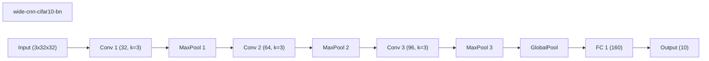

### weights-connections-cnn-cifar10 (best seed 42)
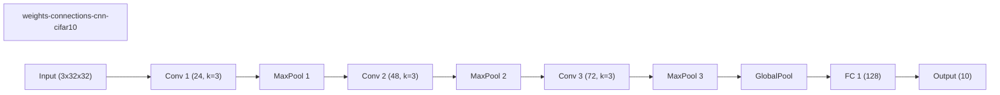

### runtime-neural-pruning-cifar10 (best seed 42)

### deep-cnn-cifar10 (best seed 42)
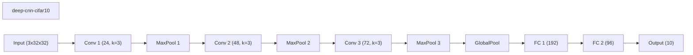

### channel-pruning-cifar10 (best seed 42)

### network-slimming-cifar10 (best seed 42)
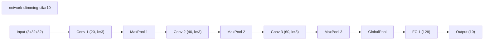

### morphnet-cifar10 (best seed 42)
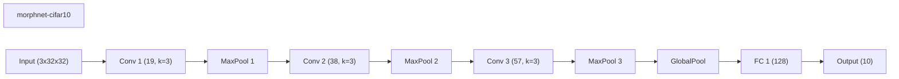

### layermerge-cifar10 (best seed 7)

### prunetrain-cifar10 (best seed 42)
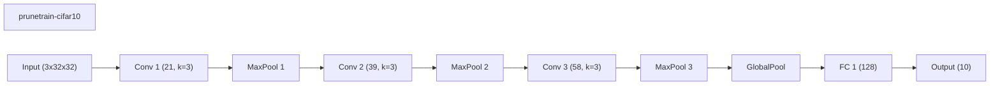

### asfp-cifar10 (best seed 7)
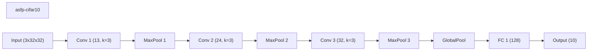

### dynamic-slimmable-cifar10 (best seed 42)
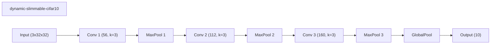

### channel-gating-cifar10 (best seed 42)
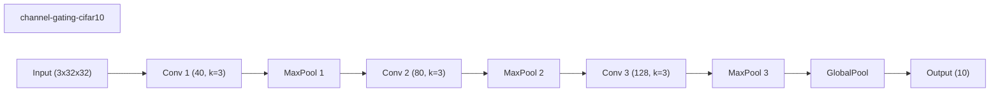

### skipnet-cifar10 (best seed 42)
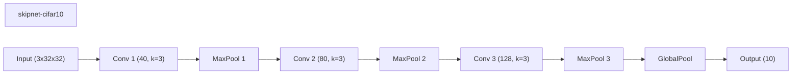

### conditional-computation-cifar10 (best seed 42)

### iamnn-cifar10 (best seed 42)

### instance-wise-sparsity-cifar10 (best seed 42)
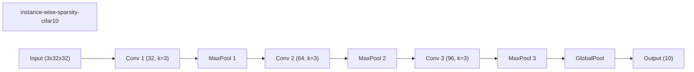
