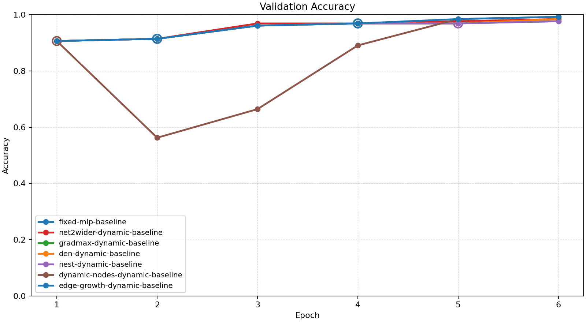
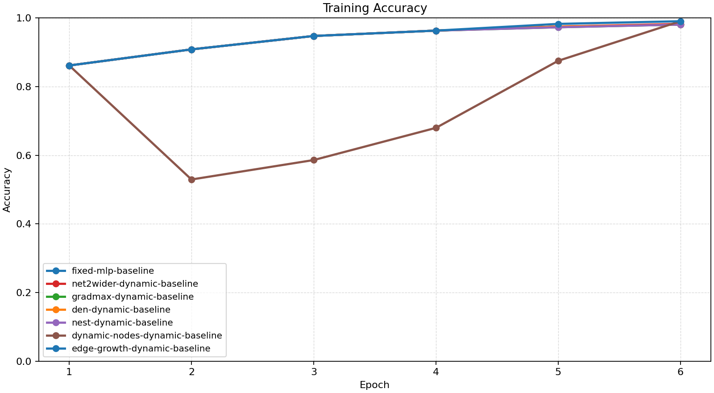
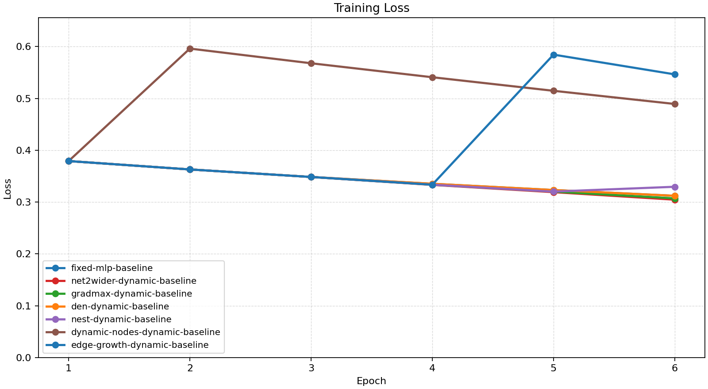
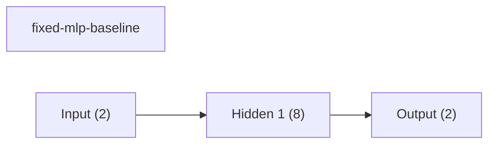
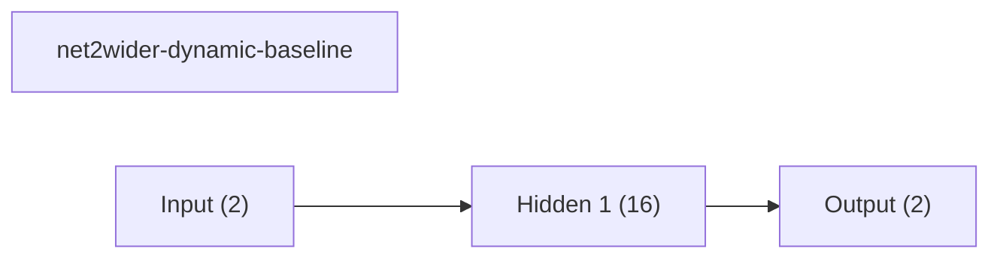
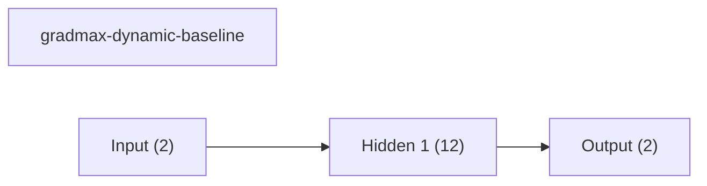
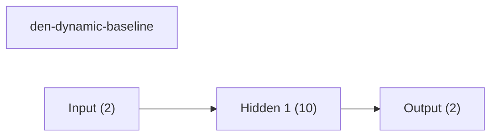
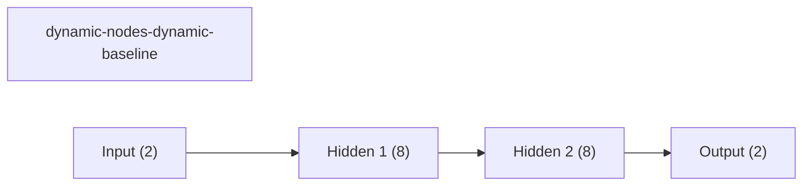
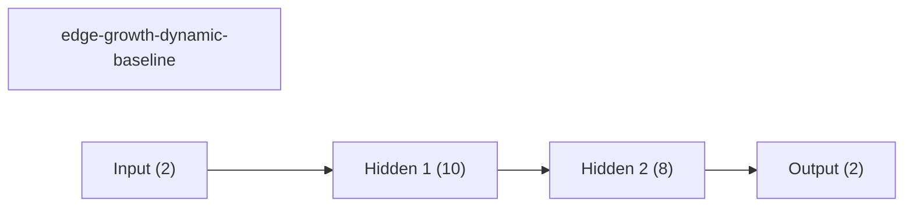
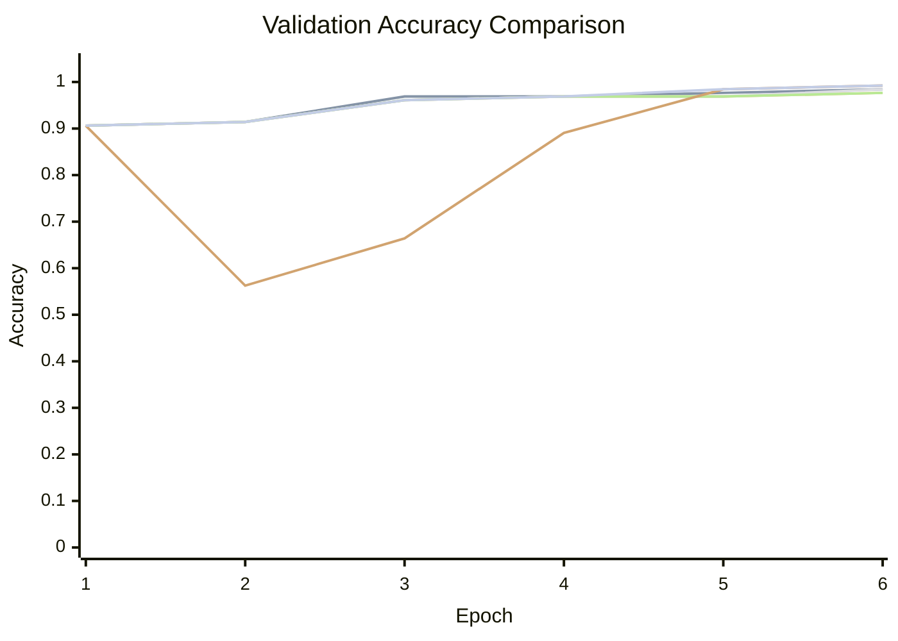

# Baseline Comparison

| Experiment | Type | Epochs | Final train acc | Final val acc | Best val acc | Adaptations | Final hidden dim |
| --- | --- | ---: | ---: | ---: | ---: | ---: | ---: |
| fixed-mlp-baseline | baseline | 6 | 0.9805 | 0.9844 | 0.9844 | 0 | - |
| net2wider-dynamic-baseline | dynamic | 6 | 0.9824 | 0.9844 | 0.9844 | 2 | 16 |
| gradmax-dynamic-baseline | dynamic | 6 | 0.9805 | 0.9766 | 0.9766 | 2 | 12 |
| den-dynamic-baseline | dynamic | 6 | 0.9805 | 0.9844 | 0.9844 | 1 | 10 |
| nest-dynamic-baseline | dynamic | 6 | 0.9805 | 0.9766 | 0.9766 | 2 | 9 |
| dynamic-nodes-dynamic-baseline | dynamic | 6 | 0.9902 | 0.9922 | 0.9922 | 1 | 8 |
| edge-growth-dynamic-baseline | dynamic | 6 | 0.9902 | 0.9922 | 0.9922 | 2 | 10 |

## Validation Accuracy

## Training Accuracy

## Training Loss

## Experiment Notes

- `net2wider-dynamic-baseline`: adaptation=net2wider
- `gradmax-dynamic-baseline`: adaptation=gradmax
- `den-dynamic-baseline`: adaptation=den
- `nest-dynamic-baseline`: adaptation=nest
- `dynamic-nodes-dynamic-baseline`: adaptation=dynamic_nodes
- `edge-growth-dynamic-baseline`: adaptation=edge_growth

## Adaptation Timeline

### net2wider-dynamic-baseline
- epoch 2: `net2wider` params={'amount': 4, 'seed': 43} effect={'applied': True, 'structural_change': True, 'version_delta': 1, 'step_delta': 0, 'hidden_dim_delta': 4, 'num_hidden_layers_delta': 0, 'hidden_dims_changed': True} before={'hidden_dim': 8, 'hidden_dims': [8], 'output_dim': 2, 'num_hidden_layers': 1, 'supported_events': ['grow_hidden', 'insert_hidden_layer', 'net2wider', 'prune_hidden']} after={'hidden_dim': 12, 'hidden_dims': [12], 'output_dim': 2, 'num_hidden_layers': 1, 'supported_events': ['grow_hidden', 'insert_hidden_layer', 'net2wider', 'prune_hidden']} capabilities=['grow_hidden', 'insert_hidden_layer', 'net2wider', 'prune_hidden']
- epoch 4: `net2wider` params={'amount': 4, 'seed': 45} effect={'applied': True, 'structural_change': True, 'version_delta': 1, 'step_delta': 0, 'hidden_dim_delta': 4, 'num_hidden_layers_delta': 0, 'hidden_dims_changed': True} before={'hidden_dim': 12, 'hidden_dims': [12], 'output_dim': 2, 'num_hidden_layers': 1, 'supported_events': ['grow_hidden', 'insert_hidden_layer', 'net2wider', 'prune_hidden']} after={'hidden_dim': 16, 'hidden_dims': [16], 'output_dim': 2, 'num_hidden_layers': 1, 'supported_events': ['grow_hidden', 'insert_hidden_layer', 'net2wider', 'prune_hidden']} capabilities=['grow_hidden', 'insert_hidden_layer', 'net2wider', 'prune_hidden']

### gradmax-dynamic-baseline
- epoch 2: `net2wider` params={'amount': 2} effect={'applied': True, 'structural_change': True, 'version_delta': 1, 'step_delta': 0, 'hidden_dim_delta': 2, 'num_hidden_layers_delta': 0, 'hidden_dims_changed': True} before={'hidden_dim': 8, 'hidden_dims': [8], 'output_dim': 2, 'num_hidden_layers': 1, 'supported_events': ['grow_hidden', 'insert_hidden_layer', 'net2wider', 'prune_hidden']} after={'hidden_dim': 10, 'hidden_dims': [10], 'output_dim': 2, 'num_hidden_layers': 1, 'supported_events': ['grow_hidden', 'insert_hidden_layer', 'net2wider', 'prune_hidden']} capabilities=['grow_hidden', 'insert_hidden_layer', 'net2wider', 'prune_hidden']
- epoch 4: `net2wider` params={'amount': 2} effect={'applied': True, 'structural_change': True, 'version_delta': 1, 'step_delta': 0, 'hidden_dim_delta': 2, 'num_hidden_layers_delta': 0, 'hidden_dims_changed': True} before={'hidden_dim': 10, 'hidden_dims': [10], 'output_dim': 2, 'num_hidden_layers': 1, 'supported_events': ['grow_hidden', 'insert_hidden_layer', 'net2wider', 'prune_hidden']} after={'hidden_dim': 12, 'hidden_dims': [12], 'output_dim': 2, 'num_hidden_layers': 1, 'supported_events': ['grow_hidden', 'insert_hidden_layer', 'net2wider', 'prune_hidden']} capabilities=['grow_hidden', 'insert_hidden_layer', 'net2wider', 'prune_hidden']

### den-dynamic-baseline
- epoch 5: `net2wider` params={'amount': 2} effect={'applied': True, 'structural_change': True, 'version_delta': 1, 'step_delta': 0, 'hidden_dim_delta': 2, 'num_hidden_layers_delta': 0, 'hidden_dims_changed': True} before={'hidden_dim': 8, 'hidden_dims': [8], 'output_dim': 2, 'num_hidden_layers': 1, 'supported_events': ['grow_hidden', 'insert_hidden_layer', 'net2wider', 'prune_hidden']} after={'hidden_dim': 10, 'hidden_dims': [10], 'output_dim': 2, 'num_hidden_layers': 1, 'supported_events': ['grow_hidden', 'insert_hidden_layer', 'net2wider', 'prune_hidden']} capabilities=['grow_hidden', 'insert_hidden_layer', 'net2wider', 'prune_hidden']

### nest-dynamic-baseline
- epoch 2: `net2wider` params={'amount': 2} effect={'applied': True, 'structural_change': True, 'version_delta': 1, 'step_delta': 0, 'hidden_dim_delta': 2, 'num_hidden_layers_delta': 0, 'hidden_dims_changed': True} before={'hidden_dim': 8, 'hidden_dims': [8], 'output_dim': 2, 'num_hidden_layers': 1, 'supported_events': ['grow_hidden', 'insert_hidden_layer', 'net2wider', 'prune_hidden']} after={'hidden_dim': 10, 'hidden_dims': [10], 'output_dim': 2, 'num_hidden_layers': 1, 'supported_events': ['grow_hidden', 'insert_hidden_layer', 'net2wider', 'prune_hidden']} capabilities=['grow_hidden', 'insert_hidden_layer', 'net2wider', 'prune_hidden']
- epoch 5: `prune_hidden` params={'amount': 1, 'min_width': 8} effect={'applied': True, 'structural_change': True, 'version_delta': 1, 'step_delta': 0, 'hidden_dim_delta': -1, 'num_hidden_layers_delta': 0, 'hidden_dims_changed': True} before={'hidden_dim': 10, 'hidden_dims': [10], 'output_dim': 2, 'num_hidden_layers': 1, 'supported_events': ['grow_hidden', 'insert_hidden_layer', 'net2wider', 'prune_hidden']} after={'hidden_dim': 9, 'hidden_dims': [9], 'output_dim': 2, 'num_hidden_layers': 1, 'supported_events': ['grow_hidden', 'insert_hidden_layer', 'net2wider', 'prune_hidden']} capabilities=['grow_hidden', 'insert_hidden_layer', 'net2wider', 'prune_hidden']

### dynamic-nodes-dynamic-baseline
- epoch 1: `insert_hidden_layer` params={'layer_index': 1, 'width': 8} effect={'applied': True, 'structural_change': True, 'version_delta': 1, 'step_delta': 0, 'hidden_dim_delta': 0, 'num_hidden_layers_delta': 1, 'hidden_dims_changed': True} before={'hidden_dim': 8, 'hidden_dims': [8], 'output_dim': 2, 'num_hidden_layers': 1, 'supported_events': ['grow_hidden', 'insert_hidden_layer', 'net2wider', 'prune_hidden']} after={'hidden_dim': 8, 'hidden_dims': [8, 8], 'output_dim': 2, 'num_hidden_layers': 2, 'supported_events': ['grow_hidden', 'insert_hidden_layer', 'net2wider', 'prune_hidden']} capabilities=['grow_hidden', 'insert_hidden_layer', 'net2wider', 'prune_hidden']

### edge-growth-dynamic-baseline
- epoch 2: `net2wider` params={'amount': 2} effect={'applied': True, 'structural_change': True, 'version_delta': 1, 'step_delta': 0, 'hidden_dim_delta': 2, 'num_hidden_layers_delta': 0, 'hidden_dims_changed': True} before={'hidden_dim': 8, 'hidden_dims': [8], 'output_dim': 2, 'num_hidden_layers': 1, 'supported_events': ['grow_hidden', 'insert_hidden_layer', 'net2wider', 'prune_hidden']} after={'hidden_dim': 10, 'hidden_dims': [10], 'output_dim': 2, 'num_hidden_layers': 1, 'supported_events': ['grow_hidden', 'insert_hidden_layer', 'net2wider', 'prune_hidden']} capabilities=['grow_hidden', 'insert_hidden_layer', 'net2wider', 'prune_hidden']
- epoch 4: `insert_hidden_layer` params={'layer_index': 1, 'width': 8} effect={'applied': True, 'structural_change': True, 'version_delta': 1, 'step_delta': 0, 'hidden_dim_delta': 0, 'num_hidden_layers_delta': 1, 'hidden_dims_changed': True} before={'hidden_dim': 10, 'hidden_dims': [10], 'output_dim': 2, 'num_hidden_layers': 1, 'supported_events': ['grow_hidden', 'insert_hidden_layer', 'net2wider', 'prune_hidden']} after={'hidden_dim': 10, 'hidden_dims': [10, 8], 'output_dim': 2, 'num_hidden_layers': 2, 'supported_events': ['grow_hidden', 'insert_hidden_layer', 'net2wider', 'prune_hidden']} capabilities=['grow_hidden', 'insert_hidden_layer', 'net2wider', 'prune_hidden']

## Architecture Graphs

### fixed-mlp-baseline

### net2wider-dynamic-baseline

### gradmax-dynamic-baseline

### den-dynamic-baseline

### nest-dynamic-baseline

### dynamic-nodes-dynamic-baseline

### edge-growth-dynamic-baseline

## Validation Accuracy By Epoch

