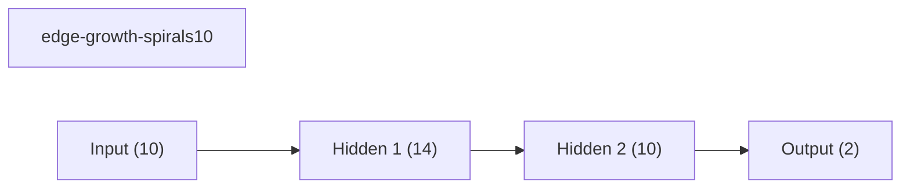
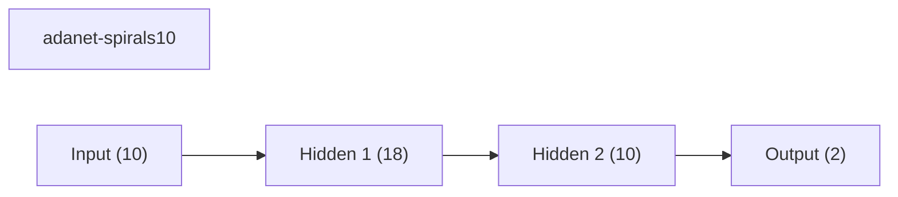
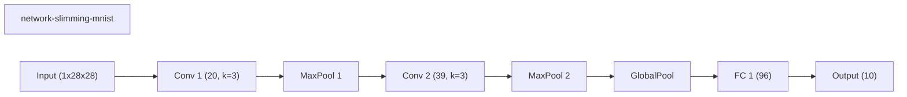

# Implemented Methods Benchmark Suite

Cross-track benchmark suite for the dynanets methods implemented so far. This keeps the synthetic growth-family, staged MLP, MNIST pruning, and MNIST routing families visible in one place without pretending that they are all directly comparable on a single leaderboard.

## Suite Plots

## Benchmark Inventory

| Benchmark | Track | Seeds | Methods | Top overall | Top method |
| --- | --- | ---: | ---: | --- | --- |
| synthetic-growth-family | synthetic_10d | 5 | 7 | edge-growth-spirals10 (0.6283) | edge-growth-spirals10 (0.6283) |
| synthetic-wave1 | synthetic_10d | 5 | 4 | adanet-spirals10 (0.6227) | adanet-spirals10 (0.6227) |
| mnist-pruning | mnist | 2 | 10 | network-slimming-mnist (0.8398) | network-slimming-mnist (0.8398) |
| mnist-routing | mnist | 5 | 9 | network-slimming-mnist (0.8029) | network-slimming-mnist (0.8029) |

## Method Coverage

| Method | Type | Appearances | Tracks | Best mean final val acc | Best benchmark |
| --- | --- | ---: | --- | ---: | --- |
| network-slimming-mnist | workflow | 2 | mnist | 0.8398 | mnist-pruning |
| wide-cnn-mnist-bn | baseline | 2 | mnist | 0.8340 | mnist-pruning |
| channel-pruning-mnist | dynamic | 1 | mnist | 0.8316 | mnist-pruning |
| prunetrain-mnist | workflow | 1 | mnist | 0.8316 | mnist-pruning |
| layerwise-obs-cnn-mnist | dynamic | 1 | mnist | 0.8179 | mnist-pruning |
| runtime-neural-pruning-mnist | dynamic | 1 | mnist | 0.7975 | mnist-pruning |
| asfp-mnist | dynamic | 1 | mnist | 0.7882 | mnist-pruning |
| weights-connections-cnn-mnist | dynamic | 1 | mnist | 0.7816 | mnist-pruning |
| morphnet-mnist | workflow | 1 | mnist | 0.7473 | mnist-pruning |
| edge-growth-spirals10 | dynamic | 1 | synthetic_10d | 0.6283 | synthetic-growth-family |
| adanet-spirals10 | workflow | 1 | synthetic_10d | 0.6227 | synthetic-wave1 |
| dynamic-nodes-spirals10 | dynamic | 1 | synthetic_10d | 0.6139 | synthetic-growth-family |
| fixed-mlp-spirals10 | baseline | 2 | synthetic_10d | 0.6131 | synthetic-growth-family |
| skipnet-mnist | workflow | 1 | mnist | 0.6074 | mnist-routing |
| nest-spirals10 | dynamic | 1 | synthetic_10d | 0.6048 | synthetic-growth-family |
| gradmax-spirals10 | dynamic | 2 | synthetic_10d | 0.6045 | synthetic-growth-family |
| conditional-computation-mnist | workflow | 1 | mnist | 0.6009 | mnist-routing |
| dynamic-slimmable-mnist | workflow | 1 | mnist | 0.5992 | mnist-routing |
| net2wider-spirals10 | dynamic | 1 | synthetic_10d | 0.5987 | synthetic-growth-family |
| iamnn-mnist | workflow | 1 | mnist | 0.5982 | mnist-routing |
| den-spirals10 | dynamic | 1 | synthetic_10d | 0.5917 | synthetic-growth-family |
| weights-connections-spirals10 | dynamic | 1 | synthetic_10d | 0.5861 | synthetic-wave1 |
| instance-wise-sparsity-mnist | workflow | 1 | mnist | 0.5268 | mnist-routing |
| channel-gating-mnist | workflow | 1 | mnist | 0.5261 | mnist-routing |
| fixed-cnn-mnist | baseline | 2 | mnist | 0.4753 | mnist-routing |

## synthetic-growth-family

Two-spirals 10D / 5000-row benchmark for the first dynamic-growth paper batch.

Source: `D:\uni\asp\sem4\dynanets\reports\paper_batch_two_spirals_10d_benchmark`

| Method | Type | Mean final val acc | Std | Mean best val acc | Params | Weight sparsity |
| --- | --- | ---: | ---: | ---: | ---: | ---: |
| edge-growth-spirals10 | dynamic | 0.6283 | 0.0173 | 0.6496 | - | 0.0000 |
| dynamic-nodes-spirals10 | dynamic | 0.6139 | 0.0288 | 0.6475 | - | 0.0000 |
| fixed-mlp-spirals10 | baseline | 0.6131 | 0.0516 | 0.6603 | - | 0.0000 |
| nest-spirals10 | dynamic | 0.6048 | 0.0397 | 0.6229 | - | 0.0000 |
| gradmax-spirals10 | dynamic | 0.6045 | 0.0316 | 0.6293 | - | 0.0000 |
| net2wider-spirals10 | dynamic | 0.5987 | 0.0409 | 0.6173 | - | 0.0000 |
| den-spirals10 | dynamic | 0.5917 | 0.0366 | 0.6397 | - | 0.0000 |

### Representative Graph: edge-growth-spirals10

## synthetic-wave1

Wave 1 preview benchmark for AdaNet-style staged growth and Han-style pruning on the synthetic track.

Source: `D:\uni\asp\sem4\dynanets\reports\track_a_wave1_preview`

| Method | Type | Mean final val acc | Std | Mean best val acc | Params | Weight sparsity |
| --- | --- | ---: | ---: | ---: | ---: | ---: |
| adanet-spirals10 | workflow | 0.6227 | 0.0505 | 0.6664 | - | 0.0000 |
| fixed-mlp-spirals10 | baseline | 0.6131 | 0.0516 | 0.6603 | - | 0.0000 |
| gradmax-spirals10 | dynamic | 0.6045 | 0.0316 | 0.6293 | - | 0.0000 |
| weights-connections-spirals10 | dynamic | 0.5861 | 0.0188 | 0.5989 | - | 0.0000 |

### Representative Graph: adanet-spirals10

## mnist-pruning

MNIST pruning/compression benchmark covering structured, sparse, progressive, and workflow-based methods.

Source: `D:\uni\asp\sem4\dynanets\reports\track_b_mnist_phase6_preview_round4`

| Method | Type | Mean final val acc | Std | Mean best val acc | Params | Weight sparsity |
| --- | --- | ---: | ---: | ---: | ---: | ---: |
| network-slimming-mnist | workflow | 0.8398 | 0.0170 | 0.8398 | 12187 | 0.0000 |
| wide-cnn-mnist-bn | baseline | 0.8340 | 0.0162 | 0.8473 | 16474 | 0.0000 |
| channel-pruning-mnist | dynamic | 0.8316 | 0.0026 | 0.8316 | 12466 | 0.0000 |
| prunetrain-mnist | workflow | 0.8316 | 0.0026 | 0.8316 | 12466 | 0.0000 |
| layerwise-obs-cnn-mnist | dynamic | 0.8179 | 0.0299 | 0.8225 | 16474 | 0.3094 |
| runtime-neural-pruning-mnist | dynamic | 0.7975 | 0.0283 | 0.7975 | 10156 | 0.0000 |
| asfp-mnist | dynamic | 0.7882 | 0.0116 | 0.8044 | 8305 | 0.0000 |
| weights-connections-cnn-mnist | dynamic | 0.7816 | 0.0474 | 0.8241 | 16474 | 0.3500 |
| morphnet-mnist | workflow | 0.7473 | 0.0297 | 0.7913 | 10678 | 0.0000 |
| fixed-cnn-mnist | baseline | 0.4736 | 0.0040 | 0.4736 | 7562 | 0.0000 |

### Representative Graph: network-slimming-mnist

## mnist-routing

MNIST routing benchmark covering dynamic slimmable execution, conditional computation, Channel Gating, and SkipNet.

Source: `D:\uni\asp\sem4\dynanets\reports\track_b_mnist_phase7_preview_round5`

| Method | Type | Mean final val acc | Std | Mean best val acc | Params | Weight sparsity |
| --- | --- | ---: | ---: | ---: | ---: | ---: |
| network-slimming-mnist | workflow | 0.8029 | 0.0815 | 0.8364 | 12187 | 0.0000 |
| wide-cnn-mnist-bn | baseline | 0.7938 | 0.0496 | 0.8365 | 16474 | 0.0000 |
| skipnet-mnist | workflow | 0.6074 | 0.0307 | 0.6088 | 11146 | 0.0000 |
| conditional-computation-mnist | workflow | 0.6009 | 0.0278 | 0.6030 | 11146 | 0.0000 |
| dynamic-slimmable-mnist | workflow | 0.5992 | 0.0336 | 0.6020 | 11146 | 0.0000 |
| iamnn-mnist | workflow | 0.5982 | 0.0297 | 0.5990 | 11146 | 0.0000 |
| instance-wise-sparsity-mnist | workflow | 0.5268 | 0.0352 | 0.5451 | 11146 | 0.0000 |
| channel-gating-mnist | workflow | 0.5261 | 0.0351 | 0.5513 | 11146 | 0.0000 |
| fixed-cnn-mnist | baseline | 0.4753 | 0.0092 | 0.4753 | 7562 | 0.0000 |

### Representative Graph: network-slimming-mnist

