# Implemented Methods Benchmark Suite

Cross-track benchmark suite for the dynanets methods implemented so far. This keeps the synthetic growth-family, staged MLP, pruning/compression, routing, LayerMerge, and efficient static-family tracks visible in one place without pretending that they are all directly comparable on a single leaderboard.

## Suite Plots

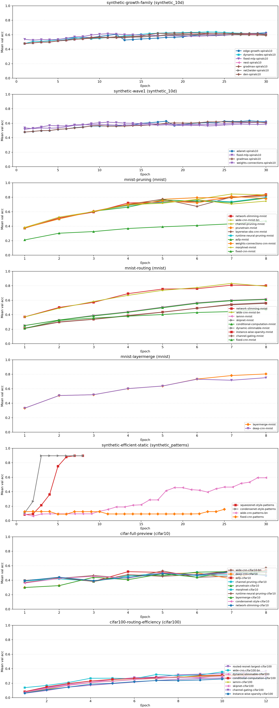

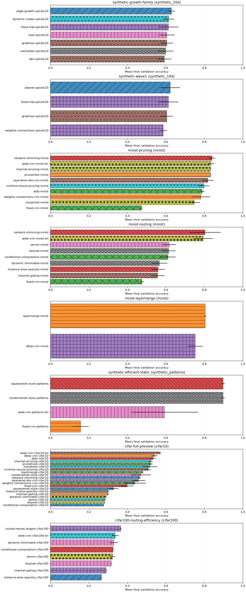

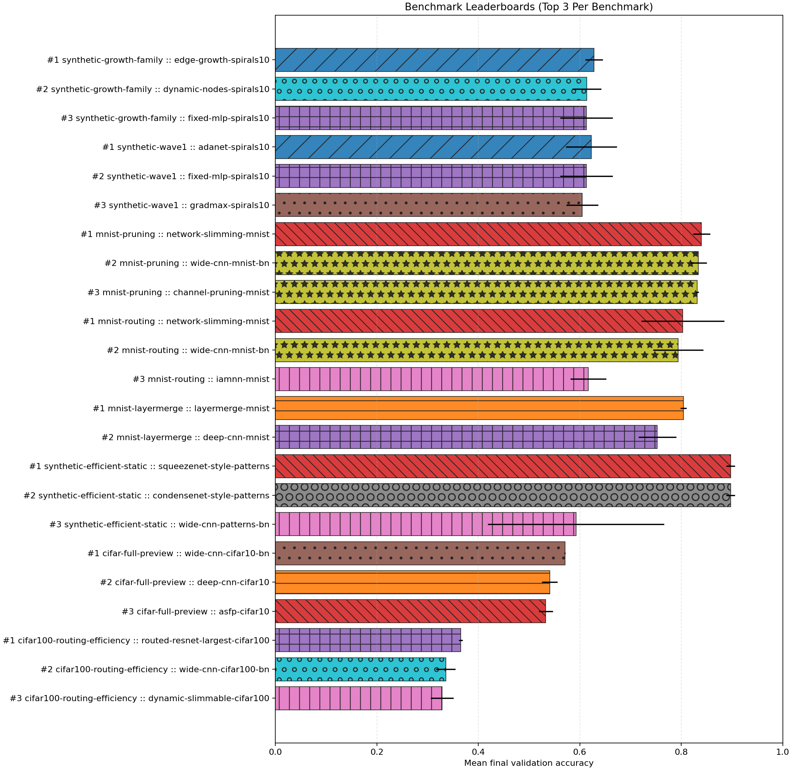

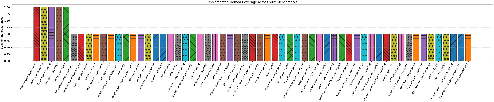

## Benchmark Inventory

| Benchmark | Track | Tier | Acceptance | Seeds | Methods | Top overall | Top method |
| --- | --- | --- | --- | ---: | ---: | --- | --- |
| synthetic-growth-family | synthetic_10d | preview | - | 5 | 7 | edge-growth-spirals10 (0.6283) | edge-growth-spirals10 (0.6283) |
| synthetic-wave1 | synthetic_10d | preview | PASS | 5 | 4 | adanet-spirals10 (0.6227) | adanet-spirals10 (0.6227) |
| mnist-pruning | mnist | preview | - | 2 | 10 | network-slimming-mnist (0.8398) | network-slimming-mnist (0.8398) |
| mnist-routing | mnist | preview | - | 5 | 9 | network-slimming-mnist (0.8029) | network-slimming-mnist (0.8029) |
| mnist-layermerge | mnist | preview | PASS | 2 | 2 | layermerge-mnist (0.8046) | layermerge-mnist (0.8046) |
| synthetic-efficient-static | synthetic_patterns | preview | PASS | 3 | 4 | squeezenet-style-patterns (0.8971) | squeezenet-style-patterns (0.8971) |
| cifar-full-preview | cifar10 | preview | PASS | 2 | 20 | wide-cnn-cifar10-bn (0.5706) | asfp-cifar10 (0.5330) |
| cifar100-routing-efficiency | cifar100 | preview | PASS | 2 | 8 | routed-resnet-largest-cifar100 (0.3654) | dynamic-slimmable-cifar100 (0.3289) |

## Method Coverage

| Method | Type | Appearances | Tracks | Best mean final val acc | Best benchmark |
| --- | --- | ---: | --- | ---: | --- |
| condensenet-style-patterns | baseline | 1 | synthetic_patterns | 0.8971 | synthetic-efficient-static |
| squeezenet-style-patterns | baseline | 1 | synthetic_patterns | 0.8971 | synthetic-efficient-static |
| network-slimming-mnist | workflow | 2 | mnist | 0.8398 | mnist-pruning |
| wide-cnn-mnist-bn | baseline | 2 | mnist | 0.8340 | mnist-pruning |
| channel-pruning-mnist | dynamic | 1 | mnist | 0.8316 | mnist-pruning |
| prunetrain-mnist | workflow | 1 | mnist | 0.8316 | mnist-pruning |
| layerwise-obs-cnn-mnist | dynamic | 1 | mnist | 0.8179 | mnist-pruning |
| layermerge-mnist | workflow | 1 | mnist | 0.8046 | mnist-layermerge |
| runtime-neural-pruning-mnist | dynamic | 1 | mnist | 0.7975 | mnist-pruning |
| asfp-mnist | dynamic | 1 | mnist | 0.7882 | mnist-pruning |
| weights-connections-cnn-mnist | dynamic | 1 | mnist | 0.7816 | mnist-pruning |
| deep-cnn-mnist | baseline | 1 | mnist | 0.7527 | mnist-layermerge |
| morphnet-mnist | workflow | 1 | mnist | 0.7473 | mnist-pruning |
| edge-growth-spirals10 | dynamic | 1 | synthetic_10d | 0.6283 | synthetic-growth-family |
| adanet-spirals10 | workflow | 1 | synthetic_10d | 0.6227 | synthetic-wave1 |
| iamnn-mnist | workflow | 1 | mnist | 0.6168 | mnist-routing |
| skipnet-mnist | workflow | 1 | mnist | 0.6140 | mnist-routing |
| dynamic-nodes-spirals10 | dynamic | 1 | synthetic_10d | 0.6139 | synthetic-growth-family |
| fixed-mlp-spirals10 | baseline | 2 | synthetic_10d | 0.6131 | synthetic-growth-family |
| conditional-computation-mnist | workflow | 1 | mnist | 0.6103 | mnist-routing |
| nest-spirals10 | dynamic | 1 | synthetic_10d | 0.6048 | synthetic-growth-family |
| gradmax-spirals10 | dynamic | 2 | synthetic_10d | 0.6045 | synthetic-growth-family |
| net2wider-spirals10 | dynamic | 1 | synthetic_10d | 0.5987 | synthetic-growth-family |
| wide-cnn-patterns-bn | baseline | 1 | synthetic_patterns | 0.5925 | synthetic-efficient-static |
| den-spirals10 | dynamic | 1 | synthetic_10d | 0.5917 | synthetic-growth-family |
| weights-connections-spirals10 | dynamic | 1 | synthetic_10d | 0.5861 | synthetic-wave1 |
| wide-cnn-cifar10-bn | baseline | 1 | cifar10 | 0.5706 | cifar-full-preview |
| dynamic-slimmable-mnist | workflow | 1 | mnist | 0.5662 | mnist-routing |
| instance-wise-sparsity-mnist | workflow | 1 | mnist | 0.5587 | mnist-routing |
| channel-gating-mnist | workflow | 1 | mnist | 0.5569 | mnist-routing |
| deep-cnn-cifar10 | baseline | 1 | cifar10 | 0.5406 | cifar-full-preview |
| asfp-cifar10 | dynamic | 1 | cifar10 | 0.5330 | cifar-full-preview |
| channel-pruning-cifar10 | dynamic | 1 | cifar10 | 0.5211 | cifar-full-preview |
| prunetrain-cifar10 | workflow | 1 | cifar10 | 0.5211 | cifar-full-preview |
| morphnet-cifar10 | workflow | 1 | cifar10 | 0.5154 | cifar-full-preview |
| runtime-neural-pruning-cifar10 | dynamic | 1 | cifar10 | 0.5081 | cifar-full-preview |
| layermerge-cifar10 | workflow | 1 | cifar10 | 0.4788 | cifar-full-preview |
| fixed-cnn-mnist | baseline | 2 | mnist | 0.4753 | mnist-routing |
| condensenet-style-cifar10 | baseline | 1 | cifar10 | 0.4702 | cifar-full-preview |
| network-slimming-cifar10 | workflow | 1 | cifar10 | 0.4620 | cifar-full-preview |
| layerwise-obs-cnn-cifar10 | dynamic | 1 | cifar10 | 0.4575 | cifar-full-preview |
| weights-connections-cnn-cifar10 | dynamic | 1 | cifar10 | 0.4383 | cifar-full-preview |
| fixed-cnn-cifar10 | baseline | 1 | cifar10 | 0.3982 | cifar-full-preview |
| routed-resnet-largest-cifar100 | baseline | 1 | cifar100 | 0.3654 | cifar100-routing-efficiency |
| wide-cnn-cifar100-bn | baseline | 1 | cifar100 | 0.3359 | cifar100-routing-efficiency |
| dynamic-slimmable-cifar100 | workflow | 1 | cifar100 | 0.3289 | cifar100-routing-efficiency |
| squeezenet-style-cifar10 | baseline | 1 | cifar10 | 0.3282 | cifar-full-preview |
| conditional-computation-cifar100 | workflow | 1 | cifar100 | 0.3249 | cifar100-routing-efficiency |
| iamnn-cifar100 | workflow | 1 | cifar100 | 0.3222 | cifar100-routing-efficiency |
| skipnet-cifar100 | workflow | 1 | cifar100 | 0.3153 | cifar100-routing-efficiency |
| instance-wise-sparsity-cifar10 | workflow | 1 | cifar10 | 0.2994 | cifar-full-preview |
| channel-gating-cifar10 | workflow | 1 | cifar10 | 0.2992 | cifar-full-preview |
| channel-gating-cifar100 | workflow | 1 | cifar100 | 0.2896 | cifar100-routing-efficiency |
| dynamic-slimmable-cifar10 | workflow | 1 | cifar10 | 0.2885 | cifar-full-preview |
| iamnn-cifar10 | workflow | 1 | cifar10 | 0.2822 | cifar-full-preview |
| skipnet-cifar10 | workflow | 1 | cifar10 | 0.2812 | cifar-full-preview |
| conditional-computation-cifar10 | workflow | 1 | cifar10 | 0.2760 | cifar-full-preview |
| instance-wise-sparsity-cifar100 | workflow | 1 | cifar100 | 0.2652 | cifar100-routing-efficiency |
| fixed-cnn-patterns | baseline | 1 | synthetic_patterns | 0.1567 | synthetic-efficient-static |

## synthetic-growth-family

Two-spirals 10D / 5000-row benchmark for the first dynamic-growth paper batch.

Source: `D:\uni\asp\sem4\dynanets\reports\paper_batch_two_spirals_10d_benchmark`
Tier: `preview`
Acceptance: `-`

| Method | Type | Mean final val acc | Std | Mean best val acc | Params | Weight sparsity |
| --- | --- | ---: | ---: | ---: | ---: | ---: |
| edge-growth-spirals10 | dynamic | 0.6283 | 0.0173 | 0.6496 | - | 0.0000 |
| dynamic-nodes-spirals10 | dynamic | 0.6139 | 0.0288 | 0.6475 | - | 0.0000 |
| fixed-mlp-spirals10 | baseline | 0.6131 | 0.0516 | 0.6603 | - | 0.0000 |
| nest-spirals10 | dynamic | 0.6048 | 0.0397 | 0.6229 | - | 0.0000 |
| gradmax-spirals10 | dynamic | 0.6045 | 0.0316 | 0.6293 | - | 0.0000 |
| net2wider-spirals10 | dynamic | 0.5987 | 0.0409 | 0.6173 | - | 0.0000 |
| den-spirals10 | dynamic | 0.5917 | 0.0366 | 0.6397 | - | 0.0000 |

### Representative Graph: edge-growth-spirals10

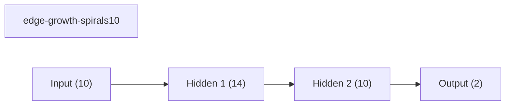

## synthetic-wave1

Wave 1 preview benchmark for AdaNet-style staged growth and Han-style pruning on the synthetic track.

Source: `D:\uni\asp\sem4\dynanets\reports\track_a_wave1_preview`
Tier: `preview`
Acceptance: `PASS`

| Method | Type | Mean final val acc | Std | Mean best val acc | Params | Weight sparsity |
| --- | --- | ---: | ---: | ---: | ---: | ---: |
| adanet-spirals10 | workflow | 0.6227 | 0.0505 | 0.6664 | - | 0.0000 |
| fixed-mlp-spirals10 | baseline | 0.6131 | 0.0516 | 0.6603 | - | 0.0000 |
| gradmax-spirals10 | dynamic | 0.6045 | 0.0316 | 0.6293 | - | 0.0000 |
| weights-connections-spirals10 | dynamic | 0.5861 | 0.0188 | 0.5989 | - | 0.0000 |

### Representative Graph: adanet-spirals10

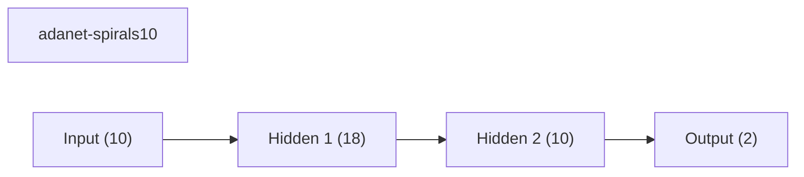

## mnist-pruning

MNIST pruning/compression benchmark covering structured, sparse, progressive, and workflow-based methods.

Source: `D:\uni\asp\sem4\dynanets\reports\track_b_mnist_phase6_preview_round4`
Tier: `preview`
Acceptance: `-`

| Method | Type | Mean final val acc | Std | Mean best val acc | Params | Weight sparsity |
| --- | --- | ---: | ---: | ---: | ---: | ---: |
| network-slimming-mnist | workflow | 0.8398 | 0.0170 | 0.8398 | 12187 | 0.0000 |
| wide-cnn-mnist-bn | baseline | 0.8340 | 0.0162 | 0.8473 | 16474 | 0.0000 |
| channel-pruning-mnist | dynamic | 0.8316 | 0.0026 | 0.8316 | 12466 | 0.0000 |
| prunetrain-mnist | workflow | 0.8316 | 0.0026 | 0.8316 | 12466 | 0.0000 |
| layerwise-obs-cnn-mnist | dynamic | 0.8179 | 0.0299 | 0.8225 | 16474 | 0.3094 |
| runtime-neural-pruning-mnist | dynamic | 0.7975 | 0.0283 | 0.7975 | 10156 | 0.0000 |
| asfp-mnist | dynamic | 0.7882 | 0.0116 | 0.8044 | 8305 | 0.0000 |
| weights-connections-cnn-mnist | dynamic | 0.7816 | 0.0474 | 0.8241 | 16474 | 0.3500 |
| morphnet-mnist | workflow | 0.7473 | 0.0297 | 0.7913 | 10678 | 0.0000 |
| fixed-cnn-mnist | baseline | 0.4736 | 0.0040 | 0.4736 | 7562 | 0.0000 |

### Representative Graph: network-slimming-mnist

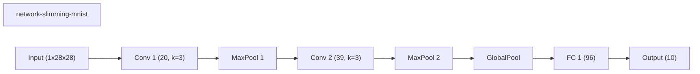

## mnist-routing

MNIST routing benchmark covering dynamic slimmable execution, conditional computation, Channel Gating, and SkipNet.

Source: `D:\uni\asp\sem4\dynanets\reports\track_b_mnist_phase7_preview_round9`
Tier: `preview`
Acceptance: `-`

| Method | Type | Mean final val acc | Std | Mean best val acc | Params | Weight sparsity |
| --- | --- | ---: | ---: | ---: | ---: | ---: |
| network-slimming-mnist | workflow | 0.8029 | 0.0815 | 0.8364 | 12187 | 0.0000 |
| wide-cnn-mnist-bn | baseline | 0.7938 | 0.0496 | 0.8365 | 16474 | 0.0000 |
| iamnn-mnist | workflow | 0.6168 | 0.0350 | 0.6193 | 11146 | 0.0000 |
| skipnet-mnist | workflow | 0.6140 | 0.0361 | 0.6163 | 11146 | 0.0000 |
| conditional-computation-mnist | workflow | 0.6103 | 0.0402 | 0.6129 | 11146 | 0.0000 |
| dynamic-slimmable-mnist | workflow | 0.5662 | 0.0406 | 0.5686 | 11146 | 0.0000 |
| instance-wise-sparsity-mnist | workflow | 0.5587 | 0.0357 | 0.5607 | 11146 | 0.0000 |
| channel-gating-mnist | workflow | 0.5569 | 0.0364 | 0.5596 | 11146 | 0.0000 |
| fixed-cnn-mnist | baseline | 0.4753 | 0.0092 | 0.4753 | 7562 | 0.0000 |

### Representative Graph: network-slimming-mnist

## mnist-layermerge

MNIST preview for the LayerMerge approximation against a deeper fixed CNN baseline.

Source: `D:\uni\asp\sem4\dynanets\reports\track_b_mnist_layermerge_preview`
Tier: `preview`
Acceptance: `PASS`

| Method | Type | Mean final val acc | Std | Mean best val acc | Params | Weight sparsity |
| --- | --- | ---: | ---: | ---: | ---: | ---: |
| layermerge-mnist | workflow | 0.8046 | 0.0060 | 0.8046 | 14586 | 0.0000 |
| deep-cnn-mnist | baseline | 0.7527 | 0.0371 | 0.7927 | 25978 | 0.0000 |

### Representative Graph: layermerge-mnist

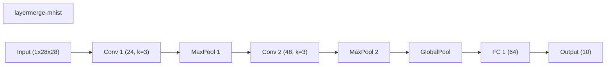

## synthetic-efficient-static

Synthetic image benchmark for efficient static comparison families inspired by SqueezeNet and CondenseNet.

Source: `D:\uni\asp\sem4\dynanets\reports\track_a_efficient_static_preview`
Tier: `preview`
Acceptance: `PASS`

| Method | Type | Mean final val acc | Std | Mean best val acc | Params | Weight sparsity |
| --- | --- | ---: | ---: | ---: | ---: | ---: |
| squeezenet-style-patterns | baseline | 0.8971 | 0.0088 | 0.9043 | 22354 | 0.0000 |
| condensenet-style-patterns | baseline | 0.8971 | 0.0088 | 0.8971 | 22034 | 0.0000 |
| wide-cnn-patterns-bn | baseline | 0.5925 | 0.1738 | 0.5992 | 16474 | 0.0000 |
| fixed-cnn-patterns | baseline | 0.1567 | 0.0413 | 0.1925 | 7562 | 0.0000 |

### Representative Graph: squeezenet-style-patterns

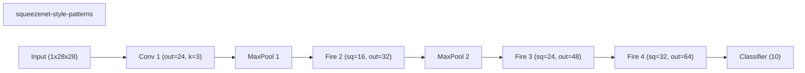

## cifar-full-preview

CIFAR-10 full preview benchmark for the implemented image-capable methods, including static, pruning, LayerMerge, and routing families.

Source: `D:\uni\asp\sem4\dynanets\reports\track_c_cifar_full_preview`
Tier: `preview`
Acceptance: `PASS`

| Method | Type | Mean final val acc | Std | Mean best val acc | Params | Weight sparsity |
| --- | --- | ---: | ---: | ---: | ---: | ---: |
| wide-cnn-cifar10-bn | baseline | 0.5706 | 0.0014 | 0.5706 | 92298 | 0.0000 |
| deep-cnn-cifar10 | baseline | 0.5406 | 0.0154 | 0.5406 | 76066 | 0.0000 |
| asfp-cifar10 | dynamic | 0.5330 | 0.0140 | 0.5452 | 22625 | 0.0000 |
| channel-pruning-cifar10 | dynamic | 0.5211 | 0.0097 | 0.5303 | 38307 | 0.0000 |
| prunetrain-cifar10 | workflow | 0.5211 | 0.0097 | 0.5303 | 38307 | 0.0000 |
| morphnet-cifar10 | workflow | 0.5154 | 0.0390 | 0.5381 | 32468 | 0.0000 |
| runtime-neural-pruning-cifar10 | dynamic | 0.5081 | 0.0127 | 0.5305 | 29855 | 0.0000 |
| layermerge-cifar10 | workflow | 0.4788 | 0.0036 | 0.5177 | 50530 | 0.0000 |
| condensenet-style-cifar10 | baseline | 0.4702 | 0.0520 | 0.5235 | 29418 | 0.0000 |
| network-slimming-cifar10 | workflow | 0.4620 | 0.0098 | 0.5176 | 37111 | 0.0000 |
| layerwise-obs-cnn-cifar10 | dynamic | 0.4575 | 0.0339 | 0.5323 | 53186 | 0.3099 |
| weights-connections-cnn-cifar10 | dynamic | 0.4383 | 0.0579 | 0.5523 | 53186 | 0.3500 |
| fixed-cnn-cifar10 | baseline | 0.3982 | 0.0342 | 0.5465 | 53186 | 0.0000 |
| squeezenet-style-cifar10 | baseline | 0.3282 | 0.0248 | 0.3324 | 46594 | 0.0000 |
| instance-wise-sparsity-cifar10 | workflow | 0.2994 | 0.0034 | 0.3047 | 20042 | 0.0000 |
| channel-gating-cifar10 | workflow | 0.2992 | 0.0034 | 0.3047 | 20042 | 0.0000 |
| dynamic-slimmable-cifar10 | workflow | 0.2885 | 0.0033 | 0.2953 | 20042 | 0.0000 |
| iamnn-cifar10 | workflow | 0.2822 | 0.0068 | 0.2926 | 20042 | 0.0000 |
| skipnet-cifar10 | workflow | 0.2812 | 0.0008 | 0.2959 | 20042 | 0.0000 |
| conditional-computation-cifar10 | workflow | 0.2760 | 0.0008 | 0.2922 | 20042 | 0.0000 |

### Representative Graph: asfp-cifar10

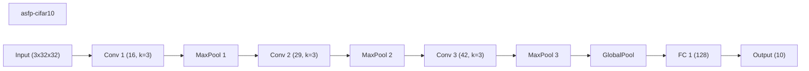

## cifar100-routing-efficiency

CIFAR-100 routing-efficiency preview with routed-ResNet-family baselines and cost-aware comparisons for dynamic-width and early-exit methods.

Source: `D:\uni\asp\sem4\dynanets\reports\track_d_routing_efficiency_cifar100_preview`
Tier: `preview`
Acceptance: `PASS`

| Method | Type | Mean final val acc | Std | Mean best val acc | Params | Weight sparsity |
| --- | --- | ---: | ---: | ---: | ---: | ---: |
| routed-resnet-largest-cifar100 | baseline | 0.3654 | 0.0036 | 0.3654 | 166532 | 0.0000 |
| wide-cnn-cifar100-bn | baseline | 0.3359 | 0.0193 | 0.3563 | 106788 | 0.0000 |
| dynamic-slimmable-cifar100 | workflow | 0.3289 | 0.0225 | 0.3344 | 166532 | 0.0000 |
| conditional-computation-cifar100 | workflow | 0.3249 | 0.0043 | 0.3249 | 128620 | 0.0000 |
| iamnn-cifar100 | workflow | 0.3222 | 0.0146 | 0.3222 | 78436 | 0.0000 |
| skipnet-cifar100 | workflow | 0.3153 | 0.0031 | 0.3153 | 84484 | 0.0000 |
| channel-gating-cifar100 | workflow | 0.2896 | 0.0030 | 0.2896 | 84484 | 0.0000 |
| instance-wise-sparsity-cifar100 | workflow | 0.2652 | 0.0002 | 0.2695 | 53828 | 0.0000 |

### Representative Graph: dynamic-slimmable-cifar100

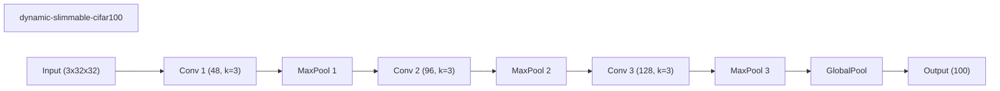
