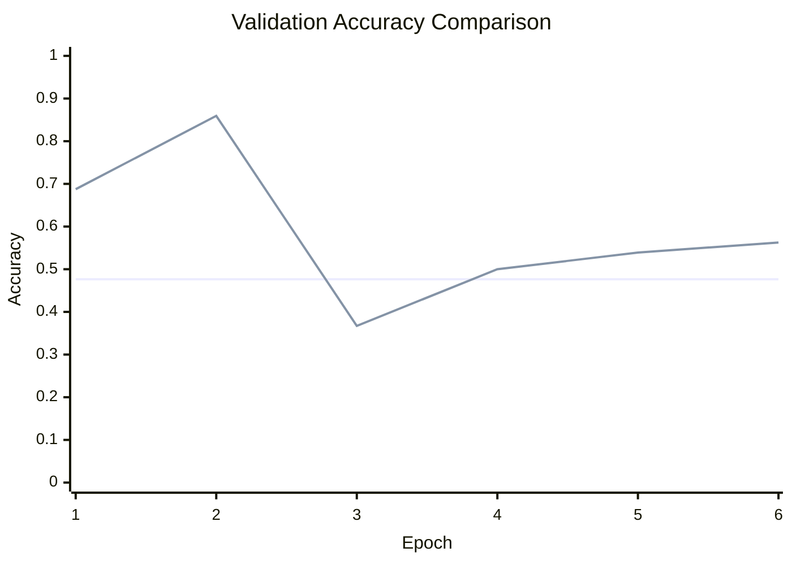

# Baseline Comparison

| Experiment | Epochs | Final train acc | Final val acc | Best val acc | Adaptations | Final hidden dim |
| --- | ---: | ---: | ---: | ---: | ---: | ---: |
| fixed-mlp-baseline | 6 | 0.5098 | 0.4766 | 0.4766 | 0 | - |
| minimal-experiment | 6 | 0.4941 | 0.5625 | 0.8594 | 3 | 20 |

## Validation Accuracy By Epoch

