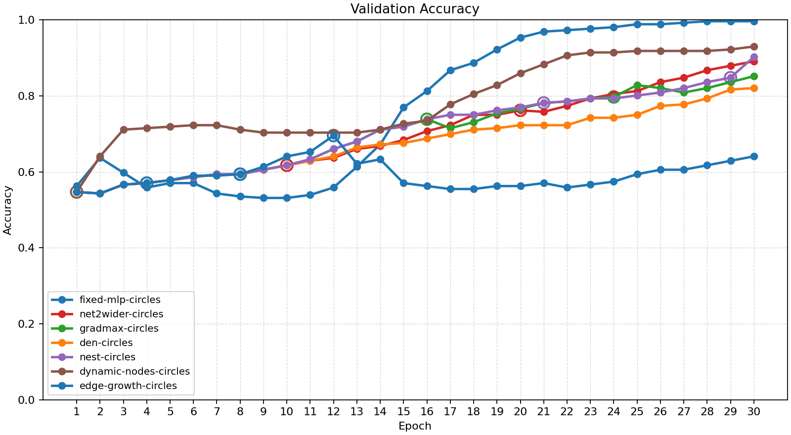
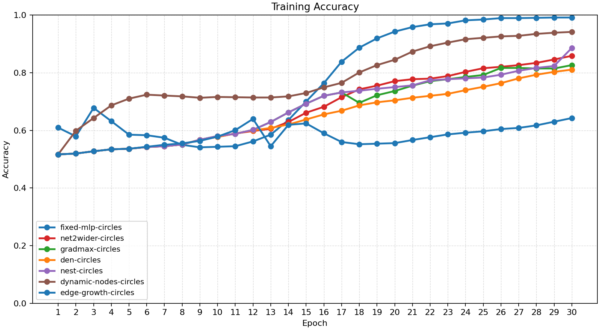
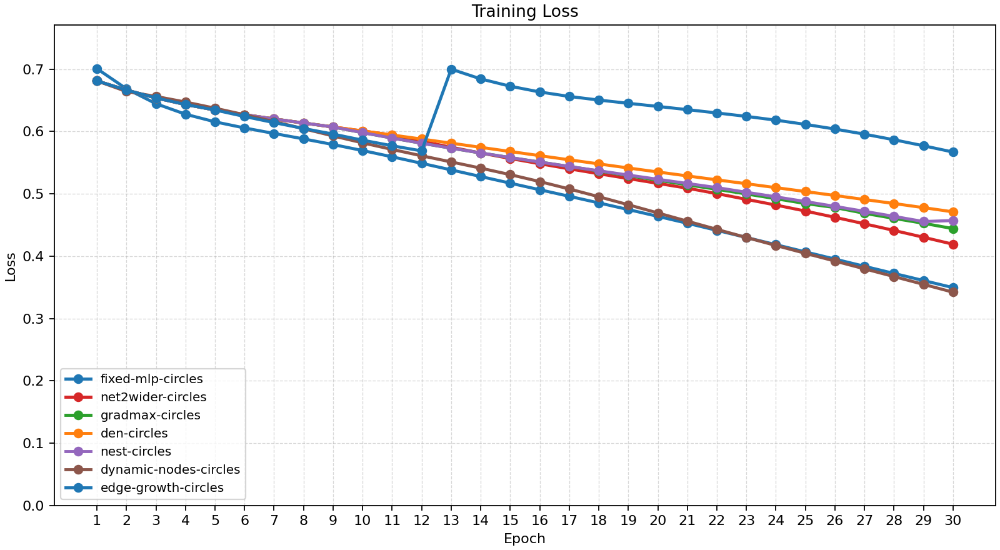
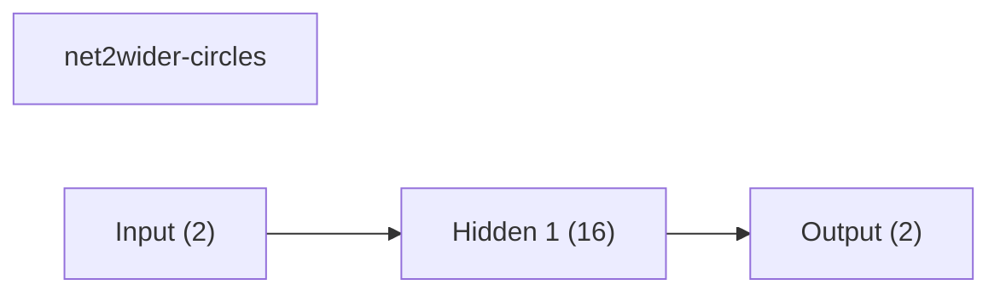
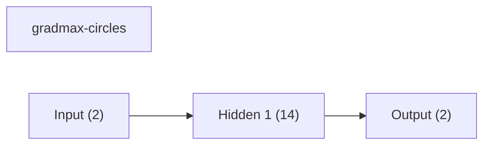
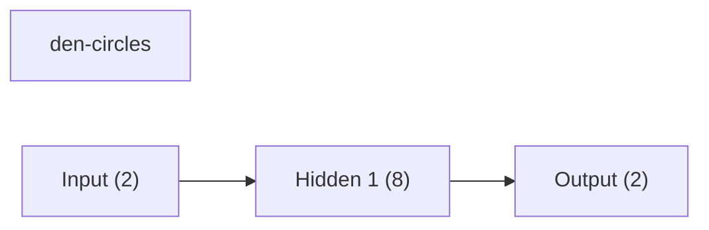
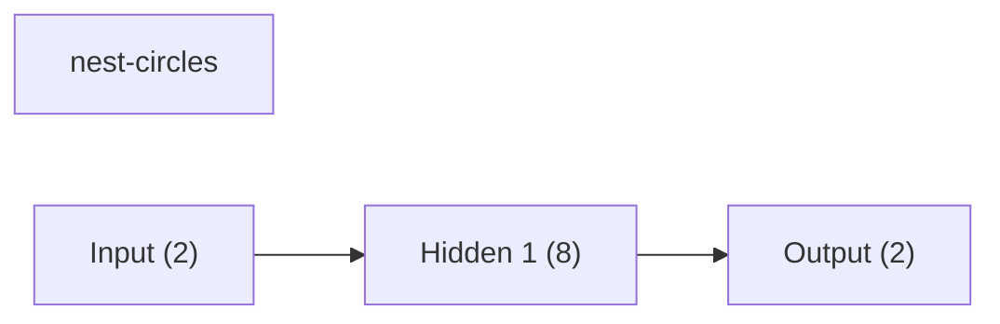
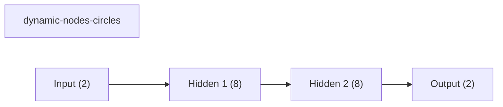
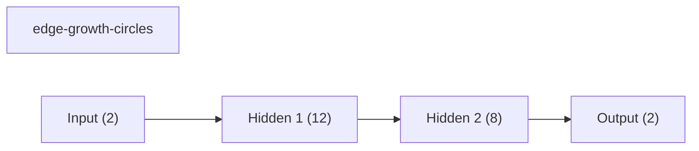
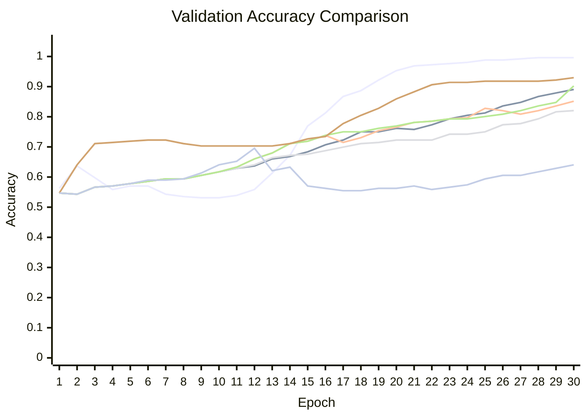

# Baseline Comparison

| Experiment | Type | Epochs | Final train acc | Final val acc | Best val acc | Adaptations | Final hidden dim |
| --- | --- | ---: | ---: | ---: | ---: | ---: | ---: |
| fixed-mlp-circles | baseline | 30 | 0.9912 | 0.9961 | 0.9961 | 0 | - |
| net2wider-circles | dynamic | 30 | 0.8584 | 0.8906 | 0.8906 | 2 | 16 |
| gradmax-circles | dynamic | 30 | 0.8262 | 0.8516 | 0.8516 | 3 | 14 |
| den-circles | dynamic | 30 | 0.8105 | 0.8203 | 0.8203 | 0 | 8 |
| nest-circles | dynamic | 30 | 0.8857 | 0.9023 | 0.9023 | 3 | 8 |
| dynamic-nodes-circles | dynamic | 30 | 0.9414 | 0.9297 | 0.9297 | 1 | 8 |
| edge-growth-circles | dynamic | 30 | 0.6426 | 0.6406 | 0.6953 | 3 | 12 |

## Validation Accuracy

## Training Accuracy

## Training Loss

## Experiment Notes

- `net2wider-circles`: adaptation=net2wider
- `gradmax-circles`: adaptation=gradmax
- `den-circles`: adaptation=den
- `nest-circles`: adaptation=nest
- `dynamic-nodes-circles`: adaptation=dynamic_nodes
- `edge-growth-circles`: adaptation=edge_growth

## Adaptation Timeline

### net2wider-circles
- epoch 10: `net2wider` params={'amount': 4, 'seed': 51} effect={'applied': True, 'structural_change': True, 'version_delta': 1, 'step_delta': 0, 'hidden_dim_delta': 4, 'num_hidden_layers_delta': 0, 'hidden_dims_changed': True} before={'hidden_dim': 8, 'hidden_dims': [8], 'output_dim': 2, 'num_hidden_layers': 1, 'supported_events': ['grow_hidden', 'insert_hidden_layer', 'net2wider', 'prune_hidden']} after={'hidden_dim': 12, 'hidden_dims': [12], 'output_dim': 2, 'num_hidden_layers': 1, 'supported_events': ['grow_hidden', 'insert_hidden_layer', 'net2wider', 'prune_hidden']} capabilities=['grow_hidden', 'insert_hidden_layer', 'net2wider', 'prune_hidden']
- epoch 20: `net2wider` params={'amount': 4, 'seed': 61} effect={'applied': True, 'structural_change': True, 'version_delta': 1, 'step_delta': 0, 'hidden_dim_delta': 4, 'num_hidden_layers_delta': 0, 'hidden_dims_changed': True} before={'hidden_dim': 12, 'hidden_dims': [12], 'output_dim': 2, 'num_hidden_layers': 1, 'supported_events': ['grow_hidden', 'insert_hidden_layer', 'net2wider', 'prune_hidden']} after={'hidden_dim': 16, 'hidden_dims': [16], 'output_dim': 2, 'num_hidden_layers': 1, 'supported_events': ['grow_hidden', 'insert_hidden_layer', 'net2wider', 'prune_hidden']} capabilities=['grow_hidden', 'insert_hidden_layer', 'net2wider', 'prune_hidden']

### gradmax-circles
- epoch 8: `net2wider` params={'amount': 2} effect={'applied': True, 'structural_change': True, 'version_delta': 1, 'step_delta': 0, 'hidden_dim_delta': 2, 'num_hidden_layers_delta': 0, 'hidden_dims_changed': True} before={'hidden_dim': 8, 'hidden_dims': [8], 'output_dim': 2, 'num_hidden_layers': 1, 'supported_events': ['grow_hidden', 'insert_hidden_layer', 'net2wider', 'prune_hidden']} after={'hidden_dim': 10, 'hidden_dims': [10], 'output_dim': 2, 'num_hidden_layers': 1, 'supported_events': ['grow_hidden', 'insert_hidden_layer', 'net2wider', 'prune_hidden']} capabilities=['grow_hidden', 'insert_hidden_layer', 'net2wider', 'prune_hidden']
- epoch 16: `net2wider` params={'amount': 2} effect={'applied': True, 'structural_change': True, 'version_delta': 1, 'step_delta': 0, 'hidden_dim_delta': 2, 'num_hidden_layers_delta': 0, 'hidden_dims_changed': True} before={'hidden_dim': 10, 'hidden_dims': [10], 'output_dim': 2, 'num_hidden_layers': 1, 'supported_events': ['grow_hidden', 'insert_hidden_layer', 'net2wider', 'prune_hidden']} after={'hidden_dim': 12, 'hidden_dims': [12], 'output_dim': 2, 'num_hidden_layers': 1, 'supported_events': ['grow_hidden', 'insert_hidden_layer', 'net2wider', 'prune_hidden']} capabilities=['grow_hidden', 'insert_hidden_layer', 'net2wider', 'prune_hidden']
- epoch 24: `net2wider` params={'amount': 2} effect={'applied': True, 'structural_change': True, 'version_delta': 1, 'step_delta': 0, 'hidden_dim_delta': 2, 'num_hidden_layers_delta': 0, 'hidden_dims_changed': True} before={'hidden_dim': 12, 'hidden_dims': [12], 'output_dim': 2, 'num_hidden_layers': 1, 'supported_events': ['grow_hidden', 'insert_hidden_layer', 'net2wider', 'prune_hidden']} after={'hidden_dim': 14, 'hidden_dims': [14], 'output_dim': 2, 'num_hidden_layers': 1, 'supported_events': ['grow_hidden', 'insert_hidden_layer', 'net2wider', 'prune_hidden']} capabilities=['grow_hidden', 'insert_hidden_layer', 'net2wider', 'prune_hidden']

### nest-circles
- epoch 8: `net2wider` params={'amount': 2} effect={'applied': True, 'structural_change': True, 'version_delta': 1, 'step_delta': 0, 'hidden_dim_delta': 2, 'num_hidden_layers_delta': 0, 'hidden_dims_changed': True} before={'hidden_dim': 8, 'hidden_dims': [8], 'output_dim': 2, 'num_hidden_layers': 1, 'supported_events': ['grow_hidden', 'insert_hidden_layer', 'net2wider', 'prune_hidden']} after={'hidden_dim': 10, 'hidden_dims': [10], 'output_dim': 2, 'num_hidden_layers': 1, 'supported_events': ['grow_hidden', 'insert_hidden_layer', 'net2wider', 'prune_hidden']} capabilities=['grow_hidden', 'insert_hidden_layer', 'net2wider', 'prune_hidden']
- epoch 21: `prune_hidden` params={'amount': 1, 'min_width': 8} effect={'applied': True, 'structural_change': True, 'version_delta': 1, 'step_delta': 0, 'hidden_dim_delta': -1, 'num_hidden_layers_delta': 0, 'hidden_dims_changed': True} before={'hidden_dim': 10, 'hidden_dims': [10], 'output_dim': 2, 'num_hidden_layers': 1, 'supported_events': ['grow_hidden', 'insert_hidden_layer', 'net2wider', 'prune_hidden']} after={'hidden_dim': 9, 'hidden_dims': [9], 'output_dim': 2, 'num_hidden_layers': 1, 'supported_events': ['grow_hidden', 'insert_hidden_layer', 'net2wider', 'prune_hidden']} capabilities=['grow_hidden', 'insert_hidden_layer', 'net2wider', 'prune_hidden']
- epoch 29: `prune_hidden` params={'amount': 1, 'min_width': 8} effect={'applied': True, 'structural_change': True, 'version_delta': 1, 'step_delta': 0, 'hidden_dim_delta': -1, 'num_hidden_layers_delta': 0, 'hidden_dims_changed': True} before={'hidden_dim': 9, 'hidden_dims': [9], 'output_dim': 2, 'num_hidden_layers': 1, 'supported_events': ['grow_hidden', 'insert_hidden_layer', 'net2wider', 'prune_hidden']} after={'hidden_dim': 8, 'hidden_dims': [8], 'output_dim': 2, 'num_hidden_layers': 1, 'supported_events': ['grow_hidden', 'insert_hidden_layer', 'net2wider', 'prune_hidden']} capabilities=['grow_hidden', 'insert_hidden_layer', 'net2wider', 'prune_hidden']

### dynamic-nodes-circles
- epoch 1: `insert_hidden_layer` params={'layer_index': 1, 'width': 8} effect={'applied': True, 'structural_change': True, 'version_delta': 1, 'step_delta': 0, 'hidden_dim_delta': 0, 'num_hidden_layers_delta': 1, 'hidden_dims_changed': True} before={'hidden_dim': 8, 'hidden_dims': [8], 'output_dim': 2, 'num_hidden_layers': 1, 'supported_events': ['grow_hidden', 'insert_hidden_layer', 'net2wider', 'prune_hidden']} after={'hidden_dim': 8, 'hidden_dims': [8, 8], 'output_dim': 2, 'num_hidden_layers': 2, 'supported_events': ['grow_hidden', 'insert_hidden_layer', 'net2wider', 'prune_hidden']} capabilities=['grow_hidden', 'insert_hidden_layer', 'net2wider', 'prune_hidden']

### edge-growth-circles
- epoch 4: `net2wider` params={'amount': 2} effect={'applied': True, 'structural_change': True, 'version_delta': 1, 'step_delta': 0, 'hidden_dim_delta': 2, 'num_hidden_layers_delta': 0, 'hidden_dims_changed': True} before={'hidden_dim': 8, 'hidden_dims': [8], 'output_dim': 2, 'num_hidden_layers': 1, 'supported_events': ['grow_hidden', 'insert_hidden_layer', 'net2wider', 'prune_hidden']} after={'hidden_dim': 10, 'hidden_dims': [10], 'output_dim': 2, 'num_hidden_layers': 1, 'supported_events': ['grow_hidden', 'insert_hidden_layer', 'net2wider', 'prune_hidden']} capabilities=['grow_hidden', 'insert_hidden_layer', 'net2wider', 'prune_hidden']
- epoch 8: `net2wider` params={'amount': 2} effect={'applied': True, 'structural_change': True, 'version_delta': 1, 'step_delta': 0, 'hidden_dim_delta': 2, 'num_hidden_layers_delta': 0, 'hidden_dims_changed': True} before={'hidden_dim': 10, 'hidden_dims': [10], 'output_dim': 2, 'num_hidden_layers': 1, 'supported_events': ['grow_hidden', 'insert_hidden_layer', 'net2wider', 'prune_hidden']} after={'hidden_dim': 12, 'hidden_dims': [12], 'output_dim': 2, 'num_hidden_layers': 1, 'supported_events': ['grow_hidden', 'insert_hidden_layer', 'net2wider', 'prune_hidden']} capabilities=['grow_hidden', 'insert_hidden_layer', 'net2wider', 'prune_hidden']
- epoch 12: `insert_hidden_layer` params={'layer_index': 1, 'width': 8} effect={'applied': True, 'structural_change': True, 'version_delta': 1, 'step_delta': 0, 'hidden_dim_delta': 0, 'num_hidden_layers_delta': 1, 'hidden_dims_changed': True} before={'hidden_dim': 12, 'hidden_dims': [12], 'output_dim': 2, 'num_hidden_layers': 1, 'supported_events': ['grow_hidden', 'insert_hidden_layer', 'net2wider', 'prune_hidden']} after={'hidden_dim': 12, 'hidden_dims': [12, 8], 'output_dim': 2, 'num_hidden_layers': 2, 'supported_events': ['grow_hidden', 'insert_hidden_layer', 'net2wider', 'prune_hidden']} capabilities=['grow_hidden', 'insert_hidden_layer', 'net2wider', 'prune_hidden']

## Architecture Graphs

### fixed-mlp-circles

### net2wider-circles

### gradmax-circles

### den-circles

### nest-circles

### dynamic-nodes-circles

### edge-growth-circles

## Validation Accuracy By Epoch

