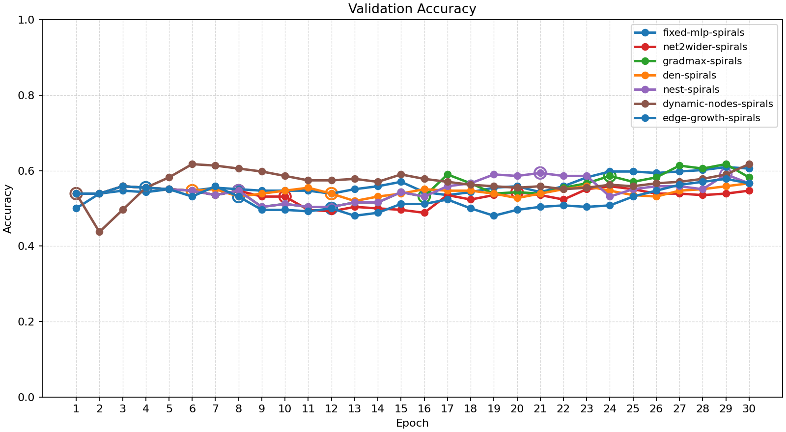
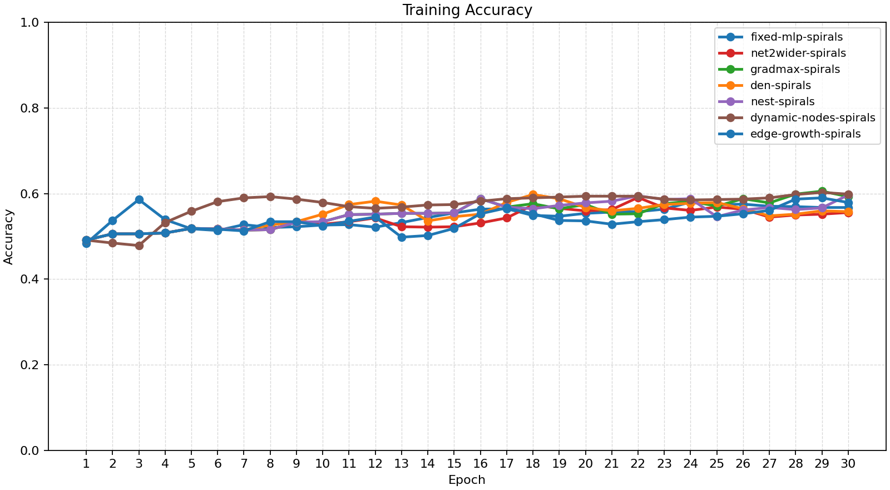
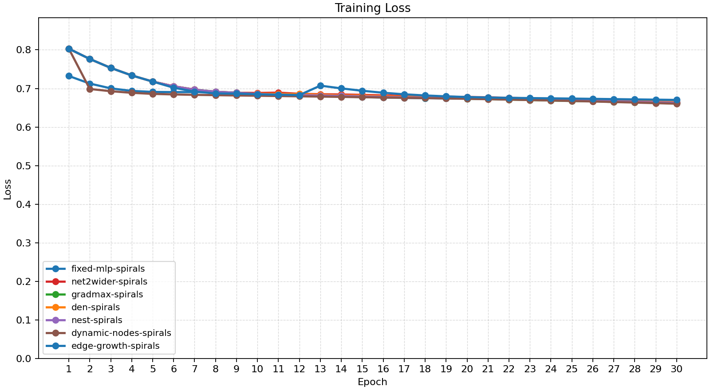
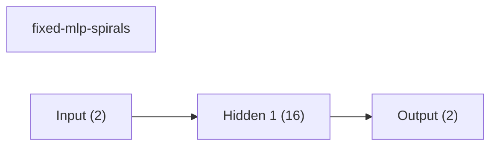
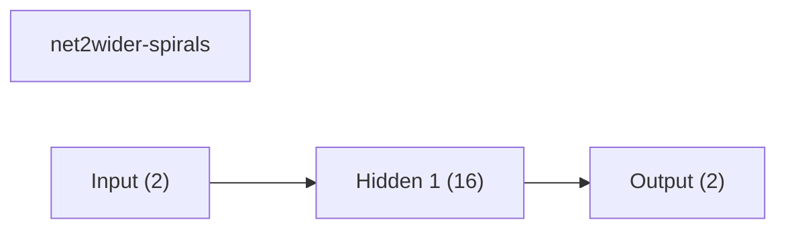
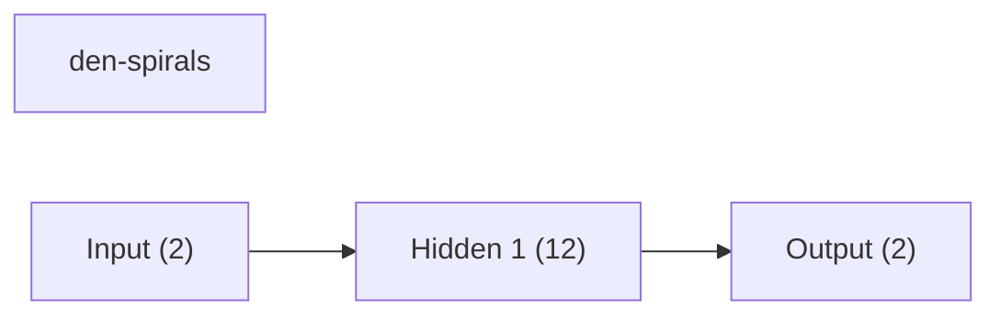
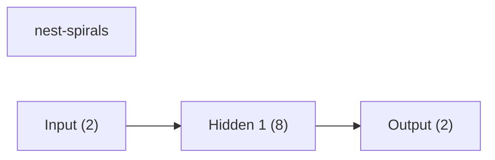
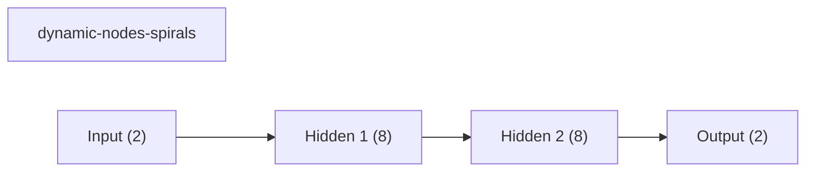
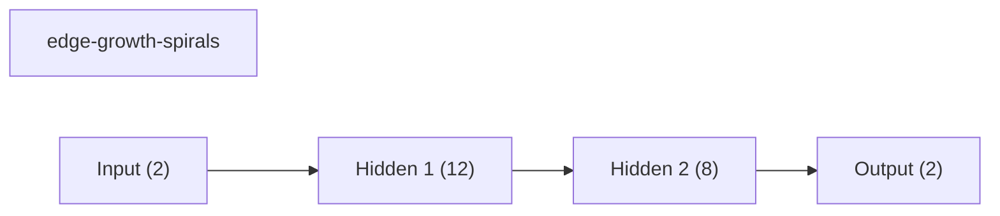
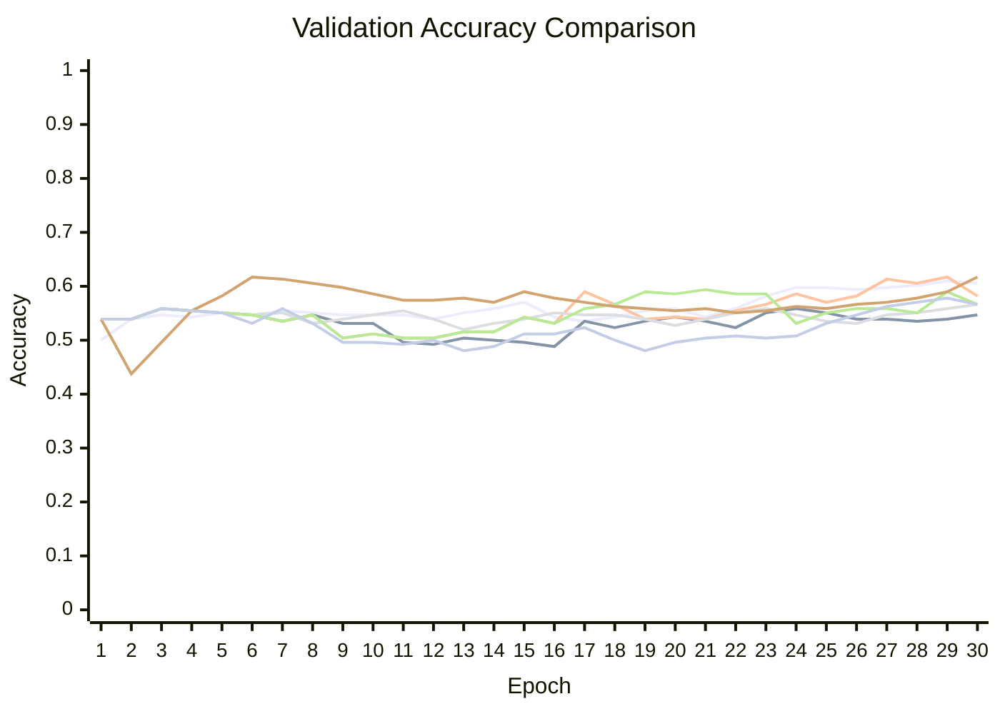

# Baseline Comparison

| Experiment | Type | Epochs | Final train acc | Final val acc | Best val acc | Adaptations | Final hidden dim |
| --- | --- | ---: | ---: | ---: | ---: | ---: | ---: |
| fixed-mlp-spirals | baseline | 30 | 0.5674 | 0.6055 | 0.6094 | 0 | - |
| net2wider-spirals | dynamic | 30 | 0.5557 | 0.5469 | 0.5586 | 2 | 16 |
| gradmax-spirals | dynamic | 30 | 0.5928 | 0.5820 | 0.6172 | 3 | 14 |
| den-spirals | dynamic | 30 | 0.5576 | 0.5664 | 0.5664 | 2 | 12 |
| nest-spirals | dynamic | 30 | 0.5967 | 0.5664 | 0.5938 | 3 | 8 |
| dynamic-nodes-spirals | dynamic | 30 | 0.5986 | 0.6172 | 0.6172 | 1 | 8 |
| edge-growth-spirals | dynamic | 30 | 0.5791 | 0.5664 | 0.5781 | 3 | 12 |

## Validation Accuracy

## Training Accuracy

## Training Loss

## Experiment Notes

- `net2wider-spirals`: adaptation=net2wider
- `gradmax-spirals`: adaptation=gradmax
- `den-spirals`: adaptation=den
- `nest-spirals`: adaptation=nest
- `dynamic-nodes-spirals`: adaptation=dynamic_nodes
- `edge-growth-spirals`: adaptation=edge_growth

## Adaptation Timeline

### net2wider-spirals
- epoch 10: `net2wider` params={'amount': 4, 'seed': 51} effect={'applied': True, 'structural_change': True, 'version_delta': 1, 'step_delta': 0, 'hidden_dim_delta': 4, 'num_hidden_layers_delta': 0, 'hidden_dims_changed': True} before={'hidden_dim': 8, 'hidden_dims': [8], 'output_dim': 2, 'num_hidden_layers': 1, 'supported_events': ['grow_hidden', 'insert_hidden_layer', 'net2wider', 'prune_hidden']} after={'hidden_dim': 12, 'hidden_dims': [12], 'output_dim': 2, 'num_hidden_layers': 1, 'supported_events': ['grow_hidden', 'insert_hidden_layer', 'net2wider', 'prune_hidden']} capabilities=['grow_hidden', 'insert_hidden_layer', 'net2wider', 'prune_hidden']
- epoch 20: `net2wider` params={'amount': 4, 'seed': 61} effect={'applied': True, 'structural_change': True, 'version_delta': 1, 'step_delta': 0, 'hidden_dim_delta': 4, 'num_hidden_layers_delta': 0, 'hidden_dims_changed': True} before={'hidden_dim': 12, 'hidden_dims': [12], 'output_dim': 2, 'num_hidden_layers': 1, 'supported_events': ['grow_hidden', 'insert_hidden_layer', 'net2wider', 'prune_hidden']} after={'hidden_dim': 16, 'hidden_dims': [16], 'output_dim': 2, 'num_hidden_layers': 1, 'supported_events': ['grow_hidden', 'insert_hidden_layer', 'net2wider', 'prune_hidden']} capabilities=['grow_hidden', 'insert_hidden_layer', 'net2wider', 'prune_hidden']

### gradmax-spirals
- epoch 8: `net2wider` params={'amount': 2} effect={'applied': True, 'structural_change': True, 'version_delta': 1, 'step_delta': 0, 'hidden_dim_delta': 2, 'num_hidden_layers_delta': 0, 'hidden_dims_changed': True} before={'hidden_dim': 8, 'hidden_dims': [8], 'output_dim': 2, 'num_hidden_layers': 1, 'supported_events': ['grow_hidden', 'insert_hidden_layer', 'net2wider', 'prune_hidden']} after={'hidden_dim': 10, 'hidden_dims': [10], 'output_dim': 2, 'num_hidden_layers': 1, 'supported_events': ['grow_hidden', 'insert_hidden_layer', 'net2wider', 'prune_hidden']} capabilities=['grow_hidden', 'insert_hidden_layer', 'net2wider', 'prune_hidden']
- epoch 16: `net2wider` params={'amount': 2} effect={'applied': True, 'structural_change': True, 'version_delta': 1, 'step_delta': 0, 'hidden_dim_delta': 2, 'num_hidden_layers_delta': 0, 'hidden_dims_changed': True} before={'hidden_dim': 10, 'hidden_dims': [10], 'output_dim': 2, 'num_hidden_layers': 1, 'supported_events': ['grow_hidden', 'insert_hidden_layer', 'net2wider', 'prune_hidden']} after={'hidden_dim': 12, 'hidden_dims': [12], 'output_dim': 2, 'num_hidden_layers': 1, 'supported_events': ['grow_hidden', 'insert_hidden_layer', 'net2wider', 'prune_hidden']} capabilities=['grow_hidden', 'insert_hidden_layer', 'net2wider', 'prune_hidden']
- epoch 24: `net2wider` params={'amount': 2} effect={'applied': True, 'structural_change': True, 'version_delta': 1, 'step_delta': 0, 'hidden_dim_delta': 2, 'num_hidden_layers_delta': 0, 'hidden_dims_changed': True} before={'hidden_dim': 12, 'hidden_dims': [12], 'output_dim': 2, 'num_hidden_layers': 1, 'supported_events': ['grow_hidden', 'insert_hidden_layer', 'net2wider', 'prune_hidden']} after={'hidden_dim': 14, 'hidden_dims': [14], 'output_dim': 2, 'num_hidden_layers': 1, 'supported_events': ['grow_hidden', 'insert_hidden_layer', 'net2wider', 'prune_hidden']} capabilities=['grow_hidden', 'insert_hidden_layer', 'net2wider', 'prune_hidden']

### den-spirals
- epoch 6: `net2wider` params={'amount': 2} effect={'applied': True, 'structural_change': True, 'version_delta': 1, 'step_delta': 0, 'hidden_dim_delta': 2, 'num_hidden_layers_delta': 0, 'hidden_dims_changed': True} before={'hidden_dim': 8, 'hidden_dims': [8], 'output_dim': 2, 'num_hidden_layers': 1, 'supported_events': ['grow_hidden', 'insert_hidden_layer', 'net2wider', 'prune_hidden']} after={'hidden_dim': 10, 'hidden_dims': [10], 'output_dim': 2, 'num_hidden_layers': 1, 'supported_events': ['grow_hidden', 'insert_hidden_layer', 'net2wider', 'prune_hidden']} capabilities=['grow_hidden', 'insert_hidden_layer', 'net2wider', 'prune_hidden']
- epoch 12: `net2wider` params={'amount': 2} effect={'applied': True, 'structural_change': True, 'version_delta': 1, 'step_delta': 0, 'hidden_dim_delta': 2, 'num_hidden_layers_delta': 0, 'hidden_dims_changed': True} before={'hidden_dim': 10, 'hidden_dims': [10], 'output_dim': 2, 'num_hidden_layers': 1, 'supported_events': ['grow_hidden', 'insert_hidden_layer', 'net2wider', 'prune_hidden']} after={'hidden_dim': 12, 'hidden_dims': [12], 'output_dim': 2, 'num_hidden_layers': 1, 'supported_events': ['grow_hidden', 'insert_hidden_layer', 'net2wider', 'prune_hidden']} capabilities=['grow_hidden', 'insert_hidden_layer', 'net2wider', 'prune_hidden']

### nest-spirals
- epoch 8: `net2wider` params={'amount': 2} effect={'applied': True, 'structural_change': True, 'version_delta': 1, 'step_delta': 0, 'hidden_dim_delta': 2, 'num_hidden_layers_delta': 0, 'hidden_dims_changed': True} before={'hidden_dim': 8, 'hidden_dims': [8], 'output_dim': 2, 'num_hidden_layers': 1, 'supported_events': ['grow_hidden', 'insert_hidden_layer', 'net2wider', 'prune_hidden']} after={'hidden_dim': 10, 'hidden_dims': [10], 'output_dim': 2, 'num_hidden_layers': 1, 'supported_events': ['grow_hidden', 'insert_hidden_layer', 'net2wider', 'prune_hidden']} capabilities=['grow_hidden', 'insert_hidden_layer', 'net2wider', 'prune_hidden']
- epoch 21: `prune_hidden` params={'amount': 1, 'min_width': 8} effect={'applied': True, 'structural_change': True, 'version_delta': 1, 'step_delta': 0, 'hidden_dim_delta': -1, 'num_hidden_layers_delta': 0, 'hidden_dims_changed': True} before={'hidden_dim': 10, 'hidden_dims': [10], 'output_dim': 2, 'num_hidden_layers': 1, 'supported_events': ['grow_hidden', 'insert_hidden_layer', 'net2wider', 'prune_hidden']} after={'hidden_dim': 9, 'hidden_dims': [9], 'output_dim': 2, 'num_hidden_layers': 1, 'supported_events': ['grow_hidden', 'insert_hidden_layer', 'net2wider', 'prune_hidden']} capabilities=['grow_hidden', 'insert_hidden_layer', 'net2wider', 'prune_hidden']
- epoch 29: `prune_hidden` params={'amount': 1, 'min_width': 8} effect={'applied': True, 'structural_change': True, 'version_delta': 1, 'step_delta': 0, 'hidden_dim_delta': -1, 'num_hidden_layers_delta': 0, 'hidden_dims_changed': True} before={'hidden_dim': 9, 'hidden_dims': [9], 'output_dim': 2, 'num_hidden_layers': 1, 'supported_events': ['grow_hidden', 'insert_hidden_layer', 'net2wider', 'prune_hidden']} after={'hidden_dim': 8, 'hidden_dims': [8], 'output_dim': 2, 'num_hidden_layers': 1, 'supported_events': ['grow_hidden', 'insert_hidden_layer', 'net2wider', 'prune_hidden']} capabilities=['grow_hidden', 'insert_hidden_layer', 'net2wider', 'prune_hidden']

### dynamic-nodes-spirals
- epoch 1: `insert_hidden_layer` params={'layer_index': 1, 'width': 8} effect={'applied': True, 'structural_change': True, 'version_delta': 1, 'step_delta': 0, 'hidden_dim_delta': 0, 'num_hidden_layers_delta': 1, 'hidden_dims_changed': True} before={'hidden_dim': 8, 'hidden_dims': [8], 'output_dim': 2, 'num_hidden_layers': 1, 'supported_events': ['grow_hidden', 'insert_hidden_layer', 'net2wider', 'prune_hidden']} after={'hidden_dim': 8, 'hidden_dims': [8, 8], 'output_dim': 2, 'num_hidden_layers': 2, 'supported_events': ['grow_hidden', 'insert_hidden_layer', 'net2wider', 'prune_hidden']} capabilities=['grow_hidden', 'insert_hidden_layer', 'net2wider', 'prune_hidden']

### edge-growth-spirals
- epoch 4: `net2wider` params={'amount': 2} effect={'applied': True, 'structural_change': True, 'version_delta': 1, 'step_delta': 0, 'hidden_dim_delta': 2, 'num_hidden_layers_delta': 0, 'hidden_dims_changed': True} before={'hidden_dim': 8, 'hidden_dims': [8], 'output_dim': 2, 'num_hidden_layers': 1, 'supported_events': ['grow_hidden', 'insert_hidden_layer', 'net2wider', 'prune_hidden']} after={'hidden_dim': 10, 'hidden_dims': [10], 'output_dim': 2, 'num_hidden_layers': 1, 'supported_events': ['grow_hidden', 'insert_hidden_layer', 'net2wider', 'prune_hidden']} capabilities=['grow_hidden', 'insert_hidden_layer', 'net2wider', 'prune_hidden']
- epoch 8: `net2wider` params={'amount': 2} effect={'applied': True, 'structural_change': True, 'version_delta': 1, 'step_delta': 0, 'hidden_dim_delta': 2, 'num_hidden_layers_delta': 0, 'hidden_dims_changed': True} before={'hidden_dim': 10, 'hidden_dims': [10], 'output_dim': 2, 'num_hidden_layers': 1, 'supported_events': ['grow_hidden', 'insert_hidden_layer', 'net2wider', 'prune_hidden']} after={'hidden_dim': 12, 'hidden_dims': [12], 'output_dim': 2, 'num_hidden_layers': 1, 'supported_events': ['grow_hidden', 'insert_hidden_layer', 'net2wider', 'prune_hidden']} capabilities=['grow_hidden', 'insert_hidden_layer', 'net2wider', 'prune_hidden']
- epoch 12: `insert_hidden_layer` params={'layer_index': 1, 'width': 8} effect={'applied': True, 'structural_change': True, 'version_delta': 1, 'step_delta': 0, 'hidden_dim_delta': 0, 'num_hidden_layers_delta': 1, 'hidden_dims_changed': True} before={'hidden_dim': 12, 'hidden_dims': [12], 'output_dim': 2, 'num_hidden_layers': 1, 'supported_events': ['grow_hidden', 'insert_hidden_layer', 'net2wider', 'prune_hidden']} after={'hidden_dim': 12, 'hidden_dims': [12, 8], 'output_dim': 2, 'num_hidden_layers': 2, 'supported_events': ['grow_hidden', 'insert_hidden_layer', 'net2wider', 'prune_hidden']} capabilities=['grow_hidden', 'insert_hidden_layer', 'net2wider', 'prune_hidden']

## Architecture Graphs

### fixed-mlp-spirals

### net2wider-spirals

### gradmax-spirals

### den-spirals

### nest-spirals

### dynamic-nodes-spirals

### edge-growth-spirals

## Validation Accuracy By Epoch

