# Baseline Comparison

| Experiment | Type | Epochs | Final train acc | Final val acc | Best val acc | Adaptations | Final hidden dim |
| --- | --- | ---: | ---: | ---: | ---: | ---: | ---: |
| fixed-mlp-spirals20 | baseline | 30 | 0.6589 | 0.6533 | 0.6707 | 0 | - |
| net2wider-spirals20 | dynamic | 30 | 0.6217 | 0.6240 | 0.6507 | 2 | 20 |
| gradmax-spirals20 | dynamic | 30 | 0.6574 | 0.6653 | 0.6760 | 3 | 18 |
| den-spirals20 | dynamic | 30 | 0.6280 | 0.6293 | 0.6813 | 2 | 16 |
| nest-spirals20 | dynamic | 30 | 0.6331 | 0.6240 | 0.6587 | 3 | 12 |
| dynamic-nodes-spirals20 | dynamic | 30 | 0.6080 | 0.6320 | 0.6387 | 1 | 12 |
| edge-growth-spirals20 | dynamic | 30 | 0.6726 | 0.6853 | 0.6920 | 3 | 16 |

## Validation Accuracy

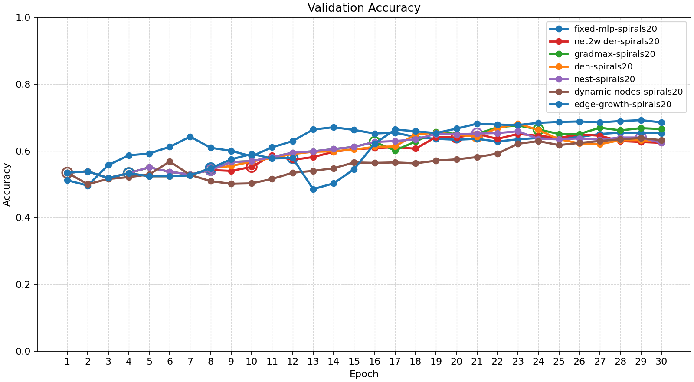

## Training Accuracy

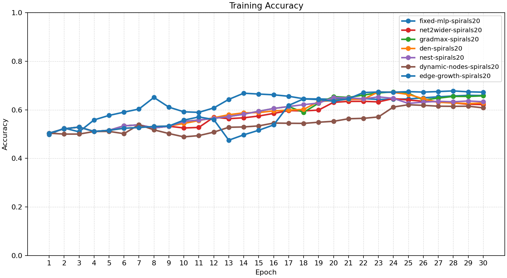

## Training Loss

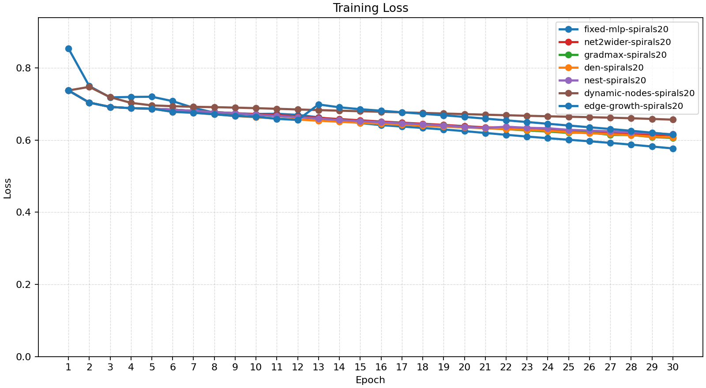

## Experiment Notes

- `net2wider-spirals20`: adaptation=net2wider
- `gradmax-spirals20`: adaptation=gradmax
- `den-spirals20`: adaptation=den
- `nest-spirals20`: adaptation=nest
- `dynamic-nodes-spirals20`: adaptation=dynamic_nodes
- `edge-growth-spirals20`: adaptation=edge_growth

## Adaptation Timeline

### net2wider-spirals20
- epoch 10: `net2wider` params={'amount': 4, 'seed': 51} effect={'applied': True, 'structural_change': True, 'version_delta': 1, 'step_delta': 0, 'hidden_dim_delta': 4, 'num_hidden_layers_delta': 0, 'hidden_dims_changed': True} before={'hidden_dim': 12, 'hidden_dims': [12], 'output_dim': 2, 'num_hidden_layers': 1, 'supported_events': ['grow_hidden', 'insert_hidden_layer', 'net2wider', 'prune_hidden']} after={'hidden_dim': 16, 'hidden_dims': [16], 'output_dim': 2, 'num_hidden_layers': 1, 'supported_events': ['grow_hidden', 'insert_hidden_layer', 'net2wider', 'prune_hidden']} capabilities=['grow_hidden', 'insert_hidden_layer', 'net2wider', 'prune_hidden']
- epoch 20: `net2wider` params={'amount': 4, 'seed': 61} effect={'applied': True, 'structural_change': True, 'version_delta': 1, 'step_delta': 0, 'hidden_dim_delta': 4, 'num_hidden_layers_delta': 0, 'hidden_dims_changed': True} before={'hidden_dim': 16, 'hidden_dims': [16], 'output_dim': 2, 'num_hidden_layers': 1, 'supported_events': ['grow_hidden', 'insert_hidden_layer', 'net2wider', 'prune_hidden']} after={'hidden_dim': 20, 'hidden_dims': [20], 'output_dim': 2, 'num_hidden_layers': 1, 'supported_events': ['grow_hidden', 'insert_hidden_layer', 'net2wider', 'prune_hidden']} capabilities=['grow_hidden', 'insert_hidden_layer', 'net2wider', 'prune_hidden']

### gradmax-spirals20
- epoch 8: `net2wider` params={'amount': 2} effect={'applied': True, 'structural_change': True, 'version_delta': 1, 'step_delta': 0, 'hidden_dim_delta': 2, 'num_hidden_layers_delta': 0, 'hidden_dims_changed': True} before={'hidden_dim': 12, 'hidden_dims': [12], 'output_dim': 2, 'num_hidden_layers': 1, 'supported_events': ['grow_hidden', 'insert_hidden_layer', 'net2wider', 'prune_hidden']} after={'hidden_dim': 14, 'hidden_dims': [14], 'output_dim': 2, 'num_hidden_layers': 1, 'supported_events': ['grow_hidden', 'insert_hidden_layer', 'net2wider', 'prune_hidden']} capabilities=['grow_hidden', 'insert_hidden_layer', 'net2wider', 'prune_hidden']
- epoch 16: `net2wider` params={'amount': 2} effect={'applied': True, 'structural_change': True, 'version_delta': 1, 'step_delta': 0, 'hidden_dim_delta': 2, 'num_hidden_layers_delta': 0, 'hidden_dims_changed': True} before={'hidden_dim': 14, 'hidden_dims': [14], 'output_dim': 2, 'num_hidden_layers': 1, 'supported_events': ['grow_hidden', 'insert_hidden_layer', 'net2wider', 'prune_hidden']} after={'hidden_dim': 16, 'hidden_dims': [16], 'output_dim': 2, 'num_hidden_layers': 1, 'supported_events': ['grow_hidden', 'insert_hidden_layer', 'net2wider', 'prune_hidden']} capabilities=['grow_hidden', 'insert_hidden_layer', 'net2wider', 'prune_hidden']
- epoch 24: `net2wider` params={'amount': 2} effect={'applied': True, 'structural_change': True, 'version_delta': 1, 'step_delta': 0, 'hidden_dim_delta': 2, 'num_hidden_layers_delta': 0, 'hidden_dims_changed': True} before={'hidden_dim': 16, 'hidden_dims': [16], 'output_dim': 2, 'num_hidden_layers': 1, 'supported_events': ['grow_hidden', 'insert_hidden_layer', 'net2wider', 'prune_hidden']} after={'hidden_dim': 18, 'hidden_dims': [18], 'output_dim': 2, 'num_hidden_layers': 1, 'supported_events': ['grow_hidden', 'insert_hidden_layer', 'net2wider', 'prune_hidden']} capabilities=['grow_hidden', 'insert_hidden_layer', 'net2wider', 'prune_hidden']

### den-spirals20
- epoch 4: `net2wider` params={'amount': 2} effect={'applied': True, 'structural_change': True, 'version_delta': 1, 'step_delta': 0, 'hidden_dim_delta': 2, 'num_hidden_layers_delta': 0, 'hidden_dims_changed': True} before={'hidden_dim': 12, 'hidden_dims': [12], 'output_dim': 2, 'num_hidden_layers': 1, 'supported_events': ['grow_hidden', 'insert_hidden_layer', 'net2wider', 'prune_hidden']} after={'hidden_dim': 14, 'hidden_dims': [14], 'output_dim': 2, 'num_hidden_layers': 1, 'supported_events': ['grow_hidden', 'insert_hidden_layer', 'net2wider', 'prune_hidden']} capabilities=['grow_hidden', 'insert_hidden_layer', 'net2wider', 'prune_hidden']
- epoch 21: `net2wider` params={'amount': 2} effect={'applied': True, 'structural_change': True, 'version_delta': 1, 'step_delta': 0, 'hidden_dim_delta': 2, 'num_hidden_layers_delta': 0, 'hidden_dims_changed': True} before={'hidden_dim': 14, 'hidden_dims': [14], 'output_dim': 2, 'num_hidden_layers': 1, 'supported_events': ['grow_hidden', 'insert_hidden_layer', 'net2wider', 'prune_hidden']} after={'hidden_dim': 16, 'hidden_dims': [16], 'output_dim': 2, 'num_hidden_layers': 1, 'supported_events': ['grow_hidden', 'insert_hidden_layer', 'net2wider', 'prune_hidden']} capabilities=['grow_hidden', 'insert_hidden_layer', 'net2wider', 'prune_hidden']

### nest-spirals20
- epoch 8: `net2wider` params={'amount': 2} effect={'applied': True, 'structural_change': True, 'version_delta': 1, 'step_delta': 0, 'hidden_dim_delta': 2, 'num_hidden_layers_delta': 0, 'hidden_dims_changed': True} before={'hidden_dim': 12, 'hidden_dims': [12], 'output_dim': 2, 'num_hidden_layers': 1, 'supported_events': ['grow_hidden', 'insert_hidden_layer', 'net2wider', 'prune_hidden']} after={'hidden_dim': 14, 'hidden_dims': [14], 'output_dim': 2, 'num_hidden_layers': 1, 'supported_events': ['grow_hidden', 'insert_hidden_layer', 'net2wider', 'prune_hidden']} capabilities=['grow_hidden', 'insert_hidden_layer', 'net2wider', 'prune_hidden']
- epoch 21: `prune_hidden` params={'amount': 1, 'min_width': 12} effect={'applied': True, 'structural_change': True, 'version_delta': 1, 'step_delta': 0, 'hidden_dim_delta': -1, 'num_hidden_layers_delta': 0, 'hidden_dims_changed': True} before={'hidden_dim': 14, 'hidden_dims': [14], 'output_dim': 2, 'num_hidden_layers': 1, 'supported_events': ['grow_hidden', 'insert_hidden_layer', 'net2wider', 'prune_hidden']} after={'hidden_dim': 13, 'hidden_dims': [13], 'output_dim': 2, 'num_hidden_layers': 1, 'supported_events': ['grow_hidden', 'insert_hidden_layer', 'net2wider', 'prune_hidden']} capabilities=['grow_hidden', 'insert_hidden_layer', 'net2wider', 'prune_hidden']
- epoch 29: `prune_hidden` params={'amount': 1, 'min_width': 12} effect={'applied': True, 'structural_change': True, 'version_delta': 1, 'step_delta': 0, 'hidden_dim_delta': -1, 'num_hidden_layers_delta': 0, 'hidden_dims_changed': True} before={'hidden_dim': 13, 'hidden_dims': [13], 'output_dim': 2, 'num_hidden_layers': 1, 'supported_events': ['grow_hidden', 'insert_hidden_layer', 'net2wider', 'prune_hidden']} after={'hidden_dim': 12, 'hidden_dims': [12], 'output_dim': 2, 'num_hidden_layers': 1, 'supported_events': ['grow_hidden', 'insert_hidden_layer', 'net2wider', 'prune_hidden']} capabilities=['grow_hidden', 'insert_hidden_layer', 'net2wider', 'prune_hidden']

### dynamic-nodes-spirals20
- epoch 1: `insert_hidden_layer` params={'layer_index': 1, 'width': 12} effect={'applied': True, 'structural_change': True, 'version_delta': 1, 'step_delta': 0, 'hidden_dim_delta': 0, 'num_hidden_layers_delta': 1, 'hidden_dims_changed': True} before={'hidden_dim': 12, 'hidden_dims': [12], 'output_dim': 2, 'num_hidden_layers': 1, 'supported_events': ['grow_hidden', 'insert_hidden_layer', 'net2wider', 'prune_hidden']} after={'hidden_dim': 12, 'hidden_dims': [12, 12], 'output_dim': 2, 'num_hidden_layers': 2, 'supported_events': ['grow_hidden', 'insert_hidden_layer', 'net2wider', 'prune_hidden']} capabilities=['grow_hidden', 'insert_hidden_layer', 'net2wider', 'prune_hidden']

### edge-growth-spirals20
- epoch 4: `net2wider` params={'amount': 2} effect={'applied': True, 'structural_change': True, 'version_delta': 1, 'step_delta': 0, 'hidden_dim_delta': 2, 'num_hidden_layers_delta': 0, 'hidden_dims_changed': True} before={'hidden_dim': 12, 'hidden_dims': [12], 'output_dim': 2, 'num_hidden_layers': 1, 'supported_events': ['grow_hidden', 'insert_hidden_layer', 'net2wider', 'prune_hidden']} after={'hidden_dim': 14, 'hidden_dims': [14], 'output_dim': 2, 'num_hidden_layers': 1, 'supported_events': ['grow_hidden', 'insert_hidden_layer', 'net2wider', 'prune_hidden']} capabilities=['grow_hidden', 'insert_hidden_layer', 'net2wider', 'prune_hidden']
- epoch 8: `net2wider` params={'amount': 2} effect={'applied': True, 'structural_change': True, 'version_delta': 1, 'step_delta': 0, 'hidden_dim_delta': 2, 'num_hidden_layers_delta': 0, 'hidden_dims_changed': True} before={'hidden_dim': 14, 'hidden_dims': [14], 'output_dim': 2, 'num_hidden_layers': 1, 'supported_events': ['grow_hidden', 'insert_hidden_layer', 'net2wider', 'prune_hidden']} after={'hidden_dim': 16, 'hidden_dims': [16], 'output_dim': 2, 'num_hidden_layers': 1, 'supported_events': ['grow_hidden', 'insert_hidden_layer', 'net2wider', 'prune_hidden']} capabilities=['grow_hidden', 'insert_hidden_layer', 'net2wider', 'prune_hidden']
- epoch 12: `insert_hidden_layer` params={'layer_index': 1, 'width': 12} effect={'applied': True, 'structural_change': True, 'version_delta': 1, 'step_delta': 0, 'hidden_dim_delta': 0, 'num_hidden_layers_delta': 1, 'hidden_dims_changed': True} before={'hidden_dim': 16, 'hidden_dims': [16], 'output_dim': 2, 'num_hidden_layers': 1, 'supported_events': ['grow_hidden', 'insert_hidden_layer', 'net2wider', 'prune_hidden']} after={'hidden_dim': 16, 'hidden_dims': [16, 12], 'output_dim': 2, 'num_hidden_layers': 2, 'supported_events': ['grow_hidden', 'insert_hidden_layer', 'net2wider', 'prune_hidden']} capabilities=['grow_hidden', 'insert_hidden_layer', 'net2wider', 'prune_hidden']

## Architecture Graphs

### fixed-mlp-spirals20
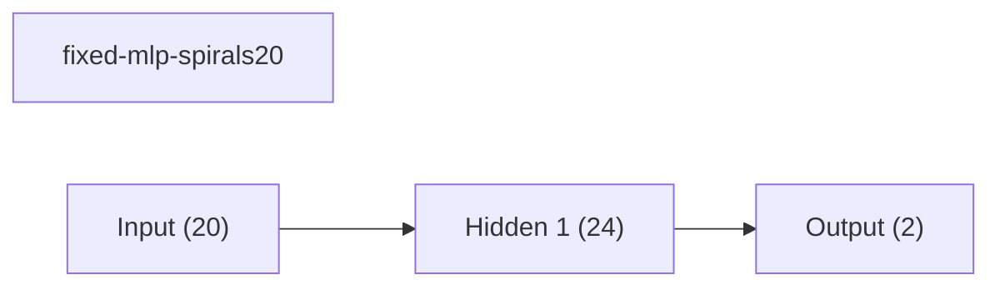

### net2wider-spirals20
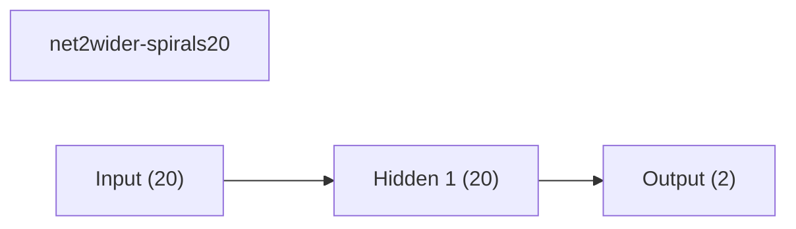

### gradmax-spirals20
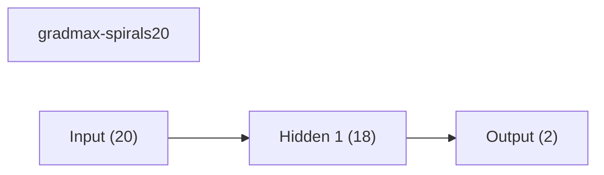

### den-spirals20
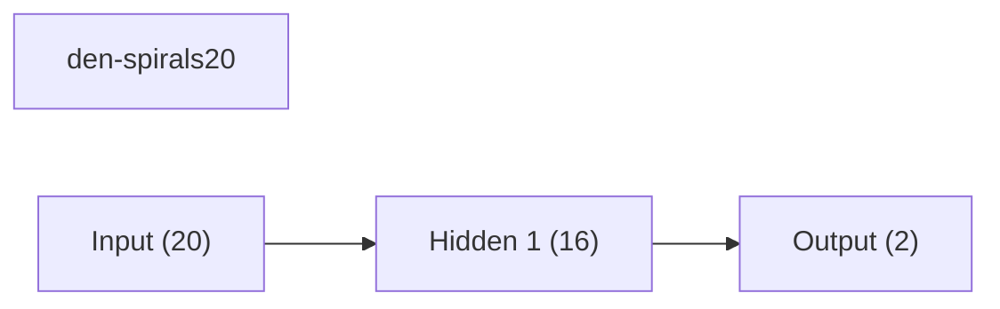

### nest-spirals20
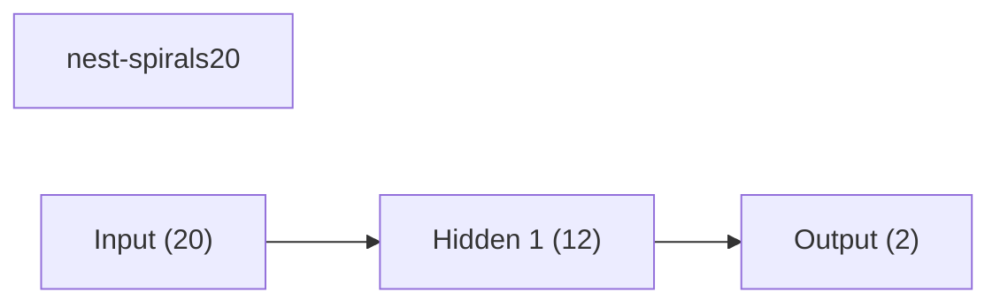

### dynamic-nodes-spirals20
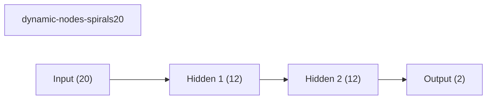

### edge-growth-spirals20
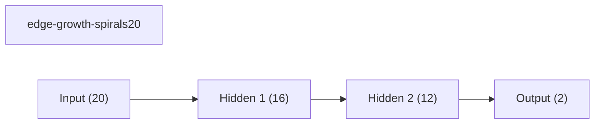

## Validation Accuracy By Epoch

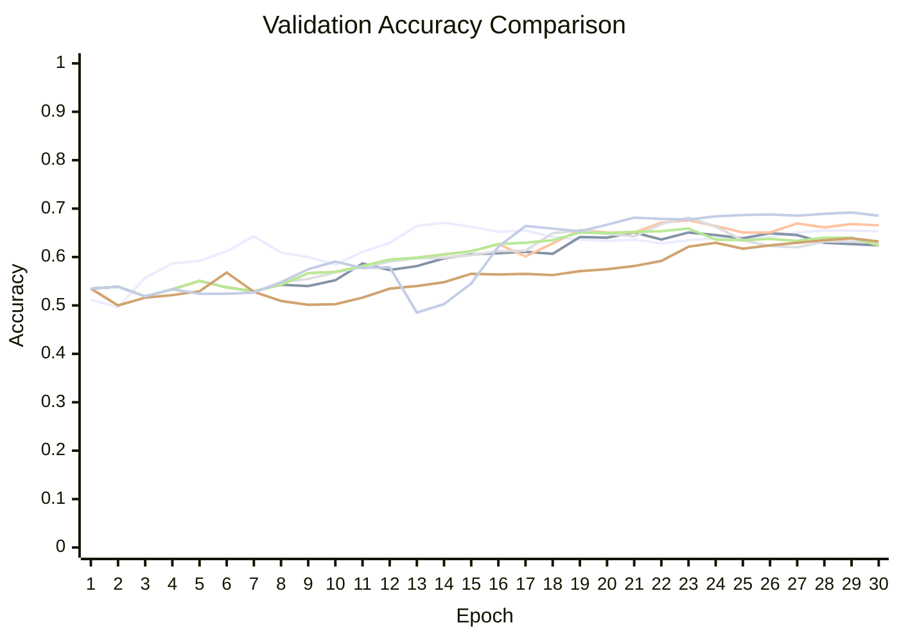
