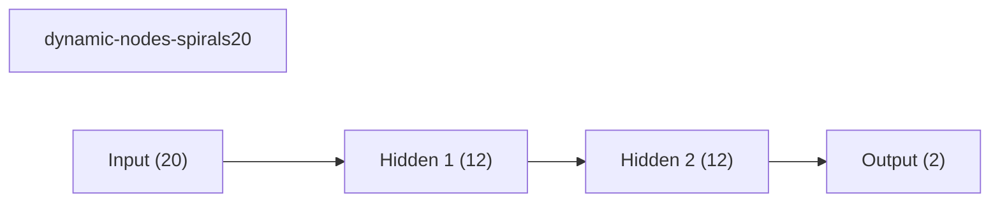
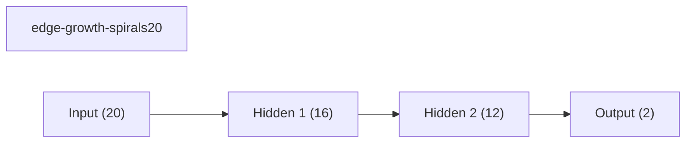
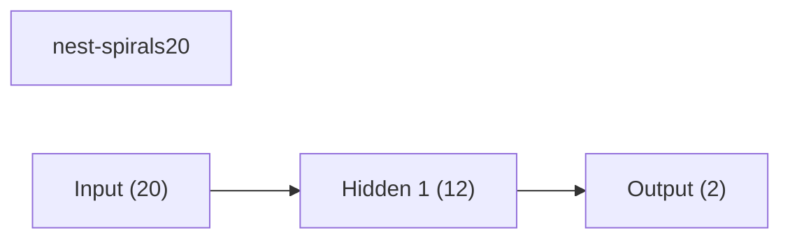
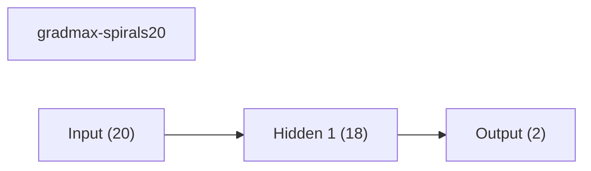
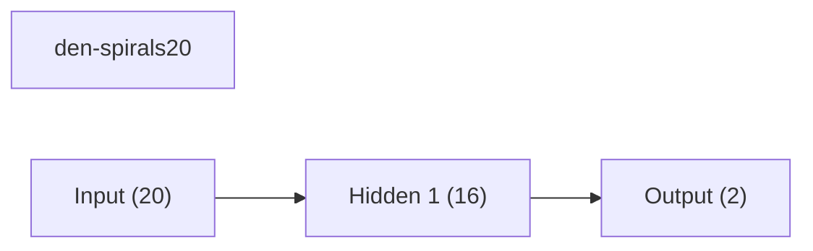
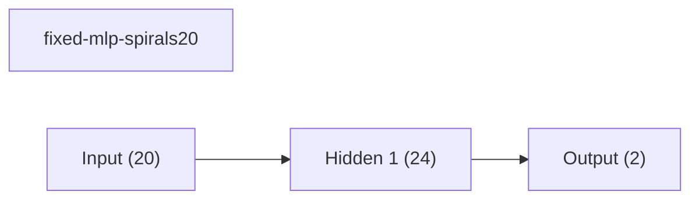
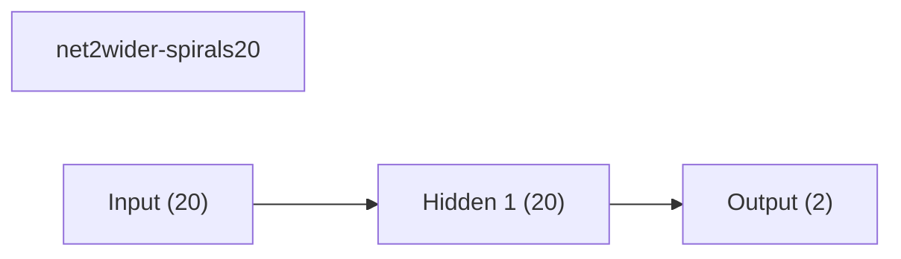

# Benchmark Summary

Seeds: 7, 11, 23, 42, 99

| Experiment | Type | Runs | Mean final val acc | Std final val acc | Mean best val acc | Mean adaptations | Mean final hidden dim | Best seed |
| --- | --- | ---: | ---: | ---: | ---: | ---: | ---: | ---: |
| dynamic-nodes-spirals20 | dynamic | 5 | 0.6307 | 0.0525 | 0.6712 | 1.00 | 12.0 | 23 |
| edge-growth-spirals20 | dynamic | 5 | 0.6293 | 0.0403 | 0.6467 | 3.00 | 16.0 | 42 |
| nest-spirals20 | dynamic | 5 | 0.6216 | 0.0308 | 0.6523 | 3.00 | 12.0 | 11 |
| gradmax-spirals20 | dynamic | 5 | 0.6131 | 0.0470 | 0.6651 | 3.00 | 18.0 | 11 |
| den-spirals20 | dynamic | 5 | 0.6032 | 0.0411 | 0.6560 | 2.00 | 16.0 | 42 |
| fixed-mlp-spirals20 | baseline | 5 | 0.6024 | 0.0405 | 0.6363 | 0.00 | - | 42 |
| net2wider-spirals20 | dynamic | 5 | 0.6016 | 0.0406 | 0.6523 | 2.00 | 20.0 | 11 |

## Per-Seed Results

### dynamic-nodes-spirals20
- seed 7: final=0.6893, best=0.6893, adaptations=1
- seed 11: final=0.5933, best=0.6280, adaptations=1
- seed 23: final=0.6853, best=0.7147, adaptations=1
- seed 42: final=0.6320, best=0.6387, adaptations=1
- seed 99: final=0.5533, best=0.6853, adaptations=1

### edge-growth-spirals20
- seed 7: final=0.6520, best=0.6733, adaptations=3
- seed 11: final=0.6413, best=0.6413, adaptations=3
- seed 23: final=0.5947, best=0.5947, adaptations=3
- seed 42: final=0.6853, best=0.6920, adaptations=3
- seed 99: final=0.5733, best=0.6320, adaptations=3

### nest-spirals20
- seed 7: final=0.6120, best=0.6720, adaptations=3
- seed 11: final=0.6707, best=0.6867, adaptations=3
- seed 23: final=0.5747, best=0.6027, adaptations=3
- seed 42: final=0.6240, best=0.6587, adaptations=3
- seed 99: final=0.6267, best=0.6413, adaptations=3

### gradmax-spirals20
- seed 7: final=0.5667, best=0.6720, adaptations=3
- seed 11: final=0.6733, best=0.6893, adaptations=3
- seed 23: final=0.5667, best=0.6467, adaptations=3
- seed 42: final=0.6653, best=0.6760, adaptations=3
- seed 99: final=0.5933, best=0.6413, adaptations=3

### den-spirals20
- seed 7: final=0.5747, best=0.6800, adaptations=2
- seed 11: final=0.6720, best=0.6760, adaptations=2
- seed 23: final=0.5720, best=0.6227, adaptations=2
- seed 42: final=0.6293, best=0.6813, adaptations=2
- seed 99: final=0.5680, best=0.6200, adaptations=2

### fixed-mlp-spirals20
- seed 7: final=0.6227, best=0.6413, adaptations=0
- seed 11: final=0.6080, best=0.6200, adaptations=0
- seed 23: final=0.5973, best=0.6347, adaptations=0
- seed 42: final=0.6533, best=0.6707, adaptations=0
- seed 99: final=0.5307, best=0.6147, adaptations=0

### net2wider-spirals20
- seed 7: final=0.5987, best=0.6707, adaptations=2
- seed 11: final=0.6653, best=0.6880, adaptations=2
- seed 23: final=0.5707, best=0.6107, adaptations=2
- seed 42: final=0.6240, best=0.6507, adaptations=2
- seed 99: final=0.5493, best=0.6413, adaptations=2

## Representative Architectures

### dynamic-nodes-spirals20 (best seed 23)

### edge-growth-spirals20 (best seed 42)

### nest-spirals20 (best seed 11)

### gradmax-spirals20 (best seed 11)

### den-spirals20 (best seed 42)

### fixed-mlp-spirals20 (best seed 42)

### net2wider-spirals20 (best seed 11)

