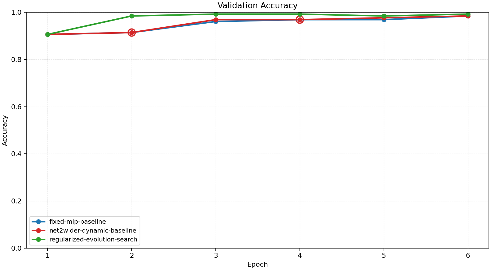
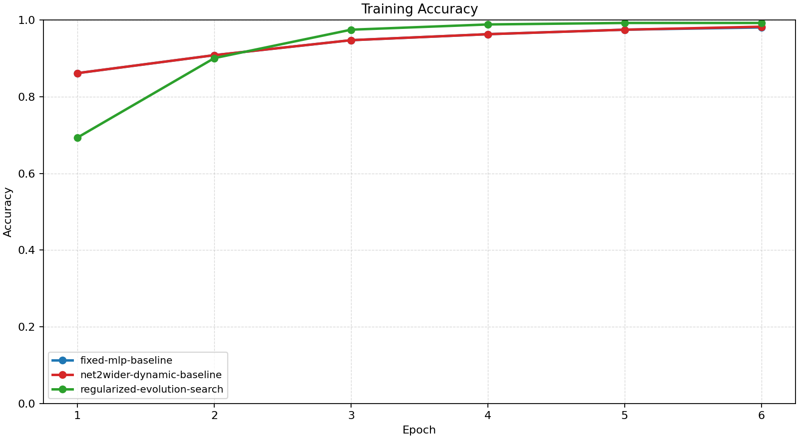
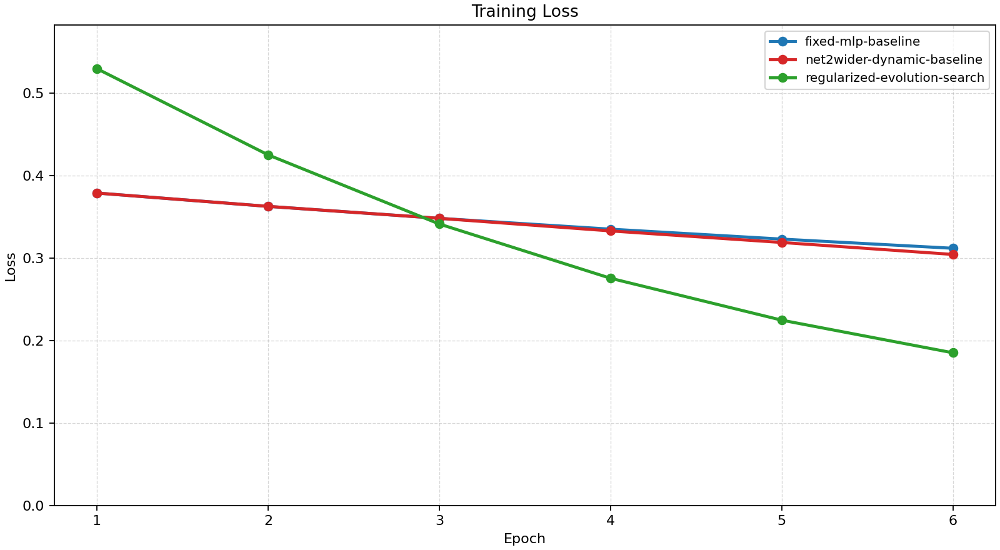
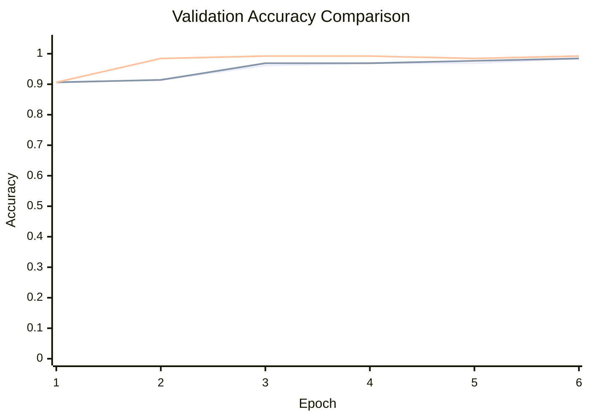

# Baseline Comparison

| Experiment | Type | Epochs | Final train acc | Final val acc | Best val acc | Adaptations | Final hidden dim |
| --- | --- | ---: | ---: | ---: | ---: | ---: | ---: |
| fixed-mlp-baseline | baseline | 6 | 0.9805 | 0.9844 | 0.9844 | 0 | - |
| net2wider-dynamic-baseline | dynamic | 6 | 0.9824 | 0.9844 | 0.9844 | 2 | 16 |
| regularized-evolution-search | search | 6 | 0.9922 | 0.9922 | 0.9922 | 0 | - |

## Validation Accuracy

## Training Accuracy

## Training Loss

## Experiment Notes

- `net2wider-dynamic-baseline`: adaptation=net2wider
- `regularized-evolution-search`: best model params={'input_dim': 2, 'hidden_dim': 8, 'output_dim': 2, 'activation': 'relu', 'lr': 0.02}; evaluations=6; search=regularized_evolution

## Validation Accuracy By Epoch

