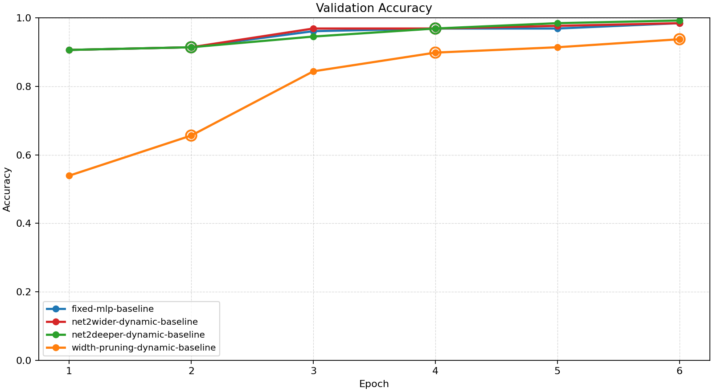
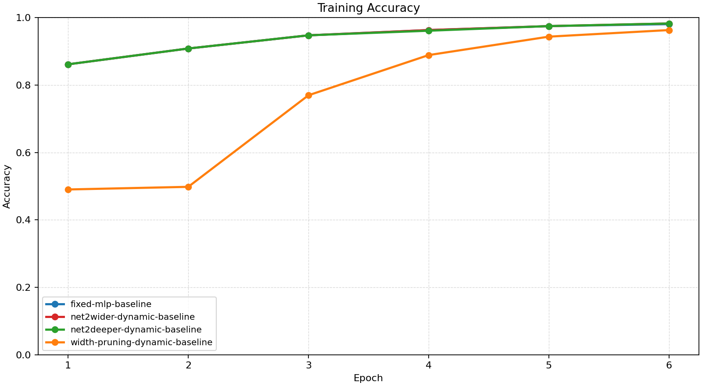
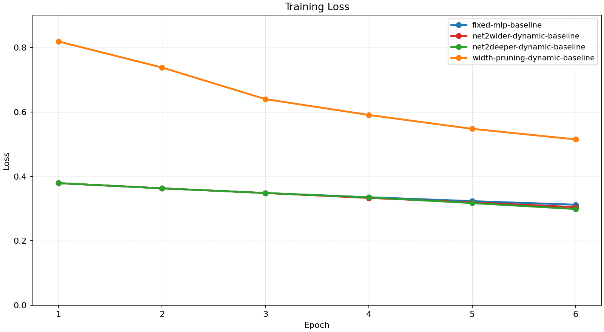
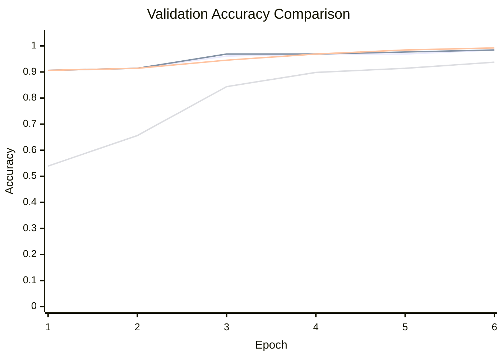

# Baseline Comparison

| Experiment | Type | Epochs | Final train acc | Final val acc | Best val acc | Adaptations | Final hidden dim |
| --- | --- | ---: | ---: | ---: | ---: | ---: | ---: |
| fixed-mlp-baseline | baseline | 6 | 0.9805 | 0.9844 | 0.9844 | 0 | - |
| net2wider-dynamic-baseline | dynamic | 6 | 0.9824 | 0.9844 | 0.9844 | 2 | 16 |
| net2deeper-dynamic-baseline | dynamic | 6 | 0.9824 | 0.9922 | 0.9922 | 2 | 8 |
| width-pruning-dynamic-baseline | dynamic | 6 | 0.9629 | 0.9375 | 0.9375 | 3 | 6 |

## Validation Accuracy

## Training Accuracy

## Training Loss

## Experiment Notes

- `net2wider-dynamic-baseline`: adaptation=net2wider
- `net2deeper-dynamic-baseline`: adaptation=net2deeper
- `width-pruning-dynamic-baseline`: adaptation=prune_hidden

## Adaptation Timeline

### net2wider-dynamic-baseline
- epoch 2: `net2wider` params={'amount': 4, 'seed': 43} metadata={'hidden_dim': 12}
- epoch 4: `net2wider` params={'amount': 4, 'seed': 45} metadata={'hidden_dim': 16}

### net2deeper-dynamic-baseline
- epoch 2: `insert_hidden_layer` params={'layer_index': 1, 'width': 8, 'init_mode': 'identity'} metadata={'method': 'net2deeper', 'hidden_dims': [8, 8], 'num_hidden_layers': 2}
- epoch 4: `insert_hidden_layer` params={'layer_index': 1, 'width': 8, 'init_mode': 'identity'} metadata={'method': 'net2deeper', 'hidden_dims': [8, 8, 8], 'num_hidden_layers': 3}

### width-pruning-dynamic-baseline
- epoch 2: `prune_hidden` params={'amount': 2, 'min_width': 6} metadata={'hidden_dim': 10}
- epoch 4: `prune_hidden` params={'amount': 2, 'min_width': 6} metadata={'hidden_dim': 8}
- epoch 6: `prune_hidden` params={'amount': 2, 'min_width': 6} metadata={'hidden_dim': 6}

## Validation Accuracy By Epoch

