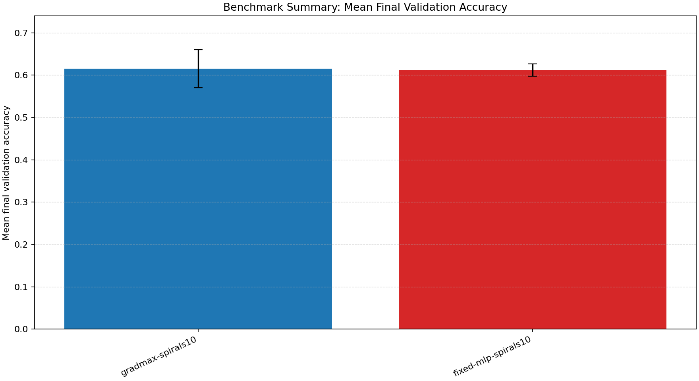
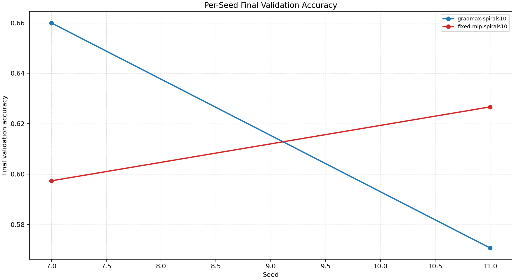
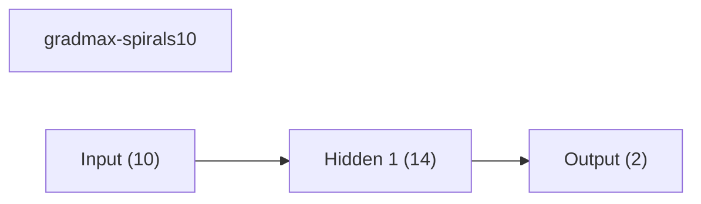
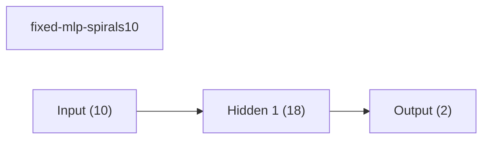

# Benchmark Summary

Seeds: 7, 11

## Aggregate Plots

| Experiment | Type | Runs | Mean final val acc | Std final val acc | Mean best val acc | Mean adaptations | Mean final hidden dim | Best seed |
| --- | --- | ---: | ---: | ---: | ---: | ---: | ---: | ---: |
| gradmax-spirals10 | dynamic | 2 | 0.6153 | 0.0447 | 0.6533 | 2.00 | 14.0 | 7 |
| fixed-mlp-spirals10 | baseline | 2 | 0.6120 | 0.0147 | 0.6540 | 0.00 | - | 7 |

## Per-Seed Results

### gradmax-spirals10
- seed 7: final=0.6600, best=0.6947, adaptations=2
- seed 11: final=0.5707, best=0.6120, adaptations=2

### fixed-mlp-spirals10
- seed 7: final=0.5973, best=0.6680, adaptations=0
- seed 11: final=0.6267, best=0.6400, adaptations=0

## Representative Architectures

### gradmax-spirals10 (best seed 7)

### fixed-mlp-spirals10 (best seed 7)

