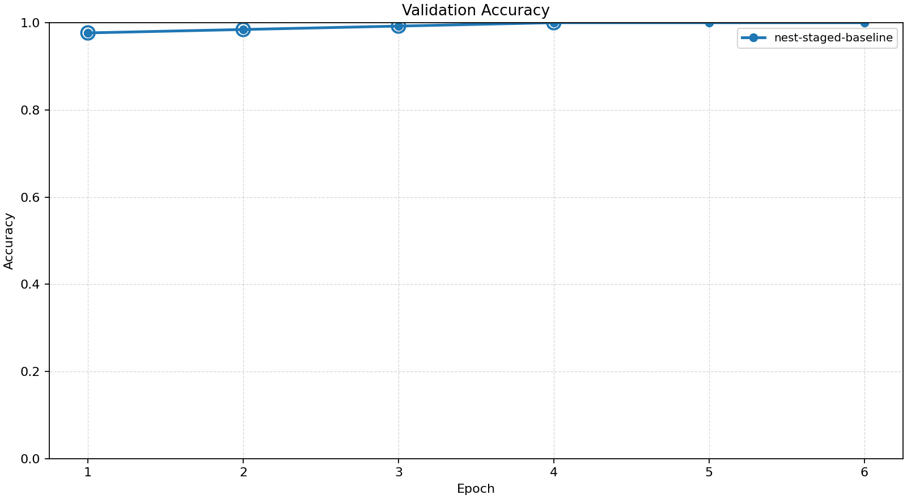
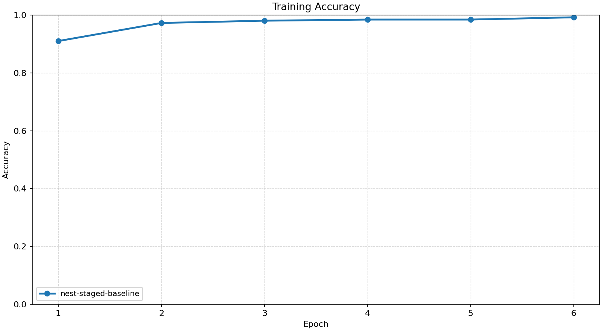
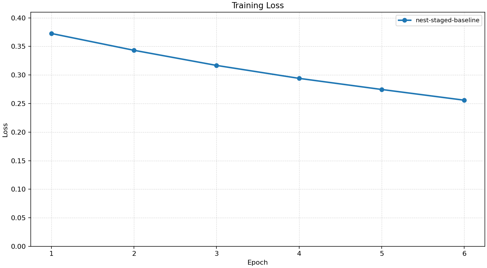
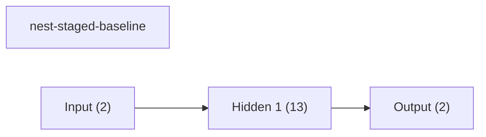
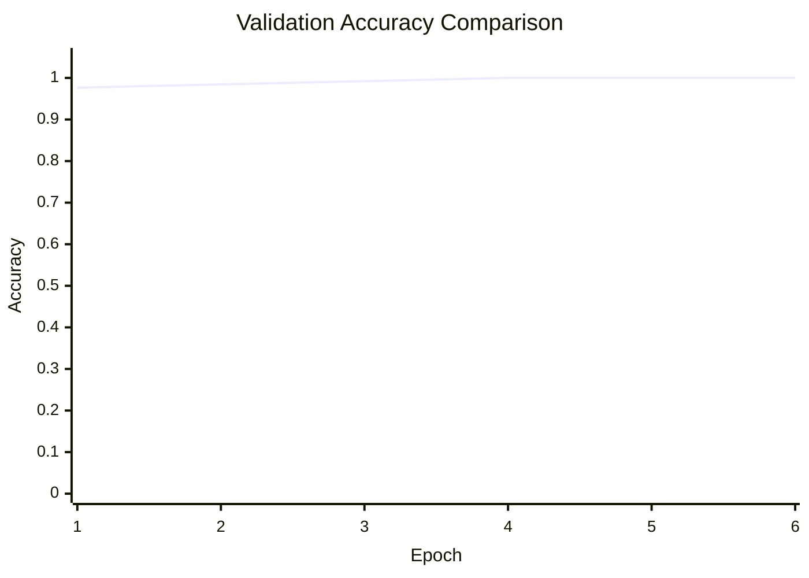

# Baseline Comparison

| Experiment | Type | Epochs | Final train acc | Final val acc | Best val acc | Adaptations | Final hidden dim |
| --- | --- | ---: | ---: | ---: | ---: | ---: | ---: |
| nest-staged-baseline | dynamic | 6 | 0.9922 | 1.0000 | 1.0000 | 4 | 13 |

## Validation Accuracy

## Training Accuracy

## Training Loss

## Experiment Notes

- `nest-staged-baseline`: adaptation=nest; workflow=scheduled

## Workflow Stages

### nest-staged-baseline
- adapt: epochs=4, range=1..4, adaptation_enabled=True, final_val=1.0
- finetune: epochs=2, range=5..6, adaptation_enabled=False, final_val=1.0
- workflow_metadata={'configured_total_epochs': 6, 'executed_total_epochs': 6, 'stage_count': 2}

## Adaptation Timeline

### nest-staged-baseline
- epoch 1: `net2wider` params={'amount': 2} effect={'applied': True, 'structural_change': True, 'version_delta': 1, 'step_delta': 0, 'hidden_dim_delta': 2, 'num_hidden_layers_delta': 0, 'parameter_count_delta': 10, 'hidden_dims_changed': True} before={'hidden_dim': 8, 'hidden_dims': [8], 'output_dim': 2, 'num_hidden_layers': 1, 'parameter_count': 42, 'supported_events': ['grow_hidden', 'insert_hidden_layer', 'net2wider', 'prune_hidden', 'remove_hidden_layer']} after={'hidden_dim': 10, 'hidden_dims': [10], 'output_dim': 2, 'num_hidden_layers': 1, 'parameter_count': 52, 'supported_events': ['grow_hidden', 'insert_hidden_layer', 'net2wider', 'prune_hidden', 'remove_hidden_layer']} capabilities=['grow_hidden', 'insert_hidden_layer', 'net2wider', 'prune_hidden', 'remove_hidden_layer']
- epoch 2: `net2wider` params={'amount': 2} effect={'applied': True, 'structural_change': True, 'version_delta': 1, 'step_delta': 0, 'hidden_dim_delta': 2, 'num_hidden_layers_delta': 0, 'parameter_count_delta': 10, 'hidden_dims_changed': True} before={'hidden_dim': 10, 'hidden_dims': [10], 'output_dim': 2, 'num_hidden_layers': 1, 'parameter_count': 52, 'supported_events': ['grow_hidden', 'insert_hidden_layer', 'net2wider', 'prune_hidden', 'remove_hidden_layer']} after={'hidden_dim': 12, 'hidden_dims': [12], 'output_dim': 2, 'num_hidden_layers': 1, 'parameter_count': 62, 'supported_events': ['grow_hidden', 'insert_hidden_layer', 'net2wider', 'prune_hidden', 'remove_hidden_layer']} capabilities=['grow_hidden', 'insert_hidden_layer', 'net2wider', 'prune_hidden', 'remove_hidden_layer']
- epoch 3: `net2wider` params={'amount': 2} effect={'applied': True, 'structural_change': True, 'version_delta': 1, 'step_delta': 0, 'hidden_dim_delta': 2, 'num_hidden_layers_delta': 0, 'parameter_count_delta': 10, 'hidden_dims_changed': True} before={'hidden_dim': 12, 'hidden_dims': [12], 'output_dim': 2, 'num_hidden_layers': 1, 'parameter_count': 62, 'supported_events': ['grow_hidden', 'insert_hidden_layer', 'net2wider', 'prune_hidden', 'remove_hidden_layer']} after={'hidden_dim': 14, 'hidden_dims': [14], 'output_dim': 2, 'num_hidden_layers': 1, 'parameter_count': 72, 'supported_events': ['grow_hidden', 'insert_hidden_layer', 'net2wider', 'prune_hidden', 'remove_hidden_layer']} capabilities=['grow_hidden', 'insert_hidden_layer', 'net2wider', 'prune_hidden', 'remove_hidden_layer']
- epoch 4: `prune_hidden` params={'amount': 1, 'min_width': 8} effect={'applied': True, 'structural_change': True, 'version_delta': 1, 'step_delta': 0, 'hidden_dim_delta': -1, 'num_hidden_layers_delta': 0, 'parameter_count_delta': -5, 'hidden_dims_changed': True} before={'hidden_dim': 14, 'hidden_dims': [14], 'output_dim': 2, 'num_hidden_layers': 1, 'parameter_count': 72, 'supported_events': ['grow_hidden', 'insert_hidden_layer', 'net2wider', 'prune_hidden', 'remove_hidden_layer']} after={'hidden_dim': 13, 'hidden_dims': [13], 'output_dim': 2, 'num_hidden_layers': 1, 'parameter_count': 67, 'supported_events': ['grow_hidden', 'insert_hidden_layer', 'net2wider', 'prune_hidden', 'remove_hidden_layer']} capabilities=['grow_hidden', 'insert_hidden_layer', 'net2wider', 'prune_hidden', 'remove_hidden_layer']

## Architecture Graphs

### nest-staged-baseline

## Validation Accuracy By Epoch

