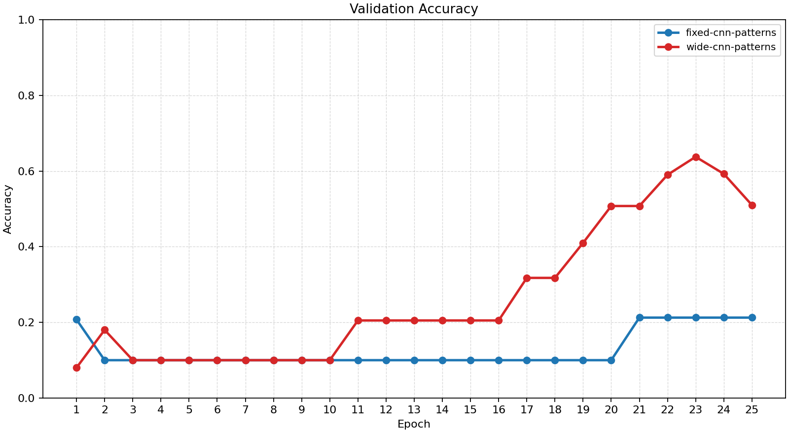
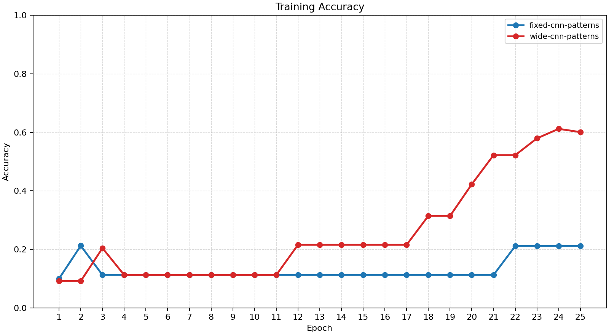
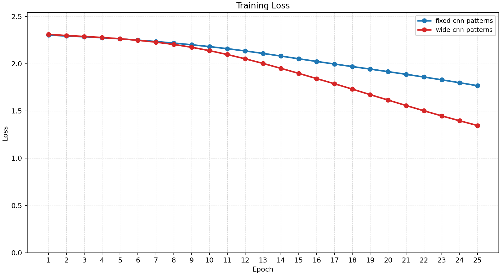
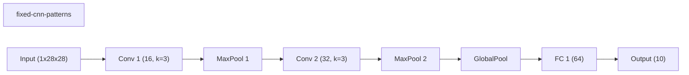
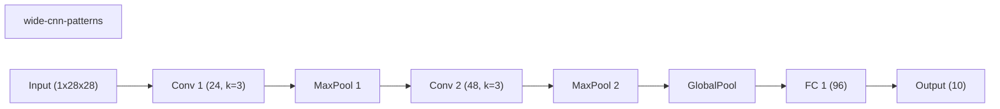
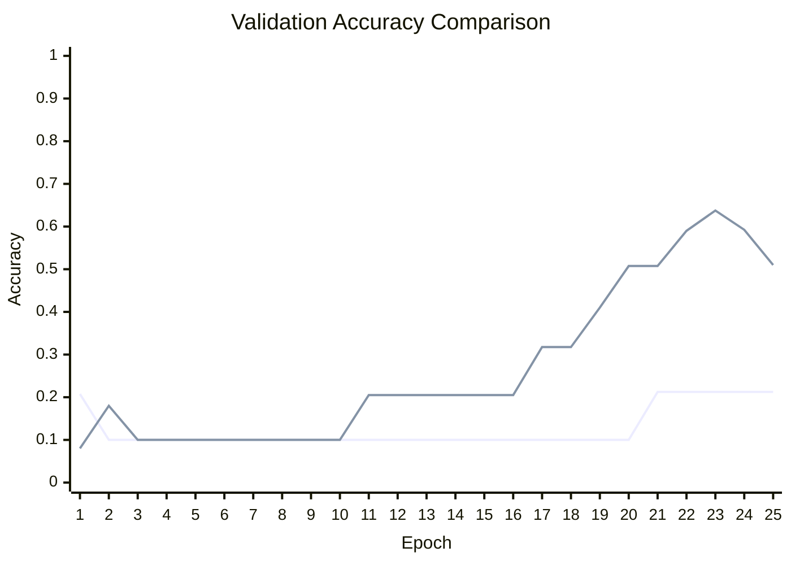

# Baseline Comparison

| Experiment | Type | Epochs | Final train acc | Final val acc | Best val acc | Adaptations | Final hidden dim |
| --- | --- | ---: | ---: | ---: | ---: | ---: | ---: |
| fixed-cnn-patterns | baseline | 25 | 0.2113 | 0.2125 | 0.2125 | 0 | - |
| wide-cnn-patterns | baseline | 25 | 0.6006 | 0.5100 | 0.6375 | 0 | - |

## Validation Accuracy

## Training Accuracy

## Training Loss

## Experiment Notes

- `fixed-cnn-patterns`: device=cpu; requested_device=auto; torch=2.10.0+cpu; cuda_available=False
- `wide-cnn-patterns`: device=cpu; requested_device=auto; torch=2.10.0+cpu; cuda_available=False

## Workflow Stages

### fixed-cnn-patterns
- train: epochs=25, range=1..25, adaptation_enabled=False, final_val=0.21250000596046448
- workflow_metadata={'configured_total_epochs': 25, 'executed_total_epochs': 25, 'stage_count': 1}

### wide-cnn-patterns
- train: epochs=25, range=1..25, adaptation_enabled=False, final_val=0.5099999904632568
- workflow_metadata={'configured_total_epochs': 25, 'executed_total_epochs': 25, 'stage_count': 1}

## Adaptation Timeline

## Architecture Graphs

### fixed-cnn-patterns

### wide-cnn-patterns

## Validation Accuracy By Epoch

