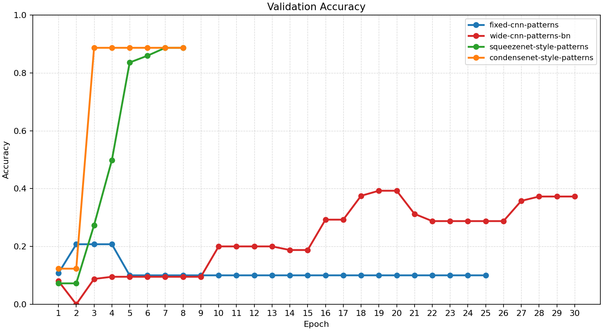
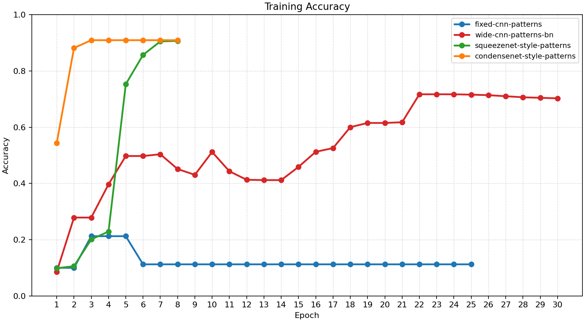
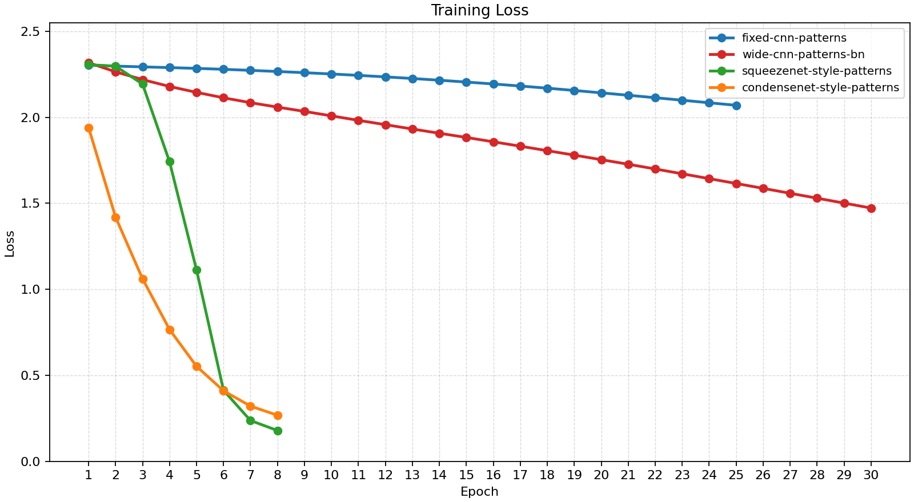
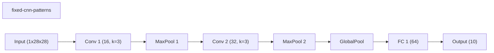
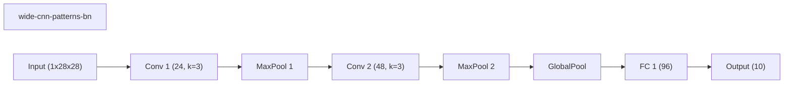
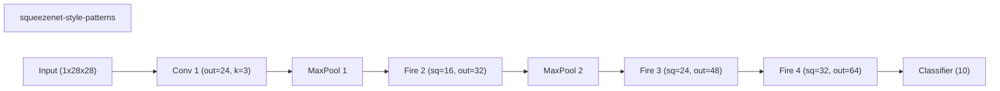
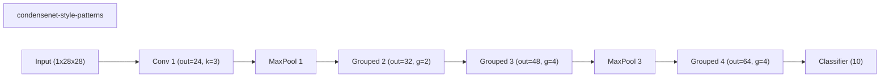
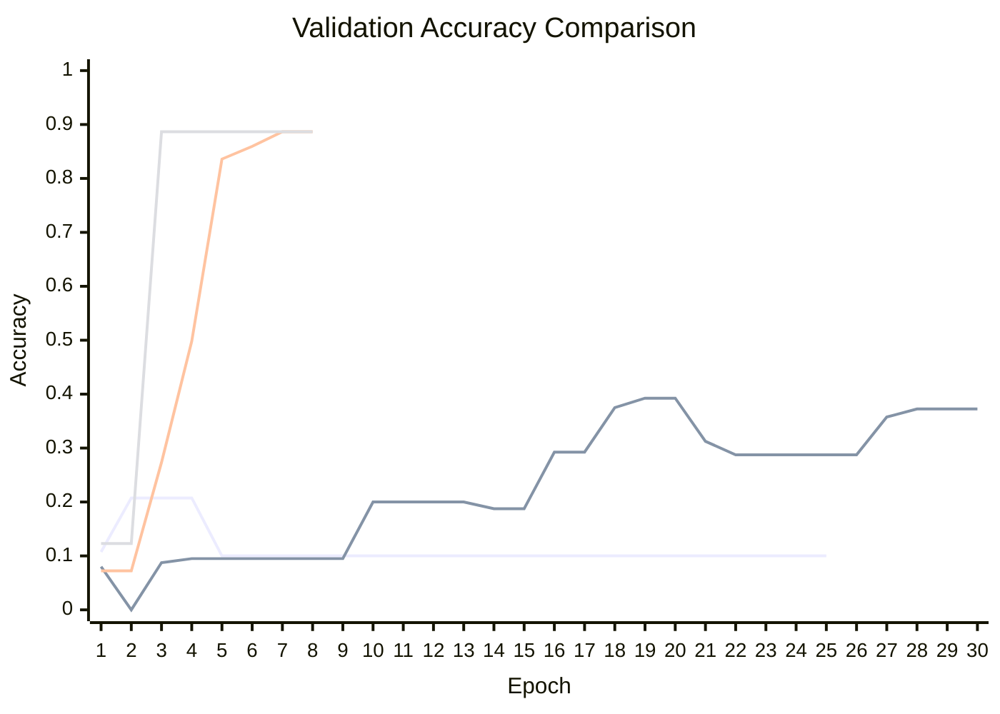

# Baseline Comparison

| Experiment | Type | Epochs | Final train acc | Final val acc | Best val acc | Adaptations | Final hidden dim |
| --- | --- | ---: | ---: | ---: | ---: | ---: | ---: |
| fixed-cnn-patterns | baseline | 25 | 0.1125 | 0.1000 | 0.2075 | 0 | 0 |
| wide-cnn-patterns-bn | baseline | 30 | 0.7025 | 0.3725 | 0.3925 | 0 | 0 |
| squeezenet-style-patterns | baseline | 8 | 0.9067 | 0.8867 | 0.8867 | 0 | - |
| condensenet-style-patterns | baseline | 8 | 0.9092 | 0.8867 | 0.8867 | 0 | - |

## Validation Accuracy

## Training Accuracy

## Training Loss

## Experiment Notes

- `fixed-cnn-patterns`: device=cuda; requested_device=auto; torch=2.11.0+cu128; cuda_available=True; torch_cuda=12.8; cuda_device=NVIDIA GeForce RTX 4070 Laptop GPU
- `wide-cnn-patterns-bn`: device=cuda; requested_device=auto; torch=2.11.0+cu128; cuda_available=True; torch_cuda=12.8; cuda_device=NVIDIA GeForce RTX 4070 Laptop GPU
- `squeezenet-style-patterns`: device=cuda; requested_device=auto; torch=2.11.0+cu128; cuda_available=True; torch_cuda=12.8; cuda_device=NVIDIA GeForce RTX 4070 Laptop GPU
- `condensenet-style-patterns`: device=cuda; requested_device=auto; torch=2.11.0+cu128; cuda_available=True; torch_cuda=12.8; cuda_device=NVIDIA GeForce RTX 4070 Laptop GPU

## Constraint Summary

| Experiment | Params | Nonzero params | Weight sparsity | FLOP proxy | Activation elems |
| --- | ---: | ---: | ---: | ---: | ---: |
| fixed-cnn-patterns | 7562 | 7562 | 0.0000 | 2061098 | 4810 |
| wide-cnn-patterns-bn | 16474 | 16474 | 0.0000 | 4505914 | 7210 |
| squeezenet-style-patterns | 22354 | 22354 | 0.0000 | 1292032 | 36466 |
| condensenet-style-patterns | 22034 | 22034 | 0.0000 | 5457920 | 37642 |

## Workflow Stages

### fixed-cnn-patterns
- train: epochs=25, range=1..25, adaptation_enabled=False, final_val=0.09999999403953552
- workflow_metadata={'configured_total_epochs': 25, 'executed_total_epochs': 25, 'stage_count': 1}

### wide-cnn-patterns-bn
- train: epochs=30, range=1..30, adaptation_enabled=False, final_val=0.3725000023841858
- workflow_metadata={'configured_total_epochs': 30, 'executed_total_epochs': 30, 'stage_count': 1}

### squeezenet-style-patterns
- train: epochs=8, range=1..8, adaptation_enabled=False, final_val=0.88671875
- workflow_metadata={'configured_total_epochs': 8, 'executed_total_epochs': 8, 'stage_count': 1}

### condensenet-style-patterns
- train: epochs=8, range=1..8, adaptation_enabled=False, final_val=0.88671875
- workflow_metadata={'configured_total_epochs': 8, 'executed_total_epochs': 8, 'stage_count': 1}

## Adaptation Timeline

## Architecture Graphs

### fixed-cnn-patterns

### wide-cnn-patterns-bn

### squeezenet-style-patterns

### condensenet-style-patterns

## Validation Accuracy By Epoch

