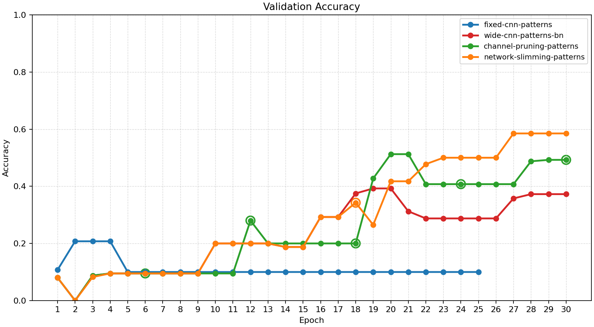
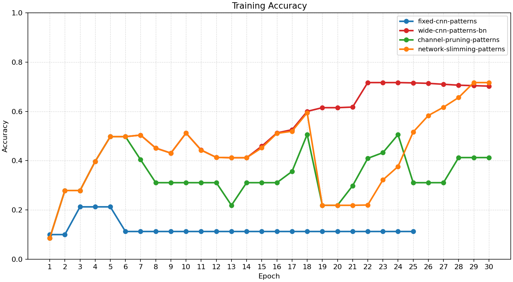
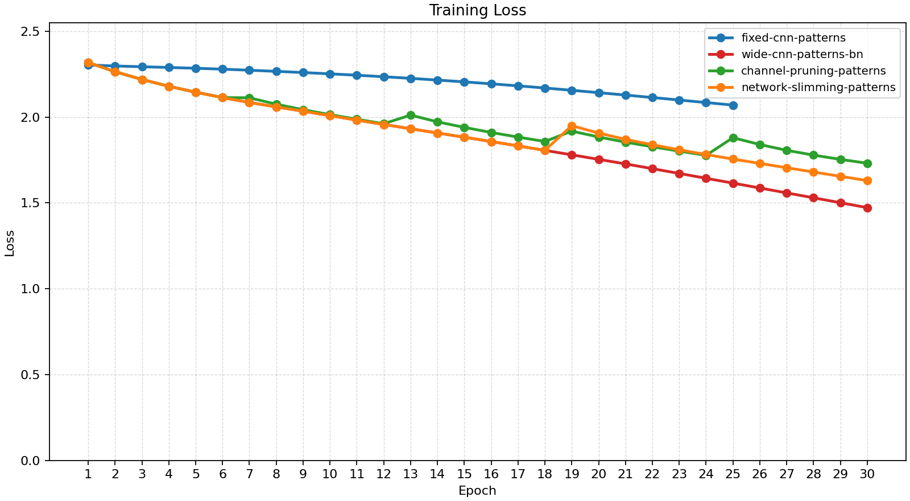
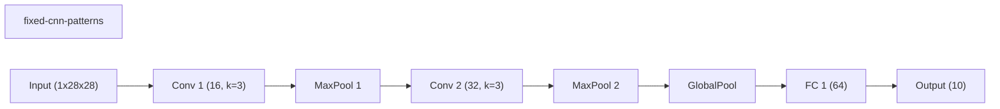
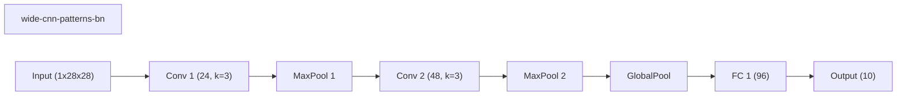
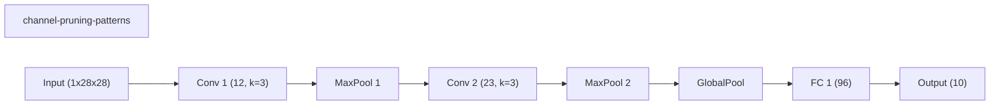
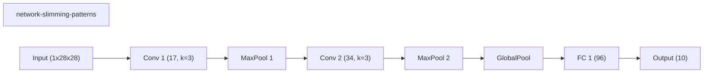
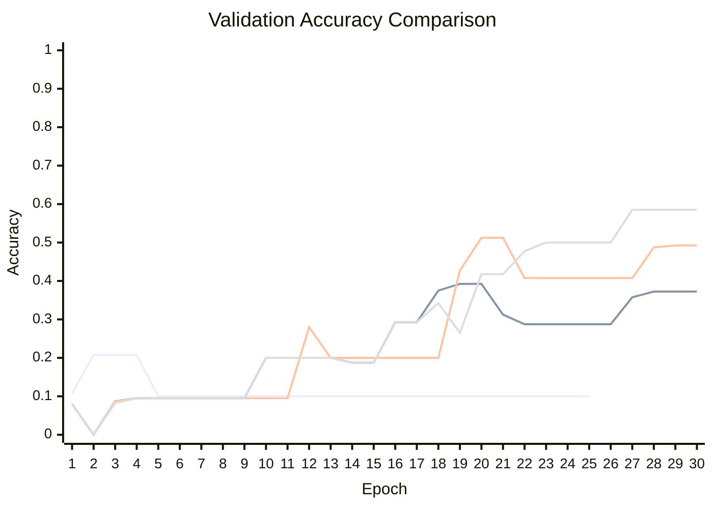

# Baseline Comparison

| Experiment | Type | Epochs | Final train acc | Final val acc | Best val acc | Adaptations | Final hidden dim |
| --- | --- | ---: | ---: | ---: | ---: | ---: | ---: |
| fixed-cnn-patterns | baseline | 25 | 0.1125 | 0.1000 | 0.2075 | 0 | 0 |
| wide-cnn-patterns-bn | baseline | 30 | 0.7025 | 0.3725 | 0.3925 | 0 | 0 |
| channel-pruning-patterns | dynamic | 30 | 0.4125 | 0.4925 | 0.5125 | 5 | 0 |
| network-slimming-patterns | workflow | 30 | 0.7169 | 0.5850 | 0.5850 | 1 | 0 |

## Validation Accuracy

## Training Accuracy

## Training Loss

## Experiment Notes

- `fixed-cnn-patterns`: device=cuda; requested_device=auto; torch=2.11.0+cu128; cuda_available=True; torch_cuda=12.8; cuda_device=NVIDIA GeForce RTX 4070 Laptop GPU
- `wide-cnn-patterns-bn`: device=cuda; requested_device=auto; torch=2.11.0+cu128; cuda_available=True; torch_cuda=12.8; cuda_device=NVIDIA GeForce RTX 4070 Laptop GPU
- `channel-pruning-patterns`: adaptation=channel_pruning; device=cuda; requested_device=auto; torch=2.11.0+cu128; cuda_available=True; torch_cuda=12.8; cuda_device=NVIDIA GeForce RTX 4070 Laptop GPU
- `network-slimming-patterns`: workflow=network_slimming; device=cuda; requested_device=auto; torch=2.11.0+cu128; cuda_available=True; torch_cuda=12.8; cuda_device=NVIDIA GeForce RTX 4070 Laptop GPU

## Constraint Summary

| Experiment | Params | Nonzero params | Weight sparsity | FLOP proxy | Activation elems |
| --- | ---: | ---: | ---: | ---: | ---: |
| fixed-cnn-patterns | 7562 | 7562 | 0.0000 | 2061098 | 4810 |
| wide-cnn-patterns-bn | 16474 | 16474 | 0.0000 | 4505914 | 7210 |
| channel-pruning-patterns | 5971 | 5971 | 0.0000 | 1194741 | 3608 |
| network-slimming-patterns | 9838 | 9838 | 0.0000 | 2352616 | 5138 |

## Workflow Stages

### fixed-cnn-patterns
- train: epochs=25, range=1..25, adaptation_enabled=False, final_val=0.09999999403953552
- workflow_metadata={'configured_total_epochs': 25, 'executed_total_epochs': 25, 'stage_count': 1}

### wide-cnn-patterns-bn
- train: epochs=30, range=1..30, adaptation_enabled=False, final_val=0.3725000023841858
- workflow_metadata={'configured_total_epochs': 30, 'executed_total_epochs': 30, 'stage_count': 1}

### channel-pruning-patterns
- train: epochs=30, range=1..30, adaptation_enabled=True, final_val=0.492499977350235
- workflow_metadata={'configured_total_epochs': 30, 'executed_total_epochs': 30, 'stage_count': 1}

### network-slimming-patterns
- network_slimming_sparse_train: epochs=18, range=1..18, adaptation_enabled=False, final_val=0.3425000011920929
- network_slimming_finetune: epochs=12, range=19..30, adaptation_enabled=False, final_val=0.5849999785423279
- workflow_metadata={'workflow_name': 'network_slimming', 'configured_total_epochs': 30, 'executed_total_epochs': 30, 'stage_count': 2, 'prune_fraction': 0.3, 'min_channels_per_block': 12, 'before_conv_channels': [24, 48], 'after_conv_channels': [17, 34]}

## Adaptation Timeline

### channel-pruning-patterns
- epoch 6: `prune_channels` params={'prune_fraction': 0.15, 'min_channels_per_block': 12} effect={'applied': True, 'structural_change': True, 'version_delta': 1, 'step_delta': 0, 'hidden_dim_delta': None, 'num_hidden_layers_delta': 0, 'parameter_count_delta': -3348, 'nonzero_parameter_count_delta': -3348, 'weight_sparsity_delta': 0.0, 'forward_flop_proxy_delta': -1082431, 'activation_elements_delta': -938, 'hidden_dims_changed': False, 'conv_channels_before': [24, 48], 'conv_channels_after': [21, 41], 'channels_changed': True} before={'conv_channels': [24, 48], 'num_conv_blocks': 2, 'classifier_hidden_dims': [96], 'nonzero_parameter_count': 16474, 'masked_weight_count': 0, 'weight_sparsity': 0.0, 'device': 'cuda', 'use_batch_norm': True, 'batch_norm_sparsity_strength': 0.0, 'supported_events': ['prune_channels'], 'architecture_family': 'cnn', 'parameter_count': 16474, 'forward_flop_proxy': 4505914, 'activation_elements': 7210} after={'conv_channels': [21, 41], 'num_conv_blocks': 2, 'classifier_hidden_dims': [96], 'nonzero_parameter_count': 13126, 'masked_weight_count': 0, 'weight_sparsity': 0.0, 'device': 'cuda', 'use_batch_norm': True, 'batch_norm_sparsity_strength': 0.0, 'supported_events': ['prune_channels'], 'architecture_family': 'cnn', 'parameter_count': 13126, 'forward_flop_proxy': 3423483, 'activation_elements': 6272, 'conv_channels_before_prune': [24, 48]} capabilities=['prune_channels']
- epoch 12: `prune_channels` params={'prune_fraction': 0.15, 'min_channels_per_block': 12} effect={'applied': True, 'structural_change': True, 'version_delta': 1, 'step_delta': 0, 'hidden_dim_delta': None, 'num_hidden_layers_delta': 0, 'parameter_count_delta': -2709, 'nonzero_parameter_count_delta': -2709, 'weight_sparsity_delta': 0.0, 'forward_flop_proxy_delta': -869922, 'activation_elements_delta': -888, 'hidden_dims_changed': False, 'conv_channels_before': [21, 41], 'conv_channels_after': [18, 35], 'channels_changed': True} before={'conv_channels': [21, 41], 'num_conv_blocks': 2, 'classifier_hidden_dims': [96], 'nonzero_parameter_count': 13126, 'masked_weight_count': 0, 'weight_sparsity': 0.0, 'device': 'cuda', 'use_batch_norm': True, 'batch_norm_sparsity_strength': 0.0, 'supported_events': ['prune_channels'], 'architecture_family': 'cnn', 'parameter_count': 13126, 'forward_flop_proxy': 3423483, 'activation_elements': 6272, 'conv_channels_before_prune': [24, 48]} after={'conv_channels': [18, 35], 'num_conv_blocks': 2, 'classifier_hidden_dims': [96], 'nonzero_parameter_count': 10417, 'masked_weight_count': 0, 'weight_sparsity': 0.0, 'device': 'cuda', 'use_batch_norm': True, 'batch_norm_sparsity_strength': 0.0, 'supported_events': ['prune_channels'], 'architecture_family': 'cnn', 'parameter_count': 10417, 'forward_flop_proxy': 2553561, 'activation_elements': 5384, 'conv_channels_before_prune': [21, 41]} capabilities=['prune_channels']
- epoch 18: `prune_channels` params={'prune_fraction': 0.15, 'min_channels_per_block': 12} effect={'applied': True, 'structural_change': True, 'version_delta': 1, 'step_delta': 0, 'hidden_dim_delta': None, 'num_hidden_layers_delta': 0, 'parameter_count_delta': -1869, 'nonzero_parameter_count_delta': -1869, 'weight_sparsity_delta': 0.0, 'forward_flop_proxy_delta': -566665, 'activation_elements_delta': -642, 'hidden_dims_changed': False, 'conv_channels_before': [18, 35], 'conv_channels_after': [16, 30], 'channels_changed': True} before={'conv_channels': [18, 35], 'num_conv_blocks': 2, 'classifier_hidden_dims': [96], 'nonzero_parameter_count': 10417, 'masked_weight_count': 0, 'weight_sparsity': 0.0, 'device': 'cuda', 'use_batch_norm': True, 'batch_norm_sparsity_strength': 0.0, 'supported_events': ['prune_channels'], 'architecture_family': 'cnn', 'parameter_count': 10417, 'forward_flop_proxy': 2553561, 'activation_elements': 5384, 'conv_channels_before_prune': [21, 41]} after={'conv_channels': [16, 30], 'num_conv_blocks': 2, 'classifier_hidden_dims': [96], 'nonzero_parameter_count': 8548, 'masked_weight_count': 0, 'weight_sparsity': 0.0, 'device': 'cuda', 'use_batch_norm': True, 'batch_norm_sparsity_strength': 0.0, 'supported_events': ['prune_channels'], 'architecture_family': 'cnn', 'parameter_count': 8548, 'forward_flop_proxy': 1986896, 'activation_elements': 4742, 'conv_channels_before_prune': [18, 35]} capabilities=['prune_channels']
- epoch 24: `prune_channels` params={'prune_fraction': 0.15, 'min_channels_per_block': 12} effect={'applied': True, 'structural_change': True, 'version_delta': 1, 'step_delta': 0, 'hidden_dim_delta': None, 'num_hidden_layers_delta': 0, 'parameter_count_delta': -1464, 'nonzero_parameter_count_delta': -1464, 'weight_sparsity_delta': 0.0, 'forward_flop_proxy_delta': -445884, 'activation_elements_delta': -592, 'hidden_dims_changed': False, 'conv_channels_before': [16, 30], 'conv_channels_after': [14, 26], 'channels_changed': True} before={'conv_channels': [16, 30], 'num_conv_blocks': 2, 'classifier_hidden_dims': [96], 'nonzero_parameter_count': 8548, 'masked_weight_count': 0, 'weight_sparsity': 0.0, 'device': 'cuda', 'use_batch_norm': True, 'batch_norm_sparsity_strength': 0.0, 'supported_events': ['prune_channels'], 'architecture_family': 'cnn', 'parameter_count': 8548, 'forward_flop_proxy': 1986896, 'activation_elements': 4742, 'conv_channels_before_prune': [18, 35]} after={'conv_channels': [14, 26], 'num_conv_blocks': 2, 'classifier_hidden_dims': [96], 'nonzero_parameter_count': 7084, 'masked_weight_count': 0, 'weight_sparsity': 0.0, 'device': 'cuda', 'use_batch_norm': True, 'batch_norm_sparsity_strength': 0.0, 'supported_events': ['prune_channels'], 'architecture_family': 'cnn', 'parameter_count': 7084, 'forward_flop_proxy': 1541012, 'activation_elements': 4150, 'conv_channels_before_prune': [16, 30]} capabilities=['prune_channels']
- epoch 30: `prune_channels` params={'prune_fraction': 0.15, 'min_channels_per_block': 12} effect={'applied': True, 'structural_change': True, 'version_delta': 1, 'step_delta': 0, 'hidden_dim_delta': None, 'num_hidden_layers_delta': 0, 'parameter_count_delta': -1113, 'nonzero_parameter_count_delta': -1113, 'weight_sparsity_delta': 0.0, 'forward_flop_proxy_delta': -346271, 'activation_elements_delta': -542, 'hidden_dims_changed': False, 'conv_channels_before': [14, 26], 'conv_channels_after': [12, 23], 'channels_changed': True} before={'conv_channels': [14, 26], 'num_conv_blocks': 2, 'classifier_hidden_dims': [96], 'nonzero_parameter_count': 7084, 'masked_weight_count': 0, 'weight_sparsity': 0.0, 'device': 'cuda', 'use_batch_norm': True, 'batch_norm_sparsity_strength': 0.0, 'supported_events': ['prune_channels'], 'architecture_family': 'cnn', 'parameter_count': 7084, 'forward_flop_proxy': 1541012, 'activation_elements': 4150, 'conv_channels_before_prune': [16, 30]} after={'conv_channels': [12, 23], 'num_conv_blocks': 2, 'classifier_hidden_dims': [96], 'nonzero_parameter_count': 5971, 'masked_weight_count': 0, 'weight_sparsity': 0.0, 'device': 'cuda', 'use_batch_norm': True, 'batch_norm_sparsity_strength': 0.0, 'supported_events': ['prune_channels'], 'architecture_family': 'cnn', 'parameter_count': 5971, 'forward_flop_proxy': 1194741, 'activation_elements': 3608, 'conv_channels_before_prune': [14, 26]} capabilities=['prune_channels']

### network-slimming-patterns
- epoch 18: `prune_channels` params={'prune_fraction': 0.3, 'min_channels_per_block': 12} effect={'applied': True, 'structural_change': True, 'version_delta': 1, 'step_delta': 0, 'parameter_count_delta': -6636, 'nonzero_parameter_count_delta': -6636, 'weight_sparsity_delta': 0.0, 'forward_flop_proxy_delta': -2153298, 'activation_elements_delta': -2072, 'num_conv_blocks_delta': 0, 'conv_channels_before': [24, 48], 'conv_channels_after': [17, 34], 'channels_changed': True} before={'conv_channels': [24, 48], 'num_conv_blocks': 2, 'classifier_hidden_dims': [96], 'nonzero_parameter_count': 16474, 'masked_weight_count': 0, 'weight_sparsity': 0.0, 'device': 'cuda', 'use_batch_norm': True, 'batch_norm_sparsity_strength': 0.0, 'supported_events': ['prune_channels'], 'architecture_family': 'cnn', 'parameter_count': 16474, 'forward_flop_proxy': 4505914, 'activation_elements': 7210} after={'conv_channels': [17, 34], 'num_conv_blocks': 2, 'classifier_hidden_dims': [96], 'nonzero_parameter_count': 9838, 'masked_weight_count': 0, 'weight_sparsity': 0.0, 'device': 'cuda', 'use_batch_norm': True, 'batch_norm_sparsity_strength': 0.0, 'supported_events': ['prune_channels'], 'architecture_family': 'cnn', 'parameter_count': 9838, 'forward_flop_proxy': 2352616, 'activation_elements': 5138, 'conv_channels_before_prune': [24, 48]} capabilities=['prune_channels']

## Architecture Graphs

### fixed-cnn-patterns

### wide-cnn-patterns-bn

### channel-pruning-patterns

### network-slimming-patterns

## Validation Accuracy By Epoch

