# Baseline Comparison

| Experiment | Type | Epochs | Final train acc | Final val acc | Best val acc | Adaptations | Final hidden dim |
| --- | --- | ---: | ---: | ---: | ---: | ---: | ---: |
| fixed-cnn-mnist | baseline | 5 | 0.0963 | 0.0914 | 0.1036 | 0 | 0 |
| wide-cnn-mnist-bn | baseline | 6 | 0.2461 | 0.1108 | 0.1118 | 0 | 0 |
| channel-pruning-mnist | dynamic | 6 | 0.2715 | 0.1196 | 0.1970 | 3 | 0 |
| channel-pruning-plateau-mnist | dynamic | 6 | 0.2431 | 0.1110 | 0.1118 | 2 | 0 |
| weights-connections-cnn-mnist | dynamic | 6 | 0.2251 | 0.1108 | 0.1146 | 5 | 0 |
| layerwise-obs-cnn-mnist | dynamic | 6 | 0.2041 | 0.1116 | 0.1118 | 5 | 0 |
| network-slimming-mnist | workflow | 6 | 0.2008 | 0.1108 | 0.1128 | 1 | 0 |

## Validation Accuracy

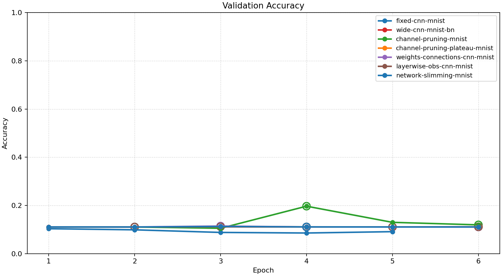

## Training Accuracy

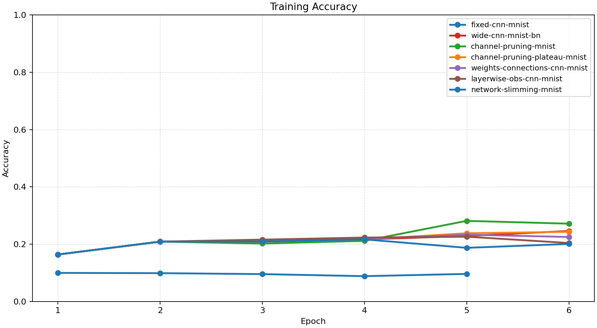

## Training Loss

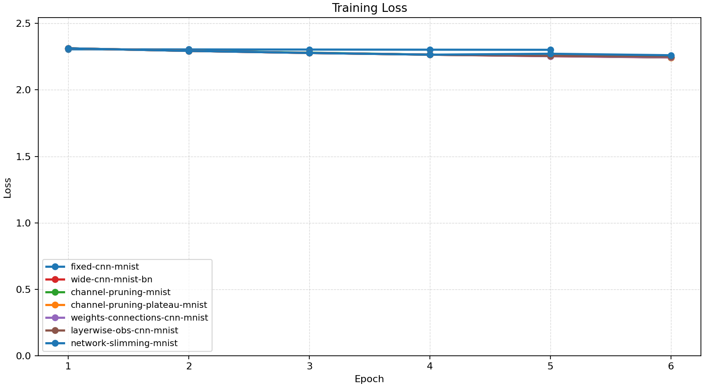

## Experiment Notes

- `fixed-cnn-mnist`: device=cuda; requested_device=auto; torch=2.11.0+cu128; cuda_available=True; torch_cuda=12.8; cuda_device=NVIDIA GeForce RTX 4070 Laptop GPU
- `wide-cnn-mnist-bn`: device=cuda; requested_device=auto; torch=2.11.0+cu128; cuda_available=True; torch_cuda=12.8; cuda_device=NVIDIA GeForce RTX 4070 Laptop GPU
- `channel-pruning-mnist`: adaptation=channel_pruning; device=cuda; requested_device=auto; torch=2.11.0+cu128; cuda_available=True; torch_cuda=12.8; cuda_device=NVIDIA GeForce RTX 4070 Laptop GPU
- `channel-pruning-plateau-mnist`: adaptation=channel_pruning_plateau; device=cuda; requested_device=auto; torch=2.11.0+cu128; cuda_available=True; torch_cuda=12.8; cuda_device=NVIDIA GeForce RTX 4070 Laptop GPU
- `weights-connections-cnn-mnist`: adaptation=weights_connections; device=cuda; requested_device=auto; torch=2.11.0+cu128; cuda_available=True; torch_cuda=12.8; cuda_device=NVIDIA GeForce RTX 4070 Laptop GPU
- `layerwise-obs-cnn-mnist`: adaptation=layerwise_obs; device=cuda; requested_device=auto; torch=2.11.0+cu128; cuda_available=True; torch_cuda=12.8; cuda_device=NVIDIA GeForce RTX 4070 Laptop GPU
- `network-slimming-mnist`: workflow=network_slimming; device=cuda; requested_device=auto; torch=2.11.0+cu128; cuda_available=True; torch_cuda=12.8; cuda_device=NVIDIA GeForce RTX 4070 Laptop GPU

## Constraint Summary

| Experiment | Params | Nonzero params | Weight sparsity | FLOP proxy | Activation elems |
| --- | ---: | ---: | ---: | ---: | ---: |
| fixed-cnn-mnist | 7562 | 7562 | 0.0000 | 2061098 | 4810 |
| wide-cnn-mnist-bn | 16474 | 16474 | 0.0000 | 4505914 | 7210 |
| channel-pruning-mnist | 10678 | 10678 | 0.0000 | 2617894 | 5434 |
| channel-pruning-plateau-mnist | 12466 | 12466 | 0.0000 | 3190786 | 6026 |
| weights-connections-cnn-mnist | 16474 | 10014 | 0.4000 | 4505914 | 7210 |
| layerwise-obs-cnn-mnist | 16474 | 10975 | 0.3405 | 4505914 | 7210 |
| network-slimming-mnist | 10678 | 10678 | 0.0000 | 2617894 | 5434 |

## Workflow Stages

### fixed-cnn-mnist
- train: epochs=5, range=1..5, adaptation_enabled=False, final_val=0.09139999747276306
- workflow_metadata={'configured_total_epochs': 5, 'executed_total_epochs': 5, 'stage_count': 1}

### wide-cnn-mnist-bn
- train: epochs=6, range=1..6, adaptation_enabled=False, final_val=0.11079999804496765
- workflow_metadata={'configured_total_epochs': 6, 'executed_total_epochs': 6, 'stage_count': 1}

### channel-pruning-mnist
- train: epochs=6, range=1..6, adaptation_enabled=True, final_val=0.11959999799728394
- workflow_metadata={'configured_total_epochs': 6, 'executed_total_epochs': 6, 'stage_count': 1}

### channel-pruning-plateau-mnist
- train: epochs=6, range=1..6, adaptation_enabled=True, final_val=0.11099999397993088
- workflow_metadata={'configured_total_epochs': 6, 'executed_total_epochs': 6, 'stage_count': 1}

### weights-connections-cnn-mnist
- train: epochs=6, range=1..6, adaptation_enabled=True, final_val=0.11079999804496765
- workflow_metadata={'configured_total_epochs': 6, 'executed_total_epochs': 6, 'stage_count': 1}

### layerwise-obs-cnn-mnist
- train: epochs=6, range=1..6, adaptation_enabled=True, final_val=0.11159999668598175
- workflow_metadata={'configured_total_epochs': 6, 'executed_total_epochs': 6, 'stage_count': 1}

### network-slimming-mnist
- network_slimming_sparse_train: epochs=4, range=1..4, adaptation_enabled=False, final_val=0.1111999973654747
- network_slimming_finetune: epochs=2, range=5..6, adaptation_enabled=False, final_val=0.11079999804496765
- workflow_metadata={'workflow_name': 'network_slimming', 'configured_total_epochs': 6, 'executed_total_epochs': 6, 'stage_count': 2, 'prune_fraction': 0.25, 'min_channels_per_block': 12, 'before_conv_channels': [24, 48], 'after_conv_channels': [18, 36]}

## Adaptation Timeline

### channel-pruning-mnist
- epoch 2: `prune_channels` params={'prune_fraction': 0.1, 'min_channels_per_block': 12} effect={'applied': True, 'structural_change': True, 'version_delta': 1, 'step_delta': 0, 'hidden_dim_delta': None, 'num_hidden_layers_delta': 0, 'parameter_count_delta': -2076, 'nonzero_parameter_count_delta': -2076, 'weight_sparsity_delta': 0.0, 'forward_flop_proxy_delta': -685788, 'activation_elements_delta': -592, 'hidden_dims_changed': False, 'conv_channels_before': [24, 48], 'conv_channels_after': [22, 44], 'channels_changed': True} before={'conv_channels': [24, 48], 'num_conv_blocks': 2, 'classifier_hidden_dims': [96], 'nonzero_parameter_count': 16474, 'masked_weight_count': 0, 'weight_sparsity': 0.0, 'mask_state_names': ['conv_0.weight', 'conv_1.weight', 'linear_0.weight', 'linear_1.weight'], 'device': 'cuda', 'use_batch_norm': True, 'batch_norm_sparsity_strength': 0.0, 'supported_events': ['apply_weight_mask', 'prune_channels'], 'architecture_family': 'cnn', 'parameter_count': 16474, 'forward_flop_proxy': 4505914, 'activation_elements': 7210} after={'conv_channels': [22, 44], 'num_conv_blocks': 2, 'classifier_hidden_dims': [96], 'nonzero_parameter_count': 14398, 'masked_weight_count': 0, 'weight_sparsity': 0.0, 'mask_state_names': ['conv_0.weight', 'conv_1.weight', 'linear_0.weight', 'linear_1.weight'], 'device': 'cuda', 'use_batch_norm': True, 'batch_norm_sparsity_strength': 0.0, 'supported_events': ['apply_weight_mask', 'prune_channels'], 'architecture_family': 'cnn', 'parameter_count': 14398, 'forward_flop_proxy': 3820126, 'activation_elements': 6618, 'conv_channels_before_prune': [24, 48]} capabilities=['apply_weight_mask', 'prune_channels']
- epoch 4: `prune_channels` params={'prune_fraction': 0.1, 'min_channels_per_block': 12} effect={'applied': True, 'structural_change': True, 'version_delta': 1, 'step_delta': 0, 'hidden_dim_delta': None, 'num_hidden_layers_delta': 0, 'parameter_count_delta': -1932, 'nonzero_parameter_count_delta': -1932, 'weight_sparsity_delta': 0.0, 'forward_flop_proxy_delta': -629340, 'activation_elements_delta': -592, 'hidden_dims_changed': False, 'conv_channels_before': [22, 44], 'conv_channels_after': [20, 40], 'channels_changed': True} before={'conv_channels': [22, 44], 'num_conv_blocks': 2, 'classifier_hidden_dims': [96], 'nonzero_parameter_count': 14398, 'masked_weight_count': 0, 'weight_sparsity': 0.0, 'mask_state_names': ['conv_0.weight', 'conv_1.weight', 'linear_0.weight', 'linear_1.weight'], 'device': 'cuda', 'use_batch_norm': True, 'batch_norm_sparsity_strength': 0.0, 'supported_events': ['apply_weight_mask', 'prune_channels'], 'architecture_family': 'cnn', 'parameter_count': 14398, 'forward_flop_proxy': 3820126, 'activation_elements': 6618, 'conv_channels_before_prune': [24, 48]} after={'conv_channels': [20, 40], 'num_conv_blocks': 2, 'classifier_hidden_dims': [96], 'nonzero_parameter_count': 12466, 'masked_weight_count': 0, 'weight_sparsity': 0.0, 'mask_state_names': ['conv_0.weight', 'conv_1.weight', 'linear_0.weight', 'linear_1.weight'], 'device': 'cuda', 'use_batch_norm': True, 'batch_norm_sparsity_strength': 0.0, 'supported_events': ['apply_weight_mask', 'prune_channels'], 'architecture_family': 'cnn', 'parameter_count': 12466, 'forward_flop_proxy': 3190786, 'activation_elements': 6026, 'conv_channels_before_prune': [22, 44]} capabilities=['apply_weight_mask', 'prune_channels']
- epoch 6: `prune_channels` params={'prune_fraction': 0.1, 'min_channels_per_block': 12} effect={'applied': True, 'structural_change': True, 'version_delta': 1, 'step_delta': 0, 'hidden_dim_delta': None, 'num_hidden_layers_delta': 0, 'parameter_count_delta': -1788, 'nonzero_parameter_count_delta': -1788, 'weight_sparsity_delta': 0.0, 'forward_flop_proxy_delta': -572892, 'activation_elements_delta': -592, 'hidden_dims_changed': False, 'conv_channels_before': [20, 40], 'conv_channels_after': [18, 36], 'channels_changed': True} before={'conv_channels': [20, 40], 'num_conv_blocks': 2, 'classifier_hidden_dims': [96], 'nonzero_parameter_count': 12466, 'masked_weight_count': 0, 'weight_sparsity': 0.0, 'mask_state_names': ['conv_0.weight', 'conv_1.weight', 'linear_0.weight', 'linear_1.weight'], 'device': 'cuda', 'use_batch_norm': True, 'batch_norm_sparsity_strength': 0.0, 'supported_events': ['apply_weight_mask', 'prune_channels'], 'architecture_family': 'cnn', 'parameter_count': 12466, 'forward_flop_proxy': 3190786, 'activation_elements': 6026, 'conv_channels_before_prune': [22, 44]} after={'conv_channels': [18, 36], 'num_conv_blocks': 2, 'classifier_hidden_dims': [96], 'nonzero_parameter_count': 10678, 'masked_weight_count': 0, 'weight_sparsity': 0.0, 'mask_state_names': ['conv_0.weight', 'conv_1.weight', 'linear_0.weight', 'linear_1.weight'], 'device': 'cuda', 'use_batch_norm': True, 'batch_norm_sparsity_strength': 0.0, 'supported_events': ['apply_weight_mask', 'prune_channels'], 'architecture_family': 'cnn', 'parameter_count': 10678, 'forward_flop_proxy': 2617894, 'activation_elements': 5434, 'conv_channels_before_prune': [20, 40]} capabilities=['apply_weight_mask', 'prune_channels']

### channel-pruning-plateau-mnist
- epoch 4: `prune_channels` params={'prune_fraction': 0.1, 'min_channels_per_block': 12} effect={'applied': True, 'structural_change': True, 'version_delta': 1, 'step_delta': 0, 'hidden_dim_delta': None, 'num_hidden_layers_delta': 0, 'parameter_count_delta': -2076, 'nonzero_parameter_count_delta': -2076, 'weight_sparsity_delta': 0.0, 'forward_flop_proxy_delta': -685788, 'activation_elements_delta': -592, 'hidden_dims_changed': False, 'conv_channels_before': [24, 48], 'conv_channels_after': [22, 44], 'channels_changed': True} before={'conv_channels': [24, 48], 'num_conv_blocks': 2, 'classifier_hidden_dims': [96], 'nonzero_parameter_count': 16474, 'masked_weight_count': 0, 'weight_sparsity': 0.0, 'mask_state_names': ['conv_0.weight', 'conv_1.weight', 'linear_0.weight', 'linear_1.weight'], 'device': 'cuda', 'use_batch_norm': True, 'batch_norm_sparsity_strength': 0.0, 'supported_events': ['apply_weight_mask', 'prune_channels'], 'architecture_family': 'cnn', 'parameter_count': 16474, 'forward_flop_proxy': 4505914, 'activation_elements': 7210} after={'conv_channels': [22, 44], 'num_conv_blocks': 2, 'classifier_hidden_dims': [96], 'nonzero_parameter_count': 14398, 'masked_weight_count': 0, 'weight_sparsity': 0.0, 'mask_state_names': ['conv_0.weight', 'conv_1.weight', 'linear_0.weight', 'linear_1.weight'], 'device': 'cuda', 'use_batch_norm': True, 'batch_norm_sparsity_strength': 0.0, 'supported_events': ['apply_weight_mask', 'prune_channels'], 'architecture_family': 'cnn', 'parameter_count': 14398, 'forward_flop_proxy': 3820126, 'activation_elements': 6618, 'conv_channels_before_prune': [24, 48]} capabilities=['apply_weight_mask', 'prune_channels']
- epoch 6: `prune_channels` params={'prune_fraction': 0.1, 'min_channels_per_block': 12} effect={'applied': True, 'structural_change': True, 'version_delta': 1, 'step_delta': 0, 'hidden_dim_delta': None, 'num_hidden_layers_delta': 0, 'parameter_count_delta': -1932, 'nonzero_parameter_count_delta': -1932, 'weight_sparsity_delta': 0.0, 'forward_flop_proxy_delta': -629340, 'activation_elements_delta': -592, 'hidden_dims_changed': False, 'conv_channels_before': [22, 44], 'conv_channels_after': [20, 40], 'channels_changed': True} before={'conv_channels': [22, 44], 'num_conv_blocks': 2, 'classifier_hidden_dims': [96], 'nonzero_parameter_count': 14398, 'masked_weight_count': 0, 'weight_sparsity': 0.0, 'mask_state_names': ['conv_0.weight', 'conv_1.weight', 'linear_0.weight', 'linear_1.weight'], 'device': 'cuda', 'use_batch_norm': True, 'batch_norm_sparsity_strength': 0.0, 'supported_events': ['apply_weight_mask', 'prune_channels'], 'architecture_family': 'cnn', 'parameter_count': 14398, 'forward_flop_proxy': 3820126, 'activation_elements': 6618, 'conv_channels_before_prune': [24, 48]} after={'conv_channels': [20, 40], 'num_conv_blocks': 2, 'classifier_hidden_dims': [96], 'nonzero_parameter_count': 12466, 'masked_weight_count': 0, 'weight_sparsity': 0.0, 'mask_state_names': ['conv_0.weight', 'conv_1.weight', 'linear_0.weight', 'linear_1.weight'], 'device': 'cuda', 'use_batch_norm': True, 'batch_norm_sparsity_strength': 0.0, 'supported_events': ['apply_weight_mask', 'prune_channels'], 'architecture_family': 'cnn', 'parameter_count': 12466, 'forward_flop_proxy': 3190786, 'activation_elements': 6026, 'conv_channels_before_prune': [22, 44]} capabilities=['apply_weight_mask', 'prune_channels']

### weights-connections-cnn-mnist
- epoch 2: `apply_weight_mask` params={'threshold': 0.006920160260051489, 'target_sparsity': 0.08} effect={'applied': True, 'structural_change': True, 'version_delta': 1, 'step_delta': 0, 'hidden_dim_delta': None, 'num_hidden_layers_delta': 0, 'parameter_count_delta': 0, 'nonzero_parameter_count_delta': -1292, 'weight_sparsity_delta': 0.07999009410599306, 'forward_flop_proxy_delta': 0, 'activation_elements_delta': 0, 'hidden_dims_changed': False, 'conv_channels_before': [24, 48], 'conv_channels_after': [24, 48], 'channels_changed': False} before={'conv_channels': [24, 48], 'num_conv_blocks': 2, 'classifier_hidden_dims': [96], 'nonzero_parameter_count': 16474, 'masked_weight_count': 0, 'weight_sparsity': 0.0, 'mask_state_names': ['conv_0.weight', 'conv_1.weight', 'linear_0.weight', 'linear_1.weight'], 'device': 'cuda', 'use_batch_norm': True, 'batch_norm_sparsity_strength': 0.0, 'supported_events': ['apply_weight_mask', 'prune_channels'], 'architecture_family': 'cnn', 'parameter_count': 16474, 'forward_flop_proxy': 4505914, 'activation_elements': 7210} after={'conv_channels': [24, 48], 'num_conv_blocks': 2, 'classifier_hidden_dims': [96], 'nonzero_parameter_count': 15182, 'masked_weight_count': 1292, 'weight_sparsity': 0.07999009410599306, 'mask_state_names': ['conv_0.weight', 'conv_1.weight', 'linear_0.weight', 'linear_1.weight'], 'device': 'cuda', 'use_batch_norm': True, 'batch_norm_sparsity_strength': 0.0, 'supported_events': ['apply_weight_mask', 'prune_channels'], 'architecture_family': 'cnn', 'parameter_count': 16474, 'forward_flop_proxy': 4505914, 'activation_elements': 7210, 'mask_threshold': 0.006920160260051489, 'target_weight_sparsity': 0.08} capabilities=['apply_weight_mask', 'prune_channels']
- epoch 3: `apply_weight_mask` params={'threshold': 0.013574463315308094, 'target_sparsity': 0.15999009410599307} effect={'applied': True, 'structural_change': True, 'version_delta': 1, 'step_delta': 0, 'hidden_dim_delta': None, 'num_hidden_layers_delta': 0, 'parameter_count_delta': 0, 'nonzero_parameter_count_delta': -1292, 'weight_sparsity_delta': 0.07999009410599306, 'forward_flop_proxy_delta': 0, 'activation_elements_delta': 0, 'hidden_dims_changed': False, 'conv_channels_before': [24, 48], 'conv_channels_after': [24, 48], 'channels_changed': False} before={'conv_channels': [24, 48], 'num_conv_blocks': 2, 'classifier_hidden_dims': [96], 'nonzero_parameter_count': 15182, 'masked_weight_count': 1292, 'weight_sparsity': 0.07999009410599306, 'mask_state_names': ['conv_0.weight', 'conv_1.weight', 'linear_0.weight', 'linear_1.weight'], 'device': 'cuda', 'use_batch_norm': True, 'batch_norm_sparsity_strength': 0.0, 'supported_events': ['apply_weight_mask', 'prune_channels'], 'architecture_family': 'cnn', 'parameter_count': 16474, 'forward_flop_proxy': 4505914, 'activation_elements': 7210, 'mask_threshold': 0.006920160260051489, 'target_weight_sparsity': 0.08} after={'conv_channels': [24, 48], 'num_conv_blocks': 2, 'classifier_hidden_dims': [96], 'nonzero_parameter_count': 13890, 'masked_weight_count': 2584, 'weight_sparsity': 0.15998018821198612, 'mask_state_names': ['conv_0.weight', 'conv_1.weight', 'linear_0.weight', 'linear_1.weight'], 'device': 'cuda', 'use_batch_norm': True, 'batch_norm_sparsity_strength': 0.0, 'supported_events': ['apply_weight_mask', 'prune_channels'], 'architecture_family': 'cnn', 'parameter_count': 16474, 'forward_flop_proxy': 4505914, 'activation_elements': 7210, 'mask_threshold': 0.013574463315308094, 'target_weight_sparsity': 0.15999009410599307} capabilities=['apply_weight_mask', 'prune_channels']
- epoch 4: `apply_weight_mask` params={'threshold': 0.019861405715346336, 'target_sparsity': 0.23998018821198613} effect={'applied': True, 'structural_change': True, 'version_delta': 1, 'step_delta': 0, 'hidden_dim_delta': None, 'num_hidden_layers_delta': 0, 'parameter_count_delta': 0, 'nonzero_parameter_count_delta': -1292, 'weight_sparsity_delta': 0.07999009410599309, 'forward_flop_proxy_delta': 0, 'activation_elements_delta': 0, 'hidden_dims_changed': False, 'conv_channels_before': [24, 48], 'conv_channels_after': [24, 48], 'channels_changed': False} before={'conv_channels': [24, 48], 'num_conv_blocks': 2, 'classifier_hidden_dims': [96], 'nonzero_parameter_count': 13890, 'masked_weight_count': 2584, 'weight_sparsity': 0.15998018821198612, 'mask_state_names': ['conv_0.weight', 'conv_1.weight', 'linear_0.weight', 'linear_1.weight'], 'device': 'cuda', 'use_batch_norm': True, 'batch_norm_sparsity_strength': 0.0, 'supported_events': ['apply_weight_mask', 'prune_channels'], 'architecture_family': 'cnn', 'parameter_count': 16474, 'forward_flop_proxy': 4505914, 'activation_elements': 7210, 'mask_threshold': 0.013574463315308094, 'target_weight_sparsity': 0.15999009410599307} after={'conv_channels': [24, 48], 'num_conv_blocks': 2, 'classifier_hidden_dims': [96], 'nonzero_parameter_count': 12598, 'masked_weight_count': 3876, 'weight_sparsity': 0.2399702823179792, 'mask_state_names': ['conv_0.weight', 'conv_1.weight', 'linear_0.weight', 'linear_1.weight'], 'device': 'cuda', 'use_batch_norm': True, 'batch_norm_sparsity_strength': 0.0, 'supported_events': ['apply_weight_mask', 'prune_channels'], 'architecture_family': 'cnn', 'parameter_count': 16474, 'forward_flop_proxy': 4505914, 'activation_elements': 7210, 'mask_threshold': 0.019861405715346336, 'target_weight_sparsity': 0.23998018821198613} capabilities=['apply_weight_mask', 'prune_channels']
- epoch 5: `apply_weight_mask` params={'threshold': 0.02651754580438137, 'target_sparsity': 0.3199702823179792} effect={'applied': True, 'structural_change': True, 'version_delta': 1, 'step_delta': 0, 'hidden_dim_delta': None, 'num_hidden_layers_delta': 0, 'parameter_count_delta': 0, 'nonzero_parameter_count_delta': -1292, 'weight_sparsity_delta': 0.07999009410599303, 'forward_flop_proxy_delta': 0, 'activation_elements_delta': 0, 'hidden_dims_changed': False, 'conv_channels_before': [24, 48], 'conv_channels_after': [24, 48], 'channels_changed': False} before={'conv_channels': [24, 48], 'num_conv_blocks': 2, 'classifier_hidden_dims': [96], 'nonzero_parameter_count': 12598, 'masked_weight_count': 3876, 'weight_sparsity': 0.2399702823179792, 'mask_state_names': ['conv_0.weight', 'conv_1.weight', 'linear_0.weight', 'linear_1.weight'], 'device': 'cuda', 'use_batch_norm': True, 'batch_norm_sparsity_strength': 0.0, 'supported_events': ['apply_weight_mask', 'prune_channels'], 'architecture_family': 'cnn', 'parameter_count': 16474, 'forward_flop_proxy': 4505914, 'activation_elements': 7210, 'mask_threshold': 0.019861405715346336, 'target_weight_sparsity': 0.23998018821198613} after={'conv_channels': [24, 48], 'num_conv_blocks': 2, 'classifier_hidden_dims': [96], 'nonzero_parameter_count': 11306, 'masked_weight_count': 5168, 'weight_sparsity': 0.31996037642397224, 'mask_state_names': ['conv_0.weight', 'conv_1.weight', 'linear_0.weight', 'linear_1.weight'], 'device': 'cuda', 'use_batch_norm': True, 'batch_norm_sparsity_strength': 0.0, 'supported_events': ['apply_weight_mask', 'prune_channels'], 'architecture_family': 'cnn', 'parameter_count': 16474, 'forward_flop_proxy': 4505914, 'activation_elements': 7210, 'mask_threshold': 0.02651754580438137, 'target_weight_sparsity': 0.3199702823179792} capabilities=['apply_weight_mask', 'prune_channels']
- epoch 6: `apply_weight_mask` params={'threshold': 0.03304281830787659, 'target_sparsity': 0.39996037642397225} effect={'applied': True, 'structural_change': True, 'version_delta': 1, 'step_delta': 0, 'hidden_dim_delta': None, 'num_hidden_layers_delta': 0, 'parameter_count_delta': 0, 'nonzero_parameter_count_delta': -1292, 'weight_sparsity_delta': 0.07999009410599311, 'forward_flop_proxy_delta': 0, 'activation_elements_delta': 0, 'hidden_dims_changed': False, 'conv_channels_before': [24, 48], 'conv_channels_after': [24, 48], 'channels_changed': False} before={'conv_channels': [24, 48], 'num_conv_blocks': 2, 'classifier_hidden_dims': [96], 'nonzero_parameter_count': 11306, 'masked_weight_count': 5168, 'weight_sparsity': 0.31996037642397224, 'mask_state_names': ['conv_0.weight', 'conv_1.weight', 'linear_0.weight', 'linear_1.weight'], 'device': 'cuda', 'use_batch_norm': True, 'batch_norm_sparsity_strength': 0.0, 'supported_events': ['apply_weight_mask', 'prune_channels'], 'architecture_family': 'cnn', 'parameter_count': 16474, 'forward_flop_proxy': 4505914, 'activation_elements': 7210, 'mask_threshold': 0.02651754580438137, 'target_weight_sparsity': 0.3199702823179792} after={'conv_channels': [24, 48], 'num_conv_blocks': 2, 'classifier_hidden_dims': [96], 'nonzero_parameter_count': 10014, 'masked_weight_count': 6460, 'weight_sparsity': 0.39995047052996535, 'mask_state_names': ['conv_0.weight', 'conv_1.weight', 'linear_0.weight', 'linear_1.weight'], 'device': 'cuda', 'use_batch_norm': True, 'batch_norm_sparsity_strength': 0.0, 'supported_events': ['apply_weight_mask', 'prune_channels'], 'architecture_family': 'cnn', 'parameter_count': 16474, 'forward_flop_proxy': 4505914, 'activation_elements': 7210, 'mask_threshold': 0.03304281830787659, 'target_weight_sparsity': 0.39996037642397225} capabilities=['apply_weight_mask', 'prune_channels']

### layerwise-obs-cnn-mnist
- epoch 2: `apply_weight_mask` params={'thresholds_by_name': {'conv_0.weight': 0.04486875236034393, 'conv_1.weight': 0.005578519776463509, 'linear_0.weight': 0.011013918556272984, 'linear_1.weight': 0.007862530648708344}, 'target_sparsity': 0.08, 'layerwise_prune_fraction': 0.08} effect={'applied': True, 'structural_change': True, 'version_delta': 1, 'step_delta': 0, 'hidden_dim_delta': None, 'num_hidden_layers_delta': 0, 'parameter_count_delta': 0, 'nonzero_parameter_count_delta': -1290, 'weight_sparsity_delta': 0.07986627043090638, 'forward_flop_proxy_delta': 0, 'activation_elements_delta': 0, 'hidden_dims_changed': False, 'conv_channels_before': [24, 48], 'conv_channels_after': [24, 48], 'channels_changed': False} before={'conv_channels': [24, 48], 'num_conv_blocks': 2, 'classifier_hidden_dims': [96], 'nonzero_parameter_count': 16474, 'masked_weight_count': 0, 'weight_sparsity': 0.0, 'mask_state_names': ['conv_0.weight', 'conv_1.weight', 'linear_0.weight', 'linear_1.weight'], 'device': 'cuda', 'use_batch_norm': True, 'batch_norm_sparsity_strength': 0.0, 'supported_events': ['apply_weight_mask', 'prune_channels'], 'architecture_family': 'cnn', 'parameter_count': 16474, 'forward_flop_proxy': 4505914, 'activation_elements': 7210} after={'conv_channels': [24, 48], 'num_conv_blocks': 2, 'classifier_hidden_dims': [96], 'nonzero_parameter_count': 15184, 'masked_weight_count': 1290, 'weight_sparsity': 0.07986627043090638, 'mask_state_names': ['conv_0.weight', 'conv_1.weight', 'linear_0.weight', 'linear_1.weight'], 'device': 'cuda', 'use_batch_norm': True, 'batch_norm_sparsity_strength': 0.0, 'supported_events': ['apply_weight_mask', 'prune_channels'], 'architecture_family': 'cnn', 'parameter_count': 16474, 'forward_flop_proxy': 4505914, 'activation_elements': 7210, 'mask_threshold': None, 'mask_thresholds_by_name': {'conv_0.weight': 0.04486875, 'conv_1.weight': 0.00557852, 'linear_0.weight': 0.01101392, 'linear_1.weight': 0.00786253}, 'target_weight_sparsity': 0.08} capabilities=['apply_weight_mask', 'prune_channels']
- epoch 3: `apply_weight_mask` params={'thresholds_by_name': {'conv_0.weight': 0.06344587355852127, 'conv_1.weight': 0.010903623886406422, 'linear_0.weight': 0.021793097257614136, 'linear_1.weight': 0.014139562845230103}, 'target_sparsity': 0.1598662704309064, 'layerwise_prune_fraction': 0.08} effect={'applied': True, 'structural_change': True, 'version_delta': 1, 'step_delta': 0, 'hidden_dim_delta': None, 'num_hidden_layers_delta': 0, 'parameter_count_delta': 0, 'nonzero_parameter_count_delta': -1187, 'weight_sparsity_delta': 0.07348935116394256, 'forward_flop_proxy_delta': 0, 'activation_elements_delta': 0, 'hidden_dims_changed': False, 'conv_channels_before': [24, 48], 'conv_channels_after': [24, 48], 'channels_changed': False} before={'conv_channels': [24, 48], 'num_conv_blocks': 2, 'classifier_hidden_dims': [96], 'nonzero_parameter_count': 15184, 'masked_weight_count': 1290, 'weight_sparsity': 0.07986627043090638, 'mask_state_names': ['conv_0.weight', 'conv_1.weight', 'linear_0.weight', 'linear_1.weight'], 'device': 'cuda', 'use_batch_norm': True, 'batch_norm_sparsity_strength': 0.0, 'supported_events': ['apply_weight_mask', 'prune_channels'], 'architecture_family': 'cnn', 'parameter_count': 16474, 'forward_flop_proxy': 4505914, 'activation_elements': 7210, 'mask_threshold': None, 'mask_thresholds_by_name': {'conv_0.weight': 0.04486875, 'conv_1.weight': 0.00557852, 'linear_0.weight': 0.01101392, 'linear_1.weight': 0.00786253}, 'target_weight_sparsity': 0.08} after={'conv_channels': [24, 48], 'num_conv_blocks': 2, 'classifier_hidden_dims': [96], 'nonzero_parameter_count': 13997, 'masked_weight_count': 2477, 'weight_sparsity': 0.15335562159484895, 'mask_state_names': ['conv_0.weight', 'conv_1.weight', 'linear_0.weight', 'linear_1.weight'], 'device': 'cuda', 'use_batch_norm': True, 'batch_norm_sparsity_strength': 0.0, 'supported_events': ['apply_weight_mask', 'prune_channels'], 'architecture_family': 'cnn', 'parameter_count': 16474, 'forward_flop_proxy': 4505914, 'activation_elements': 7210, 'mask_threshold': None, 'mask_thresholds_by_name': {'conv_0.weight': 0.06344587, 'conv_1.weight': 0.01090362, 'linear_0.weight': 0.0217931, 'linear_1.weight': 0.01413956}, 'target_weight_sparsity': 0.1598662704309064} capabilities=['apply_weight_mask', 'prune_channels']
- epoch 4: `apply_weight_mask` params={'thresholds_by_name': {'conv_0.weight': 0.08344724029302597, 'conv_1.weight': 0.015409110113978386, 'linear_0.weight': 0.03168180584907532, 'linear_1.weight': 0.02110711857676506}, 'target_sparsity': 0.23335562159484896, 'layerwise_prune_fraction': 0.08} effect={'applied': True, 'structural_change': True, 'version_delta': 1, 'step_delta': 0, 'hidden_dim_delta': None, 'num_hidden_layers_delta': 0, 'parameter_count_delta': 0, 'nonzero_parameter_count_delta': -1093, 'weight_sparsity_delta': 0.06766963843486873, 'forward_flop_proxy_delta': 0, 'activation_elements_delta': 0, 'hidden_dims_changed': False, 'conv_channels_before': [24, 48], 'conv_channels_after': [24, 48], 'channels_changed': False} before={'conv_channels': [24, 48], 'num_conv_blocks': 2, 'classifier_hidden_dims': [96], 'nonzero_parameter_count': 13997, 'masked_weight_count': 2477, 'weight_sparsity': 0.15335562159484895, 'mask_state_names': ['conv_0.weight', 'conv_1.weight', 'linear_0.weight', 'linear_1.weight'], 'device': 'cuda', 'use_batch_norm': True, 'batch_norm_sparsity_strength': 0.0, 'supported_events': ['apply_weight_mask', 'prune_channels'], 'architecture_family': 'cnn', 'parameter_count': 16474, 'forward_flop_proxy': 4505914, 'activation_elements': 7210, 'mask_threshold': None, 'mask_thresholds_by_name': {'conv_0.weight': 0.06344587, 'conv_1.weight': 0.01090362, 'linear_0.weight': 0.0217931, 'linear_1.weight': 0.01413956}, 'target_weight_sparsity': 0.1598662704309064} after={'conv_channels': [24, 48], 'num_conv_blocks': 2, 'classifier_hidden_dims': [96], 'nonzero_parameter_count': 12904, 'masked_weight_count': 3570, 'weight_sparsity': 0.22102526002971767, 'mask_state_names': ['conv_0.weight', 'conv_1.weight', 'linear_0.weight', 'linear_1.weight'], 'device': 'cuda', 'use_batch_norm': True, 'batch_norm_sparsity_strength': 0.0, 'supported_events': ['apply_weight_mask', 'prune_channels'], 'architecture_family': 'cnn', 'parameter_count': 16474, 'forward_flop_proxy': 4505914, 'activation_elements': 7210, 'mask_threshold': None, 'mask_thresholds_by_name': {'conv_0.weight': 0.08344724, 'conv_1.weight': 0.01540911, 'linear_0.weight': 0.03168181, 'linear_1.weight': 0.02110712}, 'target_weight_sparsity': 0.23335562159484896} capabilities=['apply_weight_mask', 'prune_channels']
- epoch 5: `apply_weight_mask` params={'thresholds_by_name': {'conv_0.weight': 0.0974409207701683, 'conv_1.weight': 0.019267091527581215, 'linear_0.weight': 0.04104672744870186, 'linear_1.weight': 0.027289383113384247}, 'target_sparsity': 0.3010252600297177, 'layerwise_prune_fraction': 0.08} effect={'applied': True, 'structural_change': True, 'version_delta': 1, 'step_delta': 0, 'hidden_dim_delta': None, 'num_hidden_layers_delta': 0, 'parameter_count_delta': 0, 'nonzero_parameter_count_delta': -1004, 'weight_sparsity_delta': 0.06215948489351164, 'forward_flop_proxy_delta': 0, 'activation_elements_delta': 0, 'hidden_dims_changed': False, 'conv_channels_before': [24, 48], 'conv_channels_after': [24, 48], 'channels_changed': False} before={'conv_channels': [24, 48], 'num_conv_blocks': 2, 'classifier_hidden_dims': [96], 'nonzero_parameter_count': 12904, 'masked_weight_count': 3570, 'weight_sparsity': 0.22102526002971767, 'mask_state_names': ['conv_0.weight', 'conv_1.weight', 'linear_0.weight', 'linear_1.weight'], 'device': 'cuda', 'use_batch_norm': True, 'batch_norm_sparsity_strength': 0.0, 'supported_events': ['apply_weight_mask', 'prune_channels'], 'architecture_family': 'cnn', 'parameter_count': 16474, 'forward_flop_proxy': 4505914, 'activation_elements': 7210, 'mask_threshold': None, 'mask_thresholds_by_name': {'conv_0.weight': 0.08344724, 'conv_1.weight': 0.01540911, 'linear_0.weight': 0.03168181, 'linear_1.weight': 0.02110712}, 'target_weight_sparsity': 0.23335562159484896} after={'conv_channels': [24, 48], 'num_conv_blocks': 2, 'classifier_hidden_dims': [96], 'nonzero_parameter_count': 11900, 'masked_weight_count': 4574, 'weight_sparsity': 0.2831847449232293, 'mask_state_names': ['conv_0.weight', 'conv_1.weight', 'linear_0.weight', 'linear_1.weight'], 'device': 'cuda', 'use_batch_norm': True, 'batch_norm_sparsity_strength': 0.0, 'supported_events': ['apply_weight_mask', 'prune_channels'], 'architecture_family': 'cnn', 'parameter_count': 16474, 'forward_flop_proxy': 4505914, 'activation_elements': 7210, 'mask_threshold': None, 'mask_thresholds_by_name': {'conv_0.weight': 0.09744092, 'conv_1.weight': 0.01926709, 'linear_0.weight': 0.04104673, 'linear_1.weight': 0.02728938}, 'target_weight_sparsity': 0.3010252600297177} capabilities=['apply_weight_mask', 'prune_channels']
- epoch 6: `apply_weight_mask` params={'thresholds_by_name': {'conv_0.weight': 0.10902584344148636, 'conv_1.weight': 0.023051753640174866, 'linear_0.weight': 0.0500367097556591, 'linear_1.weight': 0.03444959223270416}, 'target_sparsity': 0.36318474492322933, 'layerwise_prune_fraction': 0.08} effect={'applied': True, 'structural_change': True, 'version_delta': 1, 'step_delta': 0, 'hidden_dim_delta': None, 'num_hidden_layers_delta': 0, 'parameter_count_delta': 0, 'nonzero_parameter_count_delta': -925, 'weight_sparsity_delta': 0.05726844972758793, 'forward_flop_proxy_delta': 0, 'activation_elements_delta': 0, 'hidden_dims_changed': False, 'conv_channels_before': [24, 48], 'conv_channels_after': [24, 48], 'channels_changed': False} before={'conv_channels': [24, 48], 'num_conv_blocks': 2, 'classifier_hidden_dims': [96], 'nonzero_parameter_count': 11900, 'masked_weight_count': 4574, 'weight_sparsity': 0.2831847449232293, 'mask_state_names': ['conv_0.weight', 'conv_1.weight', 'linear_0.weight', 'linear_1.weight'], 'device': 'cuda', 'use_batch_norm': True, 'batch_norm_sparsity_strength': 0.0, 'supported_events': ['apply_weight_mask', 'prune_channels'], 'architecture_family': 'cnn', 'parameter_count': 16474, 'forward_flop_proxy': 4505914, 'activation_elements': 7210, 'mask_threshold': None, 'mask_thresholds_by_name': {'conv_0.weight': 0.09744092, 'conv_1.weight': 0.01926709, 'linear_0.weight': 0.04104673, 'linear_1.weight': 0.02728938}, 'target_weight_sparsity': 0.3010252600297177} after={'conv_channels': [24, 48], 'num_conv_blocks': 2, 'classifier_hidden_dims': [96], 'nonzero_parameter_count': 10975, 'masked_weight_count': 5499, 'weight_sparsity': 0.34045319465081725, 'mask_state_names': ['conv_0.weight', 'conv_1.weight', 'linear_0.weight', 'linear_1.weight'], 'device': 'cuda', 'use_batch_norm': True, 'batch_norm_sparsity_strength': 0.0, 'supported_events': ['apply_weight_mask', 'prune_channels'], 'architecture_family': 'cnn', 'parameter_count': 16474, 'forward_flop_proxy': 4505914, 'activation_elements': 7210, 'mask_threshold': None, 'mask_thresholds_by_name': {'conv_0.weight': 0.10902584, 'conv_1.weight': 0.02305175, 'linear_0.weight': 0.05003671, 'linear_1.weight': 0.03444959}, 'target_weight_sparsity': 0.36318474492322933} capabilities=['apply_weight_mask', 'prune_channels']

### network-slimming-mnist
- epoch 4: `prune_channels` params={'prune_fraction': 0.25, 'min_channels_per_block': 12} effect={'applied': True, 'structural_change': True, 'version_delta': 1, 'step_delta': 0, 'parameter_count_delta': -5796, 'nonzero_parameter_count_delta': -5796, 'weight_sparsity_delta': 0.0, 'forward_flop_proxy_delta': -1888020, 'activation_elements_delta': -1776, 'num_conv_blocks_delta': 0, 'conv_channels_before': [24, 48], 'conv_channels_after': [18, 36], 'channels_changed': True} before={'conv_channels': [24, 48], 'num_conv_blocks': 2, 'classifier_hidden_dims': [96], 'nonzero_parameter_count': 16474, 'masked_weight_count': 0, 'weight_sparsity': 0.0, 'mask_state_names': ['conv_0.weight', 'conv_1.weight', 'linear_0.weight', 'linear_1.weight'], 'device': 'cuda', 'use_batch_norm': True, 'batch_norm_sparsity_strength': 0.0, 'supported_events': ['apply_weight_mask', 'prune_channels'], 'architecture_family': 'cnn', 'parameter_count': 16474, 'forward_flop_proxy': 4505914, 'activation_elements': 7210} after={'conv_channels': [18, 36], 'num_conv_blocks': 2, 'classifier_hidden_dims': [96], 'nonzero_parameter_count': 10678, 'masked_weight_count': 0, 'weight_sparsity': 0.0, 'mask_state_names': ['conv_0.weight', 'conv_1.weight', 'linear_0.weight', 'linear_1.weight'], 'device': 'cuda', 'use_batch_norm': True, 'batch_norm_sparsity_strength': 0.0, 'supported_events': ['apply_weight_mask', 'prune_channels'], 'architecture_family': 'cnn', 'parameter_count': 10678, 'forward_flop_proxy': 2617894, 'activation_elements': 5434, 'conv_channels_before_prune': [24, 48]} capabilities=['apply_weight_mask', 'prune_channels']

## Architecture Graphs

### fixed-cnn-mnist
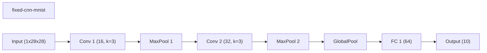

### wide-cnn-mnist-bn
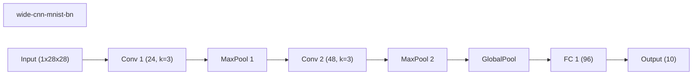

### channel-pruning-mnist
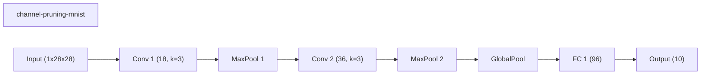

### channel-pruning-plateau-mnist
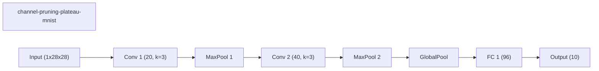

### weights-connections-cnn-mnist
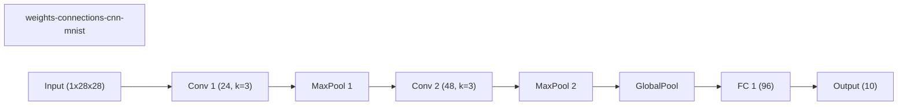

### layerwise-obs-cnn-mnist
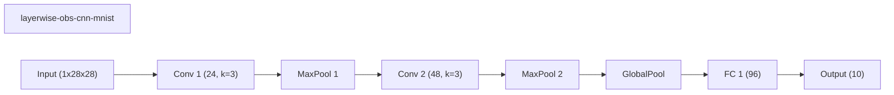

### network-slimming-mnist
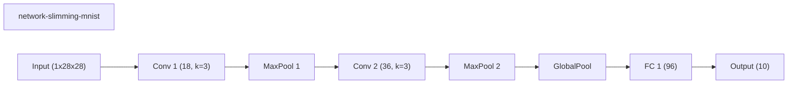

## Validation Accuracy By Epoch

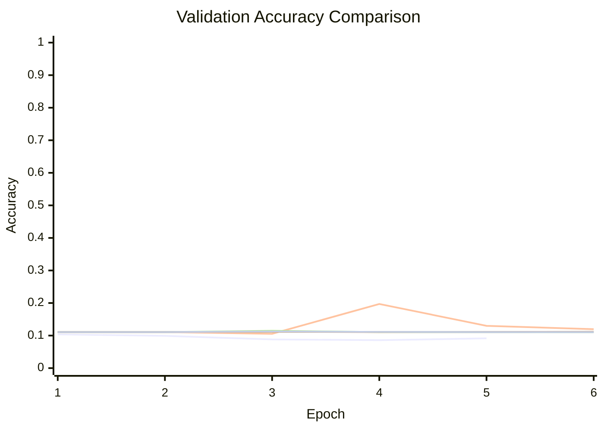
