# Baseline Comparison

| Experiment | Type | Epochs | Final train acc | Final val acc | Best val acc | Adaptations | Final hidden dim |
| --- | --- | ---: | ---: | ---: | ---: | ---: | ---: |
| fixed-cnn-mnist | baseline | 8 | 0.4566 | 0.4696 | 0.4696 | 0 | 0 |
| wide-cnn-mnist-bn | baseline | 8 | 0.8703 | 0.8502 | 0.8502 | 0 | 0 |
| channel-pruning-mnist | dynamic | 8 | 0.8267 | 0.8342 | 0.8342 | 2 | 0 |
| runtime-neural-pruning-mnist | dynamic | 8 | 0.7797 | 0.7692 | 0.7692 | 3 | 0 |
| weights-connections-cnn-mnist | dynamic | 8 | 0.8638 | 0.7342 | 0.8192 | 6 | 0 |
| layerwise-obs-cnn-mnist | dynamic | 8 | 0.8624 | 0.7880 | 0.7972 | 6 | 0 |
| network-slimming-mnist | workflow | 8 | 0.8281 | 0.8228 | 0.8228 | 1 | 0 |
| morphnet-mnist | workflow | 8 | 0.8220 | 0.7176 | 0.8036 | 1 | 0 |

## Validation Accuracy

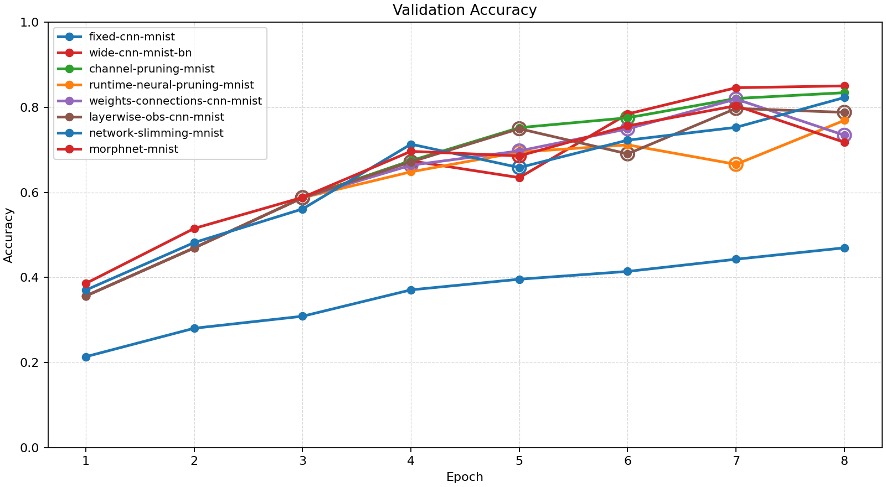

## Training Accuracy

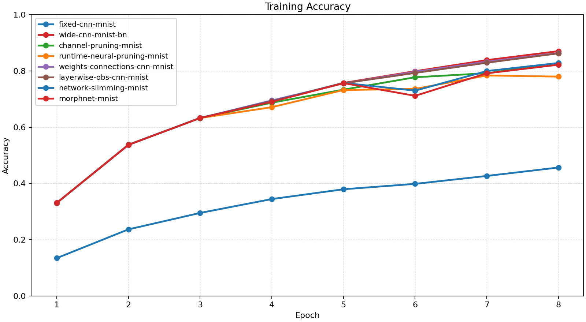

## Training Loss

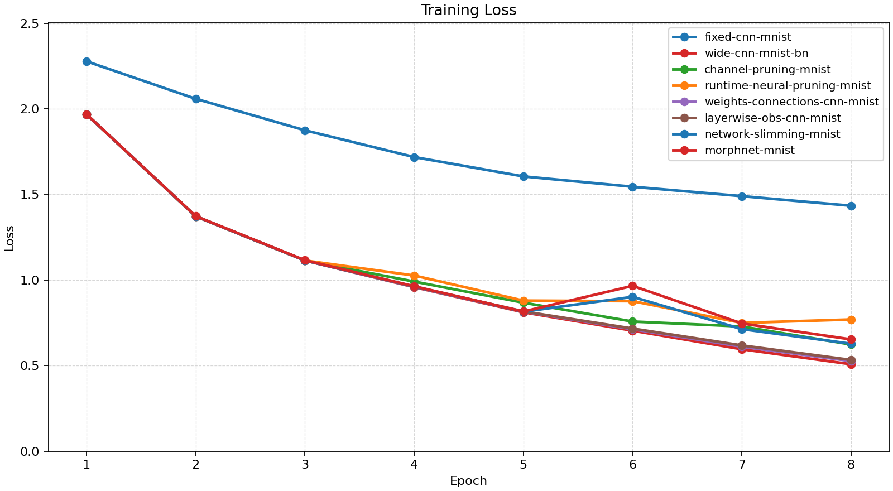

## Experiment Notes

- `fixed-cnn-mnist`: device=cuda; requested_device=auto; torch=2.11.0+cu128; cuda_available=True; torch_cuda=12.8; cuda_device=NVIDIA GeForce RTX 4070 Laptop GPU
- `wide-cnn-mnist-bn`: device=cuda; requested_device=auto; torch=2.11.0+cu128; cuda_available=True; torch_cuda=12.8; cuda_device=NVIDIA GeForce RTX 4070 Laptop GPU
- `channel-pruning-mnist`: adaptation=channel_pruning; device=cuda; requested_device=auto; torch=2.11.0+cu128; cuda_available=True; torch_cuda=12.8; cuda_device=NVIDIA GeForce RTX 4070 Laptop GPU
- `runtime-neural-pruning-mnist`: adaptation=runtime_neural_pruning; device=cuda; requested_device=auto; torch=2.11.0+cu128; cuda_available=True; torch_cuda=12.8; cuda_device=NVIDIA GeForce RTX 4070 Laptop GPU
- `weights-connections-cnn-mnist`: adaptation=weights_connections; device=cuda; requested_device=auto; torch=2.11.0+cu128; cuda_available=True; torch_cuda=12.8; cuda_device=NVIDIA GeForce RTX 4070 Laptop GPU
- `layerwise-obs-cnn-mnist`: adaptation=layerwise_obs; device=cuda; requested_device=auto; torch=2.11.0+cu128; cuda_available=True; torch_cuda=12.8; cuda_device=NVIDIA GeForce RTX 4070 Laptop GPU
- `network-slimming-mnist`: workflow=network_slimming; device=cuda; requested_device=auto; torch=2.11.0+cu128; cuda_available=True; torch_cuda=12.8; cuda_device=NVIDIA GeForce RTX 4070 Laptop GPU
- `morphnet-mnist`: workflow=morphnet; device=cuda; requested_device=auto; torch=2.11.0+cu128; cuda_available=True; torch_cuda=12.8; cuda_device=NVIDIA GeForce RTX 4070 Laptop GPU

## Constraint Summary

| Experiment | Params | Nonzero params | Weight sparsity | FLOP proxy | Activation elems |
| --- | ---: | ---: | ---: | ---: | ---: |
| fixed-cnn-mnist | 7562 | 7562 | 0.0000 | 2061098 | 4810 |
| wide-cnn-mnist-bn | 16474 | 16474 | 0.0000 | 4505914 | 7210 |
| channel-pruning-mnist | 12466 | 12466 | 0.0000 | 3190786 | 6026 |
| runtime-neural-pruning-mnist | 10156 | 10156 | 0.0000 | 2489228 | 5334 |
| weights-connections-cnn-mnist | 16474 | 10821 | 0.3500 | 4505914 | 7210 |
| layerwise-obs-cnn-mnist | 16474 | 11476 | 0.3094 | 4505914 | 7210 |
| network-slimming-mnist | 12187 | 12187 | 0.0000 | 3119397 | 5976 |
| morphnet-mnist | 10678 | 10678 | 0.0000 | 2617894 | 5434 |

## Workflow Stages

### fixed-cnn-mnist
- train: epochs=8, range=1..8, adaptation_enabled=False, final_val=0.46959999203681946
- workflow_metadata={'configured_total_epochs': 8, 'executed_total_epochs': 8, 'stage_count': 1}

### wide-cnn-mnist-bn
- train: epochs=8, range=1..8, adaptation_enabled=False, final_val=0.8501999974250793
- workflow_metadata={'configured_total_epochs': 8, 'executed_total_epochs': 8, 'stage_count': 1}

### channel-pruning-mnist
- train: epochs=8, range=1..8, adaptation_enabled=True, final_val=0.8342000246047974
- workflow_metadata={'configured_total_epochs': 8, 'executed_total_epochs': 8, 'stage_count': 1}

### runtime-neural-pruning-mnist
- train: epochs=8, range=1..8, adaptation_enabled=True, final_val=0.7692000269889832
- workflow_metadata={'configured_total_epochs': 8, 'executed_total_epochs': 8, 'stage_count': 1}

### weights-connections-cnn-mnist
- train: epochs=8, range=1..8, adaptation_enabled=True, final_val=0.7342000007629395
- workflow_metadata={'configured_total_epochs': 8, 'executed_total_epochs': 8, 'stage_count': 1}

### layerwise-obs-cnn-mnist
- train: epochs=8, range=1..8, adaptation_enabled=True, final_val=0.7879999876022339
- workflow_metadata={'configured_total_epochs': 8, 'executed_total_epochs': 8, 'stage_count': 1}

### network-slimming-mnist
- network_slimming_sparse_train: epochs=5, range=1..5, adaptation_enabled=False, final_val=0.6582000255584717
- network_slimming_finetune: epochs=3, range=6..8, adaptation_enabled=False, final_val=0.8227999806404114
- workflow_metadata={'workflow_name': 'network_slimming', 'configured_total_epochs': 8, 'executed_total_epochs': 8, 'stage_count': 2, 'prune_fraction': 0.2, 'min_channels_per_block': 12, 'before_conv_channels': [24, 48], 'after_conv_channels': [20, 39]}

### morphnet-mnist
- morphnet_resource_train: epochs=5, range=1..5, adaptation_enabled=False, final_val=0.6855999827384949
- morphnet_finetune: epochs=3, range=6..8, adaptation_enabled=False, final_val=0.7175999879837036
- workflow_metadata={'workflow_name': 'morphnet', 'configured_total_epochs': 8, 'executed_total_epochs': 8, 'stage_count': 2, 'target_flop_reduction': 0.25, 'before_conv_channels': [24, 48], 'after_conv_channels': [18, 36], 'before_flops': 4505914, 'after_flops': 2617894}

## Adaptation Timeline

### channel-pruning-mnist
- epoch 3: `prune_channels` params={'prune_fraction': 0.1, 'min_channels_per_block': 12} effect={'applied': True, 'structural_change': True, 'version_delta': 1, 'step_delta': 0, 'hidden_dim_delta': None, 'num_hidden_layers_delta': 0, 'parameter_count_delta': -2076, 'nonzero_parameter_count_delta': -2076, 'weight_sparsity_delta': 0.0, 'forward_flop_proxy_delta': -685788, 'activation_elements_delta': -592, 'hidden_dims_changed': False, 'conv_channels_before': [24, 48], 'conv_channels_after': [22, 44], 'channels_changed': True} before={'conv_channels': [24, 48], 'num_conv_blocks': 2, 'classifier_hidden_dims': [96], 'nonzero_parameter_count': 16474, 'masked_weight_count': 0, 'weight_sparsity': 0.0, 'mask_state_names': ['conv_0.weight', 'conv_1.weight', 'linear_0.weight', 'linear_1.weight'], 'device': 'cuda', 'use_batch_norm': True, 'batch_norm_sparsity_strength': 0.0, 'supported_events': ['apply_weight_mask', 'prune_channels'], 'architecture_family': 'cnn', 'parameter_count': 16474, 'forward_flop_proxy': 4505914, 'activation_elements': 7210} after={'conv_channels': [22, 44], 'num_conv_blocks': 2, 'classifier_hidden_dims': [96], 'nonzero_parameter_count': 14398, 'masked_weight_count': 0, 'weight_sparsity': 0.0, 'mask_state_names': ['conv_0.weight', 'conv_1.weight', 'linear_0.weight', 'linear_1.weight'], 'device': 'cuda', 'use_batch_norm': True, 'batch_norm_sparsity_strength': 0.0, 'supported_events': ['apply_weight_mask', 'prune_channels'], 'architecture_family': 'cnn', 'parameter_count': 14398, 'forward_flop_proxy': 3820126, 'activation_elements': 6618, 'conv_channels_before_prune': [24, 48]} capabilities=['apply_weight_mask', 'prune_channels']
- epoch 6: `prune_channels` params={'prune_fraction': 0.1, 'min_channels_per_block': 12} effect={'applied': True, 'structural_change': True, 'version_delta': 1, 'step_delta': 0, 'hidden_dim_delta': None, 'num_hidden_layers_delta': 0, 'parameter_count_delta': -1932, 'nonzero_parameter_count_delta': -1932, 'weight_sparsity_delta': 0.0, 'forward_flop_proxy_delta': -629340, 'activation_elements_delta': -592, 'hidden_dims_changed': False, 'conv_channels_before': [22, 44], 'conv_channels_after': [20, 40], 'channels_changed': True} before={'conv_channels': [22, 44], 'num_conv_blocks': 2, 'classifier_hidden_dims': [96], 'nonzero_parameter_count': 14398, 'masked_weight_count': 0, 'weight_sparsity': 0.0, 'mask_state_names': ['conv_0.weight', 'conv_1.weight', 'linear_0.weight', 'linear_1.weight'], 'device': 'cuda', 'use_batch_norm': True, 'batch_norm_sparsity_strength': 0.0, 'supported_events': ['apply_weight_mask', 'prune_channels'], 'architecture_family': 'cnn', 'parameter_count': 14398, 'forward_flop_proxy': 3820126, 'activation_elements': 6618, 'conv_channels_before_prune': [24, 48]} after={'conv_channels': [20, 40], 'num_conv_blocks': 2, 'classifier_hidden_dims': [96], 'nonzero_parameter_count': 12466, 'masked_weight_count': 0, 'weight_sparsity': 0.0, 'mask_state_names': ['conv_0.weight', 'conv_1.weight', 'linear_0.weight', 'linear_1.weight'], 'device': 'cuda', 'use_batch_norm': True, 'batch_norm_sparsity_strength': 0.0, 'supported_events': ['apply_weight_mask', 'prune_channels'], 'architecture_family': 'cnn', 'parameter_count': 12466, 'forward_flop_proxy': 3190786, 'activation_elements': 6026, 'conv_channels_before_prune': [22, 44]} capabilities=['apply_weight_mask', 'prune_channels']

### runtime-neural-pruning-mnist
- epoch 3: `prune_channels` params={'prune_fraction': 0.12, 'min_channels_per_block': 12} effect={'applied': True, 'structural_change': True, 'version_delta': 1, 'step_delta': 0, 'hidden_dim_delta': None, 'num_hidden_layers_delta': 0, 'parameter_count_delta': -2373, 'nonzero_parameter_count_delta': -2373, 'weight_sparsity_delta': 0.0, 'forward_flop_proxy_delta': -764233, 'activation_elements_delta': -642, 'hidden_dims_changed': False, 'conv_channels_before': [24, 48], 'conv_channels_after': [22, 43], 'channels_changed': True} before={'conv_channels': [24, 48], 'num_conv_blocks': 2, 'classifier_hidden_dims': [96], 'nonzero_parameter_count': 16474, 'masked_weight_count': 0, 'weight_sparsity': 0.0, 'mask_state_names': ['conv_0.weight', 'conv_1.weight', 'linear_0.weight', 'linear_1.weight'], 'device': 'cuda', 'use_batch_norm': True, 'batch_norm_sparsity_strength': 0.0, 'supported_events': ['apply_weight_mask', 'prune_channels'], 'architecture_family': 'cnn', 'parameter_count': 16474, 'forward_flop_proxy': 4505914, 'activation_elements': 7210} after={'conv_channels': [22, 43], 'num_conv_blocks': 2, 'classifier_hidden_dims': [96], 'nonzero_parameter_count': 14101, 'masked_weight_count': 0, 'weight_sparsity': 0.0, 'mask_state_names': ['conv_0.weight', 'conv_1.weight', 'linear_0.weight', 'linear_1.weight'], 'device': 'cuda', 'use_batch_norm': True, 'batch_norm_sparsity_strength': 0.0, 'supported_events': ['apply_weight_mask', 'prune_channels'], 'architecture_family': 'cnn', 'parameter_count': 14101, 'forward_flop_proxy': 3741681, 'activation_elements': 6568, 'conv_channels_before_prune': [24, 48]} capabilities=['apply_weight_mask', 'prune_channels']
- epoch 5: `prune_channels` params={'prune_fraction': 0.12, 'min_channels_per_block': 12} effect={'applied': True, 'structural_change': True, 'version_delta': 1, 'step_delta': 0, 'hidden_dim_delta': None, 'num_hidden_layers_delta': 0, 'parameter_count_delta': -2193, 'nonzero_parameter_count_delta': -2193, 'weight_sparsity_delta': 0.0, 'forward_flop_proxy_delta': -693673, 'activation_elements_delta': -642, 'hidden_dims_changed': False, 'conv_channels_before': [22, 43], 'conv_channels_after': [20, 38], 'channels_changed': True} before={'conv_channels': [22, 43], 'num_conv_blocks': 2, 'classifier_hidden_dims': [96], 'nonzero_parameter_count': 14101, 'masked_weight_count': 0, 'weight_sparsity': 0.0, 'mask_state_names': ['conv_0.weight', 'conv_1.weight', 'linear_0.weight', 'linear_1.weight'], 'device': 'cuda', 'use_batch_norm': True, 'batch_norm_sparsity_strength': 0.0, 'supported_events': ['apply_weight_mask', 'prune_channels'], 'architecture_family': 'cnn', 'parameter_count': 14101, 'forward_flop_proxy': 3741681, 'activation_elements': 6568, 'conv_channels_before_prune': [24, 48]} after={'conv_channels': [20, 38], 'num_conv_blocks': 2, 'classifier_hidden_dims': [96], 'nonzero_parameter_count': 11908, 'masked_weight_count': 0, 'weight_sparsity': 0.0, 'mask_state_names': ['conv_0.weight', 'conv_1.weight', 'linear_0.weight', 'linear_1.weight'], 'device': 'cuda', 'use_batch_norm': True, 'batch_norm_sparsity_strength': 0.0, 'supported_events': ['apply_weight_mask', 'prune_channels'], 'architecture_family': 'cnn', 'parameter_count': 11908, 'forward_flop_proxy': 3048008, 'activation_elements': 5926, 'conv_channels_before_prune': [22, 43]} capabilities=['apply_weight_mask', 'prune_channels']
- epoch 7: `prune_channels` params={'prune_fraction': 0.12, 'min_channels_per_block': 12} effect={'applied': True, 'structural_change': True, 'version_delta': 1, 'step_delta': 0, 'hidden_dim_delta': None, 'num_hidden_layers_delta': 0, 'parameter_count_delta': -1752, 'nonzero_parameter_count_delta': -1752, 'weight_sparsity_delta': 0.0, 'forward_flop_proxy_delta': -558780, 'activation_elements_delta': -592, 'hidden_dims_changed': False, 'conv_channels_before': [20, 38], 'conv_channels_after': [18, 34], 'channels_changed': True} before={'conv_channels': [20, 38], 'num_conv_blocks': 2, 'classifier_hidden_dims': [96], 'nonzero_parameter_count': 11908, 'masked_weight_count': 0, 'weight_sparsity': 0.0, 'mask_state_names': ['conv_0.weight', 'conv_1.weight', 'linear_0.weight', 'linear_1.weight'], 'device': 'cuda', 'use_batch_norm': True, 'batch_norm_sparsity_strength': 0.0, 'supported_events': ['apply_weight_mask', 'prune_channels'], 'architecture_family': 'cnn', 'parameter_count': 11908, 'forward_flop_proxy': 3048008, 'activation_elements': 5926, 'conv_channels_before_prune': [22, 43]} after={'conv_channels': [18, 34], 'num_conv_blocks': 2, 'classifier_hidden_dims': [96], 'nonzero_parameter_count': 10156, 'masked_weight_count': 0, 'weight_sparsity': 0.0, 'mask_state_names': ['conv_0.weight', 'conv_1.weight', 'linear_0.weight', 'linear_1.weight'], 'device': 'cuda', 'use_batch_norm': True, 'batch_norm_sparsity_strength': 0.0, 'supported_events': ['apply_weight_mask', 'prune_channels'], 'architecture_family': 'cnn', 'parameter_count': 10156, 'forward_flop_proxy': 2489228, 'activation_elements': 5334, 'conv_channels_before_prune': [20, 38]} capabilities=['apply_weight_mask', 'prune_channels']

### weights-connections-cnn-mnist
- epoch 3: `apply_weight_mask` params={'threshold': 0.004911003168672323, 'target_sparsity': 0.06} effect={'applied': True, 'structural_change': True, 'version_delta': 1, 'step_delta': 0, 'hidden_dim_delta': None, 'num_hidden_layers_delta': 0, 'parameter_count_delta': 0, 'nonzero_parameter_count_delta': -969, 'weight_sparsity_delta': 0.0599925705794948, 'forward_flop_proxy_delta': 0, 'activation_elements_delta': 0, 'hidden_dims_changed': False, 'conv_channels_before': [24, 48], 'conv_channels_after': [24, 48], 'channels_changed': False} before={'conv_channels': [24, 48], 'num_conv_blocks': 2, 'classifier_hidden_dims': [96], 'nonzero_parameter_count': 16474, 'masked_weight_count': 0, 'weight_sparsity': 0.0, 'mask_state_names': ['conv_0.weight', 'conv_1.weight', 'linear_0.weight', 'linear_1.weight'], 'device': 'cuda', 'use_batch_norm': True, 'batch_norm_sparsity_strength': 0.0, 'supported_events': ['apply_weight_mask', 'prune_channels'], 'architecture_family': 'cnn', 'parameter_count': 16474, 'forward_flop_proxy': 4505914, 'activation_elements': 7210} after={'conv_channels': [24, 48], 'num_conv_blocks': 2, 'classifier_hidden_dims': [96], 'nonzero_parameter_count': 15505, 'masked_weight_count': 969, 'weight_sparsity': 0.0599925705794948, 'mask_state_names': ['conv_0.weight', 'conv_1.weight', 'linear_0.weight', 'linear_1.weight'], 'device': 'cuda', 'use_batch_norm': True, 'batch_norm_sparsity_strength': 0.0, 'supported_events': ['apply_weight_mask', 'prune_channels'], 'architecture_family': 'cnn', 'parameter_count': 16474, 'forward_flop_proxy': 4505914, 'activation_elements': 7210, 'mask_threshold': 0.004911003168672323, 'target_weight_sparsity': 0.06} capabilities=['apply_weight_mask', 'prune_channels']
- epoch 4: `apply_weight_mask` params={'threshold': 0.008650989271700382, 'target_sparsity': 0.1199925705794948} effect={'applied': True, 'structural_change': True, 'version_delta': 1, 'step_delta': 0, 'hidden_dim_delta': None, 'num_hidden_layers_delta': 0, 'parameter_count_delta': 0, 'nonzero_parameter_count_delta': -969, 'weight_sparsity_delta': 0.0599925705794948, 'forward_flop_proxy_delta': 0, 'activation_elements_delta': 0, 'hidden_dims_changed': False, 'conv_channels_before': [24, 48], 'conv_channels_after': [24, 48], 'channels_changed': False} before={'conv_channels': [24, 48], 'num_conv_blocks': 2, 'classifier_hidden_dims': [96], 'nonzero_parameter_count': 15505, 'masked_weight_count': 969, 'weight_sparsity': 0.0599925705794948, 'mask_state_names': ['conv_0.weight', 'conv_1.weight', 'linear_0.weight', 'linear_1.weight'], 'device': 'cuda', 'use_batch_norm': True, 'batch_norm_sparsity_strength': 0.0, 'supported_events': ['apply_weight_mask', 'prune_channels'], 'architecture_family': 'cnn', 'parameter_count': 16474, 'forward_flop_proxy': 4505914, 'activation_elements': 7210, 'mask_threshold': 0.004911003168672323, 'target_weight_sparsity': 0.06} after={'conv_channels': [24, 48], 'num_conv_blocks': 2, 'classifier_hidden_dims': [96], 'nonzero_parameter_count': 14536, 'masked_weight_count': 1938, 'weight_sparsity': 0.1199851411589896, 'mask_state_names': ['conv_0.weight', 'conv_1.weight', 'linear_0.weight', 'linear_1.weight'], 'device': 'cuda', 'use_batch_norm': True, 'batch_norm_sparsity_strength': 0.0, 'supported_events': ['apply_weight_mask', 'prune_channels'], 'architecture_family': 'cnn', 'parameter_count': 16474, 'forward_flop_proxy': 4505914, 'activation_elements': 7210, 'mask_threshold': 0.008650989271700382, 'target_weight_sparsity': 0.1199925705794948} capabilities=['apply_weight_mask', 'prune_channels']
- epoch 5: `apply_weight_mask` params={'threshold': 0.0129848076030612, 'target_sparsity': 0.17998514115898961} effect={'applied': True, 'structural_change': True, 'version_delta': 1, 'step_delta': 0, 'hidden_dim_delta': None, 'num_hidden_layers_delta': 0, 'parameter_count_delta': 0, 'nonzero_parameter_count_delta': -969, 'weight_sparsity_delta': 0.059992570579494794, 'forward_flop_proxy_delta': 0, 'activation_elements_delta': 0, 'hidden_dims_changed': False, 'conv_channels_before': [24, 48], 'conv_channels_after': [24, 48], 'channels_changed': False} before={'conv_channels': [24, 48], 'num_conv_blocks': 2, 'classifier_hidden_dims': [96], 'nonzero_parameter_count': 14536, 'masked_weight_count': 1938, 'weight_sparsity': 0.1199851411589896, 'mask_state_names': ['conv_0.weight', 'conv_1.weight', 'linear_0.weight', 'linear_1.weight'], 'device': 'cuda', 'use_batch_norm': True, 'batch_norm_sparsity_strength': 0.0, 'supported_events': ['apply_weight_mask', 'prune_channels'], 'architecture_family': 'cnn', 'parameter_count': 16474, 'forward_flop_proxy': 4505914, 'activation_elements': 7210, 'mask_threshold': 0.008650989271700382, 'target_weight_sparsity': 0.1199925705794948} after={'conv_channels': [24, 48], 'num_conv_blocks': 2, 'classifier_hidden_dims': [96], 'nonzero_parameter_count': 13567, 'masked_weight_count': 2907, 'weight_sparsity': 0.1799777117384844, 'mask_state_names': ['conv_0.weight', 'conv_1.weight', 'linear_0.weight', 'linear_1.weight'], 'device': 'cuda', 'use_batch_norm': True, 'batch_norm_sparsity_strength': 0.0, 'supported_events': ['apply_weight_mask', 'prune_channels'], 'architecture_family': 'cnn', 'parameter_count': 16474, 'forward_flop_proxy': 4505914, 'activation_elements': 7210, 'mask_threshold': 0.0129848076030612, 'target_weight_sparsity': 0.17998514115898961} capabilities=['apply_weight_mask', 'prune_channels']
- epoch 6: `apply_weight_mask` params={'threshold': 0.0178252924233675, 'target_sparsity': 0.2399777117384844} effect={'applied': True, 'structural_change': True, 'version_delta': 1, 'step_delta': 0, 'hidden_dim_delta': None, 'num_hidden_layers_delta': 0, 'parameter_count_delta': 0, 'nonzero_parameter_count_delta': -969, 'weight_sparsity_delta': 0.05999257057949481, 'forward_flop_proxy_delta': 0, 'activation_elements_delta': 0, 'hidden_dims_changed': False, 'conv_channels_before': [24, 48], 'conv_channels_after': [24, 48], 'channels_changed': False} before={'conv_channels': [24, 48], 'num_conv_blocks': 2, 'classifier_hidden_dims': [96], 'nonzero_parameter_count': 13567, 'masked_weight_count': 2907, 'weight_sparsity': 0.1799777117384844, 'mask_state_names': ['conv_0.weight', 'conv_1.weight', 'linear_0.weight', 'linear_1.weight'], 'device': 'cuda', 'use_batch_norm': True, 'batch_norm_sparsity_strength': 0.0, 'supported_events': ['apply_weight_mask', 'prune_channels'], 'architecture_family': 'cnn', 'parameter_count': 16474, 'forward_flop_proxy': 4505914, 'activation_elements': 7210, 'mask_threshold': 0.0129848076030612, 'target_weight_sparsity': 0.17998514115898961} after={'conv_channels': [24, 48], 'num_conv_blocks': 2, 'classifier_hidden_dims': [96], 'nonzero_parameter_count': 12598, 'masked_weight_count': 3876, 'weight_sparsity': 0.2399702823179792, 'mask_state_names': ['conv_0.weight', 'conv_1.weight', 'linear_0.weight', 'linear_1.weight'], 'device': 'cuda', 'use_batch_norm': True, 'batch_norm_sparsity_strength': 0.0, 'supported_events': ['apply_weight_mask', 'prune_channels'], 'architecture_family': 'cnn', 'parameter_count': 16474, 'forward_flop_proxy': 4505914, 'activation_elements': 7210, 'mask_threshold': 0.0178252924233675, 'target_weight_sparsity': 0.2399777117384844} capabilities=['apply_weight_mask', 'prune_channels']
- epoch 7: `apply_weight_mask` params={'threshold': 0.02383670024573803, 'target_sparsity': 0.2999702823179792} effect={'applied': True, 'structural_change': True, 'version_delta': 1, 'step_delta': 0, 'hidden_dim_delta': None, 'num_hidden_layers_delta': 0, 'parameter_count_delta': 0, 'nonzero_parameter_count_delta': -969, 'weight_sparsity_delta': 0.05999257057949478, 'forward_flop_proxy_delta': 0, 'activation_elements_delta': 0, 'hidden_dims_changed': False, 'conv_channels_before': [24, 48], 'conv_channels_after': [24, 48], 'channels_changed': False} before={'conv_channels': [24, 48], 'num_conv_blocks': 2, 'classifier_hidden_dims': [96], 'nonzero_parameter_count': 12598, 'masked_weight_count': 3876, 'weight_sparsity': 0.2399702823179792, 'mask_state_names': ['conv_0.weight', 'conv_1.weight', 'linear_0.weight', 'linear_1.weight'], 'device': 'cuda', 'use_batch_norm': True, 'batch_norm_sparsity_strength': 0.0, 'supported_events': ['apply_weight_mask', 'prune_channels'], 'architecture_family': 'cnn', 'parameter_count': 16474, 'forward_flop_proxy': 4505914, 'activation_elements': 7210, 'mask_threshold': 0.0178252924233675, 'target_weight_sparsity': 0.2399777117384844} after={'conv_channels': [24, 48], 'num_conv_blocks': 2, 'classifier_hidden_dims': [96], 'nonzero_parameter_count': 11629, 'masked_weight_count': 4845, 'weight_sparsity': 0.299962852897474, 'mask_state_names': ['conv_0.weight', 'conv_1.weight', 'linear_0.weight', 'linear_1.weight'], 'device': 'cuda', 'use_batch_norm': True, 'batch_norm_sparsity_strength': 0.0, 'supported_events': ['apply_weight_mask', 'prune_channels'], 'architecture_family': 'cnn', 'parameter_count': 16474, 'forward_flop_proxy': 4505914, 'activation_elements': 7210, 'mask_threshold': 0.02383670024573803, 'target_weight_sparsity': 0.2999702823179792} capabilities=['apply_weight_mask', 'prune_channels']
- epoch 8: `apply_weight_mask` params={'threshold': 0.02836981974542141, 'target_sparsity': 0.35} effect={'applied': True, 'structural_change': True, 'version_delta': 1, 'step_delta': 0, 'hidden_dim_delta': None, 'num_hidden_layers_delta': 0, 'parameter_count_delta': 0, 'nonzero_parameter_count_delta': -808, 'weight_sparsity_delta': 0.050024764735017324, 'forward_flop_proxy_delta': 0, 'activation_elements_delta': 0, 'hidden_dims_changed': False, 'conv_channels_before': [24, 48], 'conv_channels_after': [24, 48], 'channels_changed': False} before={'conv_channels': [24, 48], 'num_conv_blocks': 2, 'classifier_hidden_dims': [96], 'nonzero_parameter_count': 11629, 'masked_weight_count': 4845, 'weight_sparsity': 0.299962852897474, 'mask_state_names': ['conv_0.weight', 'conv_1.weight', 'linear_0.weight', 'linear_1.weight'], 'device': 'cuda', 'use_batch_norm': True, 'batch_norm_sparsity_strength': 0.0, 'supported_events': ['apply_weight_mask', 'prune_channels'], 'architecture_family': 'cnn', 'parameter_count': 16474, 'forward_flop_proxy': 4505914, 'activation_elements': 7210, 'mask_threshold': 0.02383670024573803, 'target_weight_sparsity': 0.2999702823179792} after={'conv_channels': [24, 48], 'num_conv_blocks': 2, 'classifier_hidden_dims': [96], 'nonzero_parameter_count': 10821, 'masked_weight_count': 5653, 'weight_sparsity': 0.3499876176324913, 'mask_state_names': ['conv_0.weight', 'conv_1.weight', 'linear_0.weight', 'linear_1.weight'], 'device': 'cuda', 'use_batch_norm': True, 'batch_norm_sparsity_strength': 0.0, 'supported_events': ['apply_weight_mask', 'prune_channels'], 'architecture_family': 'cnn', 'parameter_count': 16474, 'forward_flop_proxy': 4505914, 'activation_elements': 7210, 'mask_threshold': 0.02836981974542141, 'target_weight_sparsity': 0.35} capabilities=['apply_weight_mask', 'prune_channels']

### layerwise-obs-cnn-mnist
- epoch 3: `apply_weight_mask` params={'thresholds_by_name': {'conv_0.weight': 0.016381319612264633, 'conv_1.weight': 0.003973796032369137, 'linear_0.weight': 0.010635584592819214, 'linear_1.weight': 0.00800194963812828}, 'target_sparsity': 0.06, 'layerwise_prune_fraction': 0.06} effect={'applied': True, 'structural_change': True, 'version_delta': 1, 'step_delta': 0, 'hidden_dim_delta': None, 'num_hidden_layers_delta': 0, 'parameter_count_delta': 0, 'nonzero_parameter_count_delta': -967, 'weight_sparsity_delta': 0.059868746904408125, 'forward_flop_proxy_delta': 0, 'activation_elements_delta': 0, 'hidden_dims_changed': False, 'conv_channels_before': [24, 48], 'conv_channels_after': [24, 48], 'channels_changed': False} before={'conv_channels': [24, 48], 'num_conv_blocks': 2, 'classifier_hidden_dims': [96], 'nonzero_parameter_count': 16474, 'masked_weight_count': 0, 'weight_sparsity': 0.0, 'mask_state_names': ['conv_0.weight', 'conv_1.weight', 'linear_0.weight', 'linear_1.weight'], 'device': 'cuda', 'use_batch_norm': True, 'batch_norm_sparsity_strength': 0.0, 'supported_events': ['apply_weight_mask', 'prune_channels'], 'architecture_family': 'cnn', 'parameter_count': 16474, 'forward_flop_proxy': 4505914, 'activation_elements': 7210} after={'conv_channels': [24, 48], 'num_conv_blocks': 2, 'classifier_hidden_dims': [96], 'nonzero_parameter_count': 15507, 'masked_weight_count': 967, 'weight_sparsity': 0.059868746904408125, 'mask_state_names': ['conv_0.weight', 'conv_1.weight', 'linear_0.weight', 'linear_1.weight'], 'device': 'cuda', 'use_batch_norm': True, 'batch_norm_sparsity_strength': 0.0, 'supported_events': ['apply_weight_mask', 'prune_channels'], 'architecture_family': 'cnn', 'parameter_count': 16474, 'forward_flop_proxy': 4505914, 'activation_elements': 7210, 'mask_threshold': None, 'mask_thresholds_by_name': {'conv_0.weight': 0.01638132, 'conv_1.weight': 0.0039738, 'linear_0.weight': 0.01063558, 'linear_1.weight': 0.00800195}, 'target_weight_sparsity': 0.06} capabilities=['apply_weight_mask', 'prune_channels']
- epoch 4: `apply_weight_mask` params={'thresholds_by_name': {'conv_0.weight': 0.048189111053943634, 'conv_1.weight': 0.005688430275768042, 'linear_0.weight': 0.020752592012286186, 'linear_1.weight': 0.01596987619996071}, 'target_sparsity': 0.11986874690440813, 'layerwise_prune_fraction': 0.06} effect={'applied': True, 'structural_change': True, 'version_delta': 1, 'step_delta': 0, 'hidden_dim_delta': None, 'num_hidden_layers_delta': 0, 'parameter_count_delta': 0, 'nonzero_parameter_count_delta': -909, 'weight_sparsity_delta': 0.056277860326894504, 'forward_flop_proxy_delta': 0, 'activation_elements_delta': 0, 'hidden_dims_changed': False, 'conv_channels_before': [24, 48], 'conv_channels_after': [24, 48], 'channels_changed': False} before={'conv_channels': [24, 48], 'num_conv_blocks': 2, 'classifier_hidden_dims': [96], 'nonzero_parameter_count': 15507, 'masked_weight_count': 967, 'weight_sparsity': 0.059868746904408125, 'mask_state_names': ['conv_0.weight', 'conv_1.weight', 'linear_0.weight', 'linear_1.weight'], 'device': 'cuda', 'use_batch_norm': True, 'batch_norm_sparsity_strength': 0.0, 'supported_events': ['apply_weight_mask', 'prune_channels'], 'architecture_family': 'cnn', 'parameter_count': 16474, 'forward_flop_proxy': 4505914, 'activation_elements': 7210, 'mask_threshold': None, 'mask_thresholds_by_name': {'conv_0.weight': 0.01638132, 'conv_1.weight': 0.0039738, 'linear_0.weight': 0.01063558, 'linear_1.weight': 0.00800195}, 'target_weight_sparsity': 0.06} after={'conv_channels': [24, 48], 'num_conv_blocks': 2, 'classifier_hidden_dims': [96], 'nonzero_parameter_count': 14598, 'masked_weight_count': 1876, 'weight_sparsity': 0.11614660723130263, 'mask_state_names': ['conv_0.weight', 'conv_1.weight', 'linear_0.weight', 'linear_1.weight'], 'device': 'cuda', 'use_batch_norm': True, 'batch_norm_sparsity_strength': 0.0, 'supported_events': ['apply_weight_mask', 'prune_channels'], 'architecture_family': 'cnn', 'parameter_count': 16474, 'forward_flop_proxy': 4505914, 'activation_elements': 7210, 'mask_threshold': None, 'mask_thresholds_by_name': {'conv_0.weight': 0.04818911, 'conv_1.weight': 0.00568843, 'linear_0.weight': 0.02075259, 'linear_1.weight': 0.01596988}, 'target_weight_sparsity': 0.11986874690440813} capabilities=['apply_weight_mask', 'prune_channels']
- epoch 5: `apply_weight_mask` params={'thresholds_by_name': {'conv_0.weight': 0.07019832730293274, 'conv_1.weight': 0.007268327288329601, 'linear_0.weight': 0.029536128044128418, 'linear_1.weight': 0.024457886815071106}, 'target_sparsity': 0.17614660723130263, 'layerwise_prune_fraction': 0.06} effect={'applied': True, 'structural_change': True, 'version_delta': 1, 'step_delta': 0, 'hidden_dim_delta': None, 'num_hidden_layers_delta': 0, 'parameter_count_delta': 0, 'nonzero_parameter_count_delta': -854, 'weight_sparsity_delta': 0.0528727092620109, 'forward_flop_proxy_delta': 0, 'activation_elements_delta': 0, 'hidden_dims_changed': False, 'conv_channels_before': [24, 48], 'conv_channels_after': [24, 48], 'channels_changed': False} before={'conv_channels': [24, 48], 'num_conv_blocks': 2, 'classifier_hidden_dims': [96], 'nonzero_parameter_count': 14598, 'masked_weight_count': 1876, 'weight_sparsity': 0.11614660723130263, 'mask_state_names': ['conv_0.weight', 'conv_1.weight', 'linear_0.weight', 'linear_1.weight'], 'device': 'cuda', 'use_batch_norm': True, 'batch_norm_sparsity_strength': 0.0, 'supported_events': ['apply_weight_mask', 'prune_channels'], 'architecture_family': 'cnn', 'parameter_count': 16474, 'forward_flop_proxy': 4505914, 'activation_elements': 7210, 'mask_threshold': None, 'mask_thresholds_by_name': {'conv_0.weight': 0.04818911, 'conv_1.weight': 0.00568843, 'linear_0.weight': 0.02075259, 'linear_1.weight': 0.01596988}, 'target_weight_sparsity': 0.11986874690440813} after={'conv_channels': [24, 48], 'num_conv_blocks': 2, 'classifier_hidden_dims': [96], 'nonzero_parameter_count': 13744, 'masked_weight_count': 2730, 'weight_sparsity': 0.16901931649331353, 'mask_state_names': ['conv_0.weight', 'conv_1.weight', 'linear_0.weight', 'linear_1.weight'], 'device': 'cuda', 'use_batch_norm': True, 'batch_norm_sparsity_strength': 0.0, 'supported_events': ['apply_weight_mask', 'prune_channels'], 'architecture_family': 'cnn', 'parameter_count': 16474, 'forward_flop_proxy': 4505914, 'activation_elements': 7210, 'mask_threshold': None, 'mask_thresholds_by_name': {'conv_0.weight': 0.07019833, 'conv_1.weight': 0.00726833, 'linear_0.weight': 0.02953613, 'linear_1.weight': 0.02445789}, 'target_weight_sparsity': 0.17614660723130263} capabilities=['apply_weight_mask', 'prune_channels']
- epoch 6: `apply_weight_mask` params={'thresholds_by_name': {'conv_0.weight': 0.0794161707162857, 'conv_1.weight': 0.009904138743877411, 'linear_0.weight': 0.038677141070365906, 'linear_1.weight': 0.033184297382831573}, 'target_sparsity': 0.22901931649331353, 'layerwise_prune_fraction': 0.06} effect={'applied': True, 'structural_change': True, 'version_delta': 1, 'step_delta': 0, 'hidden_dim_delta': None, 'num_hidden_layers_delta': 0, 'parameter_count_delta': 0, 'nonzero_parameter_count_delta': -802, 'weight_sparsity_delta': 0.049653293709757296, 'forward_flop_proxy_delta': 0, 'activation_elements_delta': 0, 'hidden_dims_changed': False, 'conv_channels_before': [24, 48], 'conv_channels_after': [24, 48], 'channels_changed': False} before={'conv_channels': [24, 48], 'num_conv_blocks': 2, 'classifier_hidden_dims': [96], 'nonzero_parameter_count': 13744, 'masked_weight_count': 2730, 'weight_sparsity': 0.16901931649331353, 'mask_state_names': ['conv_0.weight', 'conv_1.weight', 'linear_0.weight', 'linear_1.weight'], 'device': 'cuda', 'use_batch_norm': True, 'batch_norm_sparsity_strength': 0.0, 'supported_events': ['apply_weight_mask', 'prune_channels'], 'architecture_family': 'cnn', 'parameter_count': 16474, 'forward_flop_proxy': 4505914, 'activation_elements': 7210, 'mask_threshold': None, 'mask_thresholds_by_name': {'conv_0.weight': 0.07019833, 'conv_1.weight': 0.00726833, 'linear_0.weight': 0.02953613, 'linear_1.weight': 0.02445789}, 'target_weight_sparsity': 0.17614660723130263} after={'conv_channels': [24, 48], 'num_conv_blocks': 2, 'classifier_hidden_dims': [96], 'nonzero_parameter_count': 12942, 'masked_weight_count': 3532, 'weight_sparsity': 0.21867261020307083, 'mask_state_names': ['conv_0.weight', 'conv_1.weight', 'linear_0.weight', 'linear_1.weight'], 'device': 'cuda', 'use_batch_norm': True, 'batch_norm_sparsity_strength': 0.0, 'supported_events': ['apply_weight_mask', 'prune_channels'], 'architecture_family': 'cnn', 'parameter_count': 16474, 'forward_flop_proxy': 4505914, 'activation_elements': 7210, 'mask_threshold': None, 'mask_thresholds_by_name': {'conv_0.weight': 0.07941617, 'conv_1.weight': 0.00990414, 'linear_0.weight': 0.03867714, 'linear_1.weight': 0.0331843}, 'target_weight_sparsity': 0.22901931649331353} capabilities=['apply_weight_mask', 'prune_channels']
- epoch 7: `apply_weight_mask` params={'thresholds_by_name': {'conv_0.weight': 0.09721209108829498, 'conv_1.weight': 0.012263829819858074, 'linear_0.weight': 0.04763555899262428, 'linear_1.weight': 0.042442258447408676}, 'target_sparsity': 0.2786726102030708, 'layerwise_prune_fraction': 0.06} effect={'applied': True, 'structural_change': True, 'version_delta': 1, 'step_delta': 0, 'hidden_dim_delta': None, 'num_hidden_layers_delta': 0, 'parameter_count_delta': 0, 'nonzero_parameter_count_delta': -756, 'weight_sparsity_delta': 0.046805349182763745, 'forward_flop_proxy_delta': 0, 'activation_elements_delta': 0, 'hidden_dims_changed': False, 'conv_channels_before': [24, 48], 'conv_channels_after': [24, 48], 'channels_changed': False} before={'conv_channels': [24, 48], 'num_conv_blocks': 2, 'classifier_hidden_dims': [96], 'nonzero_parameter_count': 12942, 'masked_weight_count': 3532, 'weight_sparsity': 0.21867261020307083, 'mask_state_names': ['conv_0.weight', 'conv_1.weight', 'linear_0.weight', 'linear_1.weight'], 'device': 'cuda', 'use_batch_norm': True, 'batch_norm_sparsity_strength': 0.0, 'supported_events': ['apply_weight_mask', 'prune_channels'], 'architecture_family': 'cnn', 'parameter_count': 16474, 'forward_flop_proxy': 4505914, 'activation_elements': 7210, 'mask_threshold': None, 'mask_thresholds_by_name': {'conv_0.weight': 0.07941617, 'conv_1.weight': 0.00990414, 'linear_0.weight': 0.03867714, 'linear_1.weight': 0.0331843}, 'target_weight_sparsity': 0.22901931649331353} after={'conv_channels': [24, 48], 'num_conv_blocks': 2, 'classifier_hidden_dims': [96], 'nonzero_parameter_count': 12186, 'masked_weight_count': 4288, 'weight_sparsity': 0.26547795938583457, 'mask_state_names': ['conv_0.weight', 'conv_1.weight', 'linear_0.weight', 'linear_1.weight'], 'device': 'cuda', 'use_batch_norm': True, 'batch_norm_sparsity_strength': 0.0, 'supported_events': ['apply_weight_mask', 'prune_channels'], 'architecture_family': 'cnn', 'parameter_count': 16474, 'forward_flop_proxy': 4505914, 'activation_elements': 7210, 'mask_threshold': None, 'mask_thresholds_by_name': {'conv_0.weight': 0.09721209, 'conv_1.weight': 0.01226383, 'linear_0.weight': 0.04763556, 'linear_1.weight': 0.04244226}, 'target_weight_sparsity': 0.2786726102030708} capabilities=['apply_weight_mask', 'prune_channels']
- epoch 8: `apply_weight_mask` params={'thresholds_by_name': {'conv_0.weight': 0.1106361597776413, 'conv_1.weight': 0.015152868814766407, 'linear_0.weight': 0.057525116950273514, 'linear_1.weight': 0.05221262201666832}, 'target_sparsity': 0.32547795938583457, 'layerwise_prune_fraction': 0.06} effect={'applied': True, 'structural_change': True, 'version_delta': 1, 'step_delta': 0, 'hidden_dim_delta': None, 'num_hidden_layers_delta': 0, 'parameter_count_delta': 0, 'nonzero_parameter_count_delta': -710, 'weight_sparsity_delta': 0.043957404655770194, 'forward_flop_proxy_delta': 0, 'activation_elements_delta': 0, 'hidden_dims_changed': False, 'conv_channels_before': [24, 48], 'conv_channels_after': [24, 48], 'channels_changed': False} before={'conv_channels': [24, 48], 'num_conv_blocks': 2, 'classifier_hidden_dims': [96], 'nonzero_parameter_count': 12186, 'masked_weight_count': 4288, 'weight_sparsity': 0.26547795938583457, 'mask_state_names': ['conv_0.weight', 'conv_1.weight', 'linear_0.weight', 'linear_1.weight'], 'device': 'cuda', 'use_batch_norm': True, 'batch_norm_sparsity_strength': 0.0, 'supported_events': ['apply_weight_mask', 'prune_channels'], 'architecture_family': 'cnn', 'parameter_count': 16474, 'forward_flop_proxy': 4505914, 'activation_elements': 7210, 'mask_threshold': None, 'mask_thresholds_by_name': {'conv_0.weight': 0.09721209, 'conv_1.weight': 0.01226383, 'linear_0.weight': 0.04763556, 'linear_1.weight': 0.04244226}, 'target_weight_sparsity': 0.2786726102030708} after={'conv_channels': [24, 48], 'num_conv_blocks': 2, 'classifier_hidden_dims': [96], 'nonzero_parameter_count': 11476, 'masked_weight_count': 4998, 'weight_sparsity': 0.30943536404160477, 'mask_state_names': ['conv_0.weight', 'conv_1.weight', 'linear_0.weight', 'linear_1.weight'], 'device': 'cuda', 'use_batch_norm': True, 'batch_norm_sparsity_strength': 0.0, 'supported_events': ['apply_weight_mask', 'prune_channels'], 'architecture_family': 'cnn', 'parameter_count': 16474, 'forward_flop_proxy': 4505914, 'activation_elements': 7210, 'mask_threshold': None, 'mask_thresholds_by_name': {'conv_0.weight': 0.11063616, 'conv_1.weight': 0.01515287, 'linear_0.weight': 0.05752512, 'linear_1.weight': 0.05221262}, 'target_weight_sparsity': 0.32547795938583457} capabilities=['apply_weight_mask', 'prune_channels']

### network-slimming-mnist
- epoch 5: `prune_channels` params={'prune_fraction': 0.2, 'min_channels_per_block': 12} effect={'applied': True, 'structural_change': True, 'version_delta': 1, 'step_delta': 0, 'parameter_count_delta': -4287, 'nonzero_parameter_count_delta': -4287, 'weight_sparsity_delta': 0.0, 'forward_flop_proxy_delta': -1386517, 'activation_elements_delta': -1234, 'num_conv_blocks_delta': 0, 'conv_channels_before': [24, 48], 'conv_channels_after': [20, 39], 'channels_changed': True} before={'conv_channels': [24, 48], 'num_conv_blocks': 2, 'classifier_hidden_dims': [96], 'nonzero_parameter_count': 16474, 'masked_weight_count': 0, 'weight_sparsity': 0.0, 'mask_state_names': ['conv_0.weight', 'conv_1.weight', 'linear_0.weight', 'linear_1.weight'], 'device': 'cuda', 'use_batch_norm': True, 'batch_norm_sparsity_strength': 0.0, 'supported_events': ['apply_weight_mask', 'prune_channels'], 'architecture_family': 'cnn', 'parameter_count': 16474, 'forward_flop_proxy': 4505914, 'activation_elements': 7210} after={'conv_channels': [20, 39], 'num_conv_blocks': 2, 'classifier_hidden_dims': [96], 'nonzero_parameter_count': 12187, 'masked_weight_count': 0, 'weight_sparsity': 0.0, 'mask_state_names': ['conv_0.weight', 'conv_1.weight', 'linear_0.weight', 'linear_1.weight'], 'device': 'cuda', 'use_batch_norm': True, 'batch_norm_sparsity_strength': 0.0, 'supported_events': ['apply_weight_mask', 'prune_channels'], 'architecture_family': 'cnn', 'parameter_count': 12187, 'forward_flop_proxy': 3119397, 'activation_elements': 5976, 'conv_channels_before_prune': [24, 48]} capabilities=['apply_weight_mask', 'prune_channels']

### morphnet-mnist
- epoch 5: `prune_channels` params={'prune_fraction': 0.25, 'min_channels_per_block': 12} effect={'applied': True, 'structural_change': True, 'version_delta': 1, 'step_delta': 0, 'parameter_count_delta': -5796, 'nonzero_parameter_count_delta': -5796, 'weight_sparsity_delta': 0.0, 'forward_flop_proxy_delta': -1888020, 'activation_elements_delta': -1776, 'num_conv_blocks_delta': 0, 'conv_channels_before': [24, 48], 'conv_channels_after': [18, 36], 'channels_changed': True} before={'conv_channels': [24, 48], 'num_conv_blocks': 2, 'classifier_hidden_dims': [96], 'nonzero_parameter_count': 16474, 'masked_weight_count': 0, 'weight_sparsity': 0.0, 'mask_state_names': ['conv_0.weight', 'conv_1.weight', 'linear_0.weight', 'linear_1.weight'], 'device': 'cuda', 'use_batch_norm': True, 'batch_norm_sparsity_strength': 0.0, 'supported_events': ['apply_weight_mask', 'prune_channels'], 'architecture_family': 'cnn', 'parameter_count': 16474, 'forward_flop_proxy': 4505914, 'activation_elements': 7210} after={'conv_channels': [18, 36], 'num_conv_blocks': 2, 'classifier_hidden_dims': [96], 'nonzero_parameter_count': 10678, 'masked_weight_count': 0, 'weight_sparsity': 0.0, 'mask_state_names': ['conv_0.weight', 'conv_1.weight', 'linear_0.weight', 'linear_1.weight'], 'device': 'cuda', 'use_batch_norm': True, 'batch_norm_sparsity_strength': 0.0, 'supported_events': ['apply_weight_mask', 'prune_channels'], 'architecture_family': 'cnn', 'parameter_count': 10678, 'forward_flop_proxy': 2617894, 'activation_elements': 5434, 'conv_channels_before_prune': [24, 48]} capabilities=['apply_weight_mask', 'prune_channels']

## Architecture Graphs

### fixed-cnn-mnist
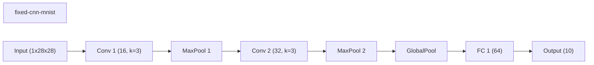

### wide-cnn-mnist-bn
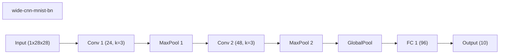

### channel-pruning-mnist
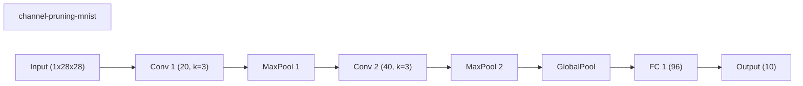

### runtime-neural-pruning-mnist
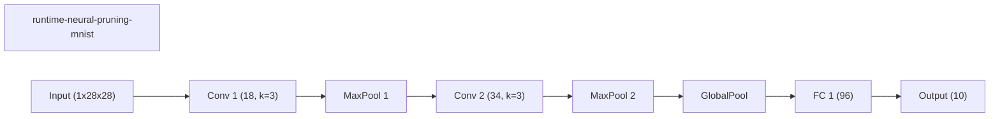

### weights-connections-cnn-mnist
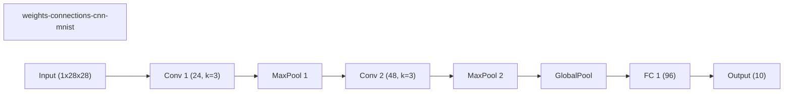

### layerwise-obs-cnn-mnist
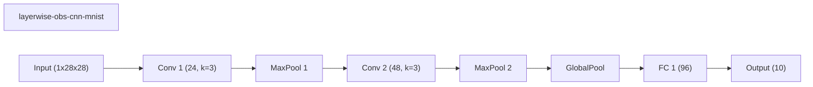

### network-slimming-mnist
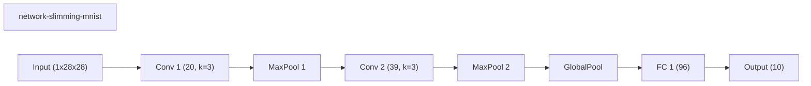

### morphnet-mnist

## Validation Accuracy By Epoch

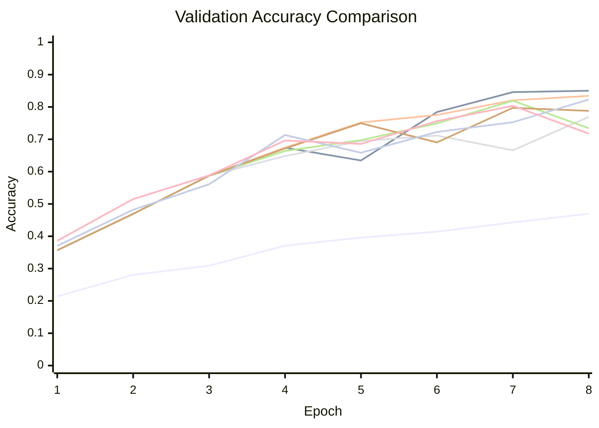
