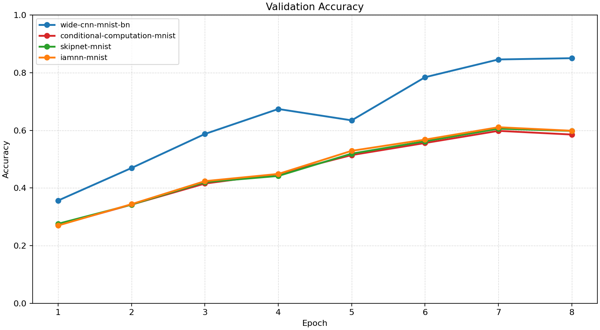
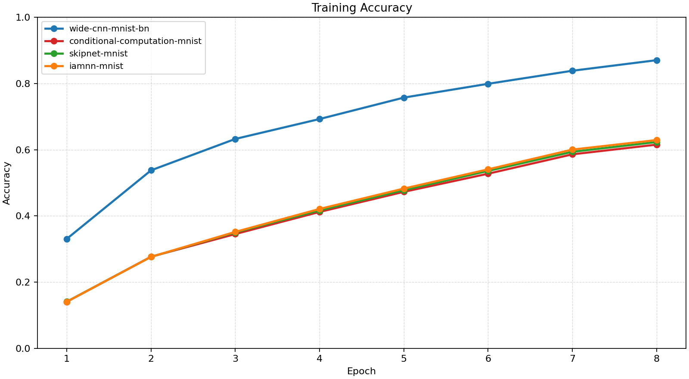
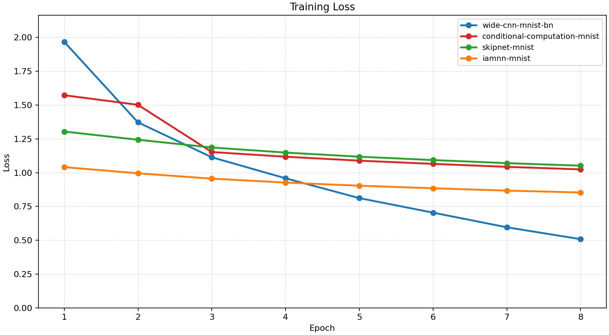
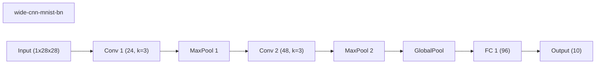
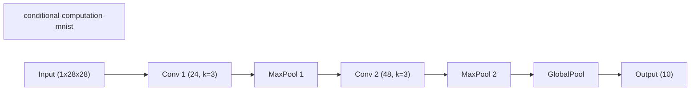
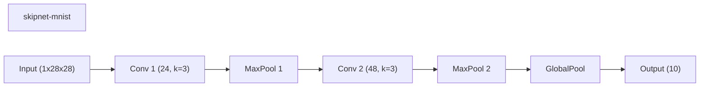
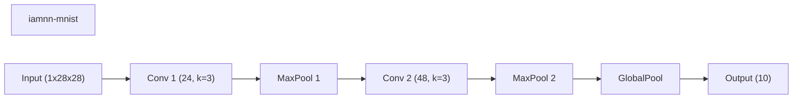
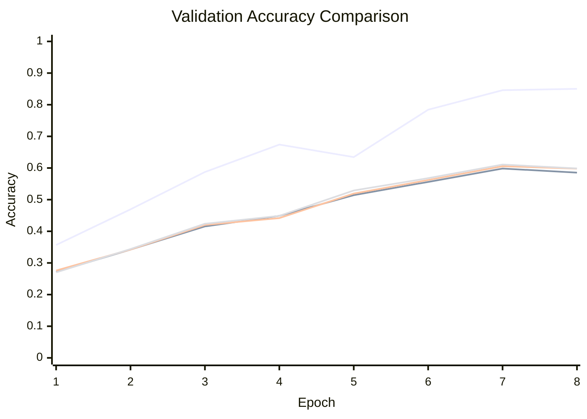

# Baseline Comparison

| Experiment | Type | Epochs | Final train acc | Final val acc | Best val acc | Adaptations | Final hidden dim |
| --- | --- | ---: | ---: | ---: | ---: | ---: | ---: |
| wide-cnn-mnist-bn | baseline | 8 | 0.8703 | 0.8502 | 0.8502 | 0 | 0 |
| conditional-computation-mnist | workflow | 8 | 0.6153 | 0.5854 | 0.5982 | 0 | - |
| skipnet-mnist | workflow | 8 | 0.6231 | 0.5980 | 0.6056 | 0 | - |
| iamnn-mnist | workflow | 8 | 0.6291 | 0.5986 | 0.6108 | 0 | - |

## Validation Accuracy

## Training Accuracy

## Training Loss

## Experiment Notes

- `wide-cnn-mnist-bn`: device=cuda; requested_device=auto; torch=2.11.0+cu128; cuda_available=True; torch_cuda=12.8; cuda_device=NVIDIA GeForce RTX 4070 Laptop GPU
- `conditional-computation-mnist`: workflow=conditional_computation; route_summary={'policy': 'early_exit', 'mode': 'eval', 'gate_mode': 'learned', 'gate_metric': 'margin', 'confidence_threshold': 0.22, 'target_cost_ratio': 0.74, 'target_accept_rate': 0.22, 'early_exit_fraction': 0.0882, 'eligible_fraction': 0.0882, 'mean_gate_score': 0.0133, 'max_gate_score': 0.0802, 'mean_exit_confidence': 0.2979, 'full_path_fraction': 0.9118, 'trace_samples': [{'sample': 0, 'path': 'full'}, {'sample': 1, 'path': 'full'}, {'sample': 2, 'path': 'full'}, {'sample': 3, 'path': 'full'}, {'sample': 4, 'path': 'full'}, {'sample': 5, 'path': 'full'}, {'sample': 6, 'path': 'early'}, {'sample': 7, 'path': 'full'}], 'mean_width': 1.0, 'mean_cost_ratio': 0.9136}; device=cuda; requested_device=auto; torch=2.11.0+cu128; cuda_available=True; torch_cuda=12.8; cuda_device=NVIDIA GeForce RTX 4070 Laptop GPU
- `skipnet-mnist`: workflow=skipnet; route_summary={'policy': 'early_exit', 'mode': 'eval', 'gate_mode': 'learned', 'gate_metric': 'margin', 'confidence_threshold': 0.16, 'target_cost_ratio': 0.74, 'target_accept_rate': 0.26, 'early_exit_fraction': 0.1029, 'eligible_fraction': 0.1029, 'mean_gate_score': 0.0147, 'max_gate_score': 0.0971, 'mean_exit_confidence': 0.3035, 'full_path_fraction': 0.8971, 'trace_samples': [{'sample': 0, 'path': 'full'}, {'sample': 1, 'path': 'full'}, {'sample': 2, 'path': 'full'}, {'sample': 3, 'path': 'full'}, {'sample': 4, 'path': 'full'}, {'sample': 5, 'path': 'full'}, {'sample': 6, 'path': 'early'}, {'sample': 7, 'path': 'full'}], 'mean_width': 1.0, 'mean_cost_ratio': 0.8992}; device=cuda; requested_device=auto; torch=2.11.0+cu128; cuda_available=True; torch_cuda=12.8; cuda_device=NVIDIA GeForce RTX 4070 Laptop GPU
- `iamnn-mnist`: workflow=iamnn; route_summary={'policy': 'early_exit', 'mode': 'eval', 'gate_mode': 'learned', 'gate_metric': 'margin', 'confidence_threshold': 0.16, 'target_cost_ratio': 0.7, 'target_accept_rate': 0.22, 'early_exit_fraction': 0.1029, 'eligible_fraction': 0.1029, 'mean_gate_score': 0.0144, 'max_gate_score': 0.098, 'mean_exit_confidence': 0.3063, 'full_path_fraction': 0.8971, 'trace_samples': [{'sample': 0, 'path': 'full'}, {'sample': 1, 'path': 'full'}, {'sample': 2, 'path': 'full'}, {'sample': 3, 'path': 'full'}, {'sample': 4, 'path': 'full'}, {'sample': 5, 'path': 'full'}, {'sample': 6, 'path': 'early'}, {'sample': 7, 'path': 'full'}], 'mean_width': 1.0, 'mean_cost_ratio': 0.8992}; device=cuda; requested_device=auto; torch=2.11.0+cu128; cuda_available=True; torch_cuda=12.8; cuda_device=NVIDIA GeForce RTX 4070 Laptop GPU

## Routing Details

### conditional-computation-mnist
- route_summary={'policy': 'early_exit', 'mode': 'eval', 'gate_mode': 'learned', 'gate_metric': 'margin', 'confidence_threshold': 0.22, 'target_cost_ratio': 0.74, 'target_accept_rate': 0.22, 'early_exit_fraction': 0.0882, 'eligible_fraction': 0.0882, 'mean_gate_score': 0.0133, 'max_gate_score': 0.0802, 'mean_exit_confidence': 0.2979, 'full_path_fraction': 0.9118, 'trace_samples': [{'sample': 0, 'path': 'full'}, {'sample': 1, 'path': 'full'}, {'sample': 2, 'path': 'full'}, {'sample': 3, 'path': 'full'}, {'sample': 4, 'path': 'full'}, {'sample': 5, 'path': 'full'}, {'sample': 6, 'path': 'early'}, {'sample': 7, 'path': 'full'}], 'mean_width': 1.0, 'mean_cost_ratio': 0.9136}
- route_trace=[{'policy': 'early_exit', 'mode': 'eval', 'threshold': 0.22, 'target_accept_rate': 0.22, 'trace_samples': [{'sample': 0, 'path': 'full'}, {'sample': 1, 'path': 'full'}, {'sample': 2, 'path': 'full'}, {'sample': 3, 'path': 'full'}, {'sample': 4, 'path': 'full'}, {'sample': 5, 'path': 'full'}, {'sample': 6, 'path': 'full'}, {'sample': 7, 'path': 'full'}]}, {'policy': 'early_exit', 'mode': 'eval', 'threshold': 0.22, 'target_accept_rate': 0.22, 'trace_samples': [{'sample': 0, 'path': 'full'}, {'sample': 1, 'path': 'full'}, {'sample': 2, 'path': 'full'}, {'sample': 3, 'path': 'full'}, {'sample': 4, 'path': 'full'}, {'sample': 5, 'path': 'full'}, {'sample': 6, 'path': 'full'}, {'sample': 7, 'path': 'full'}]}, {'policy': 'early_exit', 'mode': 'eval', 'threshold': 0.22, 'target_accept_rate': 0.22, 'trace_samples': [{'sample': 0, 'path': 'full'}, {'sample': 1, 'path': 'full'}, {'sample': 2, 'path': 'full'}, {'sample': 3, 'path': 'full'}, {'sample': 4, 'path': 'full'}, {'sample': 5, 'path': 'full'}, {'sample': 6, 'path': 'full'}, {'sample': 7, 'path': 'full'}]}, {'policy': 'early_exit', 'mode': 'eval', 'threshold': 0.22, 'target_accept_rate': 0.22, 'trace_samples': [{'sample': 0, 'path': 'full'}, {'sample': 1, 'path': 'full'}, {'sample': 2, 'path': 'full'}, {'sample': 3, 'path': 'full'}, {'sample': 4, 'path': 'full'}, {'sample': 5, 'path': 'full'}, {'sample': 6, 'path': 'early'}, {'sample': 7, 'path': 'full'}]}]

### skipnet-mnist
- route_summary={'policy': 'early_exit', 'mode': 'eval', 'gate_mode': 'learned', 'gate_metric': 'margin', 'confidence_threshold': 0.16, 'target_cost_ratio': 0.74, 'target_accept_rate': 0.26, 'early_exit_fraction': 0.1029, 'eligible_fraction': 0.1029, 'mean_gate_score': 0.0147, 'max_gate_score': 0.0971, 'mean_exit_confidence': 0.3035, 'full_path_fraction': 0.8971, 'trace_samples': [{'sample': 0, 'path': 'full'}, {'sample': 1, 'path': 'full'}, {'sample': 2, 'path': 'full'}, {'sample': 3, 'path': 'full'}, {'sample': 4, 'path': 'full'}, {'sample': 5, 'path': 'full'}, {'sample': 6, 'path': 'early'}, {'sample': 7, 'path': 'full'}], 'mean_width': 1.0, 'mean_cost_ratio': 0.8992}
- route_trace=[{'policy': 'early_exit', 'mode': 'eval', 'threshold': 0.16, 'target_accept_rate': 0.26, 'trace_samples': [{'sample': 0, 'path': 'full'}, {'sample': 1, 'path': 'full'}, {'sample': 2, 'path': 'full'}, {'sample': 3, 'path': 'full'}, {'sample': 4, 'path': 'full'}, {'sample': 5, 'path': 'full'}, {'sample': 6, 'path': 'full'}, {'sample': 7, 'path': 'full'}]}, {'policy': 'early_exit', 'mode': 'eval', 'threshold': 0.16, 'target_accept_rate': 0.26, 'trace_samples': [{'sample': 0, 'path': 'full'}, {'sample': 1, 'path': 'full'}, {'sample': 2, 'path': 'full'}, {'sample': 3, 'path': 'full'}, {'sample': 4, 'path': 'full'}, {'sample': 5, 'path': 'full'}, {'sample': 6, 'path': 'full'}, {'sample': 7, 'path': 'full'}]}, {'policy': 'early_exit', 'mode': 'eval', 'threshold': 0.16, 'target_accept_rate': 0.26, 'trace_samples': [{'sample': 0, 'path': 'full'}, {'sample': 1, 'path': 'full'}, {'sample': 2, 'path': 'full'}, {'sample': 3, 'path': 'full'}, {'sample': 4, 'path': 'full'}, {'sample': 5, 'path': 'full'}, {'sample': 6, 'path': 'full'}, {'sample': 7, 'path': 'full'}]}, {'policy': 'early_exit', 'mode': 'eval', 'threshold': 0.16, 'target_accept_rate': 0.26, 'trace_samples': [{'sample': 0, 'path': 'full'}, {'sample': 1, 'path': 'full'}, {'sample': 2, 'path': 'full'}, {'sample': 3, 'path': 'full'}, {'sample': 4, 'path': 'full'}, {'sample': 5, 'path': 'full'}, {'sample': 6, 'path': 'early'}, {'sample': 7, 'path': 'full'}]}]

### iamnn-mnist
- route_summary={'policy': 'early_exit', 'mode': 'eval', 'gate_mode': 'learned', 'gate_metric': 'margin', 'confidence_threshold': 0.16, 'target_cost_ratio': 0.7, 'target_accept_rate': 0.22, 'early_exit_fraction': 0.1029, 'eligible_fraction': 0.1029, 'mean_gate_score': 0.0144, 'max_gate_score': 0.098, 'mean_exit_confidence': 0.3063, 'full_path_fraction': 0.8971, 'trace_samples': [{'sample': 0, 'path': 'full'}, {'sample': 1, 'path': 'full'}, {'sample': 2, 'path': 'full'}, {'sample': 3, 'path': 'full'}, {'sample': 4, 'path': 'full'}, {'sample': 5, 'path': 'full'}, {'sample': 6, 'path': 'early'}, {'sample': 7, 'path': 'full'}], 'mean_width': 1.0, 'mean_cost_ratio': 0.8992}
- route_trace=[{'policy': 'early_exit', 'mode': 'eval', 'threshold': 0.16, 'target_accept_rate': 0.22, 'trace_samples': [{'sample': 0, 'path': 'full'}, {'sample': 1, 'path': 'full'}, {'sample': 2, 'path': 'full'}, {'sample': 3, 'path': 'full'}, {'sample': 4, 'path': 'full'}, {'sample': 5, 'path': 'full'}, {'sample': 6, 'path': 'full'}, {'sample': 7, 'path': 'full'}]}, {'policy': 'early_exit', 'mode': 'eval', 'threshold': 0.16, 'target_accept_rate': 0.22, 'trace_samples': [{'sample': 0, 'path': 'full'}, {'sample': 1, 'path': 'full'}, {'sample': 2, 'path': 'full'}, {'sample': 3, 'path': 'full'}, {'sample': 4, 'path': 'full'}, {'sample': 5, 'path': 'full'}, {'sample': 6, 'path': 'full'}, {'sample': 7, 'path': 'full'}]}, {'policy': 'early_exit', 'mode': 'eval', 'threshold': 0.16, 'target_accept_rate': 0.22, 'trace_samples': [{'sample': 0, 'path': 'full'}, {'sample': 1, 'path': 'full'}, {'sample': 2, 'path': 'full'}, {'sample': 3, 'path': 'full'}, {'sample': 4, 'path': 'full'}, {'sample': 5, 'path': 'full'}, {'sample': 6, 'path': 'full'}, {'sample': 7, 'path': 'full'}]}, {'policy': 'early_exit', 'mode': 'eval', 'threshold': 0.16, 'target_accept_rate': 0.22, 'trace_samples': [{'sample': 0, 'path': 'full'}, {'sample': 1, 'path': 'full'}, {'sample': 2, 'path': 'full'}, {'sample': 3, 'path': 'full'}, {'sample': 4, 'path': 'full'}, {'sample': 5, 'path': 'full'}, {'sample': 6, 'path': 'early'}, {'sample': 7, 'path': 'full'}]}]

## Constraint Summary

| Experiment | Params | Nonzero params | Weight sparsity | FLOP proxy | Activation elems |
| --- | ---: | ---: | ---: | ---: | ---: |
| wide-cnn-mnist-bn | 16474 | 16474 | 0.0000 | 4505914 | 7210 |
| conditional-computation-mnist | 11146 | 11146 | 0.0000 | 4439194 | 7114 |
| skipnet-mnist | 11146 | 11146 | 0.0000 | 4439194 | 7114 |
| iamnn-mnist | 11146 | 11146 | 0.0000 | 4439194 | 7114 |

## Workflow Stages

### wide-cnn-mnist-bn
- train: epochs=8, range=1..8, adaptation_enabled=False, final_val=0.8501999974250793
- workflow_metadata={'configured_total_epochs': 8, 'executed_total_epochs': 8, 'stage_count': 1}

### conditional-computation-mnist
- conditional_computation_warmup: epochs=2, range=1..2, adaptation_enabled=False, final_val=0.3424000144004822
- conditional_computation_routing: epochs=6, range=3..8, adaptation_enabled=False, final_val=0.5853999853134155
- workflow_metadata={'workflow_name': 'conditional_computation', 'configured_total_epochs': 8, 'executed_total_epochs': 8, 'stage_count': 2, 'routing_policy': 'early_exit', 'gate_mode': 'learned', 'warmup_epochs': 2, 'route_summary': {'policy': 'early_exit', 'mode': 'eval', 'gate_mode': 'learned', 'gate_metric': 'margin', 'confidence_threshold': 0.22, 'target_cost_ratio': 0.74, 'target_accept_rate': 0.22, 'early_exit_fraction': 0.0882, 'eligible_fraction': 0.0882, 'mean_gate_score': 0.0133, 'max_gate_score': 0.0802, 'mean_exit_confidence': 0.2979, 'full_path_fraction': 0.9118, 'trace_samples': [{'sample': 0, 'path': 'full'}, {'sample': 1, 'path': 'full'}, {'sample': 2, 'path': 'full'}, {'sample': 3, 'path': 'full'}, {'sample': 4, 'path': 'full'}, {'sample': 5, 'path': 'full'}, {'sample': 6, 'path': 'early'}, {'sample': 7, 'path': 'full'}], 'mean_width': 1.0, 'mean_cost_ratio': 0.9136}, 'route_trace': [{'policy': 'early_exit', 'mode': 'eval', 'threshold': 0.22, 'target_accept_rate': 0.22, 'trace_samples': [{'sample': 0, 'path': 'full'}, {'sample': 1, 'path': 'full'}, {'sample': 2, 'path': 'full'}, {'sample': 3, 'path': 'full'}, {'sample': 4, 'path': 'full'}, {'sample': 5, 'path': 'full'}, {'sample': 6, 'path': 'full'}, {'sample': 7, 'path': 'full'}]}, {'policy': 'early_exit', 'mode': 'eval', 'threshold': 0.22, 'target_accept_rate': 0.22, 'trace_samples': [{'sample': 0, 'path': 'full'}, {'sample': 1, 'path': 'full'}, {'sample': 2, 'path': 'full'}, {'sample': 3, 'path': 'full'}, {'sample': 4, 'path': 'full'}, {'sample': 5, 'path': 'full'}, {'sample': 6, 'path': 'full'}, {'sample': 7, 'path': 'full'}]}, {'policy': 'early_exit', 'mode': 'eval', 'threshold': 0.22, 'target_accept_rate': 0.22, 'trace_samples': [{'sample': 0, 'path': 'full'}, {'sample': 1, 'path': 'full'}, {'sample': 2, 'path': 'full'}, {'sample': 3, 'path': 'full'}, {'sample': 4, 'path': 'full'}, {'sample': 5, 'path': 'full'}, {'sample': 6, 'path': 'full'}, {'sample': 7, 'path': 'full'}]}, {'policy': 'early_exit', 'mode': 'eval', 'threshold': 0.22, 'target_accept_rate': 0.22, 'trace_samples': [{'sample': 0, 'path': 'full'}, {'sample': 1, 'path': 'full'}, {'sample': 2, 'path': 'full'}, {'sample': 3, 'path': 'full'}, {'sample': 4, 'path': 'full'}, {'sample': 5, 'path': 'full'}, {'sample': 6, 'path': 'early'}, {'sample': 7, 'path': 'full'}]}]}

### skipnet-mnist
- skipnet_warmup: epochs=3, range=1..3, adaptation_enabled=False, final_val=0.420199990272522
- skipnet_routing: epochs=5, range=4..8, adaptation_enabled=False, final_val=0.5979999899864197
- workflow_metadata={'workflow_name': 'skipnet', 'configured_total_epochs': 8, 'executed_total_epochs': 8, 'stage_count': 2, 'routing_policy': 'early_exit', 'gate_mode': 'learned', 'warmup_epochs': 3, 'route_summary': {'policy': 'early_exit', 'mode': 'eval', 'gate_mode': 'learned', 'gate_metric': 'margin', 'confidence_threshold': 0.16, 'target_cost_ratio': 0.74, 'target_accept_rate': 0.26, 'early_exit_fraction': 0.1029, 'eligible_fraction': 0.1029, 'mean_gate_score': 0.0147, 'max_gate_score': 0.0971, 'mean_exit_confidence': 0.3035, 'full_path_fraction': 0.8971, 'trace_samples': [{'sample': 0, 'path': 'full'}, {'sample': 1, 'path': 'full'}, {'sample': 2, 'path': 'full'}, {'sample': 3, 'path': 'full'}, {'sample': 4, 'path': 'full'}, {'sample': 5, 'path': 'full'}, {'sample': 6, 'path': 'early'}, {'sample': 7, 'path': 'full'}], 'mean_width': 1.0, 'mean_cost_ratio': 0.8992}, 'route_trace': [{'policy': 'early_exit', 'mode': 'eval', 'threshold': 0.16, 'target_accept_rate': 0.26, 'trace_samples': [{'sample': 0, 'path': 'full'}, {'sample': 1, 'path': 'full'}, {'sample': 2, 'path': 'full'}, {'sample': 3, 'path': 'full'}, {'sample': 4, 'path': 'full'}, {'sample': 5, 'path': 'full'}, {'sample': 6, 'path': 'full'}, {'sample': 7, 'path': 'full'}]}, {'policy': 'early_exit', 'mode': 'eval', 'threshold': 0.16, 'target_accept_rate': 0.26, 'trace_samples': [{'sample': 0, 'path': 'full'}, {'sample': 1, 'path': 'full'}, {'sample': 2, 'path': 'full'}, {'sample': 3, 'path': 'full'}, {'sample': 4, 'path': 'full'}, {'sample': 5, 'path': 'full'}, {'sample': 6, 'path': 'full'}, {'sample': 7, 'path': 'full'}]}, {'policy': 'early_exit', 'mode': 'eval', 'threshold': 0.16, 'target_accept_rate': 0.26, 'trace_samples': [{'sample': 0, 'path': 'full'}, {'sample': 1, 'path': 'full'}, {'sample': 2, 'path': 'full'}, {'sample': 3, 'path': 'full'}, {'sample': 4, 'path': 'full'}, {'sample': 5, 'path': 'full'}, {'sample': 6, 'path': 'full'}, {'sample': 7, 'path': 'full'}]}, {'policy': 'early_exit', 'mode': 'eval', 'threshold': 0.16, 'target_accept_rate': 0.26, 'trace_samples': [{'sample': 0, 'path': 'full'}, {'sample': 1, 'path': 'full'}, {'sample': 2, 'path': 'full'}, {'sample': 3, 'path': 'full'}, {'sample': 4, 'path': 'full'}, {'sample': 5, 'path': 'full'}, {'sample': 6, 'path': 'early'}, {'sample': 7, 'path': 'full'}]}]}

### iamnn-mnist
- iamnn_warmup: epochs=2, range=1..2, adaptation_enabled=False, final_val=0.3440000116825104
- iamnn_routing: epochs=4, range=3..6, adaptation_enabled=False, final_val=0.567799985408783
- iamnn_consolidation: epochs=2, range=7..8, adaptation_enabled=False, final_val=0.5985999703407288
- workflow_metadata={'workflow_name': 'iamnn', 'configured_total_epochs': 8, 'executed_total_epochs': 8, 'stage_count': 3, 'routing_policy': 'early_exit', 'gate_mode': 'learned', 'warmup_epochs': 2, 'consolidation_epochs': 2, 'route_summary': {'policy': 'early_exit', 'mode': 'eval', 'gate_mode': 'learned', 'gate_metric': 'margin', 'confidence_threshold': 0.16, 'target_cost_ratio': 0.7, 'target_accept_rate': 0.22, 'early_exit_fraction': 0.1029, 'eligible_fraction': 0.1029, 'mean_gate_score': 0.0144, 'max_gate_score': 0.098, 'mean_exit_confidence': 0.3063, 'full_path_fraction': 0.8971, 'trace_samples': [{'sample': 0, 'path': 'full'}, {'sample': 1, 'path': 'full'}, {'sample': 2, 'path': 'full'}, {'sample': 3, 'path': 'full'}, {'sample': 4, 'path': 'full'}, {'sample': 5, 'path': 'full'}, {'sample': 6, 'path': 'early'}, {'sample': 7, 'path': 'full'}], 'mean_width': 1.0, 'mean_cost_ratio': 0.8992}, 'route_trace': [{'policy': 'early_exit', 'mode': 'eval', 'threshold': 0.16, 'target_accept_rate': 0.22, 'trace_samples': [{'sample': 0, 'path': 'full'}, {'sample': 1, 'path': 'full'}, {'sample': 2, 'path': 'full'}, {'sample': 3, 'path': 'full'}, {'sample': 4, 'path': 'full'}, {'sample': 5, 'path': 'full'}, {'sample': 6, 'path': 'full'}, {'sample': 7, 'path': 'full'}]}, {'policy': 'early_exit', 'mode': 'eval', 'threshold': 0.16, 'target_accept_rate': 0.22, 'trace_samples': [{'sample': 0, 'path': 'full'}, {'sample': 1, 'path': 'full'}, {'sample': 2, 'path': 'full'}, {'sample': 3, 'path': 'full'}, {'sample': 4, 'path': 'full'}, {'sample': 5, 'path': 'full'}, {'sample': 6, 'path': 'full'}, {'sample': 7, 'path': 'full'}]}, {'policy': 'early_exit', 'mode': 'eval', 'threshold': 0.16, 'target_accept_rate': 0.22, 'trace_samples': [{'sample': 0, 'path': 'full'}, {'sample': 1, 'path': 'full'}, {'sample': 2, 'path': 'full'}, {'sample': 3, 'path': 'full'}, {'sample': 4, 'path': 'full'}, {'sample': 5, 'path': 'full'}, {'sample': 6, 'path': 'full'}, {'sample': 7, 'path': 'full'}]}, {'policy': 'early_exit', 'mode': 'eval', 'threshold': 0.16, 'target_accept_rate': 0.22, 'trace_samples': [{'sample': 0, 'path': 'full'}, {'sample': 1, 'path': 'full'}, {'sample': 2, 'path': 'full'}, {'sample': 3, 'path': 'full'}, {'sample': 4, 'path': 'full'}, {'sample': 5, 'path': 'full'}, {'sample': 6, 'path': 'early'}, {'sample': 7, 'path': 'full'}]}]}

## Adaptation Timeline

## Architecture Graphs

### wide-cnn-mnist-bn

### conditional-computation-mnist

### skipnet-mnist

### iamnn-mnist

## Validation Accuracy By Epoch

