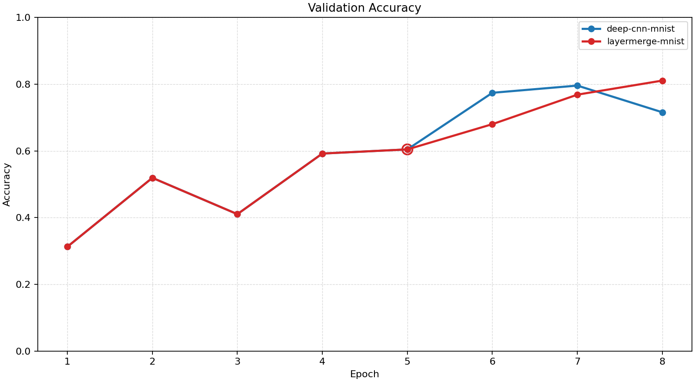
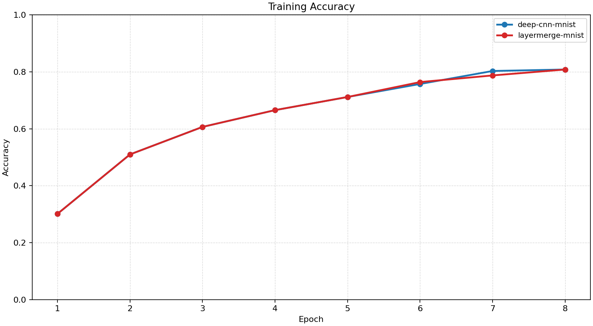
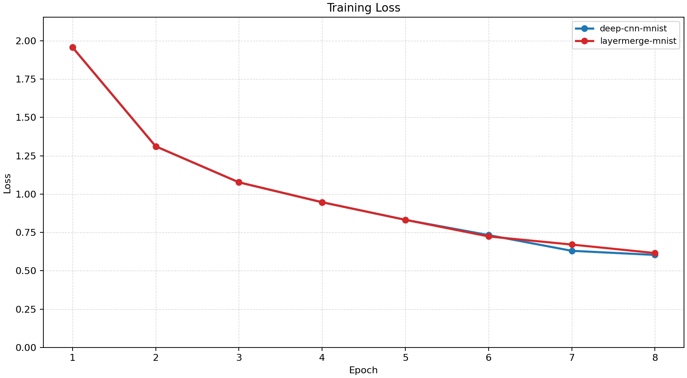
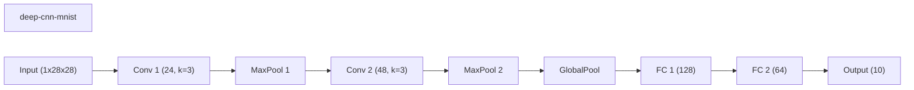
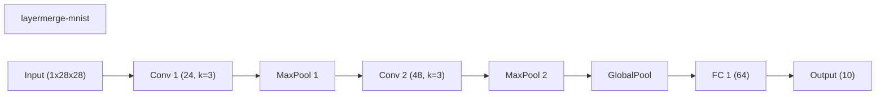
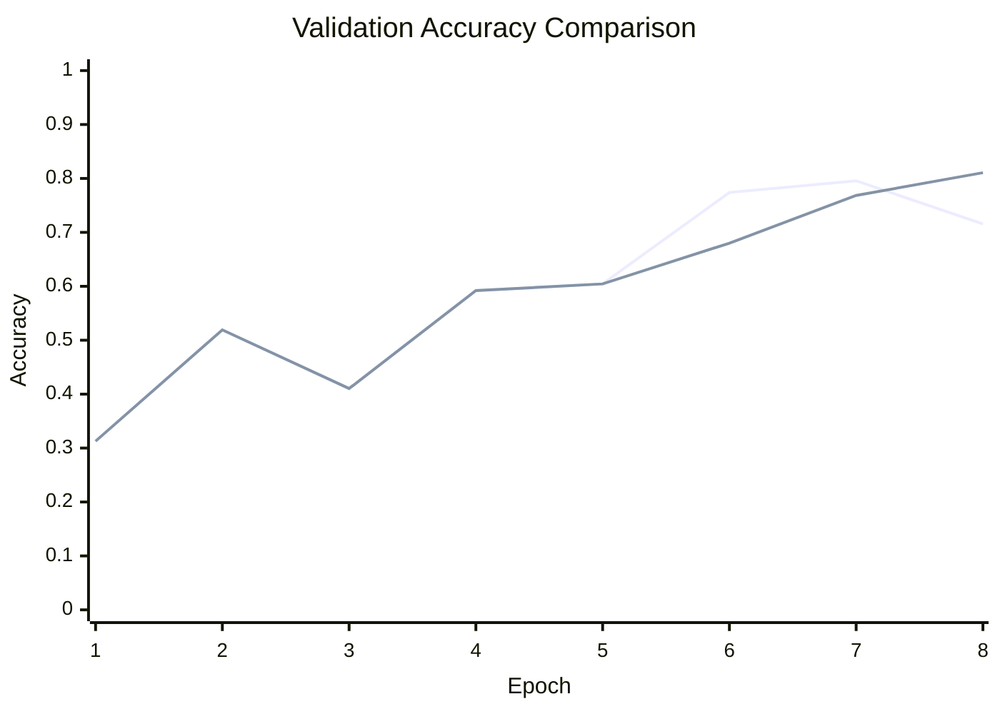

# Baseline Comparison

| Experiment | Type | Epochs | Final train acc | Final val acc | Best val acc | Adaptations | Final hidden dim |
| --- | --- | ---: | ---: | ---: | ---: | ---: | ---: |
| deep-cnn-mnist | baseline | 8 | 0.8080 | 0.7156 | 0.7956 | 0 | 0 |
| layermerge-mnist | workflow | 8 | 0.8080 | 0.8106 | 0.8106 | 1 | 0 |

## Validation Accuracy

## Training Accuracy

## Training Loss

## Experiment Notes

- `deep-cnn-mnist`: device=cuda; requested_device=auto; torch=2.11.0+cu128; cuda_available=True; torch_cuda=12.8; cuda_device=NVIDIA GeForce RTX 4070 Laptop GPU
- `layermerge-mnist`: workflow=layermerge; device=cuda; requested_device=auto; torch=2.11.0+cu128; cuda_available=True; torch_cuda=12.8; cuda_device=NVIDIA GeForce RTX 4070 Laptop GPU

## Constraint Summary

| Experiment | Params | Nonzero params | Weight sparsity | FLOP proxy | Activation elems |
| --- | ---: | ---: | ---: | ---: | ---: |
| deep-cnn-mnist | 25978 | 25978 | 0.0000 | 4524826 | 7306 |
| layermerge-mnist | 14586 | 14586 | 0.0000 | 4502170 | 7178 |

## Workflow Stages

### deep-cnn-mnist
- train: epochs=8, range=1..8, adaptation_enabled=False, final_val=0.7156000137329102
- workflow_metadata={'configured_total_epochs': 8, 'executed_total_epochs': 8, 'stage_count': 1}

### layermerge-mnist
- layermerge_pretrain: epochs=5, range=1..5, adaptation_enabled=False, final_val=0.6043999791145325
- layermerge_finetune: epochs=3, range=6..8, adaptation_enabled=False, final_val=0.8105999827384949
- workflow_metadata={'workflow_name': 'layermerge', 'configured_total_epochs': 8, 'executed_total_epochs': 8, 'stage_count': 2, 'merge_index': 0, 'before_classifier_hidden_dims': [128, 64], 'after_classifier_hidden_dims': [64]}

## Adaptation Timeline

### layermerge-mnist
- epoch 5: `merge_hidden_layers` params={'merge_index': 0} effect={'applied': True, 'structural_change': True, 'version_delta': 1, 'step_delta': 0, 'parameter_count_delta': -11392, 'nonzero_parameter_count_delta': -11392, 'weight_sparsity_delta': 0.0, 'forward_flop_proxy_delta': -22656, 'activation_elements_delta': -128, 'classifier_hidden_dims_before': [128, 64], 'classifier_hidden_dims_after': [64], 'hidden_layers_changed': True} before={'conv_channels': [24, 48], 'num_conv_blocks': 2, 'classifier_hidden_dims': [128, 64], 'nonzero_parameter_count': 25978, 'masked_weight_count': 0, 'weight_sparsity': 0.0, 'mask_state_names': ['conv_0.weight', 'conv_1.weight', 'linear_0.weight', 'linear_1.weight', 'linear_2.weight'], 'device': 'cuda', 'use_batch_norm': True, 'batch_norm_sparsity_strength': 0.0, 'supported_events': ['apply_weight_mask', 'merge_hidden_layers', 'prune_channels'], 'architecture_family': 'cnn', 'parameter_count': 25978, 'forward_flop_proxy': 4524826, 'activation_elements': 7306} after={'conv_channels': [24, 48], 'num_conv_blocks': 2, 'classifier_hidden_dims': [64], 'nonzero_parameter_count': 14586, 'masked_weight_count': 0, 'weight_sparsity': 0.0, 'mask_state_names': ['conv_0.weight', 'conv_1.weight', 'linear_0.weight', 'linear_1.weight'], 'device': 'cuda', 'use_batch_norm': True, 'batch_norm_sparsity_strength': 0.0, 'supported_events': ['apply_weight_mask', 'merge_hidden_layers', 'prune_channels'], 'architecture_family': 'cnn', 'parameter_count': 14586, 'forward_flop_proxy': 4502170, 'activation_elements': 7178, 'classifier_hidden_dims_before_merge': [128, 64], 'merge_index': 0} capabilities=['apply_weight_mask', 'merge_hidden_layers', 'prune_channels']

## Architecture Graphs

### deep-cnn-mnist

### layermerge-mnist

## Validation Accuracy By Epoch

