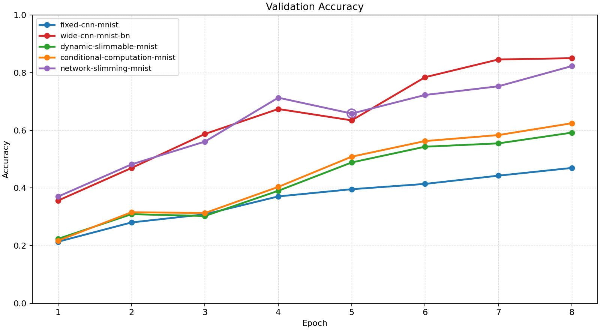
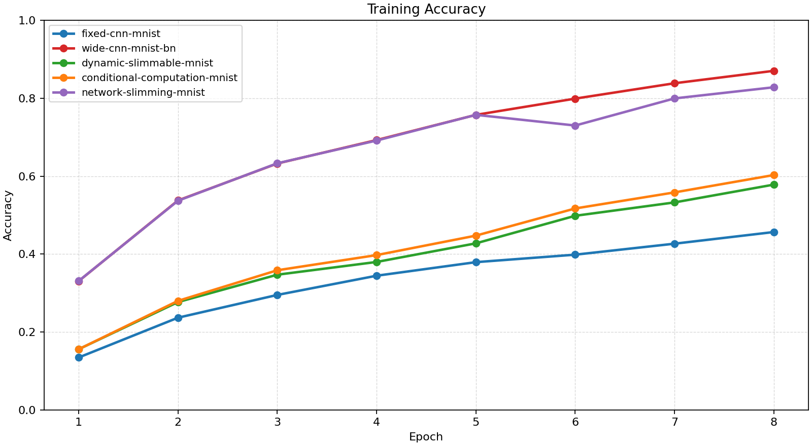
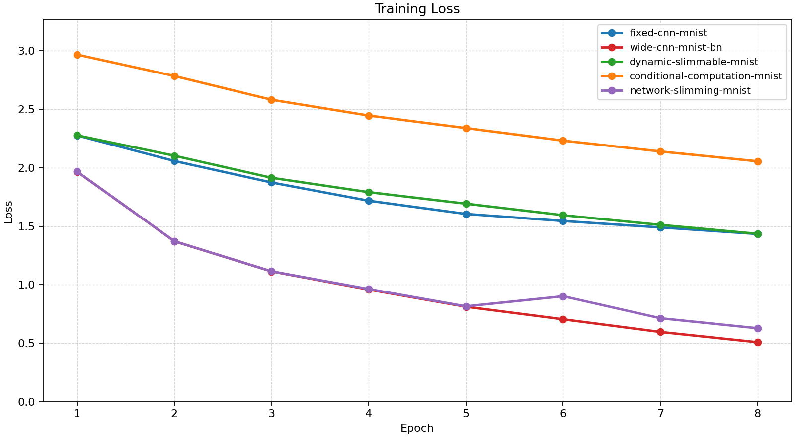
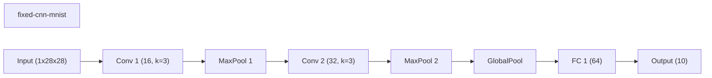
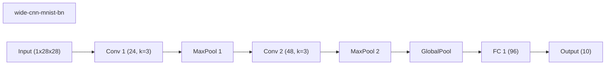
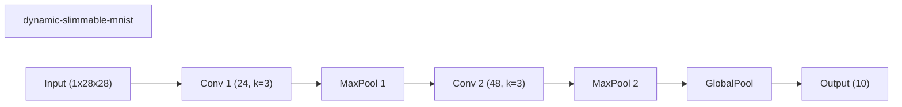
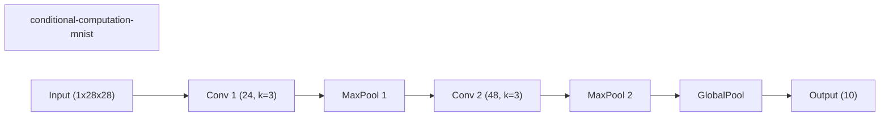
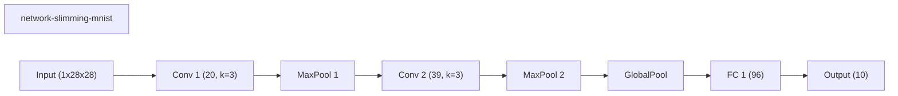
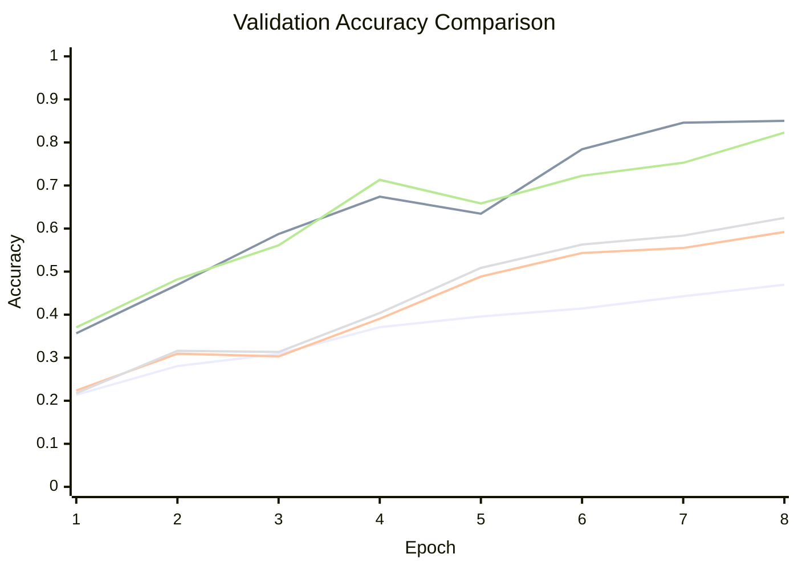

# Baseline Comparison

| Experiment | Type | Epochs | Final train acc | Final val acc | Best val acc | Adaptations | Final hidden dim |
| --- | --- | ---: | ---: | ---: | ---: | ---: | ---: |
| fixed-cnn-mnist | baseline | 8 | 0.4566 | 0.4696 | 0.4696 | 0 | 0 |
| wide-cnn-mnist-bn | baseline | 8 | 0.8703 | 0.8502 | 0.8502 | 0 | 0 |
| dynamic-slimmable-mnist | workflow | 8 | 0.5783 | 0.5920 | 0.5920 | 0 | - |
| conditional-computation-mnist | workflow | 8 | 0.6029 | 0.6246 | 0.6246 | 0 | - |
| network-slimming-mnist | workflow | 8 | 0.8281 | 0.8228 | 0.8228 | 1 | 0 |

## Validation Accuracy

## Training Accuracy

## Training Loss

## Experiment Notes

- `fixed-cnn-mnist`: device=cuda; requested_device=auto; torch=2.11.0+cu128; cuda_available=True; torch_cuda=12.8; cuda_device=NVIDIA GeForce RTX 4070 Laptop GPU
- `wide-cnn-mnist-bn`: device=cuda; requested_device=auto; torch=2.11.0+cu128; cuda_available=True; torch_cuda=12.8; cuda_device=NVIDIA GeForce RTX 4070 Laptop GPU
- `dynamic-slimmable-mnist`: workflow=dynamic_slimmable; route_summary={'policy': 'dynamic_width', 'mode': 'eval', 'confidence_threshold': 0.85, 'route_counts': {'0.5': 3, '0.75': 6, '1.0': 127}, 'mean_width': 0.9779, 'mean_cost_ratio': 0.9644}; device=cuda; requested_device=auto; torch=2.11.0+cu128; cuda_available=True; torch_cuda=12.8; cuda_device=NVIDIA GeForce RTX 4070 Laptop GPU
- `conditional-computation-mnist`: workflow=conditional_computation; route_summary={'policy': 'early_exit', 'mode': 'eval', 'confidence_threshold': 0.9, 'early_exit_fraction': 0.0, 'full_path_fraction': 1.0, 'mean_width': 1.0, 'mean_cost_ratio': 1.0}; device=cuda; requested_device=auto; torch=2.11.0+cu128; cuda_available=True; torch_cuda=12.8; cuda_device=NVIDIA GeForce RTX 4070 Laptop GPU
- `network-slimming-mnist`: workflow=network_slimming; device=cuda; requested_device=auto; torch=2.11.0+cu128; cuda_available=True; torch_cuda=12.8; cuda_device=NVIDIA GeForce RTX 4070 Laptop GPU

## Constraint Summary

| Experiment | Params | Nonzero params | Weight sparsity | FLOP proxy | Activation elems |
| --- | ---: | ---: | ---: | ---: | ---: |
| fixed-cnn-mnist | 7562 | 7562 | 0.0000 | 2061098 | 4810 |
| wide-cnn-mnist-bn | 16474 | 16474 | 0.0000 | 4505914 | 7210 |
| dynamic-slimmable-mnist | 11146 | 11146 | 0.0000 | 4439194 | 7114 |
| conditional-computation-mnist | 11146 | 11146 | 0.0000 | 4439194 | 7114 |
| network-slimming-mnist | 12187 | 12187 | 0.0000 | 3119397 | 5976 |

## Workflow Stages

### fixed-cnn-mnist
- train: epochs=8, range=1..8, adaptation_enabled=False, final_val=0.46959999203681946
- workflow_metadata={'configured_total_epochs': 8, 'executed_total_epochs': 8, 'stage_count': 1}

### wide-cnn-mnist-bn
- train: epochs=8, range=1..8, adaptation_enabled=False, final_val=0.8501999974250793
- workflow_metadata={'configured_total_epochs': 8, 'executed_total_epochs': 8, 'stage_count': 1}

### dynamic-slimmable-mnist
- dynamic_slimmable_train: epochs=8, range=1..8, adaptation_enabled=False, final_val=0.5920000076293945
- workflow_metadata={'workflow_name': 'dynamic_slimmable', 'configured_total_epochs': 8, 'executed_total_epochs': 8, 'stage_count': 1, 'routing_policy': 'dynamic_width', 'width_multipliers': [1.0, 0.75, 0.5], 'eval_width_multipliers': [0.5, 0.75, 1.0], 'route_summary': {'policy': 'dynamic_width', 'mode': 'eval', 'confidence_threshold': 0.85, 'route_counts': {'0.5': 3, '0.75': 6, '1.0': 127}, 'mean_width': 0.9779, 'mean_cost_ratio': 0.9644}}

### conditional-computation-mnist
- conditional_computation_train: epochs=8, range=1..8, adaptation_enabled=False, final_val=0.6245999932289124
- workflow_metadata={'workflow_name': 'conditional_computation', 'configured_total_epochs': 8, 'executed_total_epochs': 8, 'stage_count': 1, 'routing_policy': 'early_exit', 'confidence_threshold': 0.9, 'route_summary': {'policy': 'early_exit', 'mode': 'eval', 'confidence_threshold': 0.9, 'early_exit_fraction': 0.0, 'full_path_fraction': 1.0, 'mean_width': 1.0, 'mean_cost_ratio': 1.0}}

### network-slimming-mnist
- network_slimming_sparse_train: epochs=5, range=1..5, adaptation_enabled=False, final_val=0.6582000255584717
- network_slimming_finetune: epochs=3, range=6..8, adaptation_enabled=False, final_val=0.8227999806404114
- workflow_metadata={'workflow_name': 'network_slimming', 'configured_total_epochs': 8, 'executed_total_epochs': 8, 'stage_count': 2, 'prune_fraction': 0.2, 'min_channels_per_block': 12, 'before_conv_channels': [24, 48], 'after_conv_channels': [20, 39]}

## Adaptation Timeline

### network-slimming-mnist
- epoch 5: `prune_channels` params={'prune_fraction': 0.2, 'min_channels_per_block': 12} effect={'applied': True, 'structural_change': True, 'version_delta': 1, 'step_delta': 0, 'parameter_count_delta': -4287, 'nonzero_parameter_count_delta': -4287, 'weight_sparsity_delta': 0.0, 'forward_flop_proxy_delta': -1386517, 'activation_elements_delta': -1234, 'num_conv_blocks_delta': 0, 'conv_channels_before': [24, 48], 'conv_channels_after': [20, 39], 'channels_changed': True} before={'conv_channels': [24, 48], 'num_conv_blocks': 2, 'classifier_hidden_dims': [96], 'nonzero_parameter_count': 16474, 'masked_weight_count': 0, 'weight_sparsity': 0.0, 'mask_state_names': ['conv_0.weight', 'conv_1.weight', 'linear_0.weight', 'linear_1.weight'], 'device': 'cuda', 'use_batch_norm': True, 'batch_norm_sparsity_strength': 0.0, 'supported_events': ['apply_weight_mask', 'prune_channels'], 'architecture_family': 'cnn', 'parameter_count': 16474, 'forward_flop_proxy': 4505914, 'activation_elements': 7210} after={'conv_channels': [20, 39], 'num_conv_blocks': 2, 'classifier_hidden_dims': [96], 'nonzero_parameter_count': 12187, 'masked_weight_count': 0, 'weight_sparsity': 0.0, 'mask_state_names': ['conv_0.weight', 'conv_1.weight', 'linear_0.weight', 'linear_1.weight'], 'device': 'cuda', 'use_batch_norm': True, 'batch_norm_sparsity_strength': 0.0, 'supported_events': ['apply_weight_mask', 'prune_channels'], 'architecture_family': 'cnn', 'parameter_count': 12187, 'forward_flop_proxy': 3119397, 'activation_elements': 5976, 'conv_channels_before_prune': [24, 48]} capabilities=['apply_weight_mask', 'prune_channels']

## Architecture Graphs

### fixed-cnn-mnist

### wide-cnn-mnist-bn

### dynamic-slimmable-mnist

### conditional-computation-mnist

### network-slimming-mnist

## Validation Accuracy By Epoch

