# Baseline Comparison

| Experiment | Type | Epochs | Final train acc | Final val acc | Best val acc | Adaptations | Final hidden dim |
| --- | --- | ---: | ---: | ---: | ---: | ---: | ---: |
| fixed-cnn-mnist | baseline | 8 | 0.4566 | 0.4696 | 0.4696 | 0 | 0 |
| wide-cnn-mnist-bn | baseline | 8 | 0.8703 | 0.8502 | 0.8502 | 0 | 0 |
| dynamic-slimmable-mnist | workflow | 8 | 0.5843 | 0.5904 | 0.5904 | 0 | - |
| conditional-computation-mnist | workflow | 8 | 0.6167 | 0.5918 | 0.6022 | 0 | - |
| channel-gating-mnist | workflow | 8 | 0.5164 | 0.5228 | 0.5228 | 0 | - |
| skipnet-mnist | workflow | 8 | 0.6397 | 0.6146 | 0.6214 | 0 | - |
| instance-wise-sparsity-mnist | workflow | 8 | 0.5126 | 0.5260 | 0.5260 | 0 | - |
| iamnn-mnist | workflow | 8 | 0.6157 | 0.5926 | 0.5966 | 0 | - |
| network-slimming-mnist | workflow | 8 | 0.8281 | 0.8228 | 0.8228 | 1 | 0 |

## Validation Accuracy

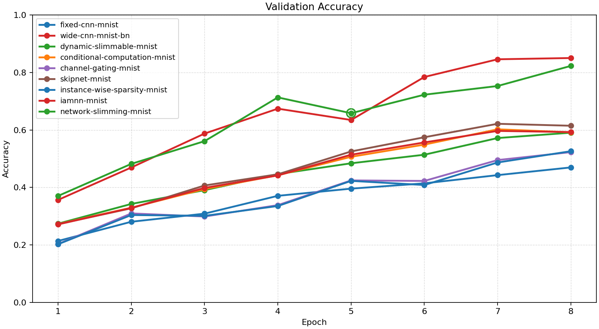

## Training Accuracy

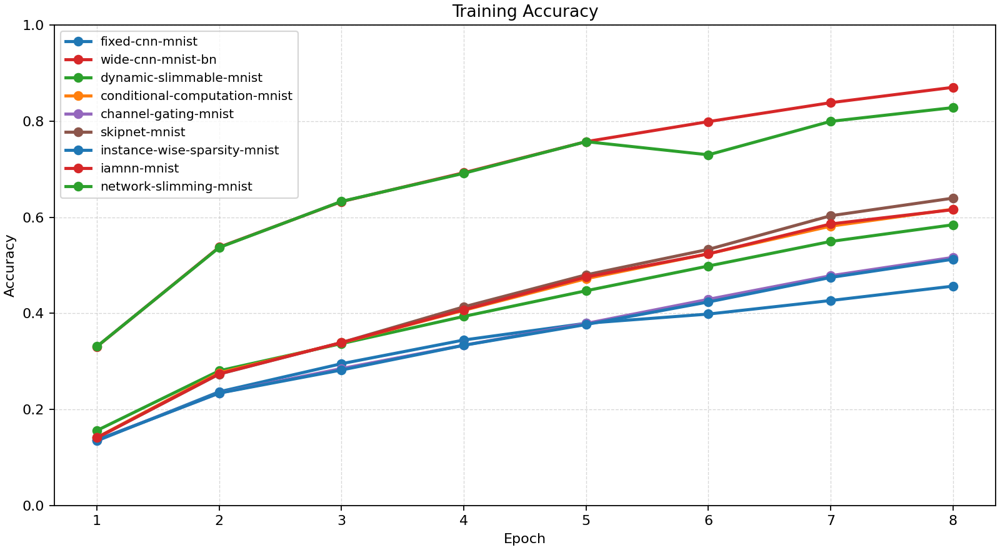

## Training Loss

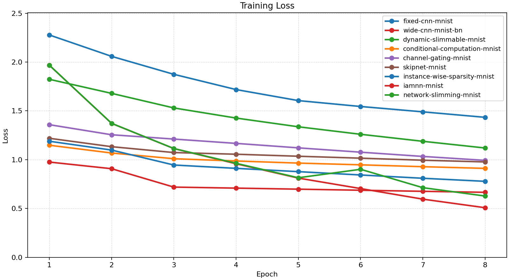

## Experiment Notes

- `fixed-cnn-mnist`: device=cuda; requested_device=auto; torch=2.11.0+cu128; cuda_available=True; torch_cuda=12.8; cuda_device=NVIDIA GeForce RTX 4070 Laptop GPU
- `wide-cnn-mnist-bn`: device=cuda; requested_device=auto; torch=2.11.0+cu128; cuda_available=True; torch_cuda=12.8; cuda_device=NVIDIA GeForce RTX 4070 Laptop GPU
- `dynamic-slimmable-mnist`: workflow=dynamic_slimmable; route_summary={'policy': 'dynamic_width', 'mode': 'eval', 'gate_mode': 'metric', 'gate_metric': 'margin', 'confidence_threshold': 0.45, 'target_cost_ratio': 0.82, 'target_accept_rate': None, 'route_counts': {'0.5': 18, '0.75': 7, '1.0': 111}, 'trace_samples': [{'sample': 0, 'width': 1.0}, {'sample': 1, 'width': 1.0}, {'sample': 2, 'width': 0.5}, {'sample': 3, 'width': 1.0}, {'sample': 4, 'width': 1.0}, {'sample': 5, 'width': 1.0}, {'sample': 6, 'width': 0.5}, {'sample': 7, 'width': 1.0}], 'mean_width': 0.921, 'mean_cost_ratio': 0.8791}; device=cuda; requested_device=auto; torch=2.11.0+cu128; cuda_available=True; torch_cuda=12.8; cuda_device=NVIDIA GeForce RTX 4070 Laptop GPU
- `conditional-computation-mnist`: workflow=conditional_computation; route_summary={'policy': 'early_exit', 'mode': 'eval', 'gate_mode': 'learned', 'gate_metric': 'margin', 'confidence_threshold': 0.55, 'target_cost_ratio': 0.8, 'target_accept_rate': None, 'early_exit_fraction': 0.0, 'full_path_fraction': 1.0, 'trace_samples': [{'sample': 0, 'path': 'full'}, {'sample': 1, 'path': 'full'}, {'sample': 2, 'path': 'full'}, {'sample': 3, 'path': 'full'}, {'sample': 4, 'path': 'full'}, {'sample': 5, 'path': 'full'}, {'sample': 6, 'path': 'full'}, {'sample': 7, 'path': 'full'}], 'mean_width': 1.0, 'mean_cost_ratio': 1.0}; device=cuda; requested_device=auto; torch=2.11.0+cu128; cuda_available=True; torch_cuda=12.8; cuda_device=NVIDIA GeForce RTX 4070 Laptop GPU
- `channel-gating-mnist`: workflow=channel_gating; route_summary={'policy': 'dynamic_width', 'mode': 'eval', 'gate_mode': 'learned', 'gate_metric': 'margin', 'confidence_threshold': 0.35, 'target_cost_ratio': 0.76, 'target_accept_rate': None, 'route_counts': {'0.5': 27, '0.75': 17, '1.0': 92}, 'trace_samples': [{'sample': 0, 'width': 1.0}, {'sample': 1, 'width': 1.0}, {'sample': 2, 'width': 0.5}, {'sample': 3, 'width': 1.0}, {'sample': 4, 'width': 1.0}, {'sample': 5, 'width': 1.0}, {'sample': 6, 'width': 0.5}, {'sample': 7, 'width': 1.0}], 'mean_width': 0.8695, 'mean_cost_ratio': 0.7979}; device=cuda; requested_device=auto; torch=2.11.0+cu128; cuda_available=True; torch_cuda=12.8; cuda_device=NVIDIA GeForce RTX 4070 Laptop GPU
- `skipnet-mnist`: workflow=skipnet; route_summary={'policy': 'early_exit', 'mode': 'eval', 'gate_mode': 'learned', 'gate_metric': 'margin', 'confidence_threshold': 0.3, 'target_cost_ratio': 0.82, 'target_accept_rate': None, 'early_exit_fraction': 0.0074, 'full_path_fraction': 0.9926, 'trace_samples': [{'sample': 0, 'path': 'full'}, {'sample': 1, 'path': 'full'}, {'sample': 2, 'path': 'full'}, {'sample': 3, 'path': 'full'}, {'sample': 4, 'path': 'full'}, {'sample': 5, 'path': 'full'}, {'sample': 6, 'path': 'full'}, {'sample': 7, 'path': 'full'}], 'mean_width': 1.0, 'mean_cost_ratio': 0.9928}; device=cuda; requested_device=auto; torch=2.11.0+cu128; cuda_available=True; torch_cuda=12.8; cuda_device=NVIDIA GeForce RTX 4070 Laptop GPU
- `instance-wise-sparsity-mnist`: workflow=instance_wise_sparsity; route_summary={'policy': 'dynamic_width', 'mode': 'eval', 'gate_mode': 'learned', 'gate_metric': 'margin', 'confidence_threshold': 0.35, 'target_cost_ratio': 0.68, 'target_accept_rate': 0.4, 'route_counts': {'0.5': 31, '0.75': 18, '1.0': 87}, 'trace_samples': [{'sample': 0, 'width': 1.0}, {'sample': 1, 'width': 1.0}, {'sample': 2, 'width': 0.5}, {'sample': 3, 'width': 1.0}, {'sample': 4, 'width': 1.0}, {'sample': 5, 'width': 1.0}, {'sample': 6, 'width': 0.5}, {'sample': 7, 'width': 1.0}], 'mean_width': 0.8529, 'mean_cost_ratio': 0.7728}; device=cuda; requested_device=auto; torch=2.11.0+cu128; cuda_available=True; torch_cuda=12.8; cuda_device=NVIDIA GeForce RTX 4070 Laptop GPU
- `iamnn-mnist`: workflow=iamnn; route_summary={'policy': 'early_exit', 'mode': 'eval', 'gate_mode': 'learned', 'gate_metric': 'margin', 'confidence_threshold': 0.28, 'target_cost_ratio': 0.72, 'target_accept_rate': 0.3, 'early_exit_fraction': 0.0147, 'full_path_fraction': 0.9853, 'trace_samples': [{'sample': 0, 'path': 'full'}, {'sample': 1, 'path': 'full'}, {'sample': 2, 'path': 'full'}, {'sample': 3, 'path': 'full'}, {'sample': 4, 'path': 'full'}, {'sample': 5, 'path': 'full'}, {'sample': 6, 'path': 'full'}, {'sample': 7, 'path': 'full'}], 'mean_width': 1.0, 'mean_cost_ratio': 0.9856}; device=cuda; requested_device=auto; torch=2.11.0+cu128; cuda_available=True; torch_cuda=12.8; cuda_device=NVIDIA GeForce RTX 4070 Laptop GPU
- `network-slimming-mnist`: workflow=network_slimming; device=cuda; requested_device=auto; torch=2.11.0+cu128; cuda_available=True; torch_cuda=12.8; cuda_device=NVIDIA GeForce RTX 4070 Laptop GPU

## Routing Details

### dynamic-slimmable-mnist
- route_summary={'policy': 'dynamic_width', 'mode': 'eval', 'gate_mode': 'metric', 'gate_metric': 'margin', 'confidence_threshold': 0.45, 'target_cost_ratio': 0.82, 'target_accept_rate': None, 'route_counts': {'0.5': 18, '0.75': 7, '1.0': 111}, 'trace_samples': [{'sample': 0, 'width': 1.0}, {'sample': 1, 'width': 1.0}, {'sample': 2, 'width': 0.5}, {'sample': 3, 'width': 1.0}, {'sample': 4, 'width': 1.0}, {'sample': 5, 'width': 1.0}, {'sample': 6, 'width': 0.5}, {'sample': 7, 'width': 1.0}], 'mean_width': 0.921, 'mean_cost_ratio': 0.8791}
- route_trace=[{'policy': 'dynamic_width', 'mode': 'eval', 'threshold': 0.45, 'trace_samples': [{'sample': 0, 'width': 1.0}, {'sample': 1, 'width': 1.0}, {'sample': 2, 'width': 1.0}, {'sample': 3, 'width': 1.0}, {'sample': 4, 'width': 1.0}, {'sample': 5, 'width': 1.0}, {'sample': 6, 'width': 1.0}, {'sample': 7, 'width': 1.0}]}, {'policy': 'dynamic_width', 'mode': 'eval', 'threshold': 0.45, 'trace_samples': [{'sample': 0, 'width': 1.0}, {'sample': 1, 'width': 1.0}, {'sample': 2, 'width': 1.0}, {'sample': 3, 'width': 1.0}, {'sample': 4, 'width': 1.0}, {'sample': 5, 'width': 1.0}, {'sample': 6, 'width': 1.0}, {'sample': 7, 'width': 1.0}]}, {'policy': 'dynamic_width', 'mode': 'eval', 'threshold': 0.45, 'trace_samples': [{'sample': 0, 'width': 1.0}, {'sample': 1, 'width': 1.0}, {'sample': 2, 'width': 1.0}, {'sample': 3, 'width': 1.0}, {'sample': 4, 'width': 1.0}, {'sample': 5, 'width': 1.0}, {'sample': 6, 'width': 0.5}, {'sample': 7, 'width': 1.0}]}, {'policy': 'dynamic_width', 'mode': 'eval', 'threshold': 0.45, 'trace_samples': [{'sample': 0, 'width': 1.0}, {'sample': 1, 'width': 1.0}, {'sample': 2, 'width': 0.5}, {'sample': 3, 'width': 1.0}, {'sample': 4, 'width': 1.0}, {'sample': 5, 'width': 1.0}, {'sample': 6, 'width': 0.5}, {'sample': 7, 'width': 1.0}]}]

### conditional-computation-mnist
- route_summary={'policy': 'early_exit', 'mode': 'eval', 'gate_mode': 'learned', 'gate_metric': 'margin', 'confidence_threshold': 0.55, 'target_cost_ratio': 0.8, 'target_accept_rate': None, 'early_exit_fraction': 0.0, 'full_path_fraction': 1.0, 'trace_samples': [{'sample': 0, 'path': 'full'}, {'sample': 1, 'path': 'full'}, {'sample': 2, 'path': 'full'}, {'sample': 3, 'path': 'full'}, {'sample': 4, 'path': 'full'}, {'sample': 5, 'path': 'full'}, {'sample': 6, 'path': 'full'}, {'sample': 7, 'path': 'full'}], 'mean_width': 1.0, 'mean_cost_ratio': 1.0}
- route_trace=[{'policy': 'early_exit', 'mode': 'eval', 'threshold': 0.55, 'trace_samples': [{'sample': 0, 'path': 'full'}, {'sample': 1, 'path': 'full'}, {'sample': 2, 'path': 'full'}, {'sample': 3, 'path': 'full'}, {'sample': 4, 'path': 'full'}, {'sample': 5, 'path': 'full'}, {'sample': 6, 'path': 'full'}, {'sample': 7, 'path': 'full'}]}, {'policy': 'early_exit', 'mode': 'eval', 'threshold': 0.55, 'trace_samples': [{'sample': 0, 'path': 'full'}, {'sample': 1, 'path': 'full'}, {'sample': 2, 'path': 'full'}, {'sample': 3, 'path': 'full'}, {'sample': 4, 'path': 'full'}, {'sample': 5, 'path': 'full'}, {'sample': 6, 'path': 'full'}, {'sample': 7, 'path': 'full'}]}, {'policy': 'early_exit', 'mode': 'eval', 'threshold': 0.55, 'trace_samples': [{'sample': 0, 'path': 'full'}, {'sample': 1, 'path': 'full'}, {'sample': 2, 'path': 'full'}, {'sample': 3, 'path': 'full'}, {'sample': 4, 'path': 'full'}, {'sample': 5, 'path': 'full'}, {'sample': 6, 'path': 'full'}, {'sample': 7, 'path': 'full'}]}, {'policy': 'early_exit', 'mode': 'eval', 'threshold': 0.55, 'trace_samples': [{'sample': 0, 'path': 'full'}, {'sample': 1, 'path': 'full'}, {'sample': 2, 'path': 'full'}, {'sample': 3, 'path': 'full'}, {'sample': 4, 'path': 'full'}, {'sample': 5, 'path': 'full'}, {'sample': 6, 'path': 'full'}, {'sample': 7, 'path': 'full'}]}]

### channel-gating-mnist
- route_summary={'policy': 'dynamic_width', 'mode': 'eval', 'gate_mode': 'learned', 'gate_metric': 'margin', 'confidence_threshold': 0.35, 'target_cost_ratio': 0.76, 'target_accept_rate': None, 'route_counts': {'0.5': 27, '0.75': 17, '1.0': 92}, 'trace_samples': [{'sample': 0, 'width': 1.0}, {'sample': 1, 'width': 1.0}, {'sample': 2, 'width': 0.5}, {'sample': 3, 'width': 1.0}, {'sample': 4, 'width': 1.0}, {'sample': 5, 'width': 1.0}, {'sample': 6, 'width': 0.5}, {'sample': 7, 'width': 1.0}], 'mean_width': 0.8695, 'mean_cost_ratio': 0.7979}
- route_trace=[{'policy': 'dynamic_width', 'mode': 'eval', 'threshold': 0.35, 'trace_samples': [{'sample': 0, 'width': 1.0}, {'sample': 1, 'width': 1.0}, {'sample': 2, 'width': 0.75}, {'sample': 3, 'width': 1.0}, {'sample': 4, 'width': 1.0}, {'sample': 5, 'width': 1.0}, {'sample': 6, 'width': 1.0}, {'sample': 7, 'width': 1.0}]}, {'policy': 'dynamic_width', 'mode': 'eval', 'threshold': 0.35, 'trace_samples': [{'sample': 0, 'width': 1.0}, {'sample': 1, 'width': 1.0}, {'sample': 2, 'width': 1.0}, {'sample': 3, 'width': 1.0}, {'sample': 4, 'width': 1.0}, {'sample': 5, 'width': 1.0}, {'sample': 6, 'width': 1.0}, {'sample': 7, 'width': 1.0}]}, {'policy': 'dynamic_width', 'mode': 'eval', 'threshold': 0.35, 'trace_samples': [{'sample': 0, 'width': 1.0}, {'sample': 1, 'width': 1.0}, {'sample': 2, 'width': 1.0}, {'sample': 3, 'width': 1.0}, {'sample': 4, 'width': 1.0}, {'sample': 5, 'width': 1.0}, {'sample': 6, 'width': 0.5}, {'sample': 7, 'width': 1.0}]}, {'policy': 'dynamic_width', 'mode': 'eval', 'threshold': 0.35, 'trace_samples': [{'sample': 0, 'width': 1.0}, {'sample': 1, 'width': 1.0}, {'sample': 2, 'width': 0.5}, {'sample': 3, 'width': 1.0}, {'sample': 4, 'width': 1.0}, {'sample': 5, 'width': 1.0}, {'sample': 6, 'width': 0.5}, {'sample': 7, 'width': 1.0}]}]

### skipnet-mnist
- route_summary={'policy': 'early_exit', 'mode': 'eval', 'gate_mode': 'learned', 'gate_metric': 'margin', 'confidence_threshold': 0.3, 'target_cost_ratio': 0.82, 'target_accept_rate': None, 'early_exit_fraction': 0.0074, 'full_path_fraction': 0.9926, 'trace_samples': [{'sample': 0, 'path': 'full'}, {'sample': 1, 'path': 'full'}, {'sample': 2, 'path': 'full'}, {'sample': 3, 'path': 'full'}, {'sample': 4, 'path': 'full'}, {'sample': 5, 'path': 'full'}, {'sample': 6, 'path': 'full'}, {'sample': 7, 'path': 'full'}], 'mean_width': 1.0, 'mean_cost_ratio': 0.9928}
- route_trace=[{'policy': 'early_exit', 'mode': 'eval', 'threshold': 0.3, 'trace_samples': [{'sample': 0, 'path': 'full'}, {'sample': 1, 'path': 'full'}, {'sample': 2, 'path': 'full'}, {'sample': 3, 'path': 'full'}, {'sample': 4, 'path': 'full'}, {'sample': 5, 'path': 'full'}, {'sample': 6, 'path': 'full'}, {'sample': 7, 'path': 'full'}]}, {'policy': 'early_exit', 'mode': 'eval', 'threshold': 0.3, 'trace_samples': [{'sample': 0, 'path': 'full'}, {'sample': 1, 'path': 'full'}, {'sample': 2, 'path': 'full'}, {'sample': 3, 'path': 'full'}, {'sample': 4, 'path': 'full'}, {'sample': 5, 'path': 'full'}, {'sample': 6, 'path': 'full'}, {'sample': 7, 'path': 'full'}]}, {'policy': 'early_exit', 'mode': 'eval', 'threshold': 0.3, 'trace_samples': [{'sample': 0, 'path': 'full'}, {'sample': 1, 'path': 'full'}, {'sample': 2, 'path': 'full'}, {'sample': 3, 'path': 'full'}, {'sample': 4, 'path': 'full'}, {'sample': 5, 'path': 'full'}, {'sample': 6, 'path': 'full'}, {'sample': 7, 'path': 'full'}]}, {'policy': 'early_exit', 'mode': 'eval', 'threshold': 0.3, 'trace_samples': [{'sample': 0, 'path': 'full'}, {'sample': 1, 'path': 'full'}, {'sample': 2, 'path': 'full'}, {'sample': 3, 'path': 'full'}, {'sample': 4, 'path': 'full'}, {'sample': 5, 'path': 'full'}, {'sample': 6, 'path': 'full'}, {'sample': 7, 'path': 'full'}]}]

### instance-wise-sparsity-mnist
- route_summary={'policy': 'dynamic_width', 'mode': 'eval', 'gate_mode': 'learned', 'gate_metric': 'margin', 'confidence_threshold': 0.35, 'target_cost_ratio': 0.68, 'target_accept_rate': 0.4, 'route_counts': {'0.5': 31, '0.75': 18, '1.0': 87}, 'trace_samples': [{'sample': 0, 'width': 1.0}, {'sample': 1, 'width': 1.0}, {'sample': 2, 'width': 0.5}, {'sample': 3, 'width': 1.0}, {'sample': 4, 'width': 1.0}, {'sample': 5, 'width': 1.0}, {'sample': 6, 'width': 0.5}, {'sample': 7, 'width': 1.0}], 'mean_width': 0.8529, 'mean_cost_ratio': 0.7728}
- route_trace=[{'policy': 'dynamic_width', 'mode': 'eval', 'threshold': 0.35, 'trace_samples': [{'sample': 0, 'width': 1.0}, {'sample': 1, 'width': 0.75}, {'sample': 2, 'width': 0.75}, {'sample': 3, 'width': 1.0}, {'sample': 4, 'width': 1.0}, {'sample': 5, 'width': 1.0}, {'sample': 6, 'width': 1.0}, {'sample': 7, 'width': 1.0}]}, {'policy': 'dynamic_width', 'mode': 'eval', 'threshold': 0.35, 'trace_samples': [{'sample': 0, 'width': 1.0}, {'sample': 1, 'width': 1.0}, {'sample': 2, 'width': 1.0}, {'sample': 3, 'width': 1.0}, {'sample': 4, 'width': 1.0}, {'sample': 5, 'width': 1.0}, {'sample': 6, 'width': 1.0}, {'sample': 7, 'width': 1.0}]}, {'policy': 'dynamic_width', 'mode': 'eval', 'threshold': 0.35, 'trace_samples': [{'sample': 0, 'width': 1.0}, {'sample': 1, 'width': 0.75}, {'sample': 2, 'width': 1.0}, {'sample': 3, 'width': 1.0}, {'sample': 4, 'width': 1.0}, {'sample': 5, 'width': 1.0}, {'sample': 6, 'width': 0.5}, {'sample': 7, 'width': 0.75}]}, {'policy': 'dynamic_width', 'mode': 'eval', 'threshold': 0.35, 'trace_samples': [{'sample': 0, 'width': 1.0}, {'sample': 1, 'width': 1.0}, {'sample': 2, 'width': 0.5}, {'sample': 3, 'width': 1.0}, {'sample': 4, 'width': 1.0}, {'sample': 5, 'width': 1.0}, {'sample': 6, 'width': 0.5}, {'sample': 7, 'width': 1.0}]}]

### iamnn-mnist
- route_summary={'policy': 'early_exit', 'mode': 'eval', 'gate_mode': 'learned', 'gate_metric': 'margin', 'confidence_threshold': 0.28, 'target_cost_ratio': 0.72, 'target_accept_rate': 0.3, 'early_exit_fraction': 0.0147, 'full_path_fraction': 0.9853, 'trace_samples': [{'sample': 0, 'path': 'full'}, {'sample': 1, 'path': 'full'}, {'sample': 2, 'path': 'full'}, {'sample': 3, 'path': 'full'}, {'sample': 4, 'path': 'full'}, {'sample': 5, 'path': 'full'}, {'sample': 6, 'path': 'full'}, {'sample': 7, 'path': 'full'}], 'mean_width': 1.0, 'mean_cost_ratio': 0.9856}
- route_trace=[{'policy': 'early_exit', 'mode': 'eval', 'threshold': 0.28, 'trace_samples': [{'sample': 0, 'path': 'full'}, {'sample': 1, 'path': 'full'}, {'sample': 2, 'path': 'full'}, {'sample': 3, 'path': 'full'}, {'sample': 4, 'path': 'full'}, {'sample': 5, 'path': 'full'}, {'sample': 6, 'path': 'full'}, {'sample': 7, 'path': 'full'}]}, {'policy': 'early_exit', 'mode': 'eval', 'threshold': 0.28, 'trace_samples': [{'sample': 0, 'path': 'full'}, {'sample': 1, 'path': 'full'}, {'sample': 2, 'path': 'full'}, {'sample': 3, 'path': 'full'}, {'sample': 4, 'path': 'full'}, {'sample': 5, 'path': 'full'}, {'sample': 6, 'path': 'full'}, {'sample': 7, 'path': 'full'}]}, {'policy': 'early_exit', 'mode': 'eval', 'threshold': 0.28, 'trace_samples': [{'sample': 0, 'path': 'full'}, {'sample': 1, 'path': 'full'}, {'sample': 2, 'path': 'full'}, {'sample': 3, 'path': 'full'}, {'sample': 4, 'path': 'full'}, {'sample': 5, 'path': 'full'}, {'sample': 6, 'path': 'full'}, {'sample': 7, 'path': 'full'}]}, {'policy': 'early_exit', 'mode': 'eval', 'threshold': 0.28, 'trace_samples': [{'sample': 0, 'path': 'full'}, {'sample': 1, 'path': 'full'}, {'sample': 2, 'path': 'full'}, {'sample': 3, 'path': 'full'}, {'sample': 4, 'path': 'full'}, {'sample': 5, 'path': 'full'}, {'sample': 6, 'path': 'full'}, {'sample': 7, 'path': 'full'}]}]

## Constraint Summary

| Experiment | Params | Nonzero params | Weight sparsity | FLOP proxy | Activation elems |
| --- | ---: | ---: | ---: | ---: | ---: |
| fixed-cnn-mnist | 7562 | 7562 | 0.0000 | 2061098 | 4810 |
| wide-cnn-mnist-bn | 16474 | 16474 | 0.0000 | 4505914 | 7210 |
| dynamic-slimmable-mnist | 11146 | 11146 | 0.0000 | 4439194 | 7114 |
| conditional-computation-mnist | 11146 | 11146 | 0.0000 | 4439194 | 7114 |
| channel-gating-mnist | 11146 | 11146 | 0.0000 | 4439194 | 7114 |
| skipnet-mnist | 11146 | 11146 | 0.0000 | 4439194 | 7114 |
| instance-wise-sparsity-mnist | 11146 | 11146 | 0.0000 | 4439194 | 7114 |
| iamnn-mnist | 11146 | 11146 | 0.0000 | 4439194 | 7114 |
| network-slimming-mnist | 12187 | 12187 | 0.0000 | 3119397 | 5976 |

## Workflow Stages

### fixed-cnn-mnist
- train: epochs=8, range=1..8, adaptation_enabled=False, final_val=0.46959999203681946
- workflow_metadata={'configured_total_epochs': 8, 'executed_total_epochs': 8, 'stage_count': 1}

### wide-cnn-mnist-bn
- train: epochs=8, range=1..8, adaptation_enabled=False, final_val=0.8501999974250793
- workflow_metadata={'configured_total_epochs': 8, 'executed_total_epochs': 8, 'stage_count': 1}

### dynamic-slimmable-mnist
- dynamic_slimmable_train: epochs=8, range=1..8, adaptation_enabled=False, final_val=0.590399980545044
- workflow_metadata={'workflow_name': 'dynamic_slimmable', 'configured_total_epochs': 8, 'executed_total_epochs': 8, 'stage_count': 1, 'routing_policy': 'dynamic_width', 'gate_mode': 'metric', 'route_summary': {'policy': 'dynamic_width', 'mode': 'eval', 'gate_mode': 'metric', 'gate_metric': 'margin', 'confidence_threshold': 0.45, 'target_cost_ratio': 0.82, 'target_accept_rate': None, 'route_counts': {'0.5': 18, '0.75': 7, '1.0': 111}, 'trace_samples': [{'sample': 0, 'width': 1.0}, {'sample': 1, 'width': 1.0}, {'sample': 2, 'width': 0.5}, {'sample': 3, 'width': 1.0}, {'sample': 4, 'width': 1.0}, {'sample': 5, 'width': 1.0}, {'sample': 6, 'width': 0.5}, {'sample': 7, 'width': 1.0}], 'mean_width': 0.921, 'mean_cost_ratio': 0.8791}, 'route_trace': [{'policy': 'dynamic_width', 'mode': 'eval', 'threshold': 0.45, 'trace_samples': [{'sample': 0, 'width': 1.0}, {'sample': 1, 'width': 1.0}, {'sample': 2, 'width': 1.0}, {'sample': 3, 'width': 1.0}, {'sample': 4, 'width': 1.0}, {'sample': 5, 'width': 1.0}, {'sample': 6, 'width': 1.0}, {'sample': 7, 'width': 1.0}]}, {'policy': 'dynamic_width', 'mode': 'eval', 'threshold': 0.45, 'trace_samples': [{'sample': 0, 'width': 1.0}, {'sample': 1, 'width': 1.0}, {'sample': 2, 'width': 1.0}, {'sample': 3, 'width': 1.0}, {'sample': 4, 'width': 1.0}, {'sample': 5, 'width': 1.0}, {'sample': 6, 'width': 1.0}, {'sample': 7, 'width': 1.0}]}, {'policy': 'dynamic_width', 'mode': 'eval', 'threshold': 0.45, 'trace_samples': [{'sample': 0, 'width': 1.0}, {'sample': 1, 'width': 1.0}, {'sample': 2, 'width': 1.0}, {'sample': 3, 'width': 1.0}, {'sample': 4, 'width': 1.0}, {'sample': 5, 'width': 1.0}, {'sample': 6, 'width': 0.5}, {'sample': 7, 'width': 1.0}]}, {'policy': 'dynamic_width', 'mode': 'eval', 'threshold': 0.45, 'trace_samples': [{'sample': 0, 'width': 1.0}, {'sample': 1, 'width': 1.0}, {'sample': 2, 'width': 0.5}, {'sample': 3, 'width': 1.0}, {'sample': 4, 'width': 1.0}, {'sample': 5, 'width': 1.0}, {'sample': 6, 'width': 0.5}, {'sample': 7, 'width': 1.0}]}]}

### conditional-computation-mnist
- conditional_computation_train: epochs=8, range=1..8, adaptation_enabled=False, final_val=0.5917999744415283
- workflow_metadata={'workflow_name': 'conditional_computation', 'configured_total_epochs': 8, 'executed_total_epochs': 8, 'stage_count': 1, 'routing_policy': 'early_exit', 'gate_mode': 'learned', 'route_summary': {'policy': 'early_exit', 'mode': 'eval', 'gate_mode': 'learned', 'gate_metric': 'margin', 'confidence_threshold': 0.55, 'target_cost_ratio': 0.8, 'target_accept_rate': None, 'early_exit_fraction': 0.0, 'full_path_fraction': 1.0, 'trace_samples': [{'sample': 0, 'path': 'full'}, {'sample': 1, 'path': 'full'}, {'sample': 2, 'path': 'full'}, {'sample': 3, 'path': 'full'}, {'sample': 4, 'path': 'full'}, {'sample': 5, 'path': 'full'}, {'sample': 6, 'path': 'full'}, {'sample': 7, 'path': 'full'}], 'mean_width': 1.0, 'mean_cost_ratio': 1.0}, 'route_trace': [{'policy': 'early_exit', 'mode': 'eval', 'threshold': 0.55, 'trace_samples': [{'sample': 0, 'path': 'full'}, {'sample': 1, 'path': 'full'}, {'sample': 2, 'path': 'full'}, {'sample': 3, 'path': 'full'}, {'sample': 4, 'path': 'full'}, {'sample': 5, 'path': 'full'}, {'sample': 6, 'path': 'full'}, {'sample': 7, 'path': 'full'}]}, {'policy': 'early_exit', 'mode': 'eval', 'threshold': 0.55, 'trace_samples': [{'sample': 0, 'path': 'full'}, {'sample': 1, 'path': 'full'}, {'sample': 2, 'path': 'full'}, {'sample': 3, 'path': 'full'}, {'sample': 4, 'path': 'full'}, {'sample': 5, 'path': 'full'}, {'sample': 6, 'path': 'full'}, {'sample': 7, 'path': 'full'}]}, {'policy': 'early_exit', 'mode': 'eval', 'threshold': 0.55, 'trace_samples': [{'sample': 0, 'path': 'full'}, {'sample': 1, 'path': 'full'}, {'sample': 2, 'path': 'full'}, {'sample': 3, 'path': 'full'}, {'sample': 4, 'path': 'full'}, {'sample': 5, 'path': 'full'}, {'sample': 6, 'path': 'full'}, {'sample': 7, 'path': 'full'}]}, {'policy': 'early_exit', 'mode': 'eval', 'threshold': 0.55, 'trace_samples': [{'sample': 0, 'path': 'full'}, {'sample': 1, 'path': 'full'}, {'sample': 2, 'path': 'full'}, {'sample': 3, 'path': 'full'}, {'sample': 4, 'path': 'full'}, {'sample': 5, 'path': 'full'}, {'sample': 6, 'path': 'full'}, {'sample': 7, 'path': 'full'}]}]}

### channel-gating-mnist
- channel_gating_warmup: epochs=3, range=1..3, adaptation_enabled=False, final_val=0.298799991607666
- channel_gating_routing: epochs=5, range=4..8, adaptation_enabled=False, final_val=0.5228000283241272
- workflow_metadata={'workflow_name': 'channel_gating', 'configured_total_epochs': 8, 'executed_total_epochs': 8, 'stage_count': 2, 'routing_policy': 'dynamic_width', 'gate_mode': 'learned', 'warmup_epochs': 3, 'route_summary': {'policy': 'dynamic_width', 'mode': 'eval', 'gate_mode': 'learned', 'gate_metric': 'margin', 'confidence_threshold': 0.35, 'target_cost_ratio': 0.76, 'target_accept_rate': None, 'route_counts': {'0.5': 27, '0.75': 17, '1.0': 92}, 'trace_samples': [{'sample': 0, 'width': 1.0}, {'sample': 1, 'width': 1.0}, {'sample': 2, 'width': 0.5}, {'sample': 3, 'width': 1.0}, {'sample': 4, 'width': 1.0}, {'sample': 5, 'width': 1.0}, {'sample': 6, 'width': 0.5}, {'sample': 7, 'width': 1.0}], 'mean_width': 0.8695, 'mean_cost_ratio': 0.7979}, 'route_trace': [{'policy': 'dynamic_width', 'mode': 'eval', 'threshold': 0.35, 'trace_samples': [{'sample': 0, 'width': 1.0}, {'sample': 1, 'width': 1.0}, {'sample': 2, 'width': 0.75}, {'sample': 3, 'width': 1.0}, {'sample': 4, 'width': 1.0}, {'sample': 5, 'width': 1.0}, {'sample': 6, 'width': 1.0}, {'sample': 7, 'width': 1.0}]}, {'policy': 'dynamic_width', 'mode': 'eval', 'threshold': 0.35, 'trace_samples': [{'sample': 0, 'width': 1.0}, {'sample': 1, 'width': 1.0}, {'sample': 2, 'width': 1.0}, {'sample': 3, 'width': 1.0}, {'sample': 4, 'width': 1.0}, {'sample': 5, 'width': 1.0}, {'sample': 6, 'width': 1.0}, {'sample': 7, 'width': 1.0}]}, {'policy': 'dynamic_width', 'mode': 'eval', 'threshold': 0.35, 'trace_samples': [{'sample': 0, 'width': 1.0}, {'sample': 1, 'width': 1.0}, {'sample': 2, 'width': 1.0}, {'sample': 3, 'width': 1.0}, {'sample': 4, 'width': 1.0}, {'sample': 5, 'width': 1.0}, {'sample': 6, 'width': 0.5}, {'sample': 7, 'width': 1.0}]}, {'policy': 'dynamic_width', 'mode': 'eval', 'threshold': 0.35, 'trace_samples': [{'sample': 0, 'width': 1.0}, {'sample': 1, 'width': 1.0}, {'sample': 2, 'width': 0.5}, {'sample': 3, 'width': 1.0}, {'sample': 4, 'width': 1.0}, {'sample': 5, 'width': 1.0}, {'sample': 6, 'width': 0.5}, {'sample': 7, 'width': 1.0}]}]}

### skipnet-mnist
- skipnet_warmup: epochs=3, range=1..3, adaptation_enabled=False, final_val=0.4068000018596649
- skipnet_routing: epochs=5, range=4..8, adaptation_enabled=False, final_val=0.6146000027656555
- workflow_metadata={'workflow_name': 'skipnet', 'configured_total_epochs': 8, 'executed_total_epochs': 8, 'stage_count': 2, 'routing_policy': 'early_exit', 'gate_mode': 'learned', 'warmup_epochs': 3, 'route_summary': {'policy': 'early_exit', 'mode': 'eval', 'gate_mode': 'learned', 'gate_metric': 'margin', 'confidence_threshold': 0.3, 'target_cost_ratio': 0.82, 'target_accept_rate': None, 'early_exit_fraction': 0.0074, 'full_path_fraction': 0.9926, 'trace_samples': [{'sample': 0, 'path': 'full'}, {'sample': 1, 'path': 'full'}, {'sample': 2, 'path': 'full'}, {'sample': 3, 'path': 'full'}, {'sample': 4, 'path': 'full'}, {'sample': 5, 'path': 'full'}, {'sample': 6, 'path': 'full'}, {'sample': 7, 'path': 'full'}], 'mean_width': 1.0, 'mean_cost_ratio': 0.9928}, 'route_trace': [{'policy': 'early_exit', 'mode': 'eval', 'threshold': 0.3, 'trace_samples': [{'sample': 0, 'path': 'full'}, {'sample': 1, 'path': 'full'}, {'sample': 2, 'path': 'full'}, {'sample': 3, 'path': 'full'}, {'sample': 4, 'path': 'full'}, {'sample': 5, 'path': 'full'}, {'sample': 6, 'path': 'full'}, {'sample': 7, 'path': 'full'}]}, {'policy': 'early_exit', 'mode': 'eval', 'threshold': 0.3, 'trace_samples': [{'sample': 0, 'path': 'full'}, {'sample': 1, 'path': 'full'}, {'sample': 2, 'path': 'full'}, {'sample': 3, 'path': 'full'}, {'sample': 4, 'path': 'full'}, {'sample': 5, 'path': 'full'}, {'sample': 6, 'path': 'full'}, {'sample': 7, 'path': 'full'}]}, {'policy': 'early_exit', 'mode': 'eval', 'threshold': 0.3, 'trace_samples': [{'sample': 0, 'path': 'full'}, {'sample': 1, 'path': 'full'}, {'sample': 2, 'path': 'full'}, {'sample': 3, 'path': 'full'}, {'sample': 4, 'path': 'full'}, {'sample': 5, 'path': 'full'}, {'sample': 6, 'path': 'full'}, {'sample': 7, 'path': 'full'}]}, {'policy': 'early_exit', 'mode': 'eval', 'threshold': 0.3, 'trace_samples': [{'sample': 0, 'path': 'full'}, {'sample': 1, 'path': 'full'}, {'sample': 2, 'path': 'full'}, {'sample': 3, 'path': 'full'}, {'sample': 4, 'path': 'full'}, {'sample': 5, 'path': 'full'}, {'sample': 6, 'path': 'full'}, {'sample': 7, 'path': 'full'}]}]}

### instance-wise-sparsity-mnist
- instance_wise_sparsity_warmup: epochs=2, range=1..2, adaptation_enabled=False, final_val=0.30399999022483826
- instance_wise_sparsity_routing: epochs=4, range=3..6, adaptation_enabled=False, final_val=0.4083999991416931
- instance_wise_sparsity_consolidation: epochs=2, range=7..8, adaptation_enabled=False, final_val=0.5260000228881836
- workflow_metadata={'workflow_name': 'instance_wise_sparsity', 'configured_total_epochs': 8, 'executed_total_epochs': 8, 'stage_count': 3, 'routing_policy': 'dynamic_width', 'gate_mode': 'learned', 'warmup_epochs': 2, 'consolidation_epochs': 2, 'route_summary': {'policy': 'dynamic_width', 'mode': 'eval', 'gate_mode': 'learned', 'gate_metric': 'margin', 'confidence_threshold': 0.35, 'target_cost_ratio': 0.68, 'target_accept_rate': 0.4, 'route_counts': {'0.5': 31, '0.75': 18, '1.0': 87}, 'trace_samples': [{'sample': 0, 'width': 1.0}, {'sample': 1, 'width': 1.0}, {'sample': 2, 'width': 0.5}, {'sample': 3, 'width': 1.0}, {'sample': 4, 'width': 1.0}, {'sample': 5, 'width': 1.0}, {'sample': 6, 'width': 0.5}, {'sample': 7, 'width': 1.0}], 'mean_width': 0.8529, 'mean_cost_ratio': 0.7728}, 'route_trace': [{'policy': 'dynamic_width', 'mode': 'eval', 'threshold': 0.35, 'trace_samples': [{'sample': 0, 'width': 1.0}, {'sample': 1, 'width': 0.75}, {'sample': 2, 'width': 0.75}, {'sample': 3, 'width': 1.0}, {'sample': 4, 'width': 1.0}, {'sample': 5, 'width': 1.0}, {'sample': 6, 'width': 1.0}, {'sample': 7, 'width': 1.0}]}, {'policy': 'dynamic_width', 'mode': 'eval', 'threshold': 0.35, 'trace_samples': [{'sample': 0, 'width': 1.0}, {'sample': 1, 'width': 1.0}, {'sample': 2, 'width': 1.0}, {'sample': 3, 'width': 1.0}, {'sample': 4, 'width': 1.0}, {'sample': 5, 'width': 1.0}, {'sample': 6, 'width': 1.0}, {'sample': 7, 'width': 1.0}]}, {'policy': 'dynamic_width', 'mode': 'eval', 'threshold': 0.35, 'trace_samples': [{'sample': 0, 'width': 1.0}, {'sample': 1, 'width': 0.75}, {'sample': 2, 'width': 1.0}, {'sample': 3, 'width': 1.0}, {'sample': 4, 'width': 1.0}, {'sample': 5, 'width': 1.0}, {'sample': 6, 'width': 0.5}, {'sample': 7, 'width': 0.75}]}, {'policy': 'dynamic_width', 'mode': 'eval', 'threshold': 0.35, 'trace_samples': [{'sample': 0, 'width': 1.0}, {'sample': 1, 'width': 1.0}, {'sample': 2, 'width': 0.5}, {'sample': 3, 'width': 1.0}, {'sample': 4, 'width': 1.0}, {'sample': 5, 'width': 1.0}, {'sample': 6, 'width': 0.5}, {'sample': 7, 'width': 1.0}]}]}

### iamnn-mnist
- iamnn_warmup: epochs=2, range=1..2, adaptation_enabled=False, final_val=0.3287999927997589
- iamnn_routing: epochs=4, range=3..6, adaptation_enabled=False, final_val=0.5565999746322632
- iamnn_consolidation: epochs=2, range=7..8, adaptation_enabled=False, final_val=0.5925999879837036
- workflow_metadata={'workflow_name': 'iamnn', 'configured_total_epochs': 8, 'executed_total_epochs': 8, 'stage_count': 3, 'routing_policy': 'early_exit', 'gate_mode': 'learned', 'warmup_epochs': 2, 'consolidation_epochs': 2, 'route_summary': {'policy': 'early_exit', 'mode': 'eval', 'gate_mode': 'learned', 'gate_metric': 'margin', 'confidence_threshold': 0.28, 'target_cost_ratio': 0.72, 'target_accept_rate': 0.3, 'early_exit_fraction': 0.0147, 'full_path_fraction': 0.9853, 'trace_samples': [{'sample': 0, 'path': 'full'}, {'sample': 1, 'path': 'full'}, {'sample': 2, 'path': 'full'}, {'sample': 3, 'path': 'full'}, {'sample': 4, 'path': 'full'}, {'sample': 5, 'path': 'full'}, {'sample': 6, 'path': 'full'}, {'sample': 7, 'path': 'full'}], 'mean_width': 1.0, 'mean_cost_ratio': 0.9856}, 'route_trace': [{'policy': 'early_exit', 'mode': 'eval', 'threshold': 0.28, 'trace_samples': [{'sample': 0, 'path': 'full'}, {'sample': 1, 'path': 'full'}, {'sample': 2, 'path': 'full'}, {'sample': 3, 'path': 'full'}, {'sample': 4, 'path': 'full'}, {'sample': 5, 'path': 'full'}, {'sample': 6, 'path': 'full'}, {'sample': 7, 'path': 'full'}]}, {'policy': 'early_exit', 'mode': 'eval', 'threshold': 0.28, 'trace_samples': [{'sample': 0, 'path': 'full'}, {'sample': 1, 'path': 'full'}, {'sample': 2, 'path': 'full'}, {'sample': 3, 'path': 'full'}, {'sample': 4, 'path': 'full'}, {'sample': 5, 'path': 'full'}, {'sample': 6, 'path': 'full'}, {'sample': 7, 'path': 'full'}]}, {'policy': 'early_exit', 'mode': 'eval', 'threshold': 0.28, 'trace_samples': [{'sample': 0, 'path': 'full'}, {'sample': 1, 'path': 'full'}, {'sample': 2, 'path': 'full'}, {'sample': 3, 'path': 'full'}, {'sample': 4, 'path': 'full'}, {'sample': 5, 'path': 'full'}, {'sample': 6, 'path': 'full'}, {'sample': 7, 'path': 'full'}]}, {'policy': 'early_exit', 'mode': 'eval', 'threshold': 0.28, 'trace_samples': [{'sample': 0, 'path': 'full'}, {'sample': 1, 'path': 'full'}, {'sample': 2, 'path': 'full'}, {'sample': 3, 'path': 'full'}, {'sample': 4, 'path': 'full'}, {'sample': 5, 'path': 'full'}, {'sample': 6, 'path': 'full'}, {'sample': 7, 'path': 'full'}]}]}

### network-slimming-mnist
- network_slimming_sparse_train: epochs=5, range=1..5, adaptation_enabled=False, final_val=0.6582000255584717
- network_slimming_finetune: epochs=3, range=6..8, adaptation_enabled=False, final_val=0.8227999806404114
- workflow_metadata={'workflow_name': 'network_slimming', 'configured_total_epochs': 8, 'executed_total_epochs': 8, 'stage_count': 2, 'prune_fraction': 0.2, 'min_channels_per_block': 12, 'before_conv_channels': [24, 48], 'after_conv_channels': [20, 39]}

## Adaptation Timeline

### network-slimming-mnist
- epoch 5: `prune_channels` params={'prune_fraction': 0.2, 'min_channels_per_block': 12} effect={'applied': True, 'structural_change': True, 'version_delta': 1, 'step_delta': 0, 'parameter_count_delta': -4287, 'nonzero_parameter_count_delta': -4287, 'weight_sparsity_delta': 0.0, 'forward_flop_proxy_delta': -1386517, 'activation_elements_delta': -1234, 'num_conv_blocks_delta': 0, 'conv_channels_before': [24, 48], 'conv_channels_after': [20, 39], 'channels_changed': True} before={'conv_channels': [24, 48], 'num_conv_blocks': 2, 'classifier_hidden_dims': [96], 'nonzero_parameter_count': 16474, 'masked_weight_count': 0, 'weight_sparsity': 0.0, 'mask_state_names': ['conv_0.weight', 'conv_1.weight', 'linear_0.weight', 'linear_1.weight'], 'device': 'cuda', 'use_batch_norm': True, 'batch_norm_sparsity_strength': 0.0, 'supported_events': ['apply_weight_mask', 'prune_channels'], 'architecture_family': 'cnn', 'parameter_count': 16474, 'forward_flop_proxy': 4505914, 'activation_elements': 7210} after={'conv_channels': [20, 39], 'num_conv_blocks': 2, 'classifier_hidden_dims': [96], 'nonzero_parameter_count': 12187, 'masked_weight_count': 0, 'weight_sparsity': 0.0, 'mask_state_names': ['conv_0.weight', 'conv_1.weight', 'linear_0.weight', 'linear_1.weight'], 'device': 'cuda', 'use_batch_norm': True, 'batch_norm_sparsity_strength': 0.0, 'supported_events': ['apply_weight_mask', 'prune_channels'], 'architecture_family': 'cnn', 'parameter_count': 12187, 'forward_flop_proxy': 3119397, 'activation_elements': 5976, 'conv_channels_before_prune': [24, 48]} capabilities=['apply_weight_mask', 'prune_channels']

## Architecture Graphs

### fixed-cnn-mnist
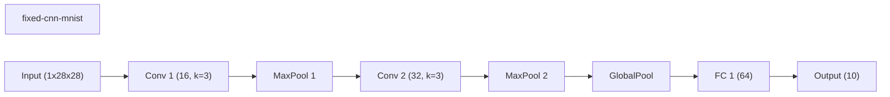

### wide-cnn-mnist-bn
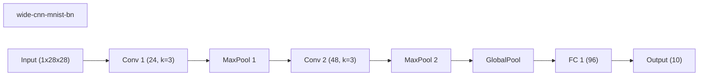

### dynamic-slimmable-mnist
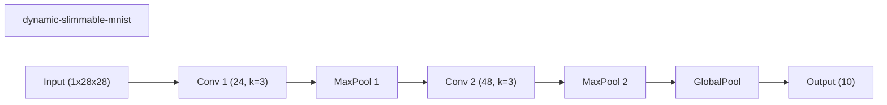

### conditional-computation-mnist
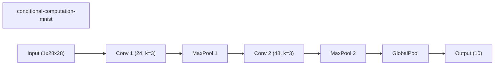

### channel-gating-mnist
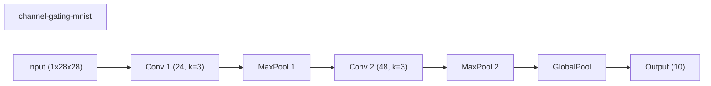

### skipnet-mnist
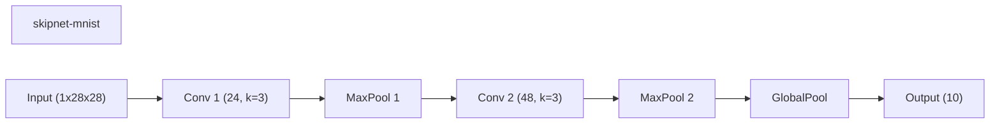

### instance-wise-sparsity-mnist
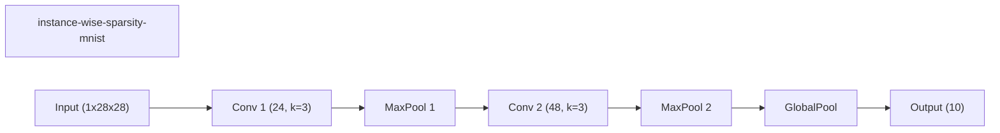

### iamnn-mnist
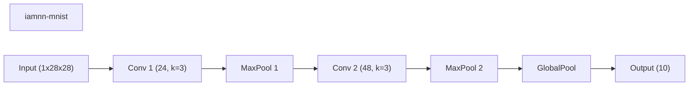

### network-slimming-mnist
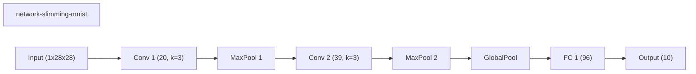

## Validation Accuracy By Epoch

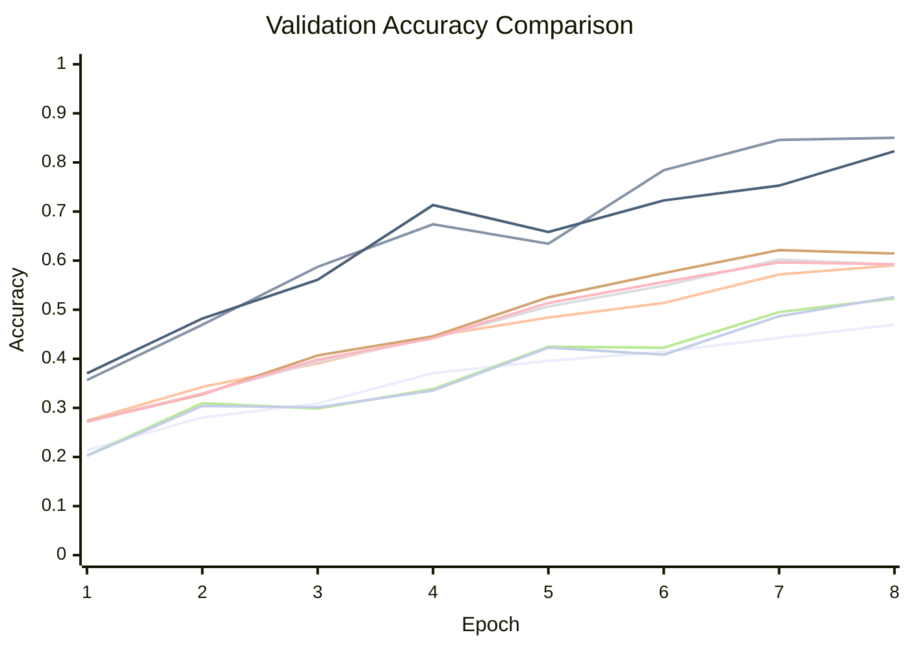
