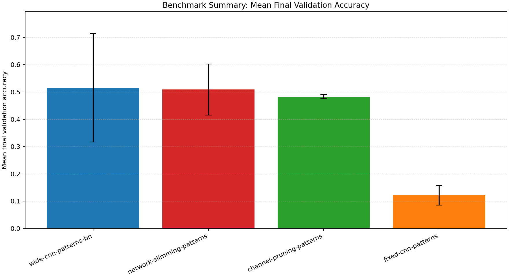
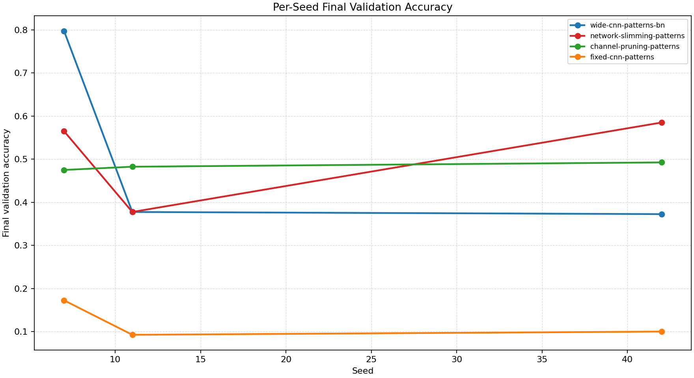
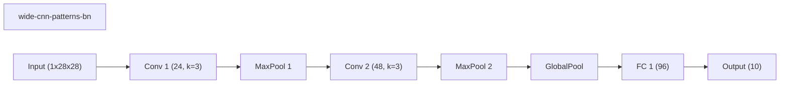
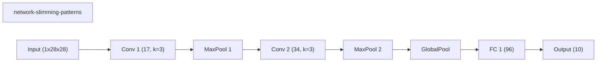
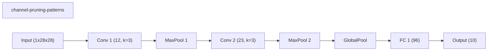
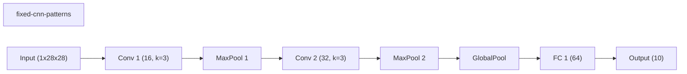

# Benchmark Summary

Seeds: 7, 11, 42

## Aggregate Plots

| Experiment | Type | Runs | Mean final val acc | Std final val acc | Mean best val acc | Mean adaptations | Mean final hidden dim | Best seed |
| --- | --- | ---: | ---: | ---: | ---: | ---: | ---: | ---: |
| wide-cnn-patterns-bn | baseline | 3 | 0.5158 | 0.1992 | 0.5225 | 0.00 | 0.0 | 7 |
| network-slimming-patterns | workflow | 3 | 0.5092 | 0.0935 | 0.5092 | 1.00 | 0.0 | 42 |
| channel-pruning-patterns | dynamic | 3 | 0.4833 | 0.0072 | 0.4900 | 5.00 | 0.0 | 42 |
| fixed-cnn-patterns | baseline | 3 | 0.1217 | 0.0361 | 0.1900 | 0.00 | 0.0 | 42 |

## Constraint Summary

| Experiment | Mean params | Mean nonzero params | Mean weight sparsity | Mean FLOP proxy | Mean activation elems |
| --- | ---: | ---: | ---: | ---: | ---: |
| wide-cnn-patterns-bn | 16474 | 16474 | 0.0000 | 4505914 | 7210 |
| network-slimming-patterns | 9838 | 9838 | 0.0000 | 2352616 | 5138 |
| channel-pruning-patterns | 5971 | 5971 | 0.0000 | 1194741 | 3608 |
| fixed-cnn-patterns | 7562 | 7562 | 0.0000 | 2061098 | 4810 |

## Experiment Notes

- `wide-cnn-patterns-bn`: device=cuda; requested_device=auto; torch=2.11.0+cu128; cuda_available=True; torch_cuda=12.8; cuda_device=NVIDIA GeForce RTX 4070 Laptop GPU
- `network-slimming-patterns`: workflow=network_slimming; device=cuda; requested_device=auto; torch=2.11.0+cu128; cuda_available=True; torch_cuda=12.8; cuda_device=NVIDIA GeForce RTX 4070 Laptop GPU
- `channel-pruning-patterns`: adaptation=channel_pruning; device=cuda; requested_device=auto; torch=2.11.0+cu128; cuda_available=True; torch_cuda=12.8; cuda_device=NVIDIA GeForce RTX 4070 Laptop GPU
- `fixed-cnn-patterns`: device=cuda; requested_device=auto; torch=2.11.0+cu128; cuda_available=True; torch_cuda=12.8; cuda_device=NVIDIA GeForce RTX 4070 Laptop GPU

## Per-Seed Results

### wide-cnn-patterns-bn
- seed 7: final=0.7975, best=0.7975, adaptations=0, params=16474, nonzero=16474, sparsity=0.0000
- seed 11: final=0.3775, best=0.3775, adaptations=0, params=16474, nonzero=16474, sparsity=0.0000
- seed 42: final=0.3725, best=0.3925, adaptations=0, params=16474, nonzero=16474, sparsity=0.0000

### network-slimming-patterns
- seed 7: final=0.5650, best=0.5650, adaptations=1, params=9838, nonzero=9838, sparsity=0.0000
- seed 11: final=0.3775, best=0.3775, adaptations=1, params=9838, nonzero=9838, sparsity=0.0000
- seed 42: final=0.5850, best=0.5850, adaptations=1, params=9838, nonzero=9838, sparsity=0.0000

### channel-pruning-patterns
- seed 7: final=0.4750, best=0.4750, adaptations=5, params=5971, nonzero=5971, sparsity=0.0000
- seed 11: final=0.4825, best=0.4825, adaptations=5, params=5971, nonzero=5971, sparsity=0.0000
- seed 42: final=0.4925, best=0.5125, adaptations=5, params=5971, nonzero=5971, sparsity=0.0000

### fixed-cnn-patterns
- seed 7: final=0.1725, best=0.1725, adaptations=0, params=7562, nonzero=7562, sparsity=0.0000
- seed 11: final=0.0925, best=0.1900, adaptations=0, params=7562, nonzero=7562, sparsity=0.0000
- seed 42: final=0.1000, best=0.2075, adaptations=0, params=7562, nonzero=7562, sparsity=0.0000

## Representative Stage Histories

### wide-cnn-patterns-bn (best seed 7)
- train: epochs=30, range=1..30, adaptation_enabled=False, final_val=0.79749995470047

### network-slimming-patterns (best seed 42)
- network_slimming_sparse_train: epochs=18, range=1..18, adaptation_enabled=False, final_val=0.3425000011920929
- network_slimming_finetune: epochs=12, range=19..30, adaptation_enabled=False, final_val=0.5849999785423279

### channel-pruning-patterns (best seed 42)
- train: epochs=30, range=1..30, adaptation_enabled=True, final_val=0.492499977350235

### fixed-cnn-patterns (best seed 42)
- train: epochs=25, range=1..25, adaptation_enabled=False, final_val=0.09999999403953552

## Representative Architectures

### wide-cnn-patterns-bn (best seed 7)

### network-slimming-patterns (best seed 42)

### channel-pruning-patterns (best seed 42)

### fixed-cnn-patterns (best seed 42)

