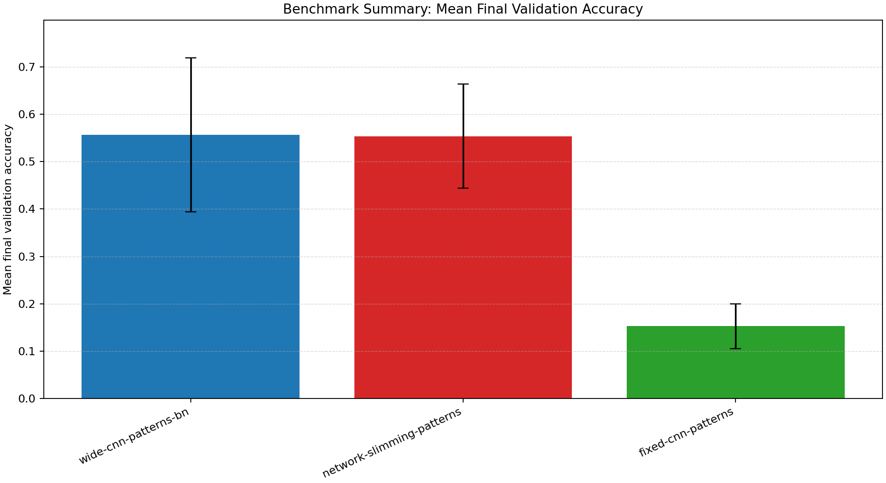
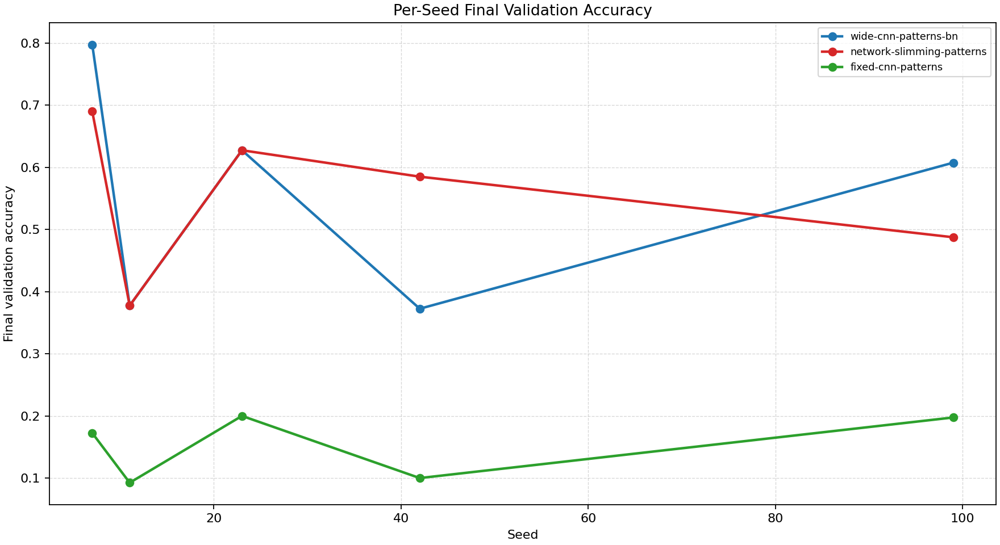
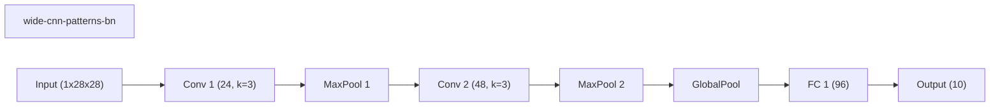
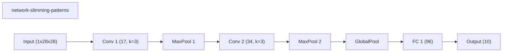
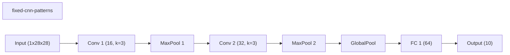

# Benchmark Summary

Seeds: 7, 11, 23, 42, 99

## Aggregate Plots

| Experiment | Type | Runs | Mean final val acc | Std final val acc | Mean best val acc | Mean adaptations | Mean final hidden dim | Best seed |
| --- | --- | ---: | ---: | ---: | ---: | ---: | ---: | ---: |
| wide-cnn-patterns-bn | baseline | 5 | 0.5565 | 0.1622 | 0.5605 | 0.00 | - | 7 |
| network-slimming-patterns | workflow | 5 | 0.5535 | 0.1099 | 0.5535 | 1.00 | - | 7 |
| fixed-cnn-patterns | baseline | 5 | 0.1525 | 0.0470 | 0.2125 | 0.00 | - | 23 |

## Constraint Summary

| Experiment | Mean params | Mean nonzero params | Mean weight sparsity | Mean FLOP proxy | Mean activation elems |
| --- | ---: | ---: | ---: | ---: | ---: |
| wide-cnn-patterns-bn | 16474 | 16474 | 0.0000 | 4505914 | 7210 |
| network-slimming-patterns | 9838 | 9838 | 0.0000 | 2352616 | 5138 |
| fixed-cnn-patterns | 7562 | 7562 | 0.0000 | 2061098 | 4810 |

## Experiment Notes

- `wide-cnn-patterns-bn`: device=cpu; requested_device=auto; torch=2.11.0+cpu; cuda_available=False
- `network-slimming-patterns`: workflow=network_slimming; device=cpu; requested_device=auto; torch=2.11.0+cpu; cuda_available=False
- `fixed-cnn-patterns`: device=cpu; requested_device=auto; torch=2.11.0+cpu; cuda_available=False

## Per-Seed Results

### wide-cnn-patterns-bn
- seed 7: final=0.7975, best=0.7975, adaptations=0, params=16474, nonzero=16474, sparsity=0.0000
- seed 11: final=0.3775, best=0.3775, adaptations=0, params=16474, nonzero=16474, sparsity=0.0000
- seed 23: final=0.6275, best=0.6275, adaptations=0, params=16474, nonzero=16474, sparsity=0.0000
- seed 42: final=0.3725, best=0.3925, adaptations=0, params=16474, nonzero=16474, sparsity=0.0000
- seed 99: final=0.6075, best=0.6075, adaptations=0, params=16474, nonzero=16474, sparsity=0.0000

### network-slimming-patterns
- seed 7: final=0.6900, best=0.6900, adaptations=1, params=9838, nonzero=9838, sparsity=0.0000
- seed 11: final=0.3775, best=0.3775, adaptations=1, params=9838, nonzero=9838, sparsity=0.0000
- seed 23: final=0.6275, best=0.6275, adaptations=1, params=9838, nonzero=9838, sparsity=0.0000
- seed 42: final=0.5850, best=0.5850, adaptations=1, params=9838, nonzero=9838, sparsity=0.0000
- seed 99: final=0.4875, best=0.4875, adaptations=1, params=9838, nonzero=9838, sparsity=0.0000

### fixed-cnn-patterns
- seed 7: final=0.1725, best=0.1725, adaptations=0, params=7562, nonzero=7562, sparsity=0.0000
- seed 11: final=0.0925, best=0.1900, adaptations=0, params=7562, nonzero=7562, sparsity=0.0000
- seed 23: final=0.2000, best=0.2950, adaptations=0, params=7562, nonzero=7562, sparsity=0.0000
- seed 42: final=0.1000, best=0.2075, adaptations=0, params=7562, nonzero=7562, sparsity=0.0000
- seed 99: final=0.1975, best=0.1975, adaptations=0, params=7562, nonzero=7562, sparsity=0.0000

## Representative Stage Histories

### wide-cnn-patterns-bn (best seed 7)
- train: epochs=30, range=1..30, adaptation_enabled=False, final_val=0.7975000143051147

### network-slimming-patterns (best seed 7)
- network_slimming_sparse_train: epochs=18, range=1..18, adaptation_enabled=False, final_val=0.47749999165534973
- network_slimming_finetune: epochs=12, range=19..30, adaptation_enabled=False, final_val=0.6899999976158142

### fixed-cnn-patterns (best seed 23)
- train: epochs=25, range=1..25, adaptation_enabled=False, final_val=0.20000000298023224

## Representative Architectures

### wide-cnn-patterns-bn (best seed 7)

### network-slimming-patterns (best seed 7)

### fixed-cnn-patterns (best seed 23)

