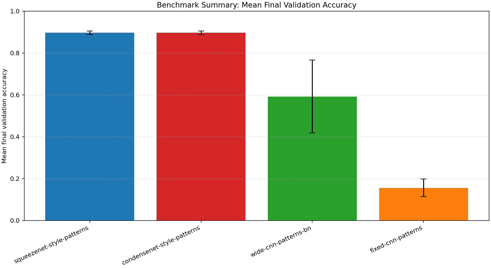
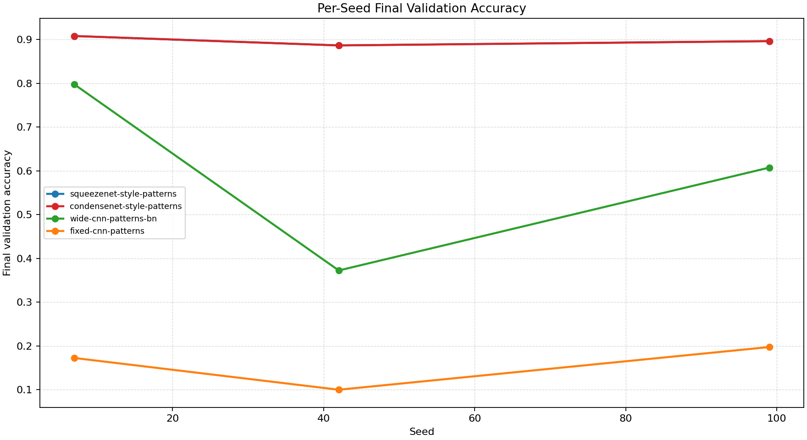
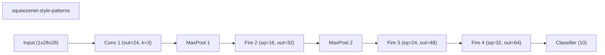
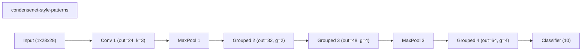
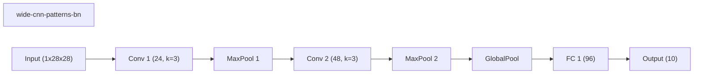
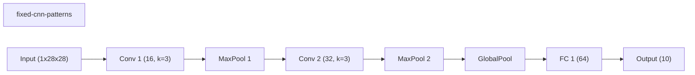

# Benchmark Summary

Seeds: 7, 42, 99

## Aggregate Plots

| Experiment | Type | Runs | Mean final val acc | Std final val acc | Mean best val acc | Mean adaptations | Mean final hidden dim | Best seed |
| --- | --- | ---: | ---: | ---: | ---: | ---: | ---: | ---: |
| squeezenet-style-patterns | baseline | 3 | 0.8971 | 0.0088 | 0.9043 | 0.00 | - | 99 |
| condensenet-style-patterns | baseline | 3 | 0.8971 | 0.0088 | 0.8971 | 0.00 | - | 7 |
| wide-cnn-patterns-bn | baseline | 3 | 0.5925 | 0.1738 | 0.5992 | 0.00 | 0.0 | 7 |
| fixed-cnn-patterns | baseline | 3 | 0.1567 | 0.0413 | 0.1925 | 0.00 | 0.0 | 42 |

## Constraint Summary

| Experiment | Mean params | Mean nonzero params | Mean weight sparsity | Mean FLOP proxy | Mean activation elems |
| --- | ---: | ---: | ---: | ---: | ---: |
| squeezenet-style-patterns | 22354 | 22354 | 0.0000 | 1292032 | 36466 |
| condensenet-style-patterns | 22034 | 22034 | 0.0000 | 5457920 | 37642 |
| wide-cnn-patterns-bn | 16474 | 16474 | 0.0000 | 4505914 | 7210 |
| fixed-cnn-patterns | 7562 | 7562 | 0.0000 | 2061098 | 4810 |

## Experiment Notes

- `squeezenet-style-patterns`: device=cuda; requested_device=auto; torch=2.11.0+cu128; cuda_available=True; torch_cuda=12.8; cuda_device=NVIDIA GeForce RTX 4070 Laptop GPU
- `condensenet-style-patterns`: device=cuda; requested_device=auto; torch=2.11.0+cu128; cuda_available=True; torch_cuda=12.8; cuda_device=NVIDIA GeForce RTX 4070 Laptop GPU
- `wide-cnn-patterns-bn`: device=cuda; requested_device=auto; torch=2.11.0+cu128; cuda_available=True; torch_cuda=12.8; cuda_device=NVIDIA GeForce RTX 4070 Laptop GPU
- `fixed-cnn-patterns`: device=cuda; requested_device=auto; torch=2.11.0+cu128; cuda_available=True; torch_cuda=12.8; cuda_device=NVIDIA GeForce RTX 4070 Laptop GPU

## Per-Seed Results

### squeezenet-style-patterns
- seed 7: final=0.9082, best=0.9082, adaptations=0, params=22354, nonzero=22354, sparsity=0.0000
- seed 42: final=0.8867, best=0.8867, adaptations=0, params=22354, nonzero=22354, sparsity=0.0000
- seed 99: final=0.8965, best=0.9180, adaptations=0, params=22354, nonzero=22354, sparsity=0.0000

### condensenet-style-patterns
- seed 7: final=0.9082, best=0.9082, adaptations=0, params=22034, nonzero=22034, sparsity=0.0000
- seed 42: final=0.8867, best=0.8867, adaptations=0, params=22034, nonzero=22034, sparsity=0.0000
- seed 99: final=0.8965, best=0.8965, adaptations=0, params=22034, nonzero=22034, sparsity=0.0000

### wide-cnn-patterns-bn
- seed 7: final=0.7975, best=0.7975, adaptations=0, params=16474, nonzero=16474, sparsity=0.0000
- seed 42: final=0.3725, best=0.3925, adaptations=0, params=16474, nonzero=16474, sparsity=0.0000
- seed 99: final=0.6075, best=0.6075, adaptations=0, params=16474, nonzero=16474, sparsity=0.0000

### fixed-cnn-patterns
- seed 7: final=0.1725, best=0.1725, adaptations=0, params=7562, nonzero=7562, sparsity=0.0000
- seed 42: final=0.1000, best=0.2075, adaptations=0, params=7562, nonzero=7562, sparsity=0.0000
- seed 99: final=0.1975, best=0.1975, adaptations=0, params=7562, nonzero=7562, sparsity=0.0000

## Representative Stage Histories

### squeezenet-style-patterns (best seed 99)
- train: epochs=8, range=1..8, adaptation_enabled=False, final_val=0.896484375

### condensenet-style-patterns (best seed 7)
- train: epochs=8, range=1..8, adaptation_enabled=False, final_val=0.908203125

### wide-cnn-patterns-bn (best seed 7)
- train: epochs=30, range=1..30, adaptation_enabled=False, final_val=0.79749995470047

### fixed-cnn-patterns (best seed 42)
- train: epochs=25, range=1..25, adaptation_enabled=False, final_val=0.09999999403953552

## Representative Architectures

### squeezenet-style-patterns (best seed 99)

### condensenet-style-patterns (best seed 7)

### wide-cnn-patterns-bn (best seed 7)

### fixed-cnn-patterns (best seed 42)

