# Benchmark Summary

Seeds: 7, 11, 23, 42, 99

## Aggregate Plots

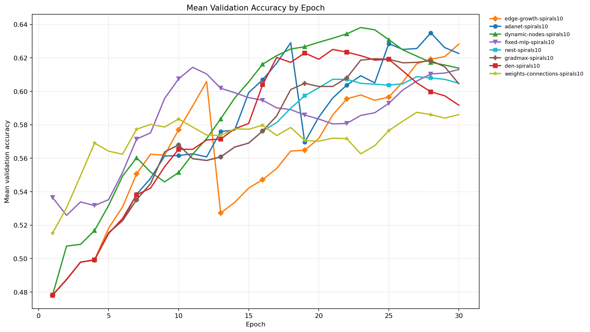

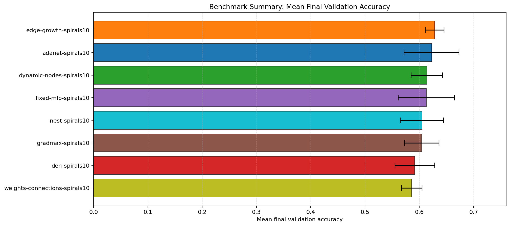

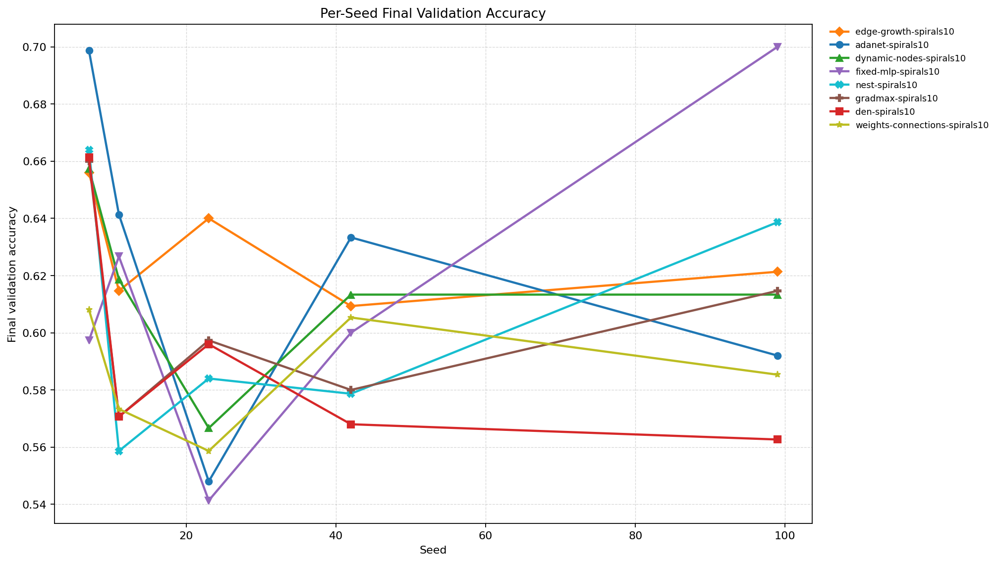

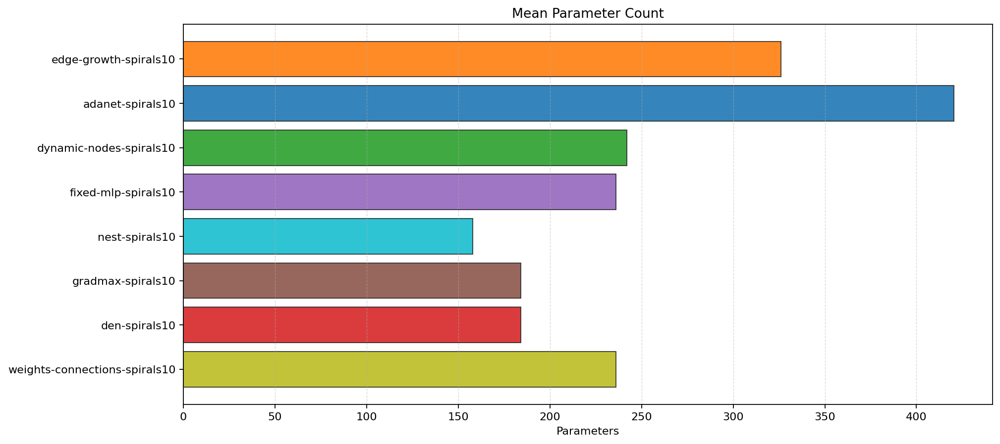

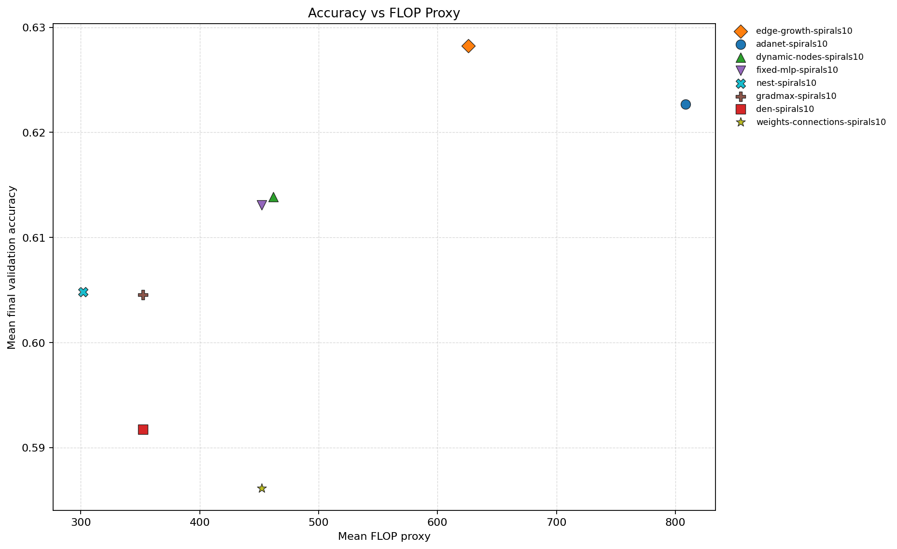

| Experiment | Type | Runs | Mean final val acc | Std final val acc | Mean best val acc | Mean adaptations | Mean final hidden dim | Best seed |
| --- | --- | ---: | ---: | ---: | ---: | ---: | ---: | ---: |
| edge-growth-spirals10 | dynamic | 5 | 0.6283 | 0.0173 | 0.6496 | 3.00 | 14.0 | 99 |
| adanet-spirals10 | workflow | 5 | 0.6227 | 0.0505 | 0.6664 | 3.00 | 16.4 | 7 |
| dynamic-nodes-spirals10 | dynamic | 5 | 0.6139 | 0.0288 | 0.6475 | 1.00 | 10.0 | 7 |
| fixed-mlp-spirals10 | baseline | 5 | 0.6131 | 0.0516 | 0.6603 | 0.00 | - | 99 |
| nest-spirals10 | dynamic | 5 | 0.6048 | 0.0397 | 0.6229 | 1.00 | 12.0 | 7 |
| gradmax-spirals10 | dynamic | 5 | 0.6045 | 0.0316 | 0.6293 | 2.00 | 14.0 | 7 |
| den-spirals10 | dynamic | 5 | 0.5917 | 0.0366 | 0.6397 | 2.00 | 14.0 | 7 |
| weights-connections-spirals10 | dynamic | 5 | 0.5861 | 0.0188 | 0.5989 | 6.00 | 18.0 | 7 |

## Accuracy-FLOP Pareto Frontier

- `nest-spirals10`: acc=0.6048, flop_proxy=302, params=158
- `fixed-mlp-spirals10`: acc=0.6131, flop_proxy=452, params=236
- `dynamic-nodes-spirals10`: acc=0.6139, flop_proxy=462, params=242
- `edge-growth-spirals10`: acc=0.6283, flop_proxy=626, params=326

## Constraint Summary

| Experiment | Mean params | Mean nonzero params | Mean weight sparsity | Mean FLOP proxy | Mean activation elems |
| --- | ---: | ---: | ---: | ---: | ---: |
| edge-growth-spirals10 | 326 | 326 | 0.0000 | 626 | 26 |
| adanet-spirals10 | 420 | 420 | 0.0000 | 808 | 32 |
| dynamic-nodes-spirals10 | 242 | 242 | 0.0000 | 462 | 22 |
| fixed-mlp-spirals10 | 236 | 236 | 0.0000 | 452 | 20 |
| nest-spirals10 | 158 | 158 | 0.0000 | 302 | 14 |
| gradmax-spirals10 | 184 | 184 | 0.0000 | 352 | 16 |
| den-spirals10 | 184 | 184 | 0.0000 | 352 | 16 |
| weights-connections-spirals10 | 236 | 134 | 0.4722 | 452 | 20 |

## Experiment Notes

- `edge-growth-spirals10`: adaptation=edge_growth; device=cuda; requested_device=auto; torch=2.11.0+cu128; cuda_available=True; torch_cuda=12.8; cuda_device=NVIDIA GeForce RTX 4070 Laptop GPU
- `adanet-spirals10`: workflow=adanet_rounds; device=cuda; requested_device=auto; torch=2.11.0+cu128; cuda_available=True; torch_cuda=12.8; cuda_device=NVIDIA GeForce RTX 4070 Laptop GPU
- `dynamic-nodes-spirals10`: adaptation=dynamic_nodes; device=cuda; requested_device=auto; torch=2.11.0+cu128; cuda_available=True; torch_cuda=12.8; cuda_device=NVIDIA GeForce RTX 4070 Laptop GPU
- `fixed-mlp-spirals10`: device=cuda; requested_device=auto; torch=2.11.0+cu128; cuda_available=True; torch_cuda=12.8; cuda_device=NVIDIA GeForce RTX 4070 Laptop GPU
- `nest-spirals10`: adaptation=nest; device=cuda; requested_device=auto; torch=2.11.0+cu128; cuda_available=True; torch_cuda=12.8; cuda_device=NVIDIA GeForce RTX 4070 Laptop GPU
- `gradmax-spirals10`: adaptation=gradmax; device=cuda; requested_device=auto; torch=2.11.0+cu128; cuda_available=True; torch_cuda=12.8; cuda_device=NVIDIA GeForce RTX 4070 Laptop GPU
- `den-spirals10`: adaptation=den; device=cuda; requested_device=auto; torch=2.11.0+cu128; cuda_available=True; torch_cuda=12.8; cuda_device=NVIDIA GeForce RTX 4070 Laptop GPU
- `weights-connections-spirals10`: adaptation=weights_connections; workflow=scheduled; device=cuda; requested_device=auto; torch=2.11.0+cu128; cuda_available=True; torch_cuda=12.8; cuda_device=NVIDIA GeForce RTX 4070 Laptop GPU

## Per-Seed Results

### edge-growth-spirals10
- seed 7: final=0.6560, best=0.6813, adaptations=3, params=326, nonzero=326, sparsity=0.0000
- seed 11: final=0.6147, best=0.6293, adaptations=3, params=326, nonzero=326, sparsity=0.0000
- seed 23: final=0.6400, best=0.6400, adaptations=3, params=326, nonzero=326, sparsity=0.0000
- seed 42: final=0.6093, best=0.6093, adaptations=3, params=326, nonzero=326, sparsity=0.0000
- seed 99: final=0.6213, best=0.6880, adaptations=3, params=326, nonzero=326, sparsity=0.0000

### adanet-spirals10
- seed 7: final=0.6987, best=0.6987, adaptations=3, params=410, nonzero=410, sparsity=0.0000
- seed 11: final=0.6413, best=0.6507, adaptations=3, params=410, nonzero=410, sparsity=0.0000
- seed 23: final=0.5480, best=0.6560, adaptations=3, params=436, nonzero=436, sparsity=0.0000
- seed 42: final=0.6333, best=0.6493, adaptations=3, params=410, nonzero=410, sparsity=0.0000
- seed 99: final=0.5920, best=0.6773, adaptations=3, params=436, nonzero=436, sparsity=0.0000

### dynamic-nodes-spirals10
- seed 7: final=0.6573, best=0.7000, adaptations=1, params=242, nonzero=242, sparsity=0.0000
- seed 11: final=0.6187, best=0.6387, adaptations=1, params=242, nonzero=242, sparsity=0.0000
- seed 23: final=0.5667, best=0.6413, adaptations=1, params=242, nonzero=242, sparsity=0.0000
- seed 42: final=0.6133, best=0.6400, adaptations=1, params=242, nonzero=242, sparsity=0.0000
- seed 99: final=0.6133, best=0.6173, adaptations=1, params=242, nonzero=242, sparsity=0.0000

### fixed-mlp-spirals10
- seed 7: final=0.5973, best=0.6680, adaptations=0, params=236, nonzero=236, sparsity=0.0000
- seed 11: final=0.6267, best=0.6400, adaptations=0, params=236, nonzero=236, sparsity=0.0000
- seed 23: final=0.5413, best=0.6453, adaptations=0, params=236, nonzero=236, sparsity=0.0000
- seed 42: final=0.6000, best=0.6480, adaptations=0, params=236, nonzero=236, sparsity=0.0000
- seed 99: final=0.7000, best=0.7000, adaptations=0, params=236, nonzero=236, sparsity=0.0000

### nest-spirals10
- seed 7: final=0.6640, best=0.6947, adaptations=1, params=158, nonzero=158, sparsity=0.0000
- seed 11: final=0.5587, best=0.5960, adaptations=1, params=158, nonzero=158, sparsity=0.0000
- seed 23: final=0.5840, best=0.5947, adaptations=1, params=158, nonzero=158, sparsity=0.0000
- seed 42: final=0.5787, best=0.5907, adaptations=1, params=158, nonzero=158, sparsity=0.0000
- seed 99: final=0.6387, best=0.6387, adaptations=1, params=158, nonzero=158, sparsity=0.0000

### gradmax-spirals10
- seed 7: final=0.6600, best=0.6947, adaptations=2, params=184, nonzero=184, sparsity=0.0000
- seed 11: final=0.5707, best=0.6120, adaptations=2, params=184, nonzero=184, sparsity=0.0000
- seed 23: final=0.5973, best=0.5973, adaptations=2, params=184, nonzero=184, sparsity=0.0000
- seed 42: final=0.5800, best=0.6013, adaptations=2, params=184, nonzero=184, sparsity=0.0000
- seed 99: final=0.6147, best=0.6413, adaptations=2, params=184, nonzero=184, sparsity=0.0000

### den-spirals10
- seed 7: final=0.6613, best=0.6960, adaptations=2, params=184, nonzero=184, sparsity=0.0000
- seed 11: final=0.5707, best=0.6080, adaptations=2, params=184, nonzero=184, sparsity=0.0000
- seed 23: final=0.5960, best=0.5987, adaptations=2, params=184, nonzero=184, sparsity=0.0000
- seed 42: final=0.5680, best=0.6520, adaptations=2, params=184, nonzero=184, sparsity=0.0000
- seed 99: final=0.5627, best=0.6440, adaptations=2, params=184, nonzero=184, sparsity=0.0000

### weights-connections-spirals10
- seed 7: final=0.6080, best=0.6253, adaptations=6, params=236, nonzero=134, sparsity=0.4722
- seed 11: final=0.5733, best=0.5880, adaptations=6, params=236, nonzero=134, sparsity=0.4722
- seed 23: final=0.5587, best=0.5693, adaptations=6, params=236, nonzero=134, sparsity=0.4722
- seed 42: final=0.6053, best=0.6107, adaptations=6, params=236, nonzero=134, sparsity=0.4722
- seed 99: final=0.5853, best=0.6013, adaptations=6, params=236, nonzero=134, sparsity=0.4722

## Representative Stage Histories

### edge-growth-spirals10 (best seed 99)
- train: epochs=30, range=1..30, adaptation_enabled=True, final_val=0.6213333010673523

### adanet-spirals10 (best seed 7)
- adanet_warmup: epochs=6, range=1..6, adaptation_enabled=False, final_val=0.6146666407585144
- adanet_round_1: epochs=6, range=7..12, adaptation_enabled=False, final_val=0.6746666431427002
- adanet_round_2: epochs=6, range=13..18, adaptation_enabled=False, final_val=0.6946666836738586
- adanet_round_3: epochs=6, range=19..24, adaptation_enabled=False, final_val=0.5706666707992554
- adanet_consolidate: epochs=6, range=25..30, adaptation_enabled=False, final_val=0.6986666321754456

### dynamic-nodes-spirals10 (best seed 7)
- train: epochs=30, range=1..30, adaptation_enabled=True, final_val=0.6573333144187927

### fixed-mlp-spirals10 (best seed 99)
- train: epochs=30, range=1..30, adaptation_enabled=False, final_val=0.699999988079071

### nest-spirals10 (best seed 7)
- train: epochs=30, range=1..30, adaptation_enabled=True, final_val=0.6639999747276306

### gradmax-spirals10 (best seed 7)
- train: epochs=30, range=1..30, adaptation_enabled=True, final_val=0.6599999666213989

### den-spirals10 (best seed 7)
- train: epochs=30, range=1..30, adaptation_enabled=True, final_val=0.6613333225250244

### weights-connections-spirals10 (best seed 7)
- dense_warmup: epochs=8, range=1..8, adaptation_enabled=False, final_val=0.5999999642372131
- prune: epochs=12, range=9..20, adaptation_enabled=True, final_val=0.5920000076293945
- finetune: epochs=10, range=21..30, adaptation_enabled=False, final_val=0.6079999804496765

## Representative Architectures

### edge-growth-spirals10 (best seed 99)
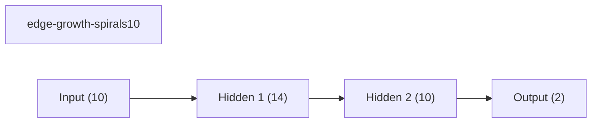

### adanet-spirals10 (best seed 7)
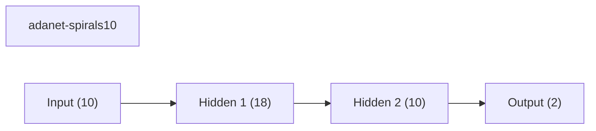

### dynamic-nodes-spirals10 (best seed 7)
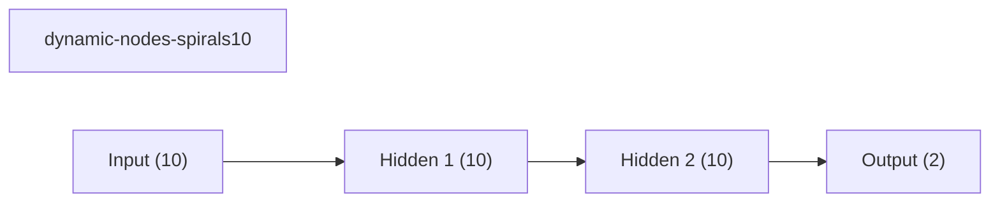

### fixed-mlp-spirals10 (best seed 99)
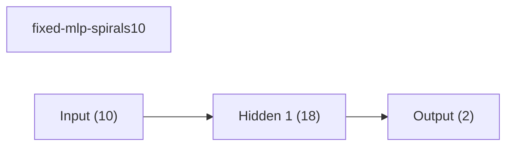

### nest-spirals10 (best seed 7)
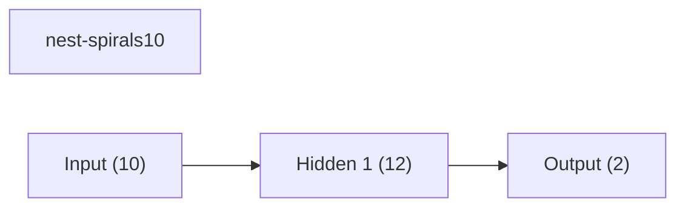

### gradmax-spirals10 (best seed 7)
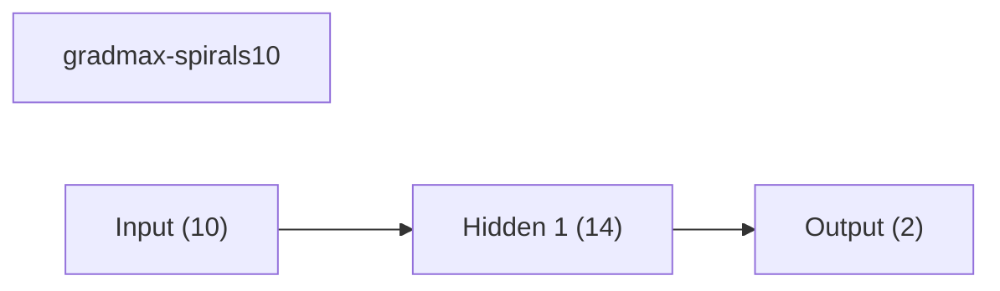

### den-spirals10 (best seed 7)
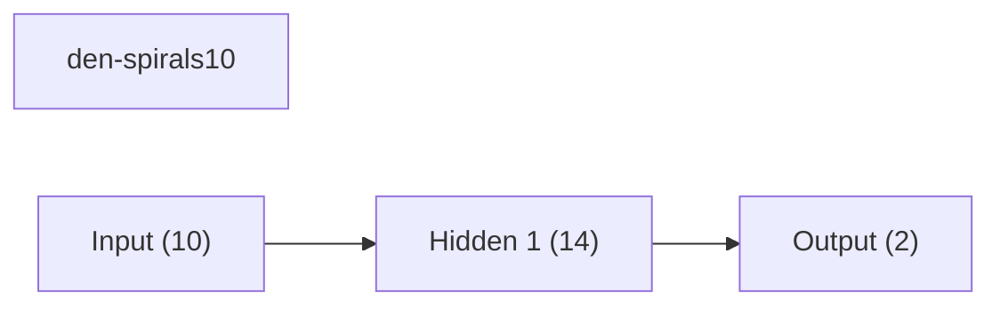

### weights-connections-spirals10 (best seed 7)
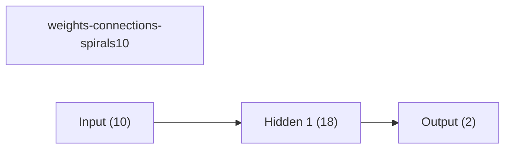
