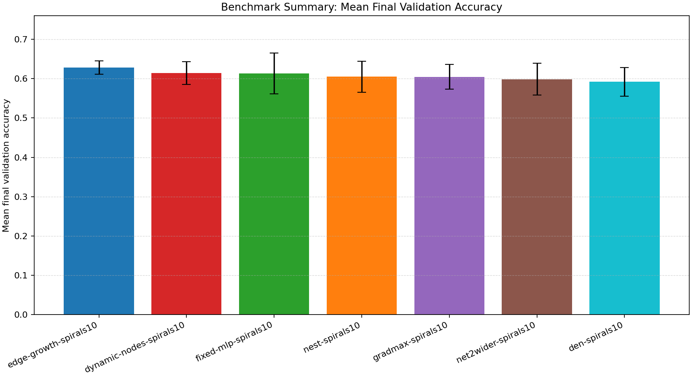
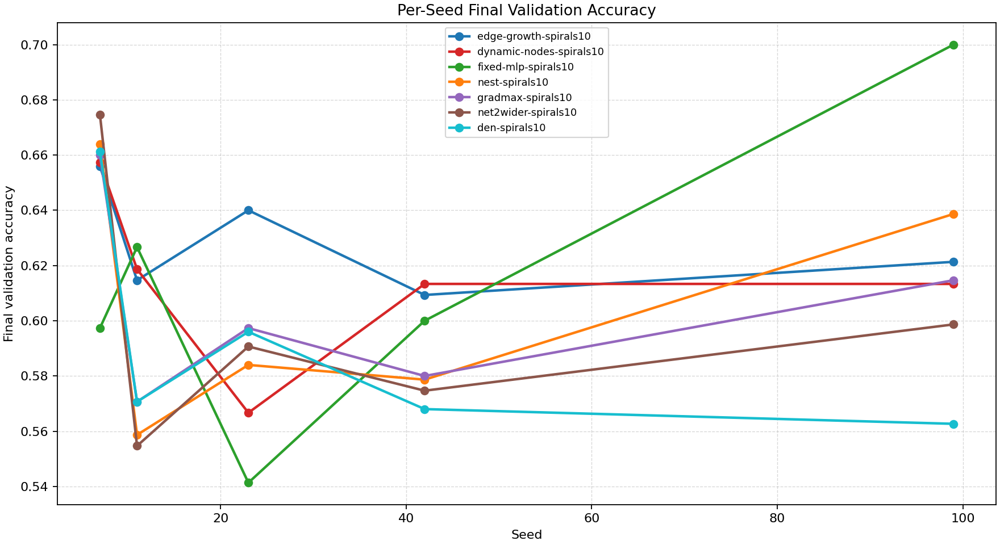
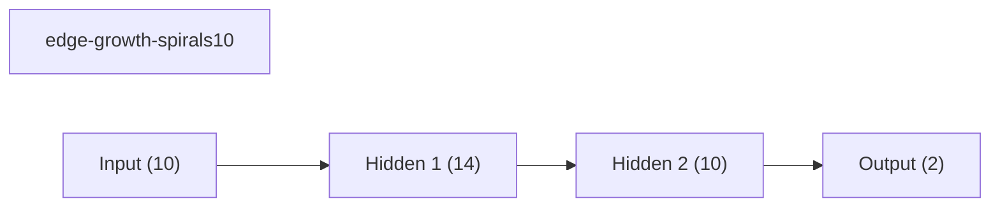
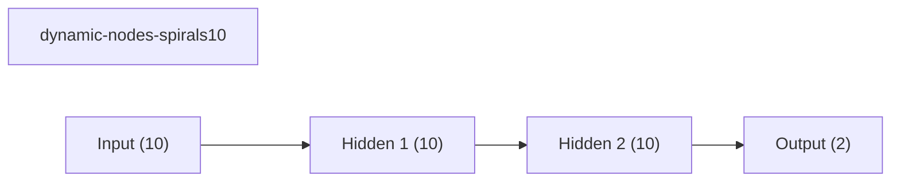
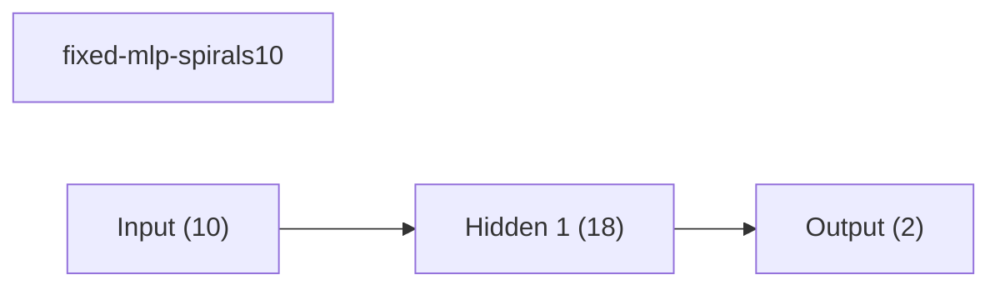
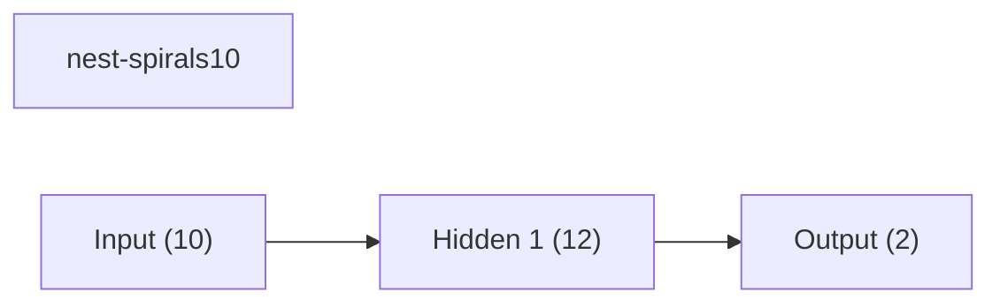
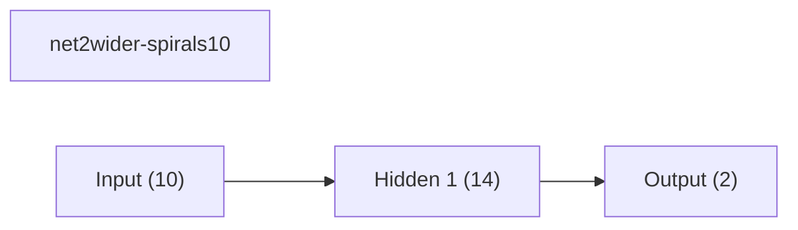
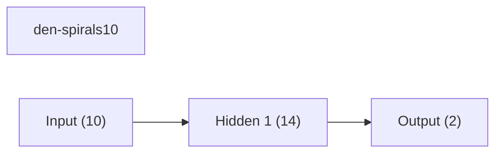

# Benchmark Summary

Seeds: 7, 11, 23, 42, 99

## Aggregate Plots

| Experiment | Type | Runs | Mean final val acc | Std final val acc | Mean best val acc | Mean adaptations | Mean final hidden dim | Best seed |
| --- | --- | ---: | ---: | ---: | ---: | ---: | ---: | ---: |
| edge-growth-spirals10 | dynamic | 5 | 0.6283 | 0.0173 | 0.6496 | 3.00 | 14.0 | 99 |
| dynamic-nodes-spirals10 | dynamic | 5 | 0.6139 | 0.0288 | 0.6475 | 1.00 | 10.0 | 7 |
| fixed-mlp-spirals10 | baseline | 5 | 0.6131 | 0.0516 | 0.6603 | 0.00 | - | 99 |
| nest-spirals10 | dynamic | 5 | 0.6048 | 0.0397 | 0.6229 | 1.00 | 12.0 | 7 |
| gradmax-spirals10 | dynamic | 5 | 0.6045 | 0.0316 | 0.6293 | 2.00 | 14.0 | 7 |
| net2wider-spirals10 | dynamic | 5 | 0.5987 | 0.0409 | 0.6173 | 1.00 | 14.0 | 7 |
| den-spirals10 | dynamic | 5 | 0.5917 | 0.0366 | 0.6397 | 2.00 | 14.0 | 7 |

## Per-Seed Results

### edge-growth-spirals10
- seed 7: final=0.6560, best=0.6813, adaptations=3
- seed 11: final=0.6147, best=0.6293, adaptations=3
- seed 23: final=0.6400, best=0.6400, adaptations=3
- seed 42: final=0.6093, best=0.6093, adaptations=3
- seed 99: final=0.6213, best=0.6880, adaptations=3

### dynamic-nodes-spirals10
- seed 7: final=0.6573, best=0.7000, adaptations=1
- seed 11: final=0.6187, best=0.6387, adaptations=1
- seed 23: final=0.5667, best=0.6413, adaptations=1
- seed 42: final=0.6133, best=0.6400, adaptations=1
- seed 99: final=0.6133, best=0.6173, adaptations=1

### fixed-mlp-spirals10
- seed 7: final=0.5973, best=0.6680, adaptations=0
- seed 11: final=0.6267, best=0.6400, adaptations=0
- seed 23: final=0.5413, best=0.6453, adaptations=0
- seed 42: final=0.6000, best=0.6480, adaptations=0
- seed 99: final=0.7000, best=0.7000, adaptations=0

### nest-spirals10
- seed 7: final=0.6640, best=0.6947, adaptations=1
- seed 11: final=0.5587, best=0.5960, adaptations=1
- seed 23: final=0.5840, best=0.5947, adaptations=1
- seed 42: final=0.5787, best=0.5907, adaptations=1
- seed 99: final=0.6387, best=0.6387, adaptations=1

### gradmax-spirals10
- seed 7: final=0.6600, best=0.6947, adaptations=2
- seed 11: final=0.5707, best=0.6120, adaptations=2
- seed 23: final=0.5973, best=0.5973, adaptations=2
- seed 42: final=0.5800, best=0.6013, adaptations=2
- seed 99: final=0.6147, best=0.6413, adaptations=2

### net2wider-spirals10
- seed 7: final=0.6747, best=0.6920, adaptations=1
- seed 11: final=0.5547, best=0.5987, adaptations=1
- seed 23: final=0.5907, best=0.6013, adaptations=1
- seed 42: final=0.5747, best=0.5960, adaptations=1
- seed 99: final=0.5987, best=0.5987, adaptations=1

### den-spirals10
- seed 7: final=0.6613, best=0.6960, adaptations=2
- seed 11: final=0.5707, best=0.6080, adaptations=2
- seed 23: final=0.5960, best=0.5987, adaptations=2
- seed 42: final=0.5680, best=0.6520, adaptations=2
- seed 99: final=0.5627, best=0.6440, adaptations=2

## Representative Stage Histories

### edge-growth-spirals10 (best seed 99)
- train: epochs=30, range=1..30, adaptation_enabled=True, final_val=0.6213333606719971

### dynamic-nodes-spirals10 (best seed 7)
- train: epochs=30, range=1..30, adaptation_enabled=True, final_val=0.6573333144187927

### fixed-mlp-spirals10 (best seed 99)
- train: epochs=30, range=1..30, adaptation_enabled=False, final_val=0.699999988079071

### nest-spirals10 (best seed 7)
- train: epochs=30, range=1..30, adaptation_enabled=True, final_val=0.6639999747276306

### gradmax-spirals10 (best seed 7)
- train: epochs=30, range=1..30, adaptation_enabled=True, final_val=0.6600000262260437

### net2wider-spirals10 (best seed 7)
- train: epochs=30, range=1..30, adaptation_enabled=True, final_val=0.6746666431427002

### den-spirals10 (best seed 7)
- train: epochs=30, range=1..30, adaptation_enabled=True, final_val=0.6613333225250244

## Representative Architectures

### edge-growth-spirals10 (best seed 99)

### dynamic-nodes-spirals10 (best seed 7)

### fixed-mlp-spirals10 (best seed 99)

### nest-spirals10 (best seed 7)

### gradmax-spirals10 (best seed 7)

### net2wider-spirals10 (best seed 7)

### den-spirals10 (best seed 7)

