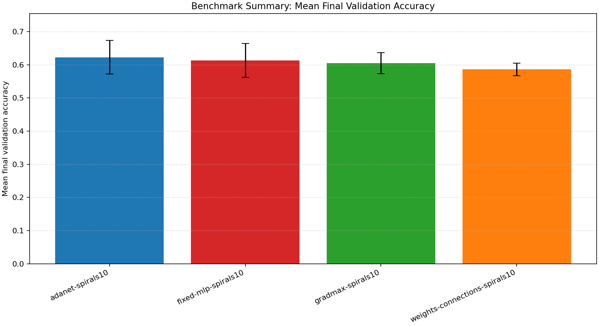
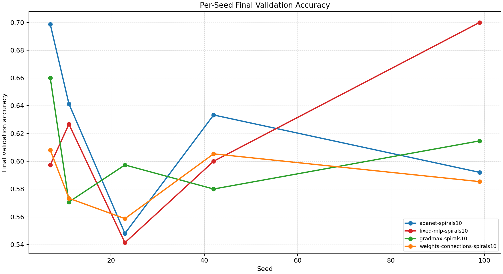
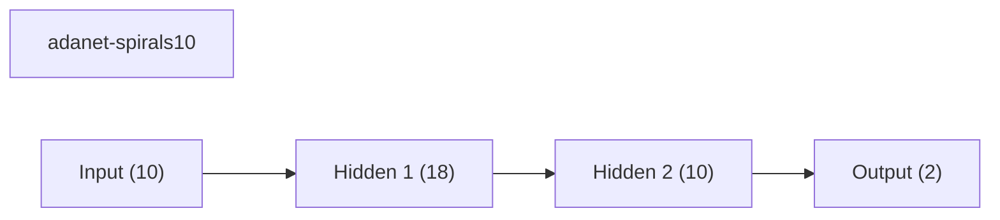
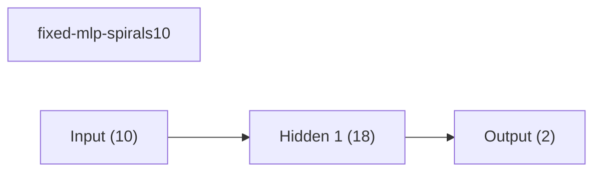
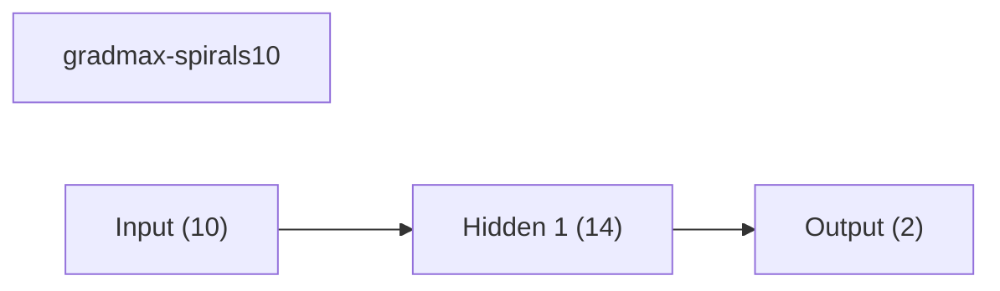
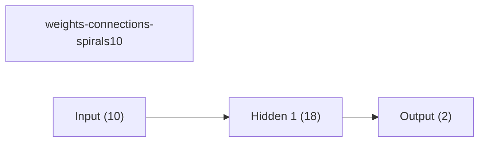

# Benchmark Summary

Seeds: 7, 11, 23, 42, 99

## Aggregate Plots

| Experiment | Type | Runs | Mean final val acc | Std final val acc | Mean best val acc | Mean adaptations | Mean final hidden dim | Best seed |
| --- | --- | ---: | ---: | ---: | ---: | ---: | ---: | ---: |
| adanet-spirals10 | workflow | 5 | 0.6227 | 0.0505 | 0.6664 | 3.00 | 16.4 | 7 |
| fixed-mlp-spirals10 | baseline | 5 | 0.6131 | 0.0516 | 0.6603 | 0.00 | - | 99 |
| gradmax-spirals10 | dynamic | 5 | 0.6045 | 0.0316 | 0.6293 | 2.00 | 14.0 | 7 |
| weights-connections-spirals10 | dynamic | 5 | 0.5861 | 0.0188 | 0.5989 | 6.00 | 18.0 | 7 |

## Experiment Notes

- `adanet-spirals10`: workflow=adanet_rounds; device=cpu; requested_device=auto; torch=2.10.0+cpu; cuda_available=False
- `fixed-mlp-spirals10`: device=cpu; requested_device=auto; torch=2.10.0+cpu; cuda_available=False
- `gradmax-spirals10`: adaptation=gradmax; device=cpu; requested_device=auto; torch=2.10.0+cpu; cuda_available=False
- `weights-connections-spirals10`: adaptation=weights_connections; workflow=scheduled; device=cpu; requested_device=auto; torch=2.10.0+cpu; cuda_available=False

## Per-Seed Results

### adanet-spirals10
- seed 7: final=0.6987, best=0.6987, adaptations=3
- seed 11: final=0.6413, best=0.6507, adaptations=3
- seed 23: final=0.5480, best=0.6560, adaptations=3
- seed 42: final=0.6333, best=0.6493, adaptations=3
- seed 99: final=0.5920, best=0.6773, adaptations=3

### fixed-mlp-spirals10
- seed 7: final=0.5973, best=0.6680, adaptations=0
- seed 11: final=0.6267, best=0.6400, adaptations=0
- seed 23: final=0.5413, best=0.6453, adaptations=0
- seed 42: final=0.6000, best=0.6480, adaptations=0
- seed 99: final=0.7000, best=0.7000, adaptations=0

### gradmax-spirals10
- seed 7: final=0.6600, best=0.6947, adaptations=2
- seed 11: final=0.5707, best=0.6120, adaptations=2
- seed 23: final=0.5973, best=0.5973, adaptations=2
- seed 42: final=0.5800, best=0.6013, adaptations=2
- seed 99: final=0.6147, best=0.6413, adaptations=2

### weights-connections-spirals10
- seed 7: final=0.6080, best=0.6253, adaptations=6
- seed 11: final=0.5733, best=0.5880, adaptations=6
- seed 23: final=0.5587, best=0.5693, adaptations=6
- seed 42: final=0.6053, best=0.6107, adaptations=6
- seed 99: final=0.5853, best=0.6013, adaptations=6

## Representative Stage Histories

### adanet-spirals10 (best seed 7)
- adanet_warmup: epochs=6, range=1..6, adaptation_enabled=False, final_val=0.6146666407585144
- adanet_round_1: epochs=6, range=7..12, adaptation_enabled=False, final_val=0.6746666431427002
- adanet_round_2: epochs=6, range=13..18, adaptation_enabled=False, final_val=0.6946666836738586
- adanet_round_3: epochs=6, range=19..24, adaptation_enabled=False, final_val=0.5706666707992554
- adanet_consolidate: epochs=6, range=25..30, adaptation_enabled=False, final_val=0.6986666917800903

### fixed-mlp-spirals10 (best seed 99)
- train: epochs=30, range=1..30, adaptation_enabled=False, final_val=0.699999988079071

### gradmax-spirals10 (best seed 7)
- train: epochs=30, range=1..30, adaptation_enabled=True, final_val=0.6600000262260437

### weights-connections-spirals10 (best seed 7)
- dense_warmup: epochs=8, range=1..8, adaptation_enabled=False, final_val=0.6000000238418579
- prune: epochs=12, range=9..20, adaptation_enabled=True, final_val=0.5920000076293945
- finetune: epochs=10, range=21..30, adaptation_enabled=False, final_val=0.6079999804496765

## Representative Architectures

### adanet-spirals10 (best seed 7)

### fixed-mlp-spirals10 (best seed 99)

### gradmax-spirals10 (best seed 7)

### weights-connections-spirals10 (best seed 7)

