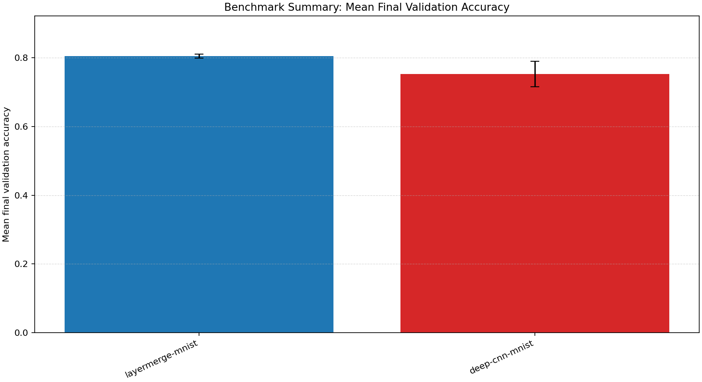
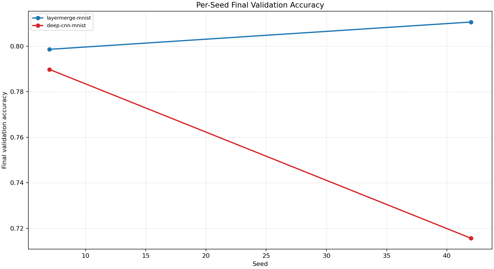
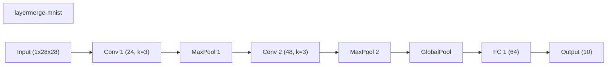
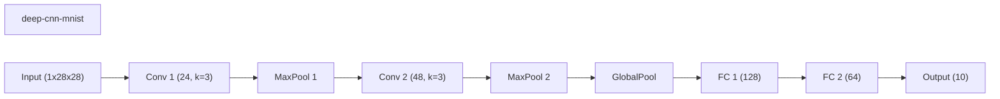

# Benchmark Summary

Seeds: 7, 42

## Aggregate Plots

| Experiment | Type | Runs | Mean final val acc | Std final val acc | Mean best val acc | Mean adaptations | Mean final hidden dim | Best seed |
| --- | --- | ---: | ---: | ---: | ---: | ---: | ---: | ---: |
| layermerge-mnist | workflow | 2 | 0.8046 | 0.0060 | 0.8046 | 1.00 | 0.0 | 42 |
| deep-cnn-mnist | baseline | 2 | 0.7527 | 0.0371 | 0.7927 | 0.00 | 0.0 | 42 |

## Constraint Summary

| Experiment | Mean params | Mean nonzero params | Mean weight sparsity | Mean FLOP proxy | Mean activation elems |
| --- | ---: | ---: | ---: | ---: | ---: |
| layermerge-mnist | 14586 | 14586 | 0.0000 | 4502170 | 7178 |
| deep-cnn-mnist | 25978 | 25978 | 0.0000 | 4524826 | 7306 |

## Experiment Notes

- `layermerge-mnist`: workflow=layermerge; device=cuda; requested_device=auto; torch=2.11.0+cu128; cuda_available=True; torch_cuda=12.8; cuda_device=NVIDIA GeForce RTX 4070 Laptop GPU
- `deep-cnn-mnist`: device=cuda; requested_device=auto; torch=2.11.0+cu128; cuda_available=True; torch_cuda=12.8; cuda_device=NVIDIA GeForce RTX 4070 Laptop GPU

## Per-Seed Results

### layermerge-mnist
- seed 7: final=0.7986, best=0.7986, adaptations=1, params=14586, nonzero=14586, sparsity=0.0000
- seed 42: final=0.8106, best=0.8106, adaptations=1, params=14586, nonzero=14586, sparsity=0.0000

### deep-cnn-mnist
- seed 7: final=0.7898, best=0.7898, adaptations=0, params=25978, nonzero=25978, sparsity=0.0000
- seed 42: final=0.7156, best=0.7956, adaptations=0, params=25978, nonzero=25978, sparsity=0.0000

## Representative Stage Histories

### layermerge-mnist (best seed 42)
- layermerge_pretrain: epochs=5, range=1..5, adaptation_enabled=False, final_val=0.6043999791145325
- layermerge_finetune: epochs=3, range=6..8, adaptation_enabled=False, final_val=0.8105999827384949

### deep-cnn-mnist (best seed 42)
- train: epochs=8, range=1..8, adaptation_enabled=False, final_val=0.7156000137329102

## Representative Architectures

### layermerge-mnist (best seed 42)

### deep-cnn-mnist (best seed 42)

