# Benchmark Summary

Seeds: 7, 42

## Aggregate Plots

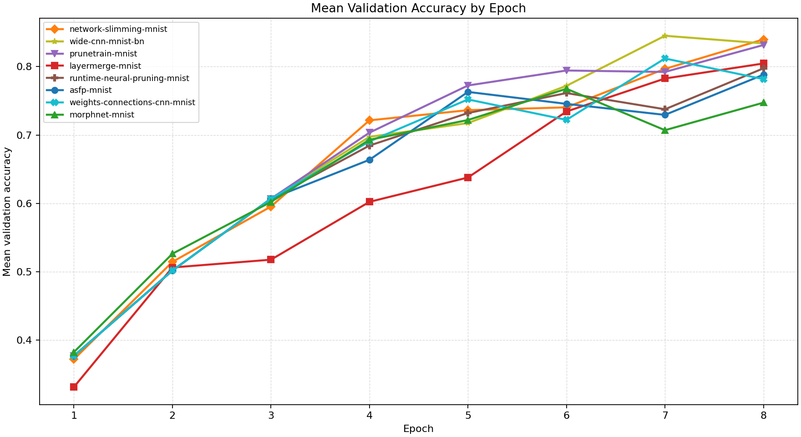

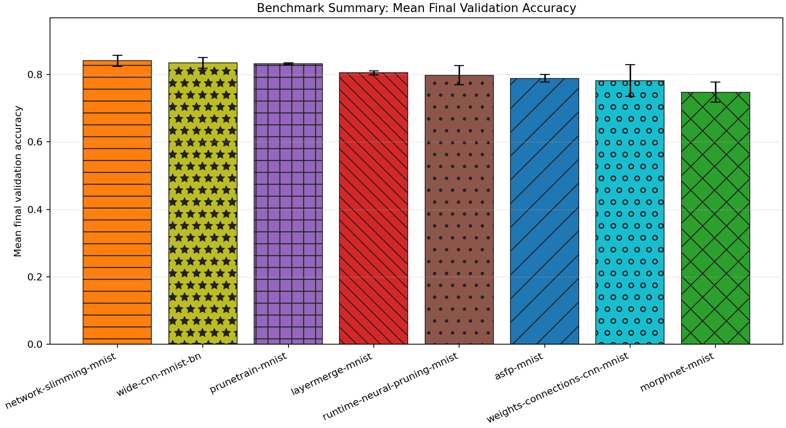

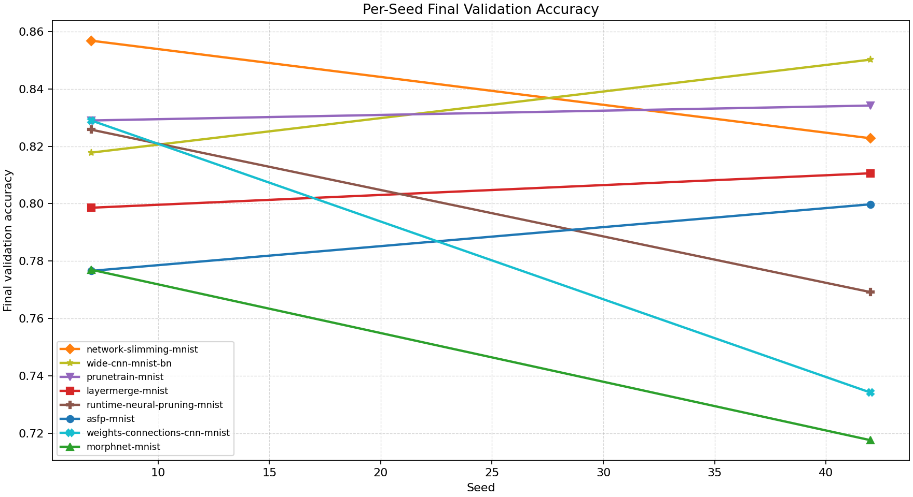

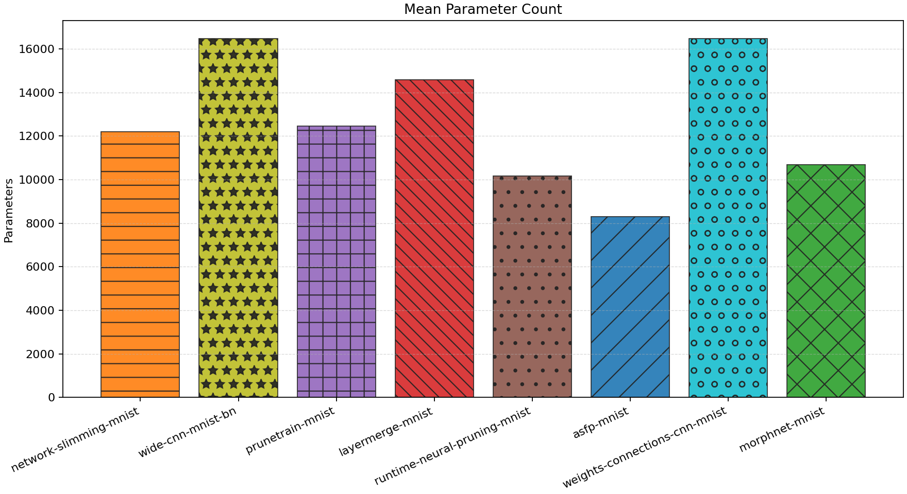

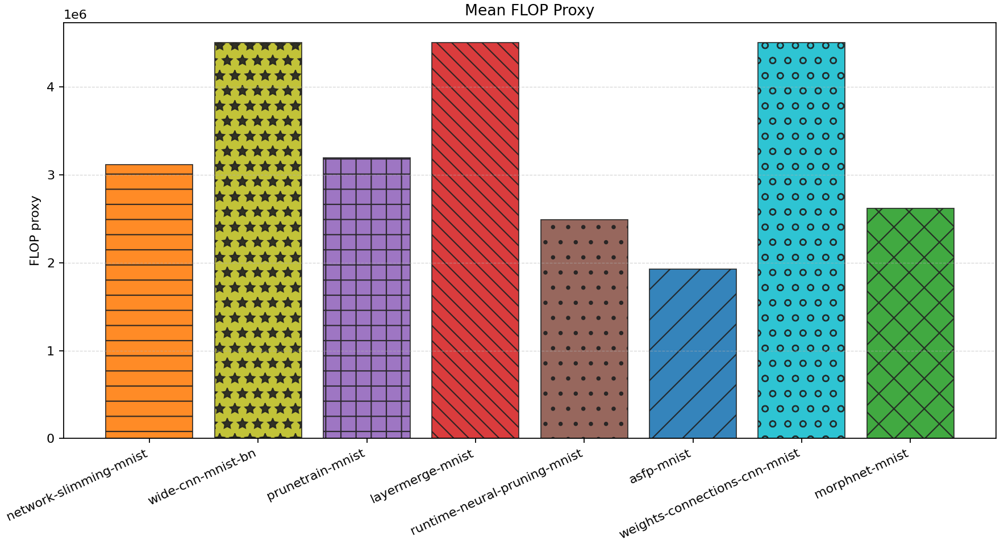

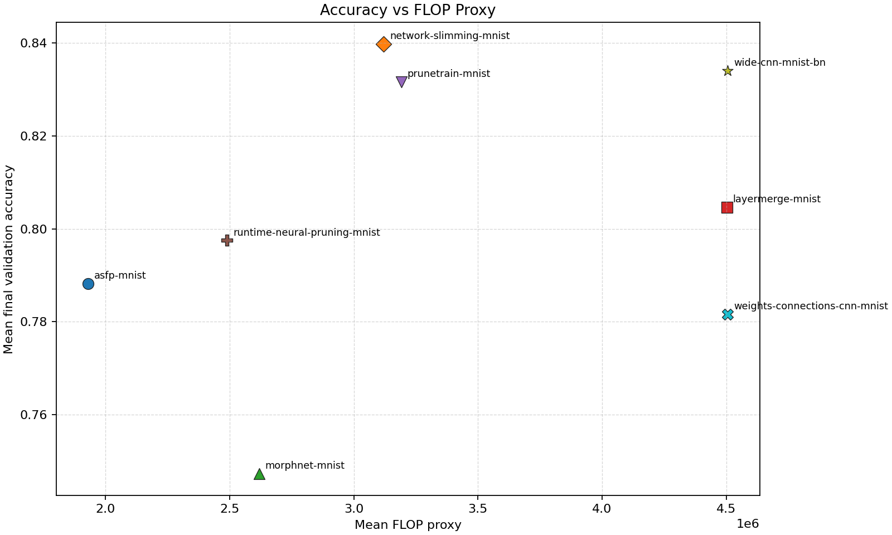

| Experiment | Type | Runs | Mean final val acc | Std final val acc | Mean best val acc | Mean adaptations | Mean final hidden dim | Best seed |
| --- | --- | ---: | ---: | ---: | ---: | ---: | ---: | ---: |
| network-slimming-mnist | workflow | 2 | 0.8398 | 0.0170 | 0.8398 | 1.00 | 0.0 | 7 |
| wide-cnn-mnist-bn | baseline | 2 | 0.8340 | 0.0162 | 0.8473 | 0.00 | 0.0 | 42 |
| prunetrain-mnist | workflow | 2 | 0.8316 | 0.0026 | 0.8316 | 2.00 | 0.0 | 42 |
| layermerge-mnist | workflow | 2 | 0.8046 | 0.0060 | 0.8046 | 1.00 | 0.0 | 42 |
| runtime-neural-pruning-mnist | dynamic | 2 | 0.7975 | 0.0283 | 0.7975 | 3.00 | 0.0 | 7 |
| asfp-mnist | dynamic | 2 | 0.7882 | 0.0116 | 0.8044 | 6.00 | 0.0 | 7 |
| weights-connections-cnn-mnist | dynamic | 2 | 0.7816 | 0.0474 | 0.8241 | 6.00 | 0.0 | 7 |
| morphnet-mnist | workflow | 2 | 0.7473 | 0.0297 | 0.7913 | 1.00 | 0.0 | 42 |

## Accuracy-FLOP Pareto Frontier

- `asfp-mnist`: acc=0.7882, flop_proxy=1929619, params=8305
- `runtime-neural-pruning-mnist`: acc=0.7975, flop_proxy=2489228, params=10156
- `network-slimming-mnist`: acc=0.8398, flop_proxy=3119397, params=12187

## Constraint Summary

| Experiment | Mean params | Mean nonzero params | Mean weight sparsity | Mean FLOP proxy | Mean activation elems |
| --- | ---: | ---: | ---: | ---: | ---: |
| network-slimming-mnist | 12187 | 12187 | 0.0000 | 3119397 | 5976 |
| wide-cnn-mnist-bn | 16474 | 16474 | 0.0000 | 4505914 | 7210 |
| prunetrain-mnist | 12466 | 12466 | 0.0000 | 3190786 | 6026 |
| layermerge-mnist | 14586 | 14586 | 0.0000 | 4502170 | 7178 |
| runtime-neural-pruning-mnist | 10156 | 10156 | 0.0000 | 2489228 | 5334 |
| asfp-mnist | 8305 | 8305 | 0.0000 | 1929619 | 4692 |
| weights-connections-cnn-mnist | 16474 | 10821 | 0.3500 | 4505914 | 7210 |
| morphnet-mnist | 10678 | 10678 | 0.0000 | 2617894 | 5434 |

## Experiment Notes

- `network-slimming-mnist`: workflow=network_slimming; device=cuda; requested_device=auto; torch=2.11.0+cu128; cuda_available=True; torch_cuda=12.8; cuda_device=NVIDIA GeForce RTX 4070 Laptop GPU
- `wide-cnn-mnist-bn`: device=cuda; requested_device=auto; torch=2.11.0+cu128; cuda_available=True; torch_cuda=12.8; cuda_device=NVIDIA GeForce RTX 4070 Laptop GPU
- `prunetrain-mnist`: workflow=prunetrain; device=cuda; requested_device=auto; torch=2.11.0+cu128; cuda_available=True; torch_cuda=12.8; cuda_device=NVIDIA GeForce RTX 4070 Laptop GPU
- `layermerge-mnist`: workflow=layermerge; device=cuda; requested_device=auto; torch=2.11.0+cu128; cuda_available=True; torch_cuda=12.8; cuda_device=NVIDIA GeForce RTX 4070 Laptop GPU
- `runtime-neural-pruning-mnist`: adaptation=runtime_neural_pruning; device=cuda; requested_device=auto; torch=2.11.0+cu128; cuda_available=True; torch_cuda=12.8; cuda_device=NVIDIA GeForce RTX 4070 Laptop GPU
- `asfp-mnist`: adaptation=soft_filter_pruning; device=cuda; requested_device=auto; torch=2.11.0+cu128; cuda_available=True; torch_cuda=12.8; cuda_device=NVIDIA GeForce RTX 4070 Laptop GPU
- `weights-connections-cnn-mnist`: adaptation=weights_connections; device=cuda; requested_device=auto; torch=2.11.0+cu128; cuda_available=True; torch_cuda=12.8; cuda_device=NVIDIA GeForce RTX 4070 Laptop GPU
- `morphnet-mnist`: workflow=morphnet; device=cuda; requested_device=auto; torch=2.11.0+cu128; cuda_available=True; torch_cuda=12.8; cuda_device=NVIDIA GeForce RTX 4070 Laptop GPU

## Per-Seed Results

### network-slimming-mnist
- seed 7: final=0.8568, best=0.8568, adaptations=1, params=12187, nonzero=12187, sparsity=0.0000
- seed 42: final=0.8228, best=0.8228, adaptations=1, params=12187, nonzero=12187, sparsity=0.0000

### wide-cnn-mnist-bn
- seed 7: final=0.8178, best=0.8444, adaptations=0, params=16474, nonzero=16474, sparsity=0.0000
- seed 42: final=0.8502, best=0.8502, adaptations=0, params=16474, nonzero=16474, sparsity=0.0000

### prunetrain-mnist
- seed 7: final=0.8290, best=0.8290, adaptations=2, params=12466, nonzero=12466, sparsity=0.0000
- seed 42: final=0.8342, best=0.8342, adaptations=2, params=12466, nonzero=12466, sparsity=0.0000

### layermerge-mnist
- seed 7: final=0.7986, best=0.7986, adaptations=1, params=14586, nonzero=14586, sparsity=0.0000
- seed 42: final=0.8106, best=0.8106, adaptations=1, params=14586, nonzero=14586, sparsity=0.0000

### runtime-neural-pruning-mnist
- seed 7: final=0.8258, best=0.8258, adaptations=3, params=10156, nonzero=10156, sparsity=0.0000
- seed 42: final=0.7692, best=0.7692, adaptations=3, params=10156, nonzero=10156, sparsity=0.0000

### asfp-mnist
- seed 7: final=0.7766, best=0.8090, adaptations=6, params=8305, nonzero=8305, sparsity=0.0000
- seed 42: final=0.7998, best=0.7998, adaptations=6, params=8305, nonzero=8305, sparsity=0.0000

### weights-connections-cnn-mnist
- seed 7: final=0.8290, best=0.8290, adaptations=6, params=16474, nonzero=10821, sparsity=0.3500
- seed 42: final=0.7342, best=0.8192, adaptations=6, params=16474, nonzero=10821, sparsity=0.3500

### morphnet-mnist
- seed 7: final=0.7770, best=0.7790, adaptations=1, params=10678, nonzero=10678, sparsity=0.0000
- seed 42: final=0.7176, best=0.8036, adaptations=1, params=10678, nonzero=10678, sparsity=0.0000

## Representative Stage Histories

### network-slimming-mnist (best seed 7)
- network_slimming_sparse_train: epochs=5, range=1..5, adaptation_enabled=False, final_val=0.8144000172615051
- network_slimming_finetune: epochs=3, range=6..8, adaptation_enabled=False, final_val=0.8568000197410583

### wide-cnn-mnist-bn (best seed 42)
- train: epochs=8, range=1..8, adaptation_enabled=False, final_val=0.8501999974250793

### prunetrain-mnist (best seed 42)
- prunetrain_segment_1: epochs=3, range=1..3, adaptation_enabled=False, final_val=0.5874000191688538
- prunetrain_segment_2: epochs=3, range=4..6, adaptation_enabled=False, final_val=0.7752000093460083
- prunetrain_segment_3: epochs=2, range=7..8, adaptation_enabled=False, final_val=0.8342000246047974

### layermerge-mnist (best seed 42)
- layermerge_pretrain: epochs=5, range=1..5, adaptation_enabled=False, final_val=0.6043999791145325
- layermerge_finetune: epochs=3, range=6..8, adaptation_enabled=False, final_val=0.8105999827384949

### runtime-neural-pruning-mnist (best seed 7)
- train: epochs=8, range=1..8, adaptation_enabled=True, final_val=0.8258000016212463

### asfp-mnist (best seed 7)
- train: epochs=8, range=1..8, adaptation_enabled=True, final_val=0.7766000032424927

### weights-connections-cnn-mnist (best seed 7)
- train: epochs=8, range=1..8, adaptation_enabled=True, final_val=0.8289999961853027

### morphnet-mnist (best seed 42)
- morphnet_resource_train: epochs=5, range=1..5, adaptation_enabled=False, final_val=0.6855999827384949
- morphnet_finetune: epochs=3, range=6..8, adaptation_enabled=False, final_val=0.7175999879837036

## Representative Architectures

### network-slimming-mnist (best seed 7)
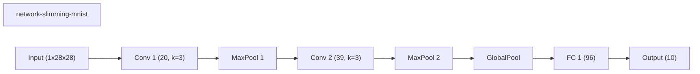

### wide-cnn-mnist-bn (best seed 42)
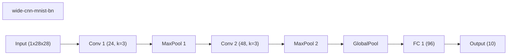

### prunetrain-mnist (best seed 42)
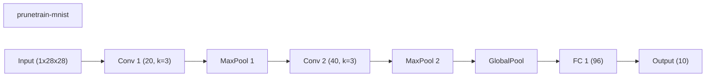

### layermerge-mnist (best seed 42)
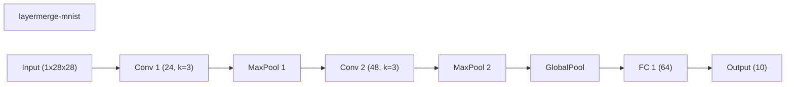

### runtime-neural-pruning-mnist (best seed 7)
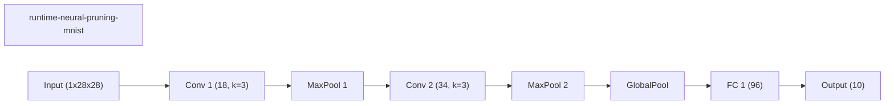

### asfp-mnist (best seed 7)
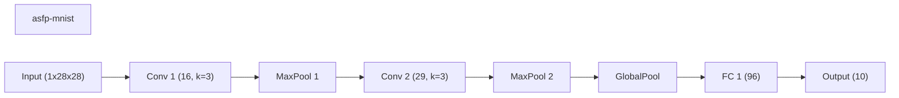

### weights-connections-cnn-mnist (best seed 7)
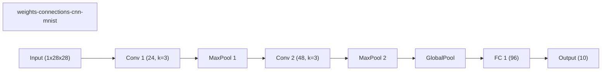

### morphnet-mnist (best seed 42)
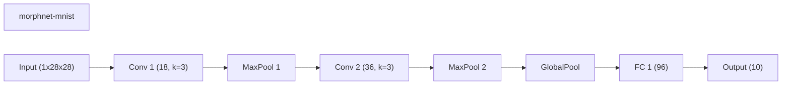
