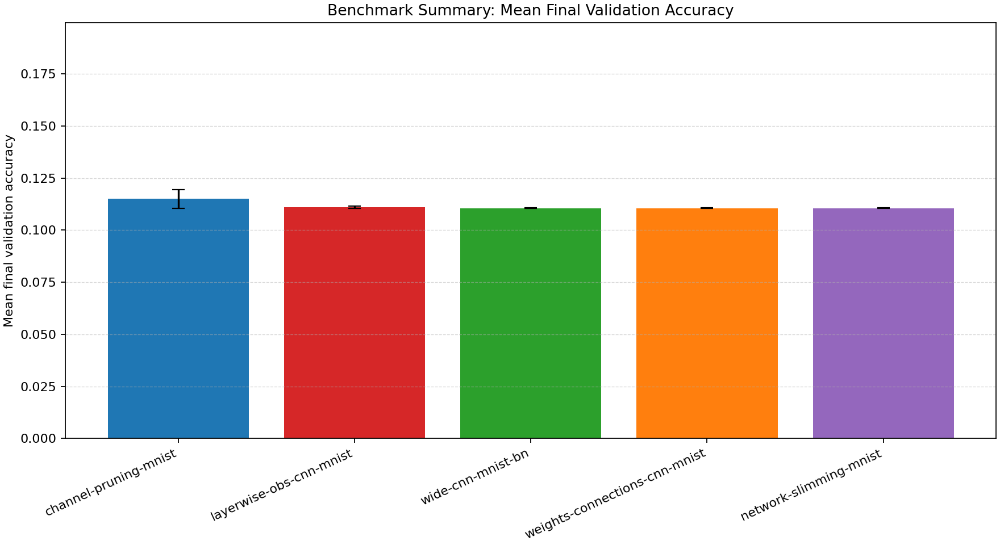
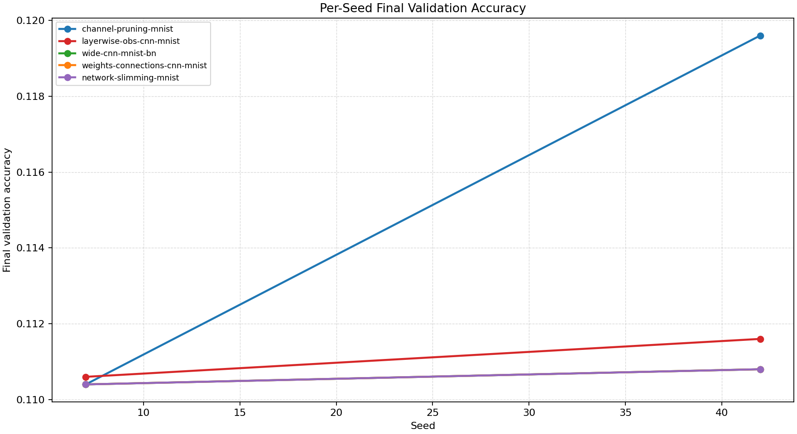
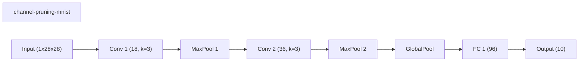
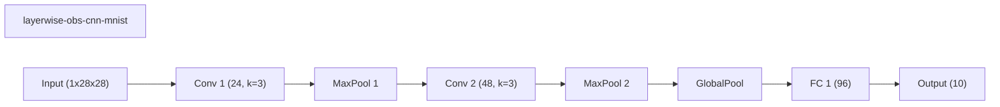
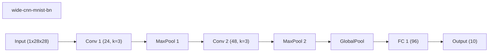
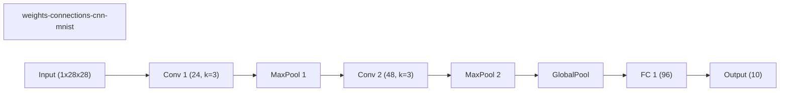
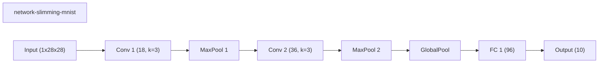

# Benchmark Summary

Seeds: 7, 42

## Aggregate Plots

| Experiment | Type | Runs | Mean final val acc | Std final val acc | Mean best val acc | Mean adaptations | Mean final hidden dim | Best seed |
| --- | --- | ---: | ---: | ---: | ---: | ---: | ---: | ---: |
| channel-pruning-mnist | dynamic | 2 | 0.1150 | 0.0046 | 0.1537 | 3.00 | 0.0 | 42 |
| layerwise-obs-cnn-mnist | dynamic | 2 | 0.1111 | 0.0005 | 0.1112 | 5.00 | 0.0 | 42 |
| wide-cnn-mnist-bn | baseline | 2 | 0.1106 | 0.0002 | 0.1111 | 0.00 | 0.0 | 42 |
| weights-connections-cnn-mnist | dynamic | 2 | 0.1106 | 0.0002 | 0.1125 | 5.00 | 0.0 | 42 |
| network-slimming-mnist | workflow | 2 | 0.1106 | 0.0002 | 0.1116 | 1.00 | 0.0 | 42 |

## Constraint Summary

| Experiment | Mean params | Mean nonzero params | Mean weight sparsity | Mean FLOP proxy | Mean activation elems |
| --- | ---: | ---: | ---: | ---: | ---: |
| channel-pruning-mnist | 10678 | 10678 | 0.0000 | 2617894 | 5434 |
| layerwise-obs-cnn-mnist | 16474 | 10975 | 0.3405 | 4505914 | 7210 |
| wide-cnn-mnist-bn | 16474 | 16474 | 0.0000 | 4505914 | 7210 |
| weights-connections-cnn-mnist | 16474 | 10014 | 0.4000 | 4505914 | 7210 |
| network-slimming-mnist | 10678 | 10678 | 0.0000 | 2617894 | 5434 |

## Experiment Notes

- `channel-pruning-mnist`: adaptation=channel_pruning; device=cuda; requested_device=auto; torch=2.11.0+cu128; cuda_available=True; torch_cuda=12.8; cuda_device=NVIDIA GeForce RTX 4070 Laptop GPU
- `layerwise-obs-cnn-mnist`: adaptation=layerwise_obs; device=cuda; requested_device=auto; torch=2.11.0+cu128; cuda_available=True; torch_cuda=12.8; cuda_device=NVIDIA GeForce RTX 4070 Laptop GPU
- `wide-cnn-mnist-bn`: device=cuda; requested_device=auto; torch=2.11.0+cu128; cuda_available=True; torch_cuda=12.8; cuda_device=NVIDIA GeForce RTX 4070 Laptop GPU
- `weights-connections-cnn-mnist`: adaptation=weights_connections; device=cuda; requested_device=auto; torch=2.11.0+cu128; cuda_available=True; torch_cuda=12.8; cuda_device=NVIDIA GeForce RTX 4070 Laptop GPU
- `network-slimming-mnist`: workflow=network_slimming; device=cuda; requested_device=auto; torch=2.11.0+cu128; cuda_available=True; torch_cuda=12.8; cuda_device=NVIDIA GeForce RTX 4070 Laptop GPU

## Per-Seed Results

### channel-pruning-mnist
- seed 7: final=0.1104, best=0.1104, adaptations=3, params=10678, nonzero=10678, sparsity=0.0000
- seed 42: final=0.1196, best=0.1970, adaptations=3, params=10678, nonzero=10678, sparsity=0.0000

### layerwise-obs-cnn-mnist
- seed 7: final=0.1106, best=0.1106, adaptations=5, params=16474, nonzero=10975, sparsity=0.3405
- seed 42: final=0.1116, best=0.1118, adaptations=5, params=16474, nonzero=10975, sparsity=0.3405

### wide-cnn-mnist-bn
- seed 7: final=0.1104, best=0.1104, adaptations=0, params=16474, nonzero=16474, sparsity=0.0000
- seed 42: final=0.1108, best=0.1118, adaptations=0, params=16474, nonzero=16474, sparsity=0.0000

### weights-connections-cnn-mnist
- seed 7: final=0.1104, best=0.1104, adaptations=5, params=16474, nonzero=10014, sparsity=0.4000
- seed 42: final=0.1108, best=0.1146, adaptations=5, params=16474, nonzero=10014, sparsity=0.4000

### network-slimming-mnist
- seed 7: final=0.1104, best=0.1104, adaptations=1, params=10678, nonzero=10678, sparsity=0.0000
- seed 42: final=0.1108, best=0.1128, adaptations=1, params=10678, nonzero=10678, sparsity=0.0000

## Representative Stage Histories

### channel-pruning-mnist (best seed 42)
- train: epochs=6, range=1..6, adaptation_enabled=True, final_val=0.11959999799728394

### layerwise-obs-cnn-mnist (best seed 42)
- train: epochs=6, range=1..6, adaptation_enabled=True, final_val=0.11159999668598175

### wide-cnn-mnist-bn (best seed 42)
- train: epochs=6, range=1..6, adaptation_enabled=False, final_val=0.11079999804496765

### weights-connections-cnn-mnist (best seed 42)
- train: epochs=6, range=1..6, adaptation_enabled=True, final_val=0.11079999804496765

### network-slimming-mnist (best seed 42)
- network_slimming_sparse_train: epochs=4, range=1..4, adaptation_enabled=False, final_val=0.1111999973654747
- network_slimming_finetune: epochs=2, range=5..6, adaptation_enabled=False, final_val=0.11079999804496765

## Representative Architectures

### channel-pruning-mnist (best seed 42)

### layerwise-obs-cnn-mnist (best seed 42)

### wide-cnn-mnist-bn (best seed 42)

### weights-connections-cnn-mnist (best seed 42)

### network-slimming-mnist (best seed 42)

