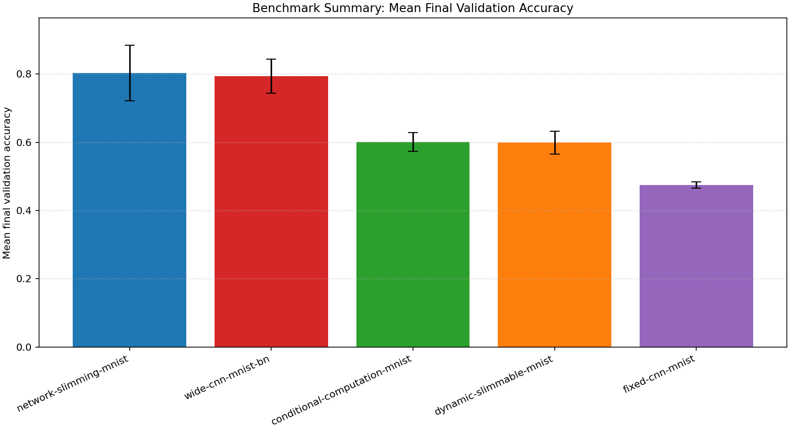
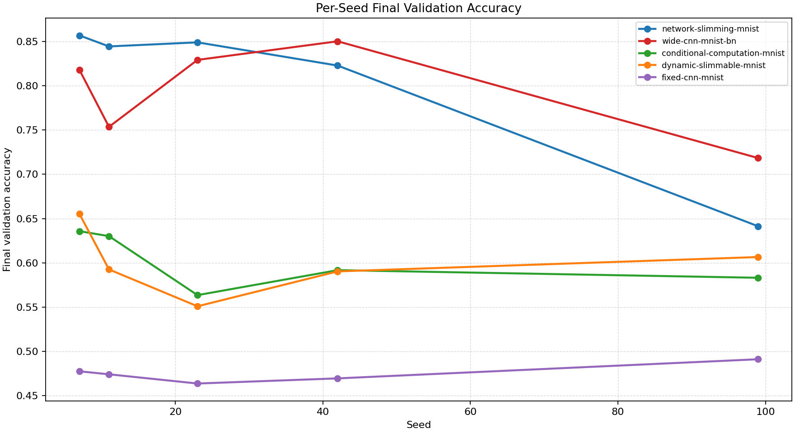
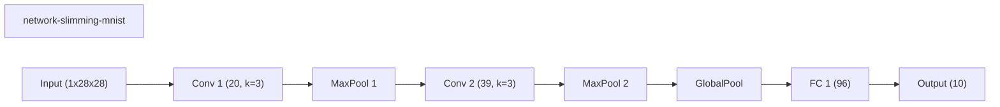
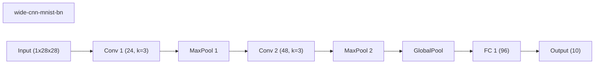
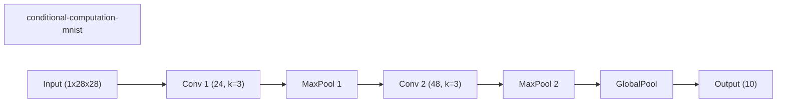
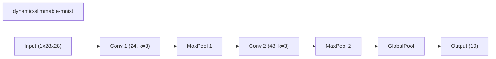
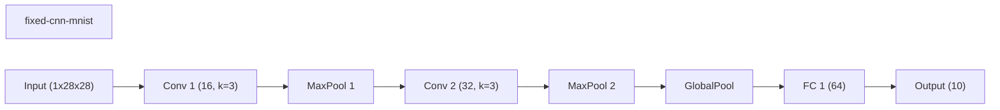

# Benchmark Summary

Seeds: 7, 11, 23, 42, 99

## Aggregate Plots

| Experiment | Type | Runs | Mean final val acc | Std final val acc | Mean best val acc | Mean adaptations | Mean final hidden dim | Best seed |
| --- | --- | ---: | ---: | ---: | ---: | ---: | ---: | ---: |
| network-slimming-mnist | workflow | 5 | 0.8029 | 0.0815 | 0.8364 | 1.00 | 0.0 | 7 |
| wide-cnn-mnist-bn | baseline | 5 | 0.7938 | 0.0496 | 0.8365 | 0.00 | 0.0 | 99 |
| conditional-computation-mnist | workflow | 5 | 0.6009 | 0.0278 | 0.6030 | 0.00 | - | 7 |
| dynamic-slimmable-mnist | workflow | 5 | 0.5992 | 0.0336 | 0.6020 | 0.00 | - | 7 |
| fixed-cnn-mnist | baseline | 5 | 0.4753 | 0.0092 | 0.4753 | 0.00 | 0.0 | 99 |

## Constraint Summary

| Experiment | Mean params | Mean nonzero params | Mean weight sparsity | Mean FLOP proxy | Mean activation elems |
| --- | ---: | ---: | ---: | ---: | ---: |
| network-slimming-mnist | 12187 | 12187 | 0.0000 | 3119397 | 5976 |
| wide-cnn-mnist-bn | 16474 | 16474 | 0.0000 | 4505914 | 7210 |
| conditional-computation-mnist | 11146 | 11146 | 0.0000 | 4439194 | 7114 |
| dynamic-slimmable-mnist | 11146 | 11146 | 0.0000 | 4439194 | 7114 |
| fixed-cnn-mnist | 7562 | 7562 | 0.0000 | 2061098 | 4810 |

## Experiment Notes

- `network-slimming-mnist`: workflow=network_slimming; device=cuda; requested_device=auto; torch=2.11.0+cu128; cuda_available=True; torch_cuda=12.8; cuda_device=NVIDIA GeForce RTX 4070 Laptop GPU
- `wide-cnn-mnist-bn`: device=cuda; requested_device=auto; torch=2.11.0+cu128; cuda_available=True; torch_cuda=12.8; cuda_device=NVIDIA GeForce RTX 4070 Laptop GPU
- `conditional-computation-mnist`: workflow=conditional_computation; route_summary={'policy': 'early_exit', 'mode': 'eval', 'gate_mode': 'learned', 'gate_metric': 'margin', 'confidence_threshold': 0.55, 'target_cost_ratio': 0.8, 'early_exit_fraction': 0.0, 'full_path_fraction': 1.0, 'mean_width': 1.0, 'mean_cost_ratio': 1.0}; device=cuda; requested_device=auto; torch=2.11.0+cu128; cuda_available=True; torch_cuda=12.8; cuda_device=NVIDIA GeForce RTX 4070 Laptop GPU
- `dynamic-slimmable-mnist`: workflow=dynamic_slimmable; route_summary={'policy': 'dynamic_width', 'mode': 'eval', 'gate_mode': 'metric', 'gate_metric': 'margin', 'confidence_threshold': 0.45, 'target_cost_ratio': 0.82, 'route_counts': {'0.5': 22, '0.75': 6, '1.0': 108}, 'mean_width': 0.9081, 'mean_cost_ratio': 0.8604}; device=cuda; requested_device=auto; torch=2.11.0+cu128; cuda_available=True; torch_cuda=12.8; cuda_device=NVIDIA GeForce RTX 4070 Laptop GPU
- `fixed-cnn-mnist`: device=cuda; requested_device=auto; torch=2.11.0+cu128; cuda_available=True; torch_cuda=12.8; cuda_device=NVIDIA GeForce RTX 4070 Laptop GPU

## Per-Seed Results

### network-slimming-mnist
- seed 7: final=0.8568, best=0.8568, adaptations=1, params=12187, nonzero=12187, sparsity=0.0000
- seed 11: final=0.8444, best=0.8444, adaptations=1, params=12187, nonzero=12187, sparsity=0.0000
- seed 23: final=0.8490, best=0.8490, adaptations=1, params=12187, nonzero=12187, sparsity=0.0000
- seed 42: final=0.8228, best=0.8228, adaptations=1, params=12187, nonzero=12187, sparsity=0.0000
- seed 99: final=0.6414, best=0.8090, adaptations=1, params=12187, nonzero=12187, sparsity=0.0000

### wide-cnn-mnist-bn
- seed 7: final=0.8178, best=0.8444, adaptations=0, params=16474, nonzero=16474, sparsity=0.0000
- seed 11: final=0.7536, best=0.8002, adaptations=0, params=16474, nonzero=16474, sparsity=0.0000
- seed 23: final=0.8292, best=0.8292, adaptations=0, params=16474, nonzero=16474, sparsity=0.0000
- seed 42: final=0.8502, best=0.8502, adaptations=0, params=16474, nonzero=16474, sparsity=0.0000
- seed 99: final=0.7184, best=0.8586, adaptations=0, params=16474, nonzero=16474, sparsity=0.0000

### conditional-computation-mnist
- seed 7: final=0.6358, best=0.6358, adaptations=0, params=11146, nonzero=11146, sparsity=0.0000
- seed 11: final=0.6302, best=0.6302, adaptations=0, params=11146, nonzero=11146, sparsity=0.0000
- seed 23: final=0.5636, best=0.5636, adaptations=0, params=11146, nonzero=11146, sparsity=0.0000
- seed 42: final=0.5918, best=0.6022, adaptations=0, params=11146, nonzero=11146, sparsity=0.0000
- seed 99: final=0.5832, best=0.5832, adaptations=0, params=11146, nonzero=11146, sparsity=0.0000

### dynamic-slimmable-mnist
- seed 7: final=0.6552, best=0.6552, adaptations=0, params=11146, nonzero=11146, sparsity=0.0000
- seed 11: final=0.5926, best=0.5926, adaptations=0, params=11146, nonzero=11146, sparsity=0.0000
- seed 23: final=0.5510, best=0.5642, adaptations=0, params=11146, nonzero=11146, sparsity=0.0000
- seed 42: final=0.5904, best=0.5904, adaptations=0, params=11146, nonzero=11146, sparsity=0.0000
- seed 99: final=0.6066, best=0.6074, adaptations=0, params=11146, nonzero=11146, sparsity=0.0000

### fixed-cnn-mnist
- seed 7: final=0.4776, best=0.4776, adaptations=0, params=7562, nonzero=7562, sparsity=0.0000
- seed 11: final=0.4742, best=0.4742, adaptations=0, params=7562, nonzero=7562, sparsity=0.0000
- seed 23: final=0.4638, best=0.4638, adaptations=0, params=7562, nonzero=7562, sparsity=0.0000
- seed 42: final=0.4696, best=0.4696, adaptations=0, params=7562, nonzero=7562, sparsity=0.0000
- seed 99: final=0.4912, best=0.4912, adaptations=0, params=7562, nonzero=7562, sparsity=0.0000

## Representative Stage Histories

### network-slimming-mnist (best seed 7)
- network_slimming_sparse_train: epochs=5, range=1..5, adaptation_enabled=False, final_val=0.8144000172615051
- network_slimming_finetune: epochs=3, range=6..8, adaptation_enabled=False, final_val=0.8568000197410583

### wide-cnn-mnist-bn (best seed 99)
- train: epochs=8, range=1..8, adaptation_enabled=False, final_val=0.7184000015258789

### conditional-computation-mnist (best seed 7)
- conditional_computation_train: epochs=8, range=1..8, adaptation_enabled=False, final_val=0.6358000040054321

### dynamic-slimmable-mnist (best seed 7)
- dynamic_slimmable_train: epochs=8, range=1..8, adaptation_enabled=False, final_val=0.6552000045776367

### fixed-cnn-mnist (best seed 99)
- train: epochs=8, range=1..8, adaptation_enabled=False, final_val=0.4912000000476837

## Representative Architectures

### network-slimming-mnist (best seed 7)

### wide-cnn-mnist-bn (best seed 99)

### conditional-computation-mnist (best seed 7)

### dynamic-slimmable-mnist (best seed 7)

### fixed-cnn-mnist (best seed 99)

