# Benchmark Summary

Seeds: 7, 11, 23, 42, 99

## Aggregate Plots

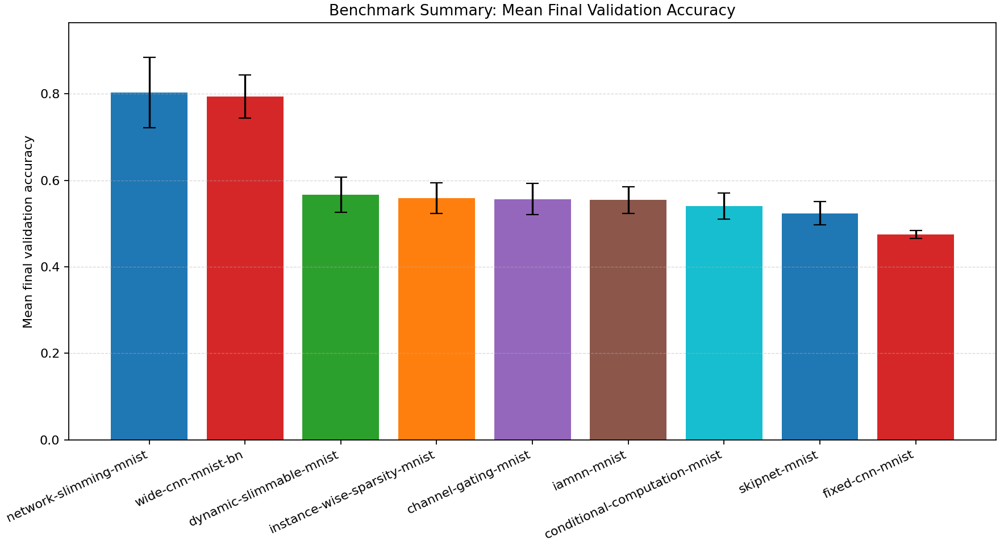

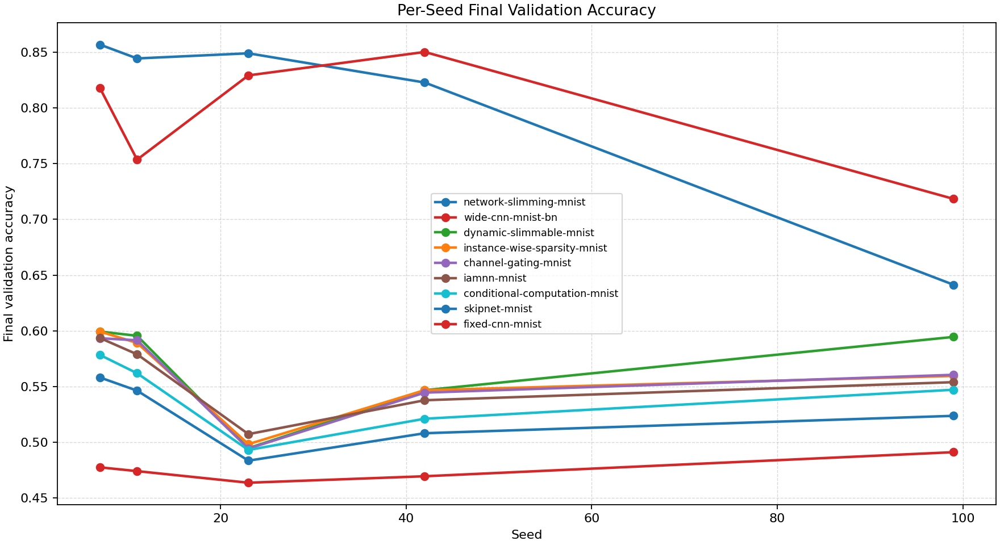

| Experiment | Type | Runs | Mean final val acc | Std final val acc | Mean best val acc | Mean adaptations | Mean final hidden dim | Best seed |
| --- | --- | ---: | ---: | ---: | ---: | ---: | ---: | ---: |
| network-slimming-mnist | workflow | 5 | 0.8029 | 0.0815 | 0.8364 | 1.00 | 0.0 | 7 |
| wide-cnn-mnist-bn | baseline | 5 | 0.7938 | 0.0496 | 0.8365 | 0.00 | 0.0 | 99 |
| dynamic-slimmable-mnist | workflow | 5 | 0.5662 | 0.0406 | 0.5686 | 0.00 | - | 7 |
| instance-wise-sparsity-mnist | workflow | 5 | 0.5587 | 0.0357 | 0.5607 | 0.00 | - | 7 |
| channel-gating-mnist | workflow | 5 | 0.5569 | 0.0364 | 0.5596 | 0.00 | - | 7 |
| iamnn-mnist | workflow | 5 | 0.5544 | 0.0304 | 0.5564 | 0.00 | - | 7 |
| conditional-computation-mnist | workflow | 5 | 0.5404 | 0.0302 | 0.5404 | 0.00 | - | 7 |
| skipnet-mnist | workflow | 5 | 0.5240 | 0.0267 | 0.5240 | 0.00 | - | 7 |
| fixed-cnn-mnist | baseline | 5 | 0.4753 | 0.0092 | 0.4753 | 0.00 | 0.0 | 99 |

## Constraint Summary

| Experiment | Mean params | Mean nonzero params | Mean weight sparsity | Mean FLOP proxy | Mean activation elems |
| --- | ---: | ---: | ---: | ---: | ---: |
| network-slimming-mnist | 12187 | 12187 | 0.0000 | 3119397 | 5976 |
| wide-cnn-mnist-bn | 16474 | 16474 | 0.0000 | 4505914 | 7210 |
| dynamic-slimmable-mnist | 11146 | 11146 | 0.0000 | 4439194 | 7114 |
| instance-wise-sparsity-mnist | 11146 | 11146 | 0.0000 | 4439194 | 7114 |
| channel-gating-mnist | 11146 | 11146 | 0.0000 | 4439194 | 7114 |
| iamnn-mnist | 11146 | 11146 | 0.0000 | 4439194 | 7114 |
| conditional-computation-mnist | 11146 | 11146 | 0.0000 | 4439194 | 7114 |
| skipnet-mnist | 11146 | 11146 | 0.0000 | 4439194 | 7114 |
| fixed-cnn-mnist | 7562 | 7562 | 0.0000 | 2061098 | 4810 |

## Experiment Notes

- `network-slimming-mnist`: workflow=network_slimming; device=cuda; requested_device=auto; torch=2.11.0+cu128; cuda_available=True; torch_cuda=12.8; cuda_device=NVIDIA GeForce RTX 4070 Laptop GPU
- `wide-cnn-mnist-bn`: device=cuda; requested_device=auto; torch=2.11.0+cu128; cuda_available=True; torch_cuda=12.8; cuda_device=NVIDIA GeForce RTX 4070 Laptop GPU
- `dynamic-slimmable-mnist`: workflow=dynamic_slimmable; route_summary={'policy': 'dynamic_width', 'mode': 'eval', 'gate_mode': 'learned', 'gate_metric': 'margin', 'confidence_threshold': 0.42, 'target_cost_ratio': 0.8, 'target_accept_rate': 0.55, 'route_counts': {'0.5': 2, '0.75': 17, '1.0': 117}, 'trace_samples': [{'sample': 0, 'width': 0.75}, {'sample': 1, 'width': 1.0}, {'sample': 2, 'width': 1.0}, {'sample': 3, 'width': 0.5}, {'sample': 4, 'width': 0.75}, {'sample': 5, 'width': 1.0}, {'sample': 6, 'width': 1.0}, {'sample': 7, 'width': 1.0}], 'mean_width': 0.9614, 'mean_cost_ratio': 0.9348}; device=cuda; requested_device=auto; torch=2.11.0+cu128; cuda_available=True; torch_cuda=12.8; cuda_device=NVIDIA GeForce RTX 4070 Laptop GPU
- `instance-wise-sparsity-mnist`: workflow=instance_wise_sparsity; route_summary={'policy': 'dynamic_width', 'mode': 'eval', 'gate_mode': 'learned', 'gate_metric': 'margin', 'confidence_threshold': 0.34, 'target_cost_ratio': 0.68, 'target_accept_rate': 0.4, 'route_counts': {'0.5': 6, '0.75': 16, '1.0': 114}, 'trace_samples': [{'sample': 0, 'width': 0.5}, {'sample': 1, 'width': 1.0}, {'sample': 2, 'width': 1.0}, {'sample': 3, 'width': 0.5}, {'sample': 4, 'width': 0.75}, {'sample': 5, 'width': 1.0}, {'sample': 6, 'width': 1.0}, {'sample': 7, 'width': 1.0}], 'mean_width': 0.9485, 'mean_cost_ratio': 0.9161}; device=cuda; requested_device=auto; torch=2.11.0+cu128; cuda_available=True; torch_cuda=12.8; cuda_device=NVIDIA GeForce RTX 4070 Laptop GPU
- `channel-gating-mnist`: workflow=channel_gating; route_summary={'policy': 'dynamic_width', 'mode': 'eval', 'gate_mode': 'learned', 'gate_metric': 'margin', 'confidence_threshold': 0.34, 'target_cost_ratio': 0.74, 'target_accept_rate': 0.5, 'route_counts': {'0.5': 6, '0.75': 16, '1.0': 114}, 'trace_samples': [{'sample': 0, 'width': 0.75}, {'sample': 1, 'width': 1.0}, {'sample': 2, 'width': 1.0}, {'sample': 3, 'width': 0.5}, {'sample': 4, 'width': 0.75}, {'sample': 5, 'width': 1.0}, {'sample': 6, 'width': 1.0}, {'sample': 7, 'width': 1.0}], 'mean_width': 0.9485, 'mean_cost_ratio': 0.9161}; device=cuda; requested_device=auto; torch=2.11.0+cu128; cuda_available=True; torch_cuda=12.8; cuda_device=NVIDIA GeForce RTX 4070 Laptop GPU
- `iamnn-mnist`: workflow=iamnn; route_summary={'policy': 'early_exit', 'mode': 'eval', 'gate_mode': 'learned', 'gate_metric': 'margin', 'confidence_threshold': 0.16, 'target_cost_ratio': 0.7, 'target_accept_rate': 0.28, 'early_exit_fraction': 0.2794, 'mean_gate_score': 0.0188, 'max_gate_score': 0.1544, 'full_path_fraction': 0.7206, 'trace_samples': [{'sample': 0, 'path': 'early'}, {'sample': 1, 'path': 'full'}, {'sample': 2, 'path': 'full'}, {'sample': 3, 'path': 'early'}, {'sample': 4, 'path': 'early'}, {'sample': 5, 'path': 'full'}, {'sample': 6, 'path': 'full'}, {'sample': 7, 'path': 'early'}], 'mean_width': 1.0, 'mean_cost_ratio': 0.7263}; device=cuda; requested_device=auto; torch=2.11.0+cu128; cuda_available=True; torch_cuda=12.8; cuda_device=NVIDIA GeForce RTX 4070 Laptop GPU
- `conditional-computation-mnist`: workflow=conditional_computation; route_summary={'policy': 'early_exit', 'mode': 'eval', 'gate_mode': 'learned', 'gate_metric': 'margin', 'confidence_threshold': 0.22, 'target_cost_ratio': 0.74, 'target_accept_rate': 0.28, 'early_exit_fraction': 0.2794, 'mean_gate_score': 0.0164, 'max_gate_score': 0.1223, 'full_path_fraction': 0.7206, 'trace_samples': [{'sample': 0, 'path': 'early'}, {'sample': 1, 'path': 'full'}, {'sample': 2, 'path': 'full'}, {'sample': 3, 'path': 'early'}, {'sample': 4, 'path': 'early'}, {'sample': 5, 'path': 'full'}, {'sample': 6, 'path': 'full'}, {'sample': 7, 'path': 'early'}], 'mean_width': 1.0, 'mean_cost_ratio': 0.7263}; device=cuda; requested_device=auto; torch=2.11.0+cu128; cuda_available=True; torch_cuda=12.8; cuda_device=NVIDIA GeForce RTX 4070 Laptop GPU
- `skipnet-mnist`: workflow=skipnet; route_summary={'policy': 'early_exit', 'mode': 'eval', 'gate_mode': 'learned', 'gate_metric': 'margin', 'confidence_threshold': 0.16, 'target_cost_ratio': 0.74, 'target_accept_rate': 0.34, 'early_exit_fraction': 0.3382, 'mean_gate_score': 0.0179, 'max_gate_score': 0.1442, 'full_path_fraction': 0.6618, 'trace_samples': [{'sample': 0, 'path': 'early'}, {'sample': 1, 'path': 'full'}, {'sample': 2, 'path': 'full'}, {'sample': 3, 'path': 'early'}, {'sample': 4, 'path': 'early'}, {'sample': 5, 'path': 'full'}, {'sample': 6, 'path': 'full'}, {'sample': 7, 'path': 'early'}], 'mean_width': 1.0, 'mean_cost_ratio': 0.6687}; device=cuda; requested_device=auto; torch=2.11.0+cu128; cuda_available=True; torch_cuda=12.8; cuda_device=NVIDIA GeForce RTX 4070 Laptop GPU
- `fixed-cnn-mnist`: device=cuda; requested_device=auto; torch=2.11.0+cu128; cuda_available=True; torch_cuda=12.8; cuda_device=NVIDIA GeForce RTX 4070 Laptop GPU

## Per-Seed Results

### network-slimming-mnist
- seed 7: final=0.8568, best=0.8568, adaptations=1, params=12187, nonzero=12187, sparsity=0.0000
- seed 11: final=0.8444, best=0.8444, adaptations=1, params=12187, nonzero=12187, sparsity=0.0000
- seed 23: final=0.8490, best=0.8490, adaptations=1, params=12187, nonzero=12187, sparsity=0.0000
- seed 42: final=0.8228, best=0.8228, adaptations=1, params=12187, nonzero=12187, sparsity=0.0000
- seed 99: final=0.6414, best=0.8090, adaptations=1, params=12187, nonzero=12187, sparsity=0.0000

### wide-cnn-mnist-bn
- seed 7: final=0.8178, best=0.8444, adaptations=0, params=16474, nonzero=16474, sparsity=0.0000
- seed 11: final=0.7536, best=0.8002, adaptations=0, params=16474, nonzero=16474, sparsity=0.0000
- seed 23: final=0.8292, best=0.8292, adaptations=0, params=16474, nonzero=16474, sparsity=0.0000
- seed 42: final=0.8502, best=0.8502, adaptations=0, params=16474, nonzero=16474, sparsity=0.0000
- seed 99: final=0.7184, best=0.8586, adaptations=0, params=16474, nonzero=16474, sparsity=0.0000

### dynamic-slimmable-mnist
- seed 7: final=0.5994, best=0.5994, adaptations=0, params=11146, nonzero=11146, sparsity=0.0000
- seed 11: final=0.5956, best=0.5956, adaptations=0, params=11146, nonzero=11146, sparsity=0.0000
- seed 23: final=0.4948, best=0.5068, adaptations=0, params=11146, nonzero=11146, sparsity=0.0000
- seed 42: final=0.5468, best=0.5468, adaptations=0, params=11146, nonzero=11146, sparsity=0.0000
- seed 99: final=0.5946, best=0.5946, adaptations=0, params=11146, nonzero=11146, sparsity=0.0000

### instance-wise-sparsity-mnist
- seed 7: final=0.5994, best=0.5994, adaptations=0, params=11146, nonzero=11146, sparsity=0.0000
- seed 11: final=0.5892, best=0.5892, adaptations=0, params=11146, nonzero=11146, sparsity=0.0000
- seed 23: final=0.4984, best=0.5084, adaptations=0, params=11146, nonzero=11146, sparsity=0.0000
- seed 42: final=0.5468, best=0.5468, adaptations=0, params=11146, nonzero=11146, sparsity=0.0000
- seed 99: final=0.5596, best=0.5596, adaptations=0, params=11146, nonzero=11146, sparsity=0.0000

### channel-gating-mnist
- seed 7: final=0.5934, best=0.5934, adaptations=0, params=11146, nonzero=11146, sparsity=0.0000
- seed 11: final=0.5916, best=0.5916, adaptations=0, params=11146, nonzero=11146, sparsity=0.0000
- seed 23: final=0.4944, best=0.5080, adaptations=0, params=11146, nonzero=11146, sparsity=0.0000
- seed 42: final=0.5446, best=0.5446, adaptations=0, params=11146, nonzero=11146, sparsity=0.0000
- seed 99: final=0.5606, best=0.5606, adaptations=0, params=11146, nonzero=11146, sparsity=0.0000

### iamnn-mnist
- seed 7: final=0.5936, best=0.5936, adaptations=0, params=11146, nonzero=11146, sparsity=0.0000
- seed 11: final=0.5790, best=0.5790, adaptations=0, params=11146, nonzero=11146, sparsity=0.0000
- seed 23: final=0.5074, best=0.5074, adaptations=0, params=11146, nonzero=11146, sparsity=0.0000
- seed 42: final=0.5378, best=0.5478, adaptations=0, params=11146, nonzero=11146, sparsity=0.0000
- seed 99: final=0.5540, best=0.5540, adaptations=0, params=11146, nonzero=11146, sparsity=0.0000

### conditional-computation-mnist
- seed 7: final=0.5784, best=0.5784, adaptations=0, params=11146, nonzero=11146, sparsity=0.0000
- seed 11: final=0.5620, best=0.5620, adaptations=0, params=11146, nonzero=11146, sparsity=0.0000
- seed 23: final=0.4932, best=0.4932, adaptations=0, params=11146, nonzero=11146, sparsity=0.0000
- seed 42: final=0.5212, best=0.5212, adaptations=0, params=11146, nonzero=11146, sparsity=0.0000
- seed 99: final=0.5472, best=0.5472, adaptations=0, params=11146, nonzero=11146, sparsity=0.0000

### skipnet-mnist
- seed 7: final=0.5582, best=0.5582, adaptations=0, params=11146, nonzero=11146, sparsity=0.0000
- seed 11: final=0.5464, best=0.5464, adaptations=0, params=11146, nonzero=11146, sparsity=0.0000
- seed 23: final=0.4836, best=0.4836, adaptations=0, params=11146, nonzero=11146, sparsity=0.0000
- seed 42: final=0.5082, best=0.5082, adaptations=0, params=11146, nonzero=11146, sparsity=0.0000
- seed 99: final=0.5238, best=0.5238, adaptations=0, params=11146, nonzero=11146, sparsity=0.0000

### fixed-cnn-mnist
- seed 7: final=0.4776, best=0.4776, adaptations=0, params=7562, nonzero=7562, sparsity=0.0000
- seed 11: final=0.4742, best=0.4742, adaptations=0, params=7562, nonzero=7562, sparsity=0.0000
- seed 23: final=0.4638, best=0.4638, adaptations=0, params=7562, nonzero=7562, sparsity=0.0000
- seed 42: final=0.4696, best=0.4696, adaptations=0, params=7562, nonzero=7562, sparsity=0.0000
- seed 99: final=0.4912, best=0.4912, adaptations=0, params=7562, nonzero=7562, sparsity=0.0000

## Representative Stage Histories

### network-slimming-mnist (best seed 7)
- network_slimming_sparse_train: epochs=5, range=1..5, adaptation_enabled=False, final_val=0.8144000172615051
- network_slimming_finetune: epochs=3, range=6..8, adaptation_enabled=False, final_val=0.8568000197410583

### wide-cnn-mnist-bn (best seed 99)
- train: epochs=8, range=1..8, adaptation_enabled=False, final_val=0.7184000015258789

### dynamic-slimmable-mnist (best seed 7)
- dynamic_slimmable_warmup: epochs=2, range=1..2, adaptation_enabled=False, final_val=0.2621999979019165
- dynamic_slimmable_routing: epochs=6, range=3..8, adaptation_enabled=False, final_val=0.599399983882904

### instance-wise-sparsity-mnist (best seed 7)
- instance_wise_sparsity_warmup: epochs=2, range=1..2, adaptation_enabled=False, final_val=0.2587999999523163
- instance_wise_sparsity_routing: epochs=4, range=3..6, adaptation_enabled=False, final_val=0.5230000019073486
- instance_wise_sparsity_consolidation: epochs=2, range=7..8, adaptation_enabled=False, final_val=0.599399983882904

### channel-gating-mnist (best seed 7)
- channel_gating_warmup: epochs=3, range=1..3, adaptation_enabled=False, final_val=0.3061999976634979
- channel_gating_routing: epochs=5, range=4..8, adaptation_enabled=False, final_val=0.5934000015258789

### iamnn-mnist (best seed 7)
- iamnn_warmup: epochs=2, range=1..2, adaptation_enabled=False, final_val=0.1728000044822693
- iamnn_routing: epochs=4, range=3..6, adaptation_enabled=False, final_val=0.545199990272522
- iamnn_consolidation: epochs=2, range=7..8, adaptation_enabled=False, final_val=0.5935999751091003

### conditional-computation-mnist (best seed 7)
- conditional_computation_warmup: epochs=2, range=1..2, adaptation_enabled=False, final_val=0.17800000309944153
- conditional_computation_routing: epochs=6, range=3..8, adaptation_enabled=False, final_val=0.5784000158309937

### skipnet-mnist (best seed 7)
- skipnet_warmup: epochs=3, range=1..3, adaptation_enabled=False, final_val=0.2741999924182892
- skipnet_routing: epochs=5, range=4..8, adaptation_enabled=False, final_val=0.5582000017166138

### fixed-cnn-mnist (best seed 99)
- train: epochs=8, range=1..8, adaptation_enabled=False, final_val=0.4912000000476837

## Representative Architectures

### network-slimming-mnist (best seed 7)
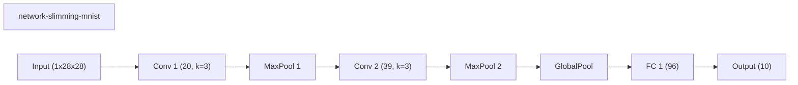

### wide-cnn-mnist-bn (best seed 99)
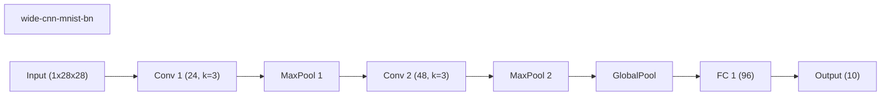

### dynamic-slimmable-mnist (best seed 7)
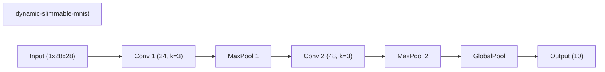

### instance-wise-sparsity-mnist (best seed 7)
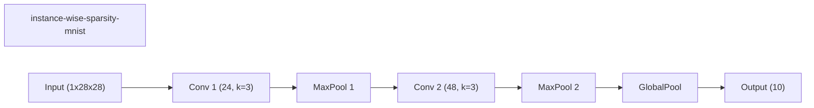

### channel-gating-mnist (best seed 7)
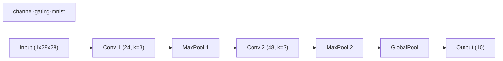

### iamnn-mnist (best seed 7)
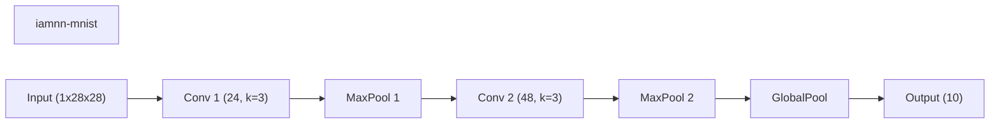

### conditional-computation-mnist (best seed 7)
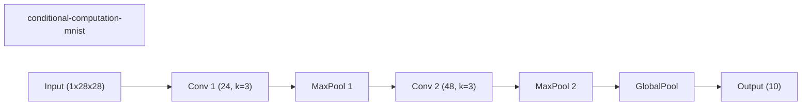

### skipnet-mnist (best seed 7)
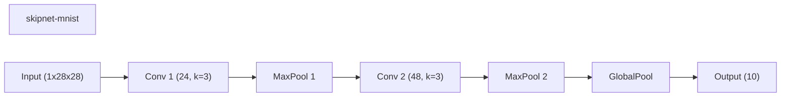

### fixed-cnn-mnist (best seed 99)
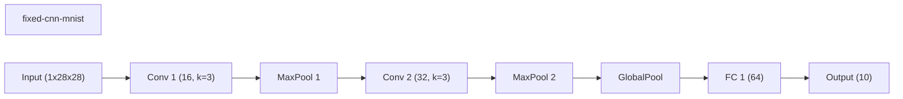
