# Benchmark Summary

Seeds: 7, 42

## Aggregate Plots

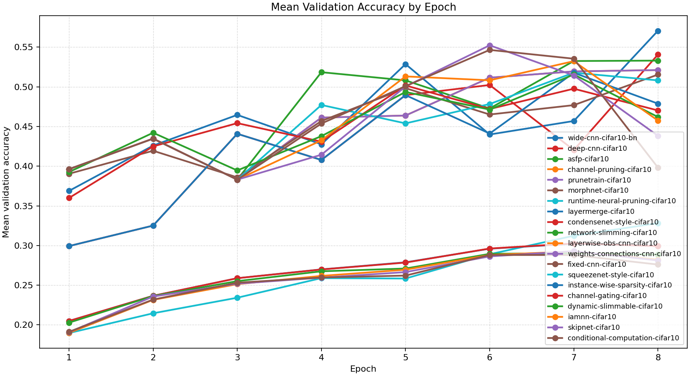

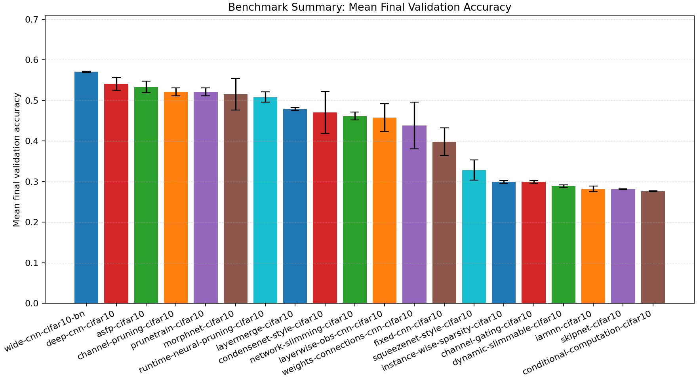

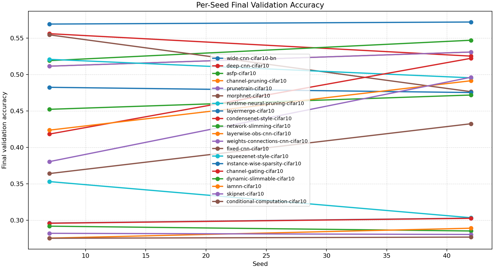

| Experiment | Type | Runs | Mean final val acc | Std final val acc | Mean best val acc | Mean adaptations | Mean final hidden dim | Best seed |
| --- | --- | ---: | ---: | ---: | ---: | ---: | ---: | ---: |
| wide-cnn-cifar10-bn | baseline | 2 | 0.5706 | 0.0014 | 0.5706 | 0.00 | 0.0 | 42 |
| deep-cnn-cifar10 | baseline | 2 | 0.5406 | 0.0154 | 0.5406 | 0.00 | 0.0 | 7 |
| asfp-cifar10 | dynamic | 2 | 0.5330 | 0.0140 | 0.5452 | 6.00 | 0.0 | 42 |
| channel-pruning-cifar10 | dynamic | 2 | 0.5211 | 0.0097 | 0.5303 | 2.00 | 0.0 | 42 |
| prunetrain-cifar10 | workflow | 2 | 0.5211 | 0.0097 | 0.5303 | 2.00 | 0.0 | 42 |
| morphnet-cifar10 | workflow | 2 | 0.5154 | 0.0390 | 0.5381 | 1.00 | 0.0 | 7 |
| runtime-neural-pruning-cifar10 | dynamic | 2 | 0.5081 | 0.0127 | 0.5305 | 3.00 | 0.0 | 42 |
| layermerge-cifar10 | workflow | 2 | 0.4788 | 0.0036 | 0.5177 | 1.00 | 0.0 | 7 |
| condensenet-style-cifar10 | baseline | 2 | 0.4702 | 0.0520 | 0.5235 | 0.00 | - | 7 |
| network-slimming-cifar10 | workflow | 2 | 0.4620 | 0.0098 | 0.5176 | 1.00 | 0.0 | 7 |
| layerwise-obs-cnn-cifar10 | dynamic | 2 | 0.4575 | 0.0339 | 0.5323 | 6.00 | 0.0 | 42 |
| weights-connections-cnn-cifar10 | dynamic | 2 | 0.4383 | 0.0579 | 0.5523 | 6.00 | 0.0 | 42 |
| fixed-cnn-cifar10 | baseline | 2 | 0.3982 | 0.0342 | 0.5465 | 0.00 | 0.0 | 42 |
| squeezenet-style-cifar10 | baseline | 2 | 0.3282 | 0.0248 | 0.3324 | 0.00 | - | 7 |
| instance-wise-sparsity-cifar10 | workflow | 2 | 0.2994 | 0.0034 | 0.3047 | 0.00 | - | 42 |
| channel-gating-cifar10 | workflow | 2 | 0.2992 | 0.0034 | 0.3047 | 0.00 | - | 42 |
| dynamic-slimmable-cifar10 | workflow | 2 | 0.2885 | 0.0033 | 0.2953 | 0.00 | - | 42 |
| iamnn-cifar10 | workflow | 2 | 0.2822 | 0.0068 | 0.2926 | 0.00 | - | 42 |
| skipnet-cifar10 | workflow | 2 | 0.2812 | 0.0008 | 0.2959 | 0.00 | - | 7 |
| conditional-computation-cifar10 | workflow | 2 | 0.2760 | 0.0008 | 0.2922 | 0.00 | - | 7 |

## Constraint Summary

| Experiment | Mean params | Mean nonzero params | Mean weight sparsity | Mean FLOP proxy | Mean activation elems |
| --- | ---: | ---: | ---: | ---: | ---: |
| wide-cnn-cifar10-bn | 92298 | 92298 | 0.0000 | 18498346 | 14090 |
| deep-cnn-cifar10 | 76066 | 76066 | 0.0000 | 10818346 | 10738 |
| asfp-cifar10 | 22625 | 22625 | 0.0000 | 4525546 | 6804 |
| channel-pruning-cifar10 | 38307 | 38307 | 0.0000 | 7640954 | 8821 |
| prunetrain-cifar10 | 38307 | 38307 | 0.0000 | 7640954 | 8821 |
| morphnet-cifar10 | 32468 | 32468 | 0.0000 | 6338410 | 7968 |
| runtime-neural-pruning-cifar10 | 29855 | 29855 | 0.0000 | 5927546 | 7789 |
| layermerge-cifar10 | 50530 | 50530 | 0.0000 | 10767466 | 10546 |
| condensenet-style-cifar10 | 29418 | 29418 | 0.0000 | 11159424 | 67594 |
| network-slimming-cifar10 | 37111 | 37111 | 0.0000 | 7434602 | 8740 |
| layerwise-obs-cnn-cifar10 | 53186 | 36882 | 0.3099 | 10772746 | 10578 |
| weights-connections-cnn-cifar10 | 53186 | 34771 | 0.3500 | 10772746 | 10578 |
| fixed-cnn-cifar10 | 53186 | 53186 | 0.0000 | 10772746 | 10578 |
| squeezenet-style-cifar10 | 46594 | 46594 | 0.0000 | 4317184 | 66570 |
| instance-wise-sparsity-cifar10 | 20042 | 20042 | 0.0000 | 11269386 | 12362 |
| channel-gating-cifar10 | 20042 | 20042 | 0.0000 | 11269386 | 12362 |
| dynamic-slimmable-cifar10 | 20042 | 20042 | 0.0000 | 11269386 | 12362 |
| iamnn-cifar10 | 20042 | 20042 | 0.0000 | 11269386 | 12362 |
| skipnet-cifar10 | 20042 | 20042 | 0.0000 | 11269386 | 12362 |
| conditional-computation-cifar10 | 20042 | 20042 | 0.0000 | 11269386 | 12362 |

## Experiment Notes

- `wide-cnn-cifar10-bn`: device=cuda; requested_device=auto; torch=2.11.0+cu128; cuda_available=True; torch_cuda=12.8; cuda_device=NVIDIA GeForce RTX 4070 Laptop GPU
- `deep-cnn-cifar10`: device=cuda; requested_device=auto; torch=2.11.0+cu128; cuda_available=True; torch_cuda=12.8; cuda_device=NVIDIA GeForce RTX 4070 Laptop GPU
- `asfp-cifar10`: adaptation=soft_filter_pruning; device=cuda; requested_device=auto; torch=2.11.0+cu128; cuda_available=True; torch_cuda=12.8; cuda_device=NVIDIA GeForce RTX 4070 Laptop GPU
- `channel-pruning-cifar10`: adaptation=channel_pruning; device=cuda; requested_device=auto; torch=2.11.0+cu128; cuda_available=True; torch_cuda=12.8; cuda_device=NVIDIA GeForce RTX 4070 Laptop GPU
- `prunetrain-cifar10`: workflow=prunetrain; device=cuda; requested_device=auto; torch=2.11.0+cu128; cuda_available=True; torch_cuda=12.8; cuda_device=NVIDIA GeForce RTX 4070 Laptop GPU
- `morphnet-cifar10`: workflow=morphnet; device=cuda; requested_device=auto; torch=2.11.0+cu128; cuda_available=True; torch_cuda=12.8; cuda_device=NVIDIA GeForce RTX 4070 Laptop GPU
- `runtime-neural-pruning-cifar10`: adaptation=runtime_neural_pruning; device=cuda; requested_device=auto; torch=2.11.0+cu128; cuda_available=True; torch_cuda=12.8; cuda_device=NVIDIA GeForce RTX 4070 Laptop GPU
- `layermerge-cifar10`: workflow=layermerge; device=cuda; requested_device=auto; torch=2.11.0+cu128; cuda_available=True; torch_cuda=12.8; cuda_device=NVIDIA GeForce RTX 4070 Laptop GPU
- `condensenet-style-cifar10`: device=cuda; requested_device=auto; torch=2.11.0+cu128; cuda_available=True; torch_cuda=12.8; cuda_device=NVIDIA GeForce RTX 4070 Laptop GPU
- `network-slimming-cifar10`: workflow=network_slimming; device=cuda; requested_device=auto; torch=2.11.0+cu128; cuda_available=True; torch_cuda=12.8; cuda_device=NVIDIA GeForce RTX 4070 Laptop GPU
- `layerwise-obs-cnn-cifar10`: adaptation=layerwise_obs; device=cuda; requested_device=auto; torch=2.11.0+cu128; cuda_available=True; torch_cuda=12.8; cuda_device=NVIDIA GeForce RTX 4070 Laptop GPU
- `weights-connections-cnn-cifar10`: adaptation=weights_connections; device=cuda; requested_device=auto; torch=2.11.0+cu128; cuda_available=True; torch_cuda=12.8; cuda_device=NVIDIA GeForce RTX 4070 Laptop GPU
- `fixed-cnn-cifar10`: device=cuda; requested_device=auto; torch=2.11.0+cu128; cuda_available=True; torch_cuda=12.8; cuda_device=NVIDIA GeForce RTX 4070 Laptop GPU
- `squeezenet-style-cifar10`: device=cuda; requested_device=auto; torch=2.11.0+cu128; cuda_available=True; torch_cuda=12.8; cuda_device=NVIDIA GeForce RTX 4070 Laptop GPU
- `instance-wise-sparsity-cifar10`: workflow=instance_wise_sparsity; route_summary={'policy': 'dynamic_width', 'mode': 'eval', 'gate_mode': 'learned', 'gate_metric': 'margin', 'confidence_threshold': 0.36, 'target_cost_ratio': 0.68, 'target_accept_rate': 0.4, 'route_counts': {'0.5': 0, '0.75': 0, '1.0': 136}, 'trace_samples': [{'sample': 0, 'width': 1.0}, {'sample': 1, 'width': 1.0}, {'sample': 2, 'width': 1.0}, {'sample': 3, 'width': 1.0}, {'sample': 4, 'width': 1.0}, {'sample': 5, 'width': 1.0}, {'sample': 6, 'width': 1.0}, {'sample': 7, 'width': 1.0}], 'mean_width': 1.0, 'mean_cost_ratio': 1.0}; device=cuda; requested_device=auto; torch=2.11.0+cu128; cuda_available=True; torch_cuda=12.8; cuda_device=NVIDIA GeForce RTX 4070 Laptop GPU
- `channel-gating-cifar10`: workflow=channel_gating; route_summary={'policy': 'dynamic_width', 'mode': 'eval', 'gate_mode': 'learned', 'gate_metric': 'margin', 'confidence_threshold': 0.36, 'target_cost_ratio': 0.78, 'target_accept_rate': 0.48, 'route_counts': {'0.5': 0, '0.75': 0, '1.0': 136}, 'trace_samples': [{'sample': 0, 'width': 1.0}, {'sample': 1, 'width': 1.0}, {'sample': 2, 'width': 1.0}, {'sample': 3, 'width': 1.0}, {'sample': 4, 'width': 1.0}, {'sample': 5, 'width': 1.0}, {'sample': 6, 'width': 1.0}, {'sample': 7, 'width': 1.0}], 'mean_width': 1.0, 'mean_cost_ratio': 1.0}; device=cuda; requested_device=auto; torch=2.11.0+cu128; cuda_available=True; torch_cuda=12.8; cuda_device=NVIDIA GeForce RTX 4070 Laptop GPU
- `dynamic-slimmable-cifar10`: workflow=dynamic_slimmable; route_summary={'policy': 'dynamic_width', 'mode': 'eval', 'gate_mode': 'learned', 'gate_metric': 'margin', 'confidence_threshold': 0.36, 'target_cost_ratio': 0.78, 'target_accept_rate': 0.48, 'route_counts': {'0.5': 0, '0.75': 0, '1.0': 136}, 'trace_samples': [{'sample': 0, 'width': 1.0}, {'sample': 1, 'width': 1.0}, {'sample': 2, 'width': 1.0}, {'sample': 3, 'width': 1.0}, {'sample': 4, 'width': 1.0}, {'sample': 5, 'width': 1.0}, {'sample': 6, 'width': 1.0}, {'sample': 7, 'width': 1.0}], 'mean_width': 1.0, 'mean_cost_ratio': 1.0}; device=cuda; requested_device=auto; torch=2.11.0+cu128; cuda_available=True; torch_cuda=12.8; cuda_device=NVIDIA GeForce RTX 4070 Laptop GPU
- `iamnn-cifar10`: workflow=iamnn; route_summary={'policy': 'early_exit', 'mode': 'eval', 'gate_mode': 'learned', 'gate_metric': 'margin', 'confidence_threshold': 0.12, 'target_cost_ratio': 0.72, 'target_accept_rate': 0.16, 'early_exit_fraction': 0.1618, 'eligible_fraction': 0.1985, 'mean_gate_score': 0.0104, 'max_gate_score': 0.0652, 'mean_exit_confidence': 0.2818, 'full_path_fraction': 0.8382, 'trace_samples': [{'sample': 0, 'path': 'full'}, {'sample': 1, 'path': 'full'}, {'sample': 2, 'path': 'early'}, {'sample': 3, 'path': 'full'}, {'sample': 4, 'path': 'early'}, {'sample': 5, 'path': 'full'}, {'sample': 6, 'path': 'full'}, {'sample': 7, 'path': 'full'}], 'mean_width': 1.0, 'mean_cost_ratio': 0.8455}; device=cuda; requested_device=auto; torch=2.11.0+cu128; cuda_available=True; torch_cuda=12.8; cuda_device=NVIDIA GeForce RTX 4070 Laptop GPU
- `skipnet-cifar10`: workflow=skipnet; route_summary={'policy': 'early_exit', 'mode': 'eval', 'gate_mode': 'learned', 'gate_metric': 'margin', 'confidence_threshold': 0.12, 'target_cost_ratio': 0.78, 'target_accept_rate': 0.16, 'early_exit_fraction': 0.1618, 'eligible_fraction': 0.3235, 'mean_gate_score': 0.0159, 'max_gate_score': 0.0527, 'mean_exit_confidence': 0.3199, 'full_path_fraction': 0.8382, 'trace_samples': [{'sample': 0, 'path': 'full'}, {'sample': 1, 'path': 'full'}, {'sample': 2, 'path': 'full'}, {'sample': 3, 'path': 'full'}, {'sample': 4, 'path': 'full'}, {'sample': 5, 'path': 'full'}, {'sample': 6, 'path': 'full'}, {'sample': 7, 'path': 'full'}], 'mean_width': 1.0, 'mean_cost_ratio': 0.8455}; device=cuda; requested_device=auto; torch=2.11.0+cu128; cuda_available=True; torch_cuda=12.8; cuda_device=NVIDIA GeForce RTX 4070 Laptop GPU
- `conditional-computation-cifar10`: workflow=conditional_computation; route_summary={'policy': 'early_exit', 'mode': 'eval', 'gate_mode': 'learned', 'gate_metric': 'margin', 'confidence_threshold': 0.12, 'target_cost_ratio': 0.78, 'target_accept_rate': 0.16, 'early_exit_fraction': 0.1618, 'eligible_fraction': 0.2794, 'mean_gate_score': 0.0116, 'max_gate_score': 0.0536, 'mean_exit_confidence': 0.3136, 'full_path_fraction': 0.8382, 'trace_samples': [{'sample': 0, 'path': 'full'}, {'sample': 1, 'path': 'full'}, {'sample': 2, 'path': 'full'}, {'sample': 3, 'path': 'full'}, {'sample': 4, 'path': 'full'}, {'sample': 5, 'path': 'full'}, {'sample': 6, 'path': 'full'}, {'sample': 7, 'path': 'full'}], 'mean_width': 1.0, 'mean_cost_ratio': 0.8455}; device=cuda; requested_device=auto; torch=2.11.0+cu128; cuda_available=True; torch_cuda=12.8; cuda_device=NVIDIA GeForce RTX 4070 Laptop GPU

## Per-Seed Results

### wide-cnn-cifar10-bn
- seed 7: final=0.5692, best=0.5692, adaptations=0, params=92298, nonzero=92298, sparsity=0.0000
- seed 42: final=0.5720, best=0.5720, adaptations=0, params=92298, nonzero=92298, sparsity=0.0000

### deep-cnn-cifar10
- seed 7: final=0.5560, best=0.5560, adaptations=0, params=76066, nonzero=76066, sparsity=0.0000
- seed 42: final=0.5252, best=0.5252, adaptations=0, params=76066, nonzero=76066, sparsity=0.0000

### asfp-cifar10
- seed 7: final=0.5190, best=0.5434, adaptations=6, params=22625, nonzero=22625, sparsity=0.0000
- seed 42: final=0.5470, best=0.5470, adaptations=6, params=22625, nonzero=22625, sparsity=0.0000

### channel-pruning-cifar10
- seed 7: final=0.5114, best=0.5298, adaptations=2, params=38307, nonzero=38307, sparsity=0.0000
- seed 42: final=0.5308, best=0.5308, adaptations=2, params=38307, nonzero=38307, sparsity=0.0000

### prunetrain-cifar10
- seed 7: final=0.5114, best=0.5298, adaptations=2, params=38307, nonzero=38307, sparsity=0.0000
- seed 42: final=0.5308, best=0.5308, adaptations=2, params=38307, nonzero=38307, sparsity=0.0000

### morphnet-cifar10
- seed 7: final=0.5544, best=0.5544, adaptations=1, params=32468, nonzero=32468, sparsity=0.0000
- seed 42: final=0.4764, best=0.5218, adaptations=1, params=32468, nonzero=32468, sparsity=0.0000

### runtime-neural-pruning-cifar10
- seed 7: final=0.5208, best=0.5208, adaptations=3, params=29855, nonzero=29855, sparsity=0.0000
- seed 42: final=0.4954, best=0.5402, adaptations=3, params=29855, nonzero=29855, sparsity=0.0000

### layermerge-cifar10
- seed 7: final=0.4824, best=0.5454, adaptations=1, params=50530, nonzero=50530, sparsity=0.0000
- seed 42: final=0.4752, best=0.4900, adaptations=1, params=50530, nonzero=50530, sparsity=0.0000

### condensenet-style-cifar10
- seed 7: final=0.4182, best=0.5248, adaptations=0, params=29418, nonzero=29418, sparsity=0.0000
- seed 42: final=0.5222, best=0.5222, adaptations=0, params=29418, nonzero=29418, sparsity=0.0000

### network-slimming-cifar10
- seed 7: final=0.4522, best=0.5322, adaptations=1, params=37111, nonzero=37111, sparsity=0.0000
- seed 42: final=0.4718, best=0.5030, adaptations=1, params=37111, nonzero=37111, sparsity=0.0000

### layerwise-obs-cnn-cifar10
- seed 7: final=0.4236, best=0.5164, adaptations=6, params=53186, nonzero=36882, sparsity=0.3099
- seed 42: final=0.4914, best=0.5482, adaptations=6, params=53186, nonzero=36882, sparsity=0.3099

### weights-connections-cnn-cifar10
- seed 7: final=0.3804, best=0.5516, adaptations=6, params=53186, nonzero=34771, sparsity=0.3500
- seed 42: final=0.4962, best=0.5530, adaptations=6, params=53186, nonzero=34771, sparsity=0.3500

### fixed-cnn-cifar10
- seed 7: final=0.3640, best=0.5368, adaptations=0, params=53186, nonzero=53186, sparsity=0.0000
- seed 42: final=0.4324, best=0.5562, adaptations=0, params=53186, nonzero=53186, sparsity=0.0000

### squeezenet-style-cifar10
- seed 7: final=0.3530, best=0.3530, adaptations=0, params=46594, nonzero=46594, sparsity=0.0000
- seed 42: final=0.3034, best=0.3118, adaptations=0, params=46594, nonzero=46594, sparsity=0.0000

### instance-wise-sparsity-cifar10
- seed 7: final=0.2960, best=0.2960, adaptations=0, params=20042, nonzero=20042, sparsity=0.0000
- seed 42: final=0.3028, best=0.3134, adaptations=0, params=20042, nonzero=20042, sparsity=0.0000

### channel-gating-cifar10
- seed 7: final=0.2958, best=0.2958, adaptations=0, params=20042, nonzero=20042, sparsity=0.0000
- seed 42: final=0.3026, best=0.3136, adaptations=0, params=20042, nonzero=20042, sparsity=0.0000

### dynamic-slimmable-cifar10
- seed 7: final=0.2918, best=0.2918, adaptations=0, params=20042, nonzero=20042, sparsity=0.0000
- seed 42: final=0.2852, best=0.2988, adaptations=0, params=20042, nonzero=20042, sparsity=0.0000

### iamnn-cifar10
- seed 7: final=0.2754, best=0.2926, adaptations=0, params=20042, nonzero=20042, sparsity=0.0000
- seed 42: final=0.2890, best=0.2926, adaptations=0, params=20042, nonzero=20042, sparsity=0.0000

### skipnet-cifar10
- seed 7: final=0.2820, best=0.3012, adaptations=0, params=20042, nonzero=20042, sparsity=0.0000
- seed 42: final=0.2804, best=0.2906, adaptations=0, params=20042, nonzero=20042, sparsity=0.0000

### conditional-computation-cifar10
- seed 7: final=0.2752, best=0.2930, adaptations=0, params=20042, nonzero=20042, sparsity=0.0000
- seed 42: final=0.2768, best=0.2914, adaptations=0, params=20042, nonzero=20042, sparsity=0.0000

## Representative Stage Histories

### wide-cnn-cifar10-bn (best seed 42)
- train: epochs=8, range=1..8, adaptation_enabled=False, final_val=0.5720000267028809

### deep-cnn-cifar10 (best seed 7)
- train: epochs=8, range=1..8, adaptation_enabled=False, final_val=0.5559999942779541

### asfp-cifar10 (best seed 42)
- train: epochs=8, range=1..8, adaptation_enabled=True, final_val=0.546999990940094

### channel-pruning-cifar10 (best seed 42)
- train: epochs=8, range=1..8, adaptation_enabled=True, final_val=0.5307999849319458

### prunetrain-cifar10 (best seed 42)
- prunetrain_segment_1: epochs=3, range=1..3, adaptation_enabled=False, final_val=0.36320000886917114
- prunetrain_segment_2: epochs=3, range=4..6, adaptation_enabled=False, final_val=0.5108000040054321
- prunetrain_segment_3: epochs=2, range=7..8, adaptation_enabled=False, final_val=0.5307999849319458

### morphnet-cifar10 (best seed 7)
- morphnet_resource_train: epochs=5, range=1..5, adaptation_enabled=False, final_val=0.49459999799728394
- morphnet_finetune: epochs=3, range=6..8, adaptation_enabled=False, final_val=0.5544000267982483

### runtime-neural-pruning-cifar10 (best seed 42)
- train: epochs=8, range=1..8, adaptation_enabled=True, final_val=0.49540001153945923

### layermerge-cifar10 (best seed 7)
- layermerge_pretrain: epochs=5, range=1..5, adaptation_enabled=False, final_val=0.5157999992370605
- layermerge_finetune: epochs=3, range=6..8, adaptation_enabled=False, final_val=0.48240000009536743

### condensenet-style-cifar10 (best seed 7)
- train: epochs=8, range=1..8, adaptation_enabled=False, final_val=0.41819998621940613

### network-slimming-cifar10 (best seed 7)
- network_slimming_sparse_train: epochs=5, range=1..5, adaptation_enabled=False, final_val=0.48399999737739563
- network_slimming_finetune: epochs=3, range=6..8, adaptation_enabled=False, final_val=0.4521999955177307

### layerwise-obs-cnn-cifar10 (best seed 42)
- train: epochs=8, range=1..8, adaptation_enabled=True, final_val=0.49140000343322754

### weights-connections-cnn-cifar10 (best seed 42)
- train: epochs=8, range=1..8, adaptation_enabled=True, final_val=0.49619999527931213

### fixed-cnn-cifar10 (best seed 42)
- train: epochs=8, range=1..8, adaptation_enabled=False, final_val=0.4323999881744385

### squeezenet-style-cifar10 (best seed 7)
- train: epochs=8, range=1..8, adaptation_enabled=False, final_val=0.3529999852180481

### instance-wise-sparsity-cifar10 (best seed 42)
- instance_wise_sparsity_warmup: epochs=3, range=1..3, adaptation_enabled=False, final_val=0.2574000060558319
- instance_wise_sparsity_routing: epochs=3, range=4..6, adaptation_enabled=False, final_val=0.313400000333786
- instance_wise_sparsity_consolidation: epochs=2, range=7..8, adaptation_enabled=False, final_val=0.3027999997138977

### channel-gating-cifar10 (best seed 42)
- channel_gating_warmup: epochs=3, range=1..3, adaptation_enabled=False, final_val=0.2574000060558319
- channel_gating_routing: epochs=5, range=4..8, adaptation_enabled=False, final_val=0.3025999963283539

### dynamic-slimmable-cifar10 (best seed 42)
- dynamic_slimmable_warmup: epochs=3, range=1..3, adaptation_enabled=False, final_val=0.24940000474452972
- dynamic_slimmable_routing: epochs=5, range=4..8, adaptation_enabled=False, final_val=0.28519999980926514

### iamnn-cifar10 (best seed 42)
- iamnn_warmup: epochs=3, range=1..3, adaptation_enabled=False, final_val=0.2492000013589859
- iamnn_routing: epochs=3, range=4..6, adaptation_enabled=False, final_val=0.29260000586509705
- iamnn_consolidation: epochs=2, range=7..8, adaptation_enabled=False, final_val=0.289000004529953

### skipnet-cifar10 (best seed 7)
- skipnet_warmup: epochs=3, range=1..3, adaptation_enabled=False, final_val=0.25040000677108765
- skipnet_routing: epochs=5, range=4..8, adaptation_enabled=False, final_val=0.28200000524520874

### conditional-computation-cifar10 (best seed 7)
- conditional_computation_warmup: epochs=3, range=1..3, adaptation_enabled=False, final_val=0.2533999979496002
- conditional_computation_routing: epochs=5, range=4..8, adaptation_enabled=False, final_val=0.2752000093460083

## Representative Architectures

### wide-cnn-cifar10-bn (best seed 42)
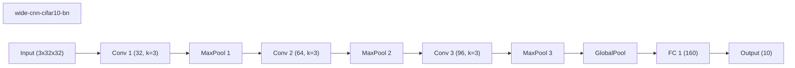

### deep-cnn-cifar10 (best seed 7)
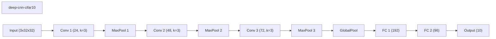

### asfp-cifar10 (best seed 42)
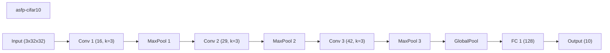

### channel-pruning-cifar10 (best seed 42)
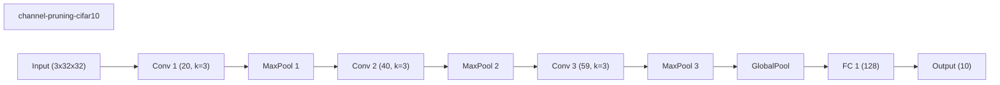

### prunetrain-cifar10 (best seed 42)
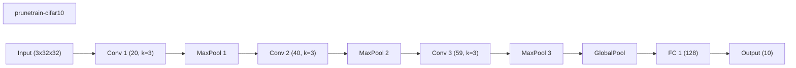

### morphnet-cifar10 (best seed 7)
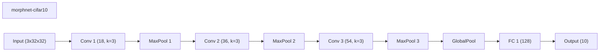

### runtime-neural-pruning-cifar10 (best seed 42)
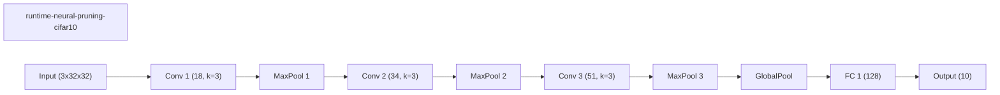

### layermerge-cifar10 (best seed 7)

### condensenet-style-cifar10 (best seed 7)
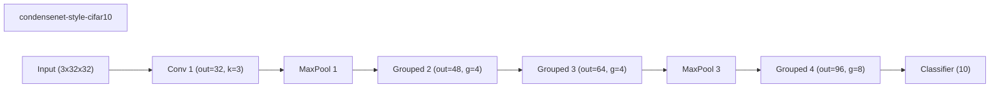

### network-slimming-cifar10 (best seed 7)

### layerwise-obs-cnn-cifar10 (best seed 42)
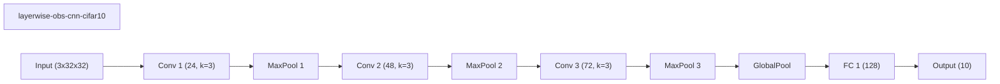

### weights-connections-cnn-cifar10 (best seed 42)

### fixed-cnn-cifar10 (best seed 42)
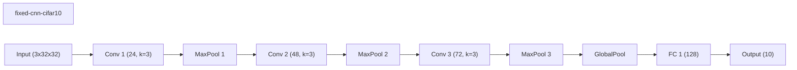

### squeezenet-style-cifar10 (best seed 7)
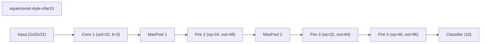

### instance-wise-sparsity-cifar10 (best seed 42)

### channel-gating-cifar10 (best seed 42)
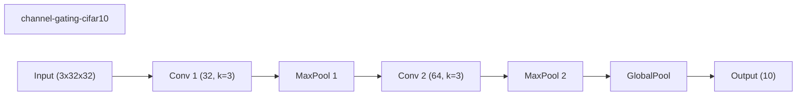

### dynamic-slimmable-cifar10 (best seed 42)
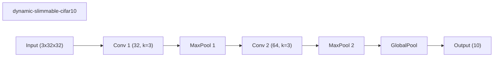

### iamnn-cifar10 (best seed 42)

### skipnet-cifar10 (best seed 7)
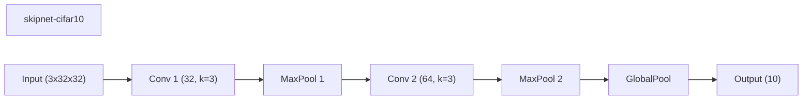

### conditional-computation-cifar10 (best seed 7)
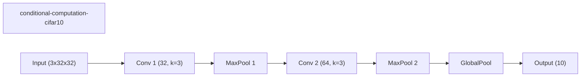
