# Benchmark Summary

Seeds: 7, 23, 42

## Aggregate Plots

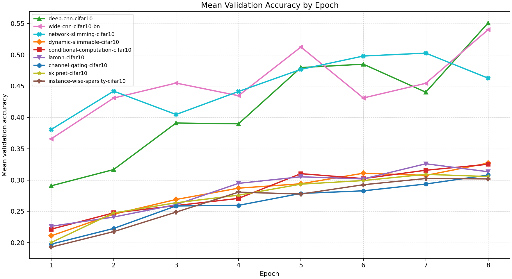

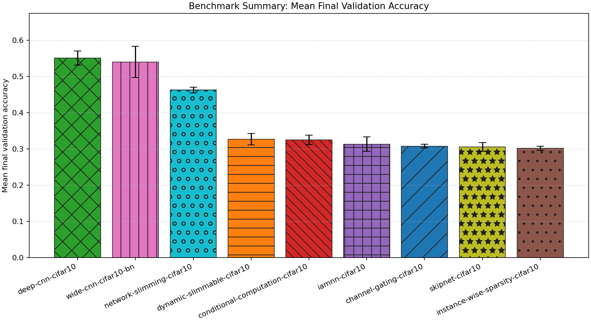

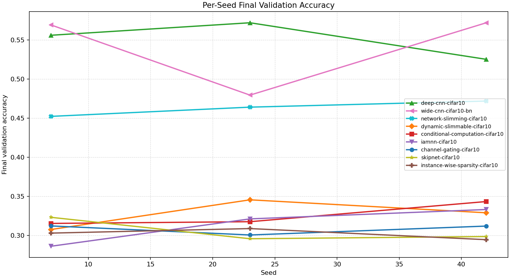

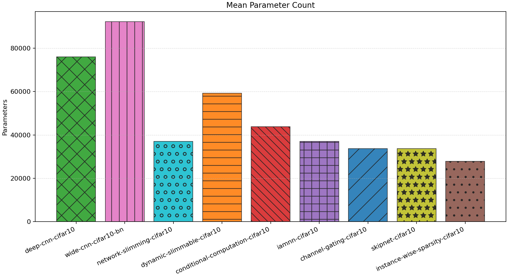

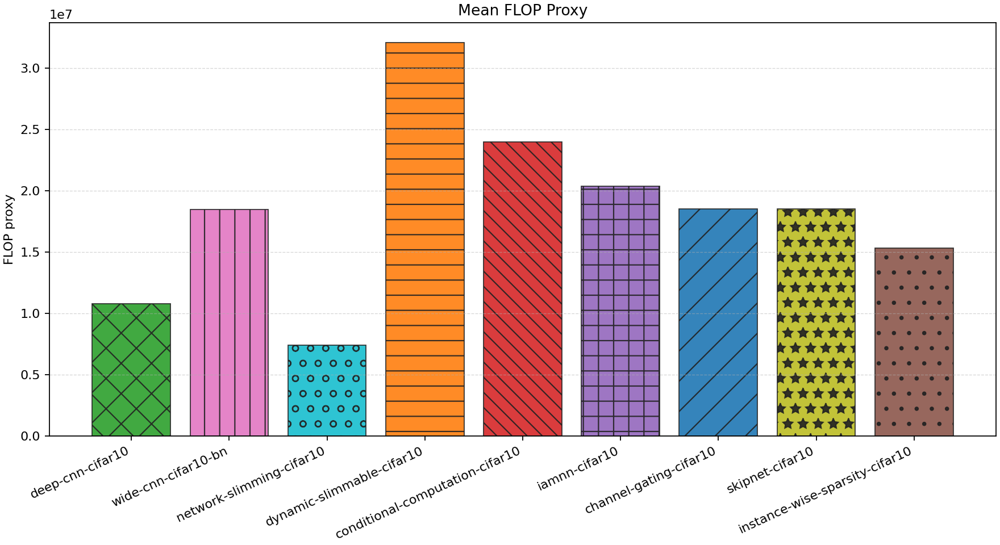

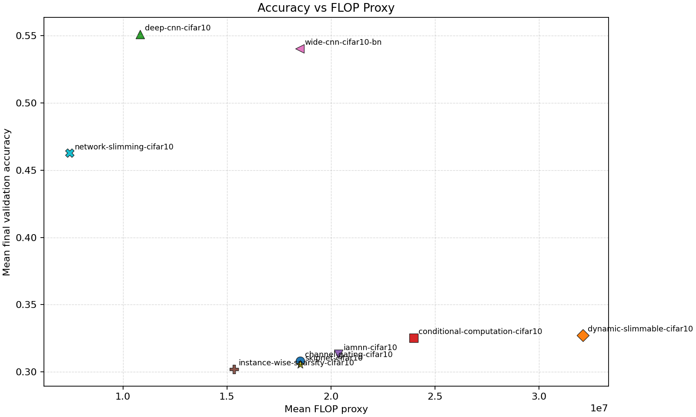

| Experiment | Type | Runs | Mean final val acc | Std final val acc | Mean best val acc | Mean adaptations | Mean final hidden dim | Best seed |
| --- | --- | ---: | ---: | ---: | ---: | ---: | ---: | ---: |
| deep-cnn-cifar10 | baseline | 3 | 0.5511 | 0.0194 | 0.5511 | 0.00 | 0.0 | 23 |
| wide-cnn-cifar10-bn | baseline | 3 | 0.5402 | 0.0430 | 0.5405 | 0.00 | 0.0 | 42 |
| network-slimming-cifar10 | workflow | 3 | 0.4627 | 0.0081 | 0.5289 | 1.00 | 0.0 | 23 |
| dynamic-slimmable-cifar10 | workflow | 3 | 0.3272 | 0.0156 | 0.3332 | 0.00 | - | 23 |
| conditional-computation-cifar10 | workflow | 3 | 0.3253 | 0.0127 | 0.3253 | 0.00 | - | 42 |
| iamnn-cifar10 | workflow | 3 | 0.3133 | 0.0199 | 0.3261 | 0.00 | - | 42 |
| channel-gating-cifar10 | workflow | 3 | 0.3081 | 0.0054 | 0.3081 | 0.00 | - | 7 |
| skipnet-cifar10 | workflow | 3 | 0.3057 | 0.0123 | 0.3110 | 0.00 | - | 7 |
| instance-wise-sparsity-cifar10 | workflow | 3 | 0.3019 | 0.0058 | 0.3069 | 0.00 | - | 23 |

## Constraint Summary

| Experiment | Mean params | Mean nonzero params | Mean weight sparsity | Mean FLOP proxy | Mean activation elems |
| --- | ---: | ---: | ---: | ---: | ---: |
| deep-cnn-cifar10 | 76066 | 76066 | 0.0000 | 10818346 | 10738 |
| wide-cnn-cifar10-bn | 92298 | 92298 | 0.0000 | 18498346 | 14090 |
| network-slimming-cifar10 | 37111 | 37111 | 0.0000 | 7434602 | 8740 |
| dynamic-slimmable-cifar10 | 59258 | 59258 | 0.0000 | 32107722 | 21626 |
| conditional-computation-cifar10 | 43882 | 43882 | 0.0000 | 23981962 | 18538 |
| iamnn-cifar10 | 37058 | 37058 | 0.0000 | 20361450 | 16994 |
| channel-gating-cifar10 | 33778 | 33778 | 0.0000 | 18513130 | 15970 |
| skipnet-cifar10 | 33778 | 33778 | 0.0000 | 18513130 | 15970 |
| instance-wise-sparsity-cifar10 | 27818 | 27818 | 0.0000 | 15334986 | 14426 |

## Experiment Notes

- `deep-cnn-cifar10`: device=cuda; requested_device=auto; torch=2.11.0+cu128; cuda_available=True; torch_cuda=12.8; cuda_device=NVIDIA GeForce RTX 4070 Laptop GPU
- `wide-cnn-cifar10-bn`: device=cuda; requested_device=auto; torch=2.11.0+cu128; cuda_available=True; torch_cuda=12.8; cuda_device=NVIDIA GeForce RTX 4070 Laptop GPU
- `network-slimming-cifar10`: workflow=network_slimming; device=cuda; requested_device=auto; torch=2.11.0+cu128; cuda_available=True; torch_cuda=12.8; cuda_device=NVIDIA GeForce RTX 4070 Laptop GPU
- `dynamic-slimmable-cifar10`: workflow=dynamic_slimmable; route_summary={'policy': 'dynamic_width', 'mode': 'eval', 'gate_mode': 'learned', 'gate_metric': 'margin', 'confidence_threshold': 0.22, 'target_cost_ratio': 0.9, 'target_accept_rate': 0.4, 'stage_target_accept_rates': {'0.75': 0.1282, '0.875': 0.24, '1.0': None}, 'route_counts': {'0.75': 17, '0.875': 29, '1.0': 90}, 'trace_samples': [{'sample': 0, 'width': 1.0}, {'sample': 1, 'width': 0.875}, {'sample': 2, 'width': 0.75}, {'sample': 3, 'width': 1.0}, {'sample': 4, 'width': 0.875}, {'sample': 5, 'width': 0.875}, {'sample': 6, 'width': 1.0}, {'sample': 7, 'width': 1.0}], 'mean_width': 0.9421, 'mean_cost_ratio': 0.8966}; device=cuda; requested_device=auto; torch=2.11.0+cu128; cuda_available=True; torch_cuda=12.8; cuda_device=NVIDIA GeForce RTX 4070 Laptop GPU
- `conditional-computation-cifar10`: workflow=conditional_computation; route_summary={'policy': 'early_exit', 'mode': 'eval', 'gate_mode': 'learned', 'gate_metric': 'margin', 'confidence_threshold': 0.22, 'target_cost_ratio': 0.92, 'target_accept_rate': 0.08, 'early_exit_fraction': 0.0809, 'eligible_fraction': 0.1765, 'mean_gate_score': 0.0101, 'max_gate_score': 0.0767, 'mean_exit_confidence': 0.3422, 'full_path_fraction': 0.9191, 'trace_samples': [{'sample': 0, 'path': 'full'}, {'sample': 1, 'path': 'full'}, {'sample': 2, 'path': 'full'}, {'sample': 3, 'path': 'full'}, {'sample': 4, 'path': 'full'}, {'sample': 5, 'path': 'full'}, {'sample': 6, 'path': 'full'}, {'sample': 7, 'path': 'full'}], 'mean_width': 1.0, 'mean_cost_ratio': 0.9216}; device=cuda; requested_device=auto; torch=2.11.0+cu128; cuda_available=True; torch_cuda=12.8; cuda_device=NVIDIA GeForce RTX 4070 Laptop GPU
- `iamnn-cifar10`: workflow=iamnn; route_summary={'policy': 'early_exit', 'mode': 'eval', 'gate_mode': 'learned', 'gate_metric': 'margin', 'confidence_threshold': 0.2, 'target_cost_ratio': 0.72, 'target_accept_rate': 0.12, 'early_exit_fraction': 0.1176, 'eligible_fraction': 0.2279, 'mean_gate_score': 0.0538, 'max_gate_score': 0.0843, 'mean_exit_confidence': 0.3286, 'full_path_fraction': 0.8824, 'trace_samples': [{'sample': 0, 'path': 'full'}, {'sample': 1, 'path': 'full'}, {'sample': 2, 'path': 'full'}, {'sample': 3, 'path': 'full'}, {'sample': 4, 'path': 'early'}, {'sample': 5, 'path': 'full'}, {'sample': 6, 'path': 'full'}, {'sample': 7, 'path': 'full'}], 'mean_width': 1.0, 'mean_cost_ratio': 0.8862}; device=cuda; requested_device=auto; torch=2.11.0+cu128; cuda_available=True; torch_cuda=12.8; cuda_device=NVIDIA GeForce RTX 4070 Laptop GPU
- `channel-gating-cifar10`: workflow=channel_gating; route_summary={'policy': 'dynamic_width', 'mode': 'eval', 'gate_mode': 'learned', 'gate_metric': 'margin', 'confidence_threshold': 0.2, 'target_cost_ratio': 0.88, 'target_accept_rate': 0.44, 'stage_target_accept_rates': {'0.75': 0.1515, '0.875': 0.28, '1.0': None}, 'route_counts': {'0.75': 24, '0.875': 31, '1.0': 81}, 'trace_samples': [{'sample': 0, 'width': 0.75}, {'sample': 1, 'width': 1.0}, {'sample': 2, 'width': 1.0}, {'sample': 3, 'width': 1.0}, {'sample': 4, 'width': 1.0}, {'sample': 5, 'width': 1.0}, {'sample': 6, 'width': 1.0}, {'sample': 7, 'width': 1.0}], 'mean_width': 0.9274, 'mean_cost_ratio': 0.8713}; device=cuda; requested_device=auto; torch=2.11.0+cu128; cuda_available=True; torch_cuda=12.8; cuda_device=NVIDIA GeForce RTX 4070 Laptop GPU
- `skipnet-cifar10`: workflow=skipnet; route_summary={'policy': 'early_exit', 'mode': 'eval', 'gate_mode': 'learned', 'gate_metric': 'margin', 'confidence_threshold': 0.21, 'target_cost_ratio': 0.9, 'target_accept_rate': 0.1, 'early_exit_fraction': 0.2868, 'eligible_fraction': 0.2132, 'mean_gate_score': 0.1815, 'max_gate_score': 0.3476, 'mean_exit_confidence': 0.2467, 'full_path_fraction': 0.7132, 'trace_samples': [{'sample': 0, 'path': 'early'}, {'sample': 1, 'path': 'full'}, {'sample': 2, 'path': 'full'}, {'sample': 3, 'path': 'full'}, {'sample': 4, 'path': 'early'}, {'sample': 5, 'path': 'early'}, {'sample': 6, 'path': 'full'}, {'sample': 7, 'path': 'full'}], 'mean_width': 1.0, 'mean_cost_ratio': 0.7227}; device=cuda; requested_device=auto; torch=2.11.0+cu128; cuda_available=True; torch_cuda=12.8; cuda_device=NVIDIA GeForce RTX 4070 Laptop GPU
- `instance-wise-sparsity-cifar10`: workflow=instance_wise_sparsity; route_summary={'policy': 'dynamic_width', 'mode': 'eval', 'gate_mode': 'learned', 'gate_metric': 'margin', 'confidence_threshold': 0.18, 'target_cost_ratio': 0.68, 'target_accept_rate': 0.4, 'stage_target_accept_rates': {'0.75': 0.1633}, 'route_counts': {'0.75': 136, '0.875': 0, '1.0': 0}, 'trace_samples': [{'sample': 0, 'width': 0.75}, {'sample': 1, 'width': 0.75}, {'sample': 2, 'width': 0.75}, {'sample': 3, 'width': 0.75}, {'sample': 4, 'width': 0.75}, {'sample': 5, 'width': 0.75}, {'sample': 6, 'width': 0.75}, {'sample': 7, 'width': 0.75}], 'mean_width': 0.75, 'mean_cost_ratio': 0.5693}; device=cuda; requested_device=auto; torch=2.11.0+cu128; cuda_available=True; torch_cuda=12.8; cuda_device=NVIDIA GeForce RTX 4070 Laptop GPU

## Per-Seed Results

### deep-cnn-cifar10
- seed 7: final=0.5560, best=0.5560, adaptations=0, params=76066, nonzero=76066, sparsity=0.0000
- seed 23: final=0.5720, best=0.5720, adaptations=0, params=76066, nonzero=76066, sparsity=0.0000
- seed 42: final=0.5252, best=0.5252, adaptations=0, params=76066, nonzero=76066, sparsity=0.0000

### wide-cnn-cifar10-bn
- seed 7: final=0.5692, best=0.5692, adaptations=0, params=92298, nonzero=92298, sparsity=0.0000
- seed 23: final=0.4794, best=0.4802, adaptations=0, params=92298, nonzero=92298, sparsity=0.0000
- seed 42: final=0.5720, best=0.5720, adaptations=0, params=92298, nonzero=92298, sparsity=0.0000

### network-slimming-cifar10
- seed 7: final=0.4522, best=0.5322, adaptations=1, params=37111, nonzero=37111, sparsity=0.0000
- seed 23: final=0.4640, best=0.5516, adaptations=1, params=37111, nonzero=37111, sparsity=0.0000
- seed 42: final=0.4718, best=0.5030, adaptations=1, params=37111, nonzero=37111, sparsity=0.0000

### dynamic-slimmable-cifar10
- seed 7: final=0.3074, best=0.3254, adaptations=0, params=59258, nonzero=59258, sparsity=0.0000
- seed 23: final=0.3454, best=0.3454, adaptations=0, params=59258, nonzero=59258, sparsity=0.0000
- seed 42: final=0.3288, best=0.3288, adaptations=0, params=59258, nonzero=59258, sparsity=0.0000

### conditional-computation-cifar10
- seed 7: final=0.3152, best=0.3152, adaptations=0, params=43882, nonzero=43882, sparsity=0.0000
- seed 23: final=0.3174, best=0.3174, adaptations=0, params=43882, nonzero=43882, sparsity=0.0000
- seed 42: final=0.3432, best=0.3432, adaptations=0, params=43882, nonzero=43882, sparsity=0.0000

### iamnn-cifar10
- seed 7: final=0.2860, best=0.3156, adaptations=0, params=37058, nonzero=37058, sparsity=0.0000
- seed 23: final=0.3210, best=0.3256, adaptations=0, params=37058, nonzero=37058, sparsity=0.0000
- seed 42: final=0.3330, best=0.3370, adaptations=0, params=37058, nonzero=37058, sparsity=0.0000

### channel-gating-cifar10
- seed 7: final=0.3120, best=0.3120, adaptations=0, params=33778, nonzero=33778, sparsity=0.0000
- seed 23: final=0.3004, best=0.3004, adaptations=0, params=33778, nonzero=33778, sparsity=0.0000
- seed 42: final=0.3118, best=0.3118, adaptations=0, params=33778, nonzero=33778, sparsity=0.0000

### skipnet-cifar10
- seed 7: final=0.3230, best=0.3390, adaptations=0, params=33778, nonzero=33778, sparsity=0.0000
- seed 23: final=0.2956, best=0.2956, adaptations=0, params=33778, nonzero=33778, sparsity=0.0000
- seed 42: final=0.2984, best=0.2984, adaptations=0, params=33778, nonzero=33778, sparsity=0.0000

### instance-wise-sparsity-cifar10
- seed 7: final=0.3028, best=0.3078, adaptations=0, params=27818, nonzero=27818, sparsity=0.0000
- seed 23: final=0.3086, best=0.3184, adaptations=0, params=27818, nonzero=27818, sparsity=0.0000
- seed 42: final=0.2944, best=0.2944, adaptations=0, params=27818, nonzero=27818, sparsity=0.0000

## Representative Stage Histories

### deep-cnn-cifar10 (best seed 23)
- train: epochs=8, range=1..8, adaptation_enabled=False, final_val=0.5720000267028809

### wide-cnn-cifar10-bn (best seed 42)
- train: epochs=8, range=1..8, adaptation_enabled=False, final_val=0.5720000267028809

### network-slimming-cifar10 (best seed 23)
- network_slimming_sparse_train: epochs=5, range=1..5, adaptation_enabled=False, final_val=0.44339999556541443
- network_slimming_finetune: epochs=3, range=6..8, adaptation_enabled=False, final_val=0.46399998664855957

### dynamic-slimmable-cifar10 (best seed 23)
- dynamic_slimmable_warmup: epochs=4, range=1..4, adaptation_enabled=False, final_val=0.29260000586509705
- dynamic_slimmable_routing: epochs=4, range=5..8, adaptation_enabled=False, final_val=0.34540000557899475

### conditional-computation-cifar10 (best seed 42)
- conditional_computation_warmup: epochs=4, range=1..4, adaptation_enabled=False, final_val=0.29120001196861267
- conditional_computation_routing: epochs=4, range=5..8, adaptation_enabled=False, final_val=0.3431999981403351

### iamnn-cifar10 (best seed 42)
- iamnn_warmup: epochs=4, range=1..4, adaptation_enabled=False, final_val=0.2874000072479248
- iamnn_routing: epochs=2, range=5..6, adaptation_enabled=False, final_val=0.2782000005245209
- iamnn_consolidation: epochs=2, range=7..8, adaptation_enabled=False, final_val=0.3330000042915344

### channel-gating-cifar10 (best seed 7)
- channel_gating_warmup: epochs=4, range=1..4, adaptation_enabled=False, final_val=0.22200000286102295
- channel_gating_routing: epochs=4, range=5..8, adaptation_enabled=False, final_val=0.31200000643730164

### skipnet-cifar10 (best seed 7)
- skipnet_warmup: epochs=4, range=1..4, adaptation_enabled=False, final_val=0.24799999594688416
- skipnet_routing: epochs=4, range=5..8, adaptation_enabled=False, final_val=0.3230000138282776

### instance-wise-sparsity-cifar10 (best seed 23)
- instance_wise_sparsity_warmup: epochs=4, range=1..4, adaptation_enabled=False, final_val=0.27480000257492065
- instance_wise_sparsity_routing: epochs=2, range=5..6, adaptation_enabled=False, final_val=0.2797999978065491
- instance_wise_sparsity_consolidation: epochs=2, range=7..8, adaptation_enabled=False, final_val=0.3086000084877014

## Representative Architectures

### deep-cnn-cifar10 (best seed 23)
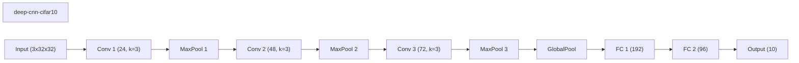

### wide-cnn-cifar10-bn (best seed 42)
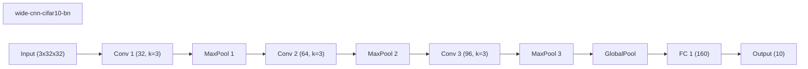

### network-slimming-cifar10 (best seed 23)
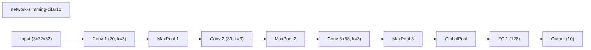

### dynamic-slimmable-cifar10 (best seed 23)
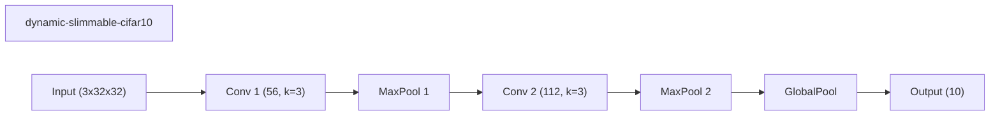

### conditional-computation-cifar10 (best seed 42)
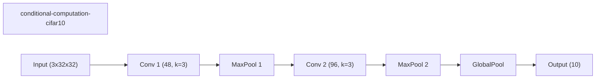

### iamnn-cifar10 (best seed 42)
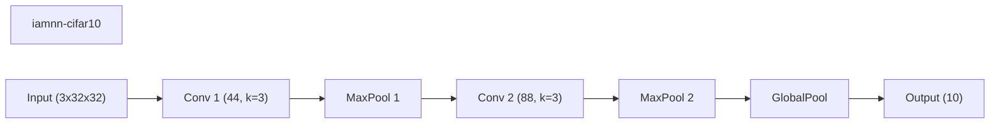

### channel-gating-cifar10 (best seed 7)
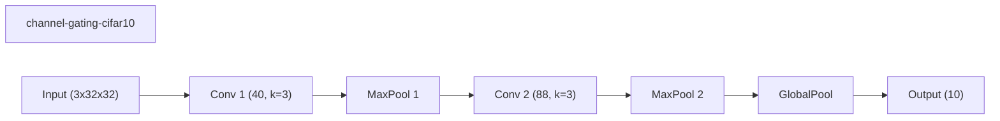

### skipnet-cifar10 (best seed 7)

### instance-wise-sparsity-cifar10 (best seed 23)
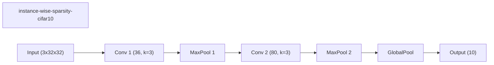
