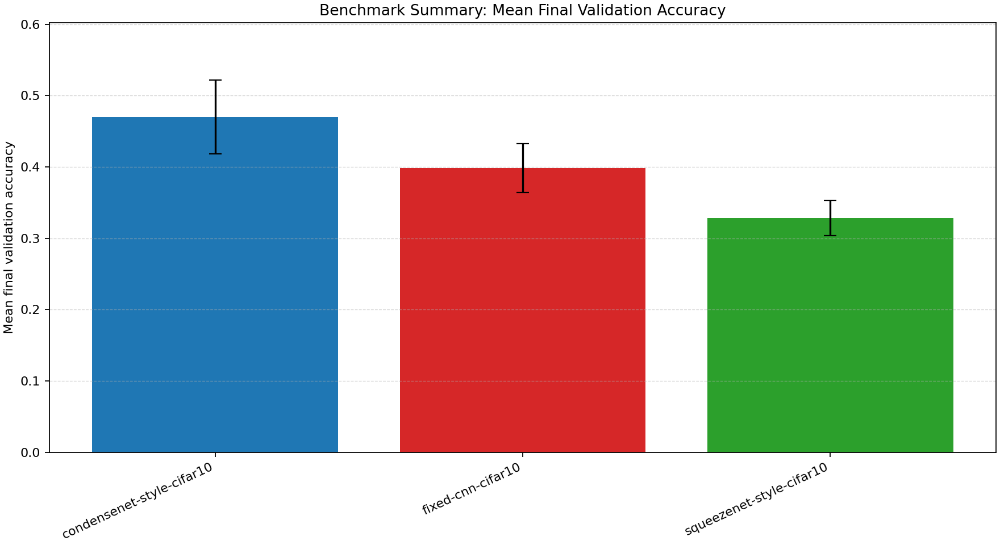
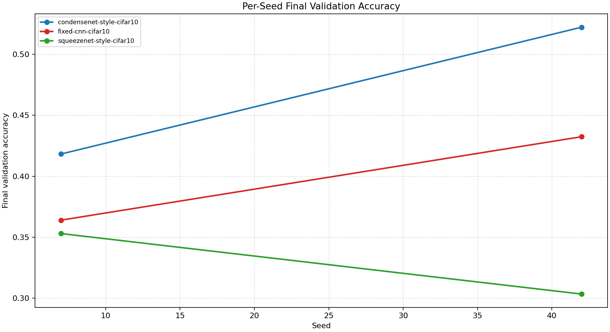
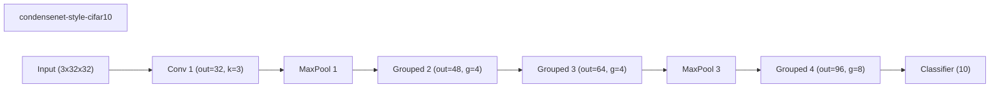
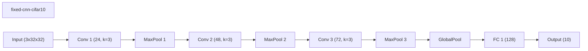
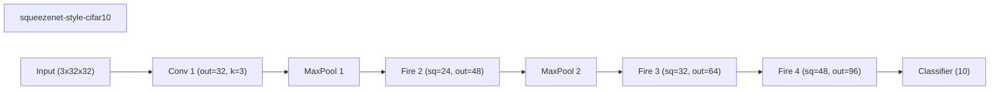

# Benchmark Summary

Seeds: 7, 42

## Aggregate Plots

| Experiment | Type | Runs | Mean final val acc | Std final val acc | Mean best val acc | Mean adaptations | Mean final hidden dim | Best seed |
| --- | --- | ---: | ---: | ---: | ---: | ---: | ---: | ---: |
| condensenet-style-cifar10 | baseline | 2 | 0.4702 | 0.0520 | 0.5235 | 0.00 | - | 7 |
| fixed-cnn-cifar10 | baseline | 2 | 0.3982 | 0.0342 | 0.5465 | 0.00 | 0.0 | 42 |
| squeezenet-style-cifar10 | baseline | 2 | 0.3282 | 0.0248 | 0.3324 | 0.00 | - | 7 |

## Constraint Summary

| Experiment | Mean params | Mean nonzero params | Mean weight sparsity | Mean FLOP proxy | Mean activation elems |
| --- | ---: | ---: | ---: | ---: | ---: |
| condensenet-style-cifar10 | 29418 | 29418 | 0.0000 | 11159424 | 67594 |
| fixed-cnn-cifar10 | 53186 | 53186 | 0.0000 | 10772746 | 10578 |
| squeezenet-style-cifar10 | 46594 | 46594 | 0.0000 | 4317184 | 66570 |

## Experiment Notes

- `condensenet-style-cifar10`: device=cuda; requested_device=auto; torch=2.11.0+cu128; cuda_available=True; torch_cuda=12.8; cuda_device=NVIDIA GeForce RTX 4070 Laptop GPU
- `fixed-cnn-cifar10`: device=cuda; requested_device=auto; torch=2.11.0+cu128; cuda_available=True; torch_cuda=12.8; cuda_device=NVIDIA GeForce RTX 4070 Laptop GPU
- `squeezenet-style-cifar10`: device=cuda; requested_device=auto; torch=2.11.0+cu128; cuda_available=True; torch_cuda=12.8; cuda_device=NVIDIA GeForce RTX 4070 Laptop GPU

## Per-Seed Results

### condensenet-style-cifar10
- seed 7: final=0.4182, best=0.5248, adaptations=0, params=29418, nonzero=29418, sparsity=0.0000
- seed 42: final=0.5222, best=0.5222, adaptations=0, params=29418, nonzero=29418, sparsity=0.0000

### fixed-cnn-cifar10
- seed 7: final=0.3640, best=0.5368, adaptations=0, params=53186, nonzero=53186, sparsity=0.0000
- seed 42: final=0.4324, best=0.5562, adaptations=0, params=53186, nonzero=53186, sparsity=0.0000

### squeezenet-style-cifar10
- seed 7: final=0.3530, best=0.3530, adaptations=0, params=46594, nonzero=46594, sparsity=0.0000
- seed 42: final=0.3034, best=0.3118, adaptations=0, params=46594, nonzero=46594, sparsity=0.0000

## Representative Stage Histories

### condensenet-style-cifar10 (best seed 7)
- train: epochs=8, range=1..8, adaptation_enabled=False, final_val=0.41819998621940613

### fixed-cnn-cifar10 (best seed 42)
- train: epochs=8, range=1..8, adaptation_enabled=False, final_val=0.4323999881744385

### squeezenet-style-cifar10 (best seed 7)
- train: epochs=8, range=1..8, adaptation_enabled=False, final_val=0.3529999852180481

## Representative Architectures

### condensenet-style-cifar10 (best seed 7)

### fixed-cnn-cifar10 (best seed 42)

### squeezenet-style-cifar10 (best seed 7)

