# Benchmark Summary

Seeds: 7, 42

## Aggregate Plots

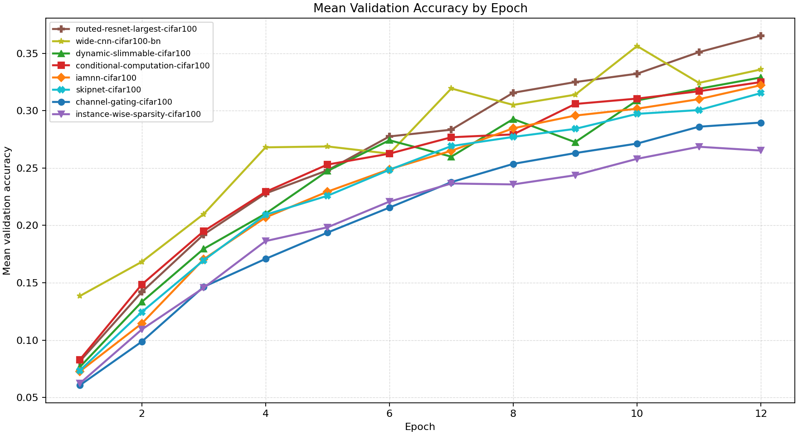

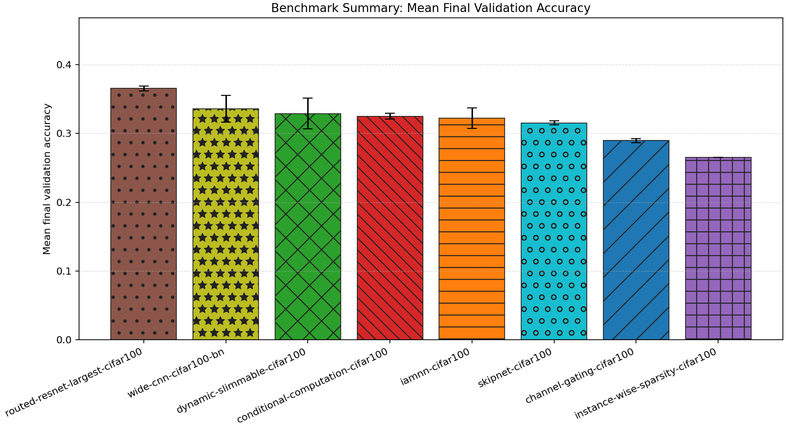

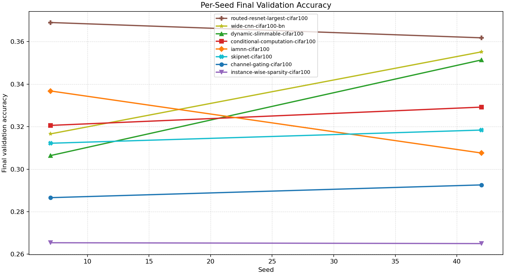

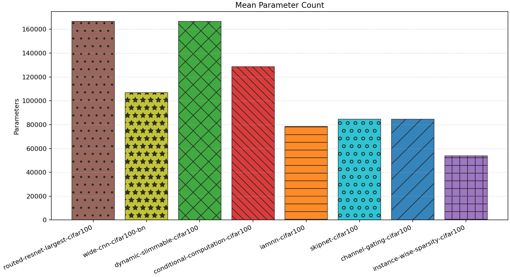

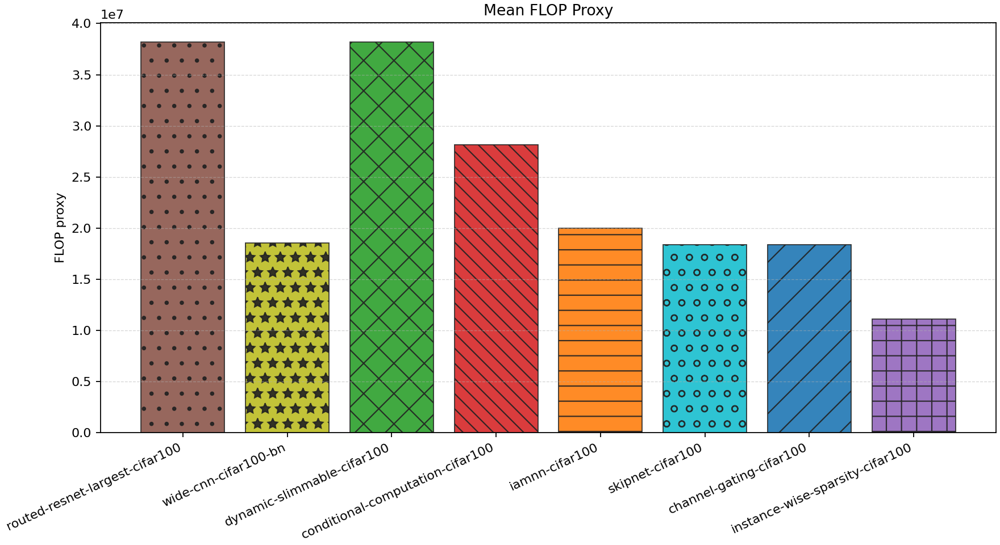

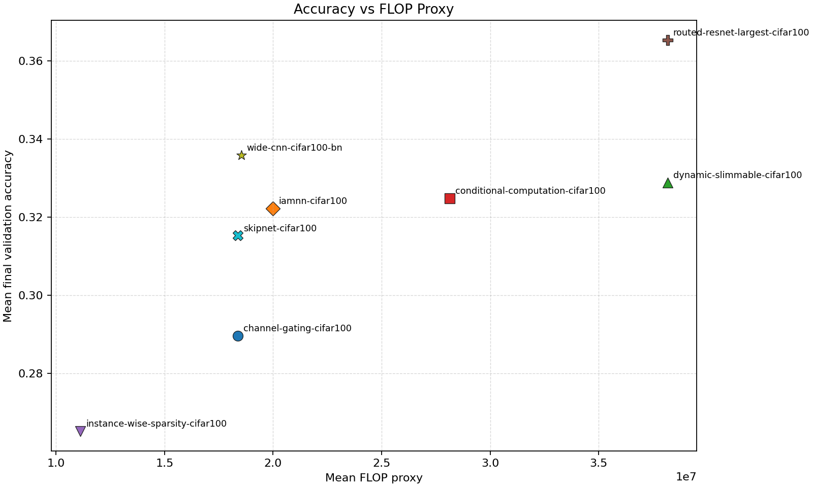

| Experiment | Type | Runs | Mean final val acc | Std final val acc | Mean best val acc | Mean adaptations | Mean final hidden dim | Best seed |
| --- | --- | ---: | ---: | ---: | ---: | ---: | ---: | ---: |
| routed-resnet-largest-cifar100 | baseline | 2 | 0.3654 | 0.0036 | 0.3654 | 0.00 | - | 7 |
| wide-cnn-cifar100-bn | baseline | 2 | 0.3359 | 0.0193 | 0.3563 | 0.00 | 0.0 | 42 |
| dynamic-slimmable-cifar100 | workflow | 2 | 0.3289 | 0.0225 | 0.3344 | 0.00 | - | 42 |
| conditional-computation-cifar100 | workflow | 2 | 0.3249 | 0.0043 | 0.3249 | 0.00 | - | 42 |
| iamnn-cifar100 | workflow | 2 | 0.3222 | 0.0146 | 0.3222 | 0.00 | - | 7 |
| skipnet-cifar100 | workflow | 2 | 0.3153 | 0.0031 | 0.3153 | 0.00 | - | 42 |
| channel-gating-cifar100 | workflow | 2 | 0.2896 | 0.0030 | 0.2896 | 0.00 | - | 42 |
| instance-wise-sparsity-cifar100 | workflow | 2 | 0.2652 | 0.0002 | 0.2695 | 0.00 | - | 42 |

## Accuracy-FLOP Pareto Frontier

- `instance-wise-sparsity-cifar100`: acc=0.2652, flop_proxy=11127780, params=53828
- `skipnet-cifar100`: acc=0.3153, flop_proxy=18372964, params=84484
- `wide-cnn-cifar100-bn`: acc=0.3359, flop_proxy=18527236, params=106788
- `routed-resnet-largest-cifar100`: acc=0.3654, flop_proxy=38171748, params=166532

## Constraint Summary

| Experiment | Mean params | Mean nonzero params | Mean weight sparsity | Mean FLOP proxy | Mean activation elems |
| --- | ---: | ---: | ---: | ---: | ---: |
| routed-resnet-largest-cifar100 | 166532 | 166532 | 0.0000 | 38171748 | 20708 |
| wide-cnn-cifar100-bn | 106788 | 106788 | 0.0000 | 18527236 | 14180 |
| dynamic-slimmable-cifar100 | 166532 | 166532 | 0.0000 | 38171748 | 20708 |
| conditional-computation-cifar100 | 128620 | 128620 | 0.0000 | 28127140 | 17500 |
| iamnn-cifar100 | 78436 | 78436 | 0.0000 | 19995940 | 15148 |
| skipnet-cifar100 | 84484 | 84484 | 0.0000 | 18372964 | 14020 |
| channel-gating-cifar100 | 84484 | 84484 | 0.0000 | 18372964 | 14020 |
| instance-wise-sparsity-cifar100 | 53828 | 53828 | 0.0000 | 11127780 | 10676 |

## Experiment Notes

- `routed-resnet-largest-cifar100`: route_summary={'policy': 'largest', 'routing_family': 'slimmable_pyramid', 'mode': 'eval', 'gate_mode': 'learned', 'gate_metric': 'confidence', 'used_width': 1.0, 'mean_width': 1.0, 'mean_cost_ratio': 1.0}; device=cuda; requested_device=auto; torch=2.11.0+cu128; cuda_available=True; torch_cuda=12.8; cuda_device=NVIDIA GeForce RTX 4070 Laptop GPU
- `wide-cnn-cifar100-bn`: device=cuda; requested_device=auto; torch=2.11.0+cu128; cuda_available=True; torch_cuda=12.8; cuda_device=NVIDIA GeForce RTX 4070 Laptop GPU
- `dynamic-slimmable-cifar100`: workflow=dynamic_slimmable; route_summary={'policy': 'dynamic_width', 'routing_family': 'slimmable_pyramid', 'mode': 'eval', 'gate_mode': 'learned', 'gate_metric': 'margin', 'confidence_threshold': 0.24, 'target_cost_ratio': 0.9, 'target_accept_rate': 0.4, 'stage_target_accept_rates': {'0.75': 0.1168, '0.875': 0.22, '1.0': None}, 'route_counts': {'0.75': 16, '0.875': 26, '1.0': 94}, 'trace_samples': [{'sample': 0, 'width': 1.0}, {'sample': 1, 'width': 1.0}, {'sample': 2, 'width': 0.875}, {'sample': 3, 'width': 1.0}, {'sample': 4, 'width': 0.75}, {'sample': 5, 'width': 1.0}, {'sample': 6, 'width': 0.875}, {'sample': 7, 'width': 1.0}], 'mean_width': 0.9467, 'mean_cost_ratio': 0.9038}; device=cuda; requested_device=auto; torch=2.11.0+cu128; cuda_available=True; torch_cuda=12.8; cuda_device=NVIDIA GeForce RTX 4070 Laptop GPU
- `conditional-computation-cifar100`: workflow=conditional_computation; route_summary={'policy': 'early_exit', 'routing_family': 'early_exit_cascade', 'mode': 'eval', 'gate_mode': 'learned', 'gate_metric': 'margin', 'confidence_threshold': 0.24, 'target_cost_ratio': 0.92, 'target_accept_rate': 0.08, 'early_exit_fraction': 0.0809, 'eligible_fraction': 0.2132, 'mean_gate_score': 0.0202, 'max_gate_score': 0.2067, 'mean_exit_confidence': 0.5304, 'full_path_fraction': 0.9191, 'trace_samples': [{'sample': 0, 'path': 'full'}, {'sample': 1, 'path': 'full'}, {'sample': 2, 'path': 'full'}, {'sample': 3, 'path': 'full'}, {'sample': 4, 'path': 'full'}, {'sample': 5, 'path': 'full'}, {'sample': 6, 'path': 'early'}, {'sample': 7, 'path': 'full'}], 'mean_width': 1.0, 'mean_cost_ratio': 0.9245}; device=cuda; requested_device=auto; torch=2.11.0+cu128; cuda_available=True; torch_cuda=12.8; cuda_device=NVIDIA GeForce RTX 4070 Laptop GPU
- `iamnn-cifar100`: workflow=iamnn; route_summary={'policy': 'early_exit', 'routing_family': 'iterative_refine', 'mode': 'eval', 'gate_mode': 'learned', 'gate_metric': 'margin', 'confidence_threshold': 0.22, 'target_cost_ratio': 0.72, 'target_accept_rate': 0.1, 'early_exit_fraction': 0.1029, 'eligible_fraction': 0.5809, 'mean_gate_score': 0.1018, 'max_gate_score': 0.2595, 'mean_exit_confidence': 0.9015, 'full_path_fraction': 0.8971, 'trace_samples': [{'sample': 0, 'path': 'full'}, {'sample': 1, 'path': 'full'}, {'sample': 2, 'path': 'full'}, {'sample': 3, 'path': 'full'}, {'sample': 4, 'path': 'full'}, {'sample': 5, 'path': 'full'}, {'sample': 6, 'path': 'full'}, {'sample': 7, 'path': 'full'}], 'mean_width': 1.0, 'mean_cost_ratio': 0.9545}; device=cuda; requested_device=auto; torch=2.11.0+cu128; cuda_available=True; torch_cuda=12.8; cuda_device=NVIDIA GeForce RTX 4070 Laptop GPU
- `skipnet-cifar100`: workflow=skipnet; route_summary={'policy': 'early_exit', 'routing_family': 'skip_cascade', 'mode': 'eval', 'gate_mode': 'learned', 'gate_metric': 'margin', 'confidence_threshold': 0.23, 'target_cost_ratio': 0.88, 'target_accept_rate': 0.1, 'early_exit_fraction': 0.3382, 'eligible_fraction': 0.4485, 'mean_gate_score': 0.2011, 'max_gate_score': 0.4816, 'mean_exit_confidence': 0.455, 'full_path_fraction': 0.6618, 'trace_samples': [{'sample': 0, 'path': 'full'}, {'sample': 1, 'path': 'full'}, {'sample': 2, 'path': 'full'}, {'sample': 3, 'path': 'early'}, {'sample': 4, 'path': 'early'}, {'sample': 5, 'path': 'full'}, {'sample': 6, 'path': 'early'}, {'sample': 7, 'path': 'full'}], 'mean_width': 1.0, 'mean_cost_ratio': 0.7716}; device=cuda; requested_device=auto; torch=2.11.0+cu128; cuda_available=True; torch_cuda=12.8; cuda_device=NVIDIA GeForce RTX 4070 Laptop GPU
- `channel-gating-cifar100`: workflow=channel_gating; route_summary={'policy': 'dynamic_width', 'routing_family': 'channel_gate_pyramid', 'mode': 'eval', 'gate_mode': 'learned', 'gate_metric': 'margin', 'confidence_threshold': 0.22, 'target_cost_ratio': 0.86, 'target_accept_rate': 0.46, 'stage_target_accept_rates': {'0.75': 0.1633, '0.875': 0.3, '1.0': None}, 'route_counts': {'0.75': 86, '0.875': 27, '1.0': 23}, 'trace_samples': [{'sample': 0, 'width': 0.875}, {'sample': 1, 'width': 0.75}, {'sample': 2, 'width': 0.75}, {'sample': 3, 'width': 0.75}, {'sample': 4, 'width': 0.75}, {'sample': 5, 'width': 0.75}, {'sample': 6, 'width': 0.75}, {'sample': 7, 'width': 1.0}], 'mean_width': 0.8171, 'mean_cost_ratio': 0.6772}; device=cuda; requested_device=auto; torch=2.11.0+cu128; cuda_available=True; torch_cuda=12.8; cuda_device=NVIDIA GeForce RTX 4070 Laptop GPU
- `instance-wise-sparsity-cifar100`: workflow=instance_wise_sparsity; route_summary={'policy': 'dynamic_width', 'routing_family': 'instance_sparse_pyramid', 'mode': 'eval', 'gate_mode': 'learned', 'gate_metric': 'margin', 'confidence_threshold': 0.2, 'target_cost_ratio': 0.68, 'target_accept_rate': 0.4, 'stage_target_accept_rates': {'0.75': 0.1876}, 'route_counts': {'0.75': 136, '0.875': 0, '1.0': 0}, 'trace_samples': [{'sample': 0, 'width': 0.75}, {'sample': 1, 'width': 0.75}, {'sample': 2, 'width': 0.75}, {'sample': 3, 'width': 0.75}, {'sample': 4, 'width': 0.75}, {'sample': 5, 'width': 0.75}, {'sample': 6, 'width': 0.75}, {'sample': 7, 'width': 0.75}], 'mean_width': 0.75, 'mean_cost_ratio': 0.5632}; device=cuda; requested_device=auto; torch=2.11.0+cu128; cuda_available=True; torch_cuda=12.8; cuda_device=NVIDIA GeForce RTX 4070 Laptop GPU

## Per-Seed Results

### routed-resnet-largest-cifar100
- seed 7: final=0.3690, best=0.3690, adaptations=0, params=166532, nonzero=166532, sparsity=0.0000
- seed 42: final=0.3618, best=0.3618, adaptations=0, params=166532, nonzero=166532, sparsity=0.0000

### wide-cnn-cifar100-bn
- seed 7: final=0.3166, best=0.3440, adaptations=0, params=106788, nonzero=106788, sparsity=0.0000
- seed 42: final=0.3552, best=0.3686, adaptations=0, params=106788, nonzero=106788, sparsity=0.0000

### dynamic-slimmable-cifar100
- seed 7: final=0.3064, best=0.3174, adaptations=0, params=166532, nonzero=166532, sparsity=0.0000
- seed 42: final=0.3514, best=0.3514, adaptations=0, params=166532, nonzero=166532, sparsity=0.0000

### conditional-computation-cifar100
- seed 7: final=0.3206, best=0.3206, adaptations=0, params=128620, nonzero=128620, sparsity=0.0000
- seed 42: final=0.3292, best=0.3292, adaptations=0, params=128620, nonzero=128620, sparsity=0.0000

### iamnn-cifar100
- seed 7: final=0.3368, best=0.3368, adaptations=0, params=78436, nonzero=78436, sparsity=0.0000
- seed 42: final=0.3076, best=0.3076, adaptations=0, params=78436, nonzero=78436, sparsity=0.0000

### skipnet-cifar100
- seed 7: final=0.3122, best=0.3122, adaptations=0, params=84484, nonzero=84484, sparsity=0.0000
- seed 42: final=0.3184, best=0.3184, adaptations=0, params=84484, nonzero=84484, sparsity=0.0000

### channel-gating-cifar100
- seed 7: final=0.2866, best=0.2866, adaptations=0, params=84484, nonzero=84484, sparsity=0.0000
- seed 42: final=0.2926, best=0.2926, adaptations=0, params=84484, nonzero=84484, sparsity=0.0000

### instance-wise-sparsity-cifar100
- seed 7: final=0.2654, best=0.2654, adaptations=0, params=53828, nonzero=53828, sparsity=0.0000
- seed 42: final=0.2650, best=0.2736, adaptations=0, params=53828, nonzero=53828, sparsity=0.0000

## Representative Stage Histories

### routed-resnet-largest-cifar100 (best seed 7)
- train: epochs=12, range=1..12, adaptation_enabled=False, final_val=0.36899998784065247

### wide-cnn-cifar100-bn (best seed 42)
- train: epochs=12, range=1..12, adaptation_enabled=False, final_val=0.35519999265670776

### dynamic-slimmable-cifar100 (best seed 42)
- dynamic_slimmable_warmup: epochs=5, range=1..5, adaptation_enabled=False, final_val=0.2484000027179718
- dynamic_slimmable_routing: epochs=7, range=6..12, adaptation_enabled=False, final_val=0.3513999879360199

### conditional-computation-cifar100 (best seed 42)
- conditional_computation_warmup: epochs=5, range=1..5, adaptation_enabled=False, final_val=0.25940001010894775
- conditional_computation_routing: epochs=7, range=6..12, adaptation_enabled=False, final_val=0.32919999957084656

### iamnn-cifar100 (best seed 7)
- iamnn_warmup: epochs=4, range=1..4, adaptation_enabled=False, final_val=0.2199999988079071
- iamnn_routing: epochs=5, range=5..9, adaptation_enabled=False, final_val=0.3046000003814697
- iamnn_consolidation: epochs=3, range=10..12, adaptation_enabled=False, final_val=0.3368000090122223

### skipnet-cifar100 (best seed 42)
- skipnet_warmup: epochs=5, range=1..5, adaptation_enabled=False, final_val=0.2362000048160553
- skipnet_routing: epochs=7, range=6..12, adaptation_enabled=False, final_val=0.31839999556541443

### channel-gating-cifar100 (best seed 42)
- channel_gating_warmup: epochs=5, range=1..5, adaptation_enabled=False, final_val=0.1923999935388565
- channel_gating_routing: epochs=7, range=6..12, adaptation_enabled=False, final_val=0.29260000586509705

### instance-wise-sparsity-cifar100 (best seed 42)
- instance_wise_sparsity_warmup: epochs=4, range=1..4, adaptation_enabled=False, final_val=0.1891999989748001
- instance_wise_sparsity_routing: epochs=5, range=5..9, adaptation_enabled=False, final_val=0.24619999527931213
- instance_wise_sparsity_consolidation: epochs=3, range=10..12, adaptation_enabled=False, final_val=0.26499998569488525

## Representative Architectures

### routed-resnet-largest-cifar100 (best seed 7)
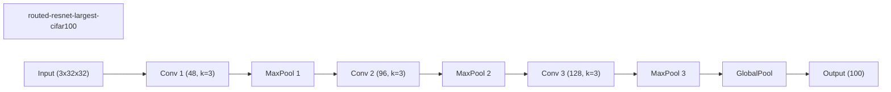

### wide-cnn-cifar100-bn (best seed 42)
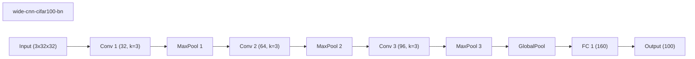

### dynamic-slimmable-cifar100 (best seed 42)
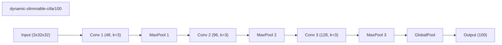

### conditional-computation-cifar100 (best seed 42)
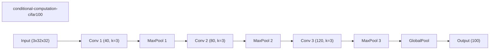

### iamnn-cifar100 (best seed 7)
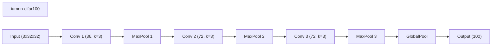

### skipnet-cifar100 (best seed 42)
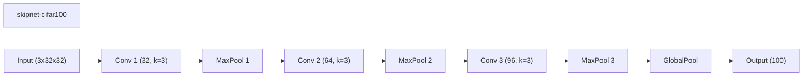

### channel-gating-cifar100 (best seed 42)
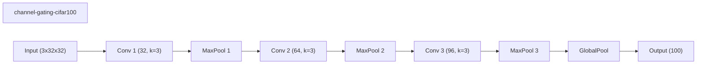

### instance-wise-sparsity-cifar100 (best seed 42)

