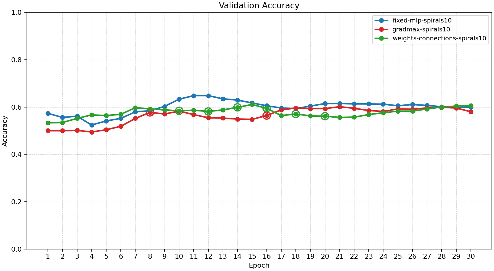
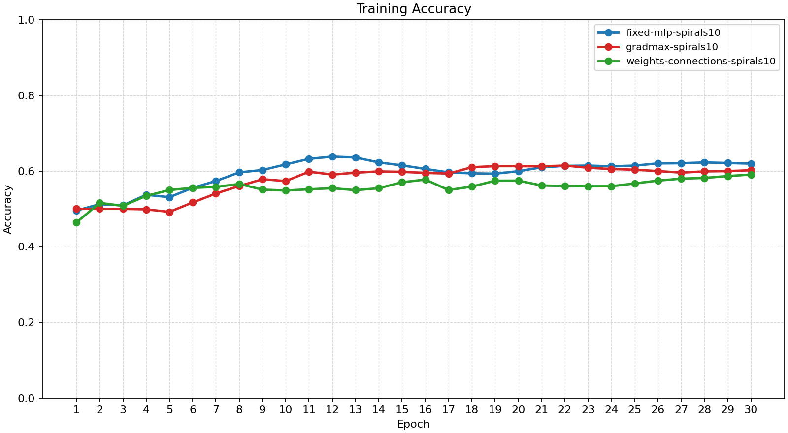
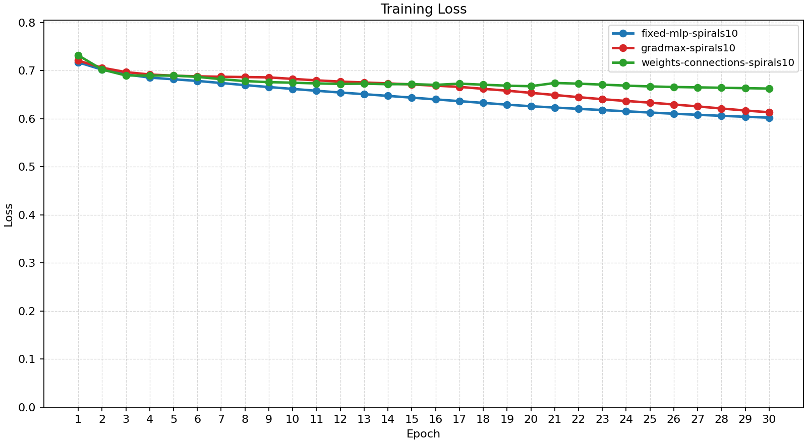
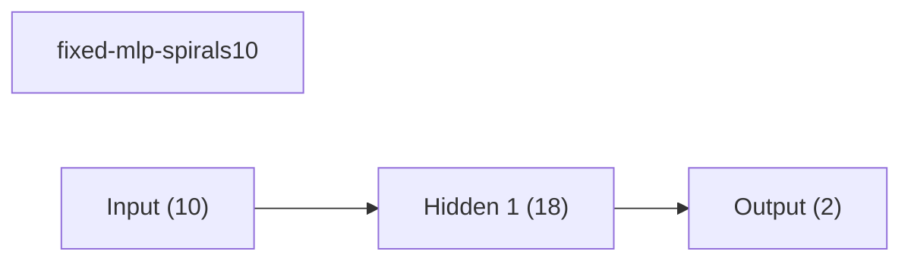
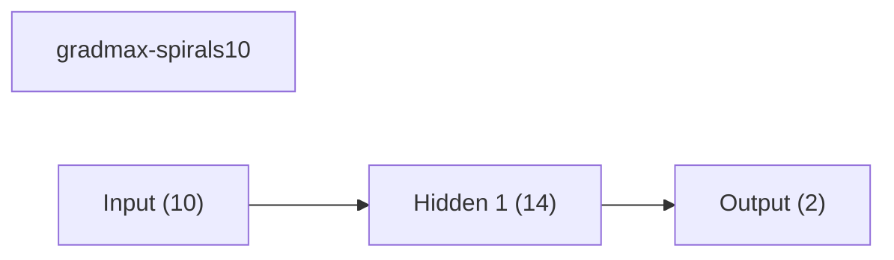
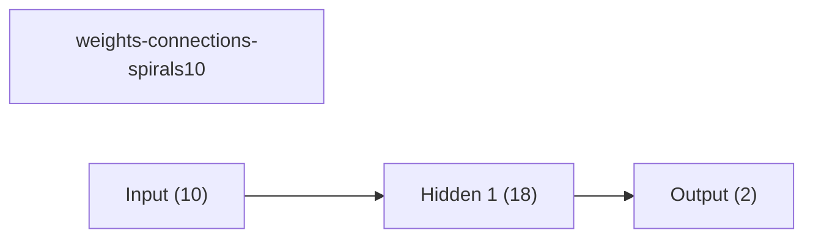
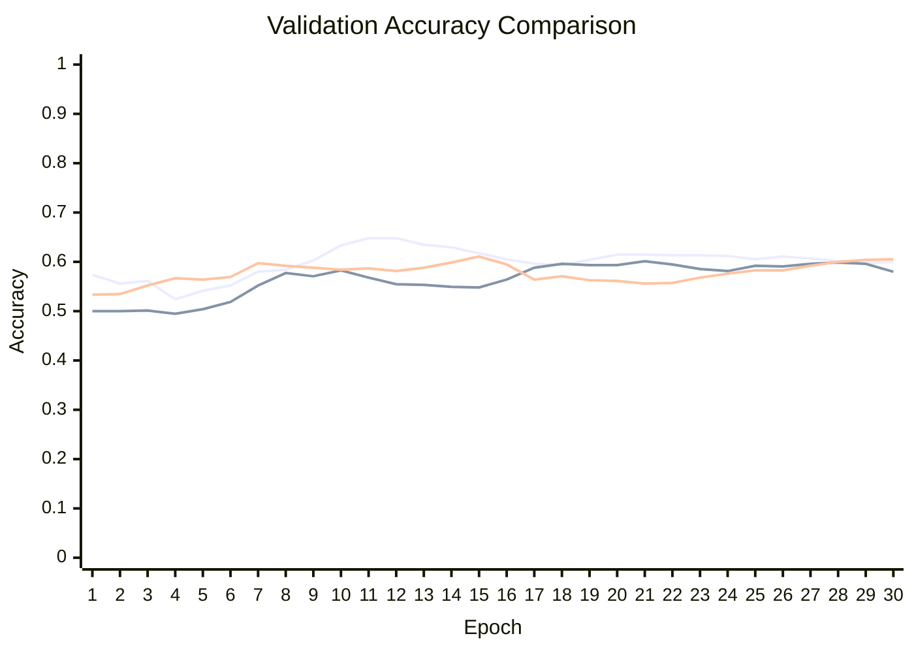

# Baseline Comparison

| Experiment | Type | Epochs | Final train acc | Final val acc | Best val acc | Adaptations | Final hidden dim |
| --- | --- | ---: | ---: | ---: | ---: | ---: | ---: |
| fixed-mlp-spirals10 | baseline | 30 | 0.6194 | 0.6000 | 0.6480 | 0 | - |
| gradmax-spirals10 | dynamic | 30 | 0.6020 | 0.5800 | 0.6013 | 2 | 14 |
| weights-connections-spirals10 | dynamic | 30 | 0.5906 | 0.6053 | 0.6107 | 6 | 18 |

## Validation Accuracy

## Training Accuracy

## Training Loss

## Experiment Notes

- `fixed-mlp-spirals10`: device=cpu; requested_device=auto; torch=2.11.0+cpu; cuda_available=False
- `gradmax-spirals10`: adaptation=gradmax; device=cpu; requested_device=auto; torch=2.11.0+cpu; cuda_available=False
- `weights-connections-spirals10`: adaptation=weights_connections; workflow=scheduled; device=cpu; requested_device=auto; torch=2.11.0+cpu; cuda_available=False

## Constraint Summary

| Experiment | Params | Nonzero params | Weight sparsity | FLOP proxy | Activation elems |
| --- | ---: | ---: | ---: | ---: | ---: |
| fixed-mlp-spirals10 | 236 | 236 | 0.0000 | 452 | 20 |
| gradmax-spirals10 | 184 | 184 | 0.0000 | 352 | 16 |
| weights-connections-spirals10 | 236 | 134 | 0.4722 | 452 | 20 |

## Workflow Stages

### fixed-mlp-spirals10
- train: epochs=30, range=1..30, adaptation_enabled=False, final_val=0.6000000238418579
- workflow_metadata={'configured_total_epochs': 30, 'executed_total_epochs': 30, 'stage_count': 1}

### gradmax-spirals10
- train: epochs=30, range=1..30, adaptation_enabled=True, final_val=0.5799999833106995
- workflow_metadata={'configured_total_epochs': 30, 'executed_total_epochs': 30, 'stage_count': 1}

### weights-connections-spirals10
- dense_warmup: epochs=8, range=1..8, adaptation_enabled=False, final_val=0.5920000076293945
- prune: epochs=12, range=9..20, adaptation_enabled=True, final_val=0.5613333582878113
- finetune: epochs=10, range=21..30, adaptation_enabled=False, final_val=0.6053333282470703
- workflow_metadata={'configured_total_epochs': 30, 'executed_total_epochs': 30, 'stage_count': 3}

## Adaptation Timeline

### gradmax-spirals10
- epoch 8: `net2wider` params={'amount': 2} effect={'applied': True, 'structural_change': True, 'version_delta': 1, 'step_delta': 0, 'hidden_dim_delta': 2, 'num_hidden_layers_delta': 0, 'parameter_count_delta': 26, 'nonzero_parameter_count_delta': 26, 'weight_sparsity_delta': 0.0, 'forward_flop_proxy_delta': 50, 'activation_elements_delta': 2, 'hidden_dims_changed': True} before={'hidden_dim': 10, 'hidden_dims': [10], 'num_hidden_layers': 1, 'masked_weight_count': 0, 'nonzero_parameter_count': 132, 'weight_sparsity': 0.0, 'device': 'cpu', 'supported_events': ['apply_weight_mask', 'grow_hidden', 'insert_hidden_layer', 'net2wider', 'prune_hidden', 'prune_neurons', 'remove_hidden_layer'], 'mask_state_names': ['linear_0.weight', 'linear_1.weight'], 'architecture_family': 'mlp', 'parameter_count': 132, 'forward_flop_proxy': 252, 'activation_elements': 12} after={'hidden_dim': 12, 'hidden_dims': [12], 'num_hidden_layers': 1, 'masked_weight_count': 0, 'nonzero_parameter_count': 158, 'weight_sparsity': 0.0, 'device': 'cpu', 'supported_events': ['apply_weight_mask', 'grow_hidden', 'insert_hidden_layer', 'net2wider', 'prune_hidden', 'prune_neurons', 'remove_hidden_layer'], 'mask_state_names': ['linear_0.weight', 'linear_1.weight'], 'architecture_family': 'mlp', 'parameter_count': 158, 'forward_flop_proxy': 302, 'activation_elements': 14} capabilities=['apply_weight_mask', 'grow_hidden', 'insert_hidden_layer', 'net2wider', 'prune_hidden', 'prune_neurons', 'remove_hidden_layer']
- epoch 16: `net2wider` params={'amount': 2} effect={'applied': True, 'structural_change': True, 'version_delta': 1, 'step_delta': 0, 'hidden_dim_delta': 2, 'num_hidden_layers_delta': 0, 'parameter_count_delta': 26, 'nonzero_parameter_count_delta': 26, 'weight_sparsity_delta': 0.0, 'forward_flop_proxy_delta': 50, 'activation_elements_delta': 2, 'hidden_dims_changed': True} before={'hidden_dim': 12, 'hidden_dims': [12], 'num_hidden_layers': 1, 'masked_weight_count': 0, 'nonzero_parameter_count': 158, 'weight_sparsity': 0.0, 'device': 'cpu', 'supported_events': ['apply_weight_mask', 'grow_hidden', 'insert_hidden_layer', 'net2wider', 'prune_hidden', 'prune_neurons', 'remove_hidden_layer'], 'mask_state_names': ['linear_0.weight', 'linear_1.weight'], 'architecture_family': 'mlp', 'parameter_count': 158, 'forward_flop_proxy': 302, 'activation_elements': 14} after={'hidden_dim': 14, 'hidden_dims': [14], 'num_hidden_layers': 1, 'masked_weight_count': 0, 'nonzero_parameter_count': 184, 'weight_sparsity': 0.0, 'device': 'cpu', 'supported_events': ['apply_weight_mask', 'grow_hidden', 'insert_hidden_layer', 'net2wider', 'prune_hidden', 'prune_neurons', 'remove_hidden_layer'], 'mask_state_names': ['linear_0.weight', 'linear_1.weight'], 'architecture_family': 'mlp', 'parameter_count': 184, 'forward_flop_proxy': 352, 'activation_elements': 16} capabilities=['apply_weight_mask', 'grow_hidden', 'insert_hidden_layer', 'net2wider', 'prune_hidden', 'prune_neurons', 'remove_hidden_layer']

### weights-connections-spirals10
- epoch 10: `apply_weight_mask` params={'threshold': 0.027810515835881233, 'target_sparsity': 0.08} effect={'applied': True, 'structural_change': True, 'version_delta': 1, 'step_delta': 0, 'hidden_dim_delta': 0, 'num_hidden_layers_delta': 0, 'parameter_count_delta': 0, 'nonzero_parameter_count_delta': -17, 'weight_sparsity_delta': 0.0787037037037037, 'forward_flop_proxy_delta': 0, 'activation_elements_delta': 0, 'hidden_dims_changed': False} before={'hidden_dim': 18, 'hidden_dims': [18], 'num_hidden_layers': 1, 'masked_weight_count': 0, 'nonzero_parameter_count': 236, 'weight_sparsity': 0.0, 'device': 'cpu', 'supported_events': ['apply_weight_mask', 'grow_hidden', 'insert_hidden_layer', 'net2wider', 'prune_hidden', 'prune_neurons', 'remove_hidden_layer'], 'mask_state_names': ['linear_0.weight', 'linear_1.weight'], 'architecture_family': 'mlp', 'parameter_count': 236, 'forward_flop_proxy': 452, 'activation_elements': 20} after={'hidden_dim': 18, 'hidden_dims': [18], 'num_hidden_layers': 1, 'masked_weight_count': 17, 'nonzero_parameter_count': 219, 'weight_sparsity': 0.0787037037037037, 'device': 'cpu', 'supported_events': ['apply_weight_mask', 'grow_hidden', 'insert_hidden_layer', 'net2wider', 'prune_hidden', 'prune_neurons', 'remove_hidden_layer'], 'mask_state_names': ['linear_0.weight', 'linear_1.weight'], 'architecture_family': 'mlp', 'parameter_count': 236, 'forward_flop_proxy': 452, 'activation_elements': 20, 'mask_threshold': 0.027810515835881233, 'target_weight_sparsity': 0.08} capabilities=['apply_weight_mask', 'grow_hidden', 'insert_hidden_layer', 'net2wider', 'prune_hidden', 'prune_neurons', 'remove_hidden_layer']
- epoch 12: `apply_weight_mask` params={'threshold': 0.049374934285879135, 'target_sparsity': 0.1587037037037037} effect={'applied': True, 'structural_change': True, 'version_delta': 1, 'step_delta': 0, 'hidden_dim_delta': 0, 'num_hidden_layers_delta': 0, 'parameter_count_delta': 0, 'nonzero_parameter_count_delta': -17, 'weight_sparsity_delta': 0.0787037037037037, 'forward_flop_proxy_delta': 0, 'activation_elements_delta': 0, 'hidden_dims_changed': False} before={'hidden_dim': 18, 'hidden_dims': [18], 'num_hidden_layers': 1, 'masked_weight_count': 17, 'nonzero_parameter_count': 219, 'weight_sparsity': 0.0787037037037037, 'device': 'cpu', 'supported_events': ['apply_weight_mask', 'grow_hidden', 'insert_hidden_layer', 'net2wider', 'prune_hidden', 'prune_neurons', 'remove_hidden_layer'], 'mask_state_names': ['linear_0.weight', 'linear_1.weight'], 'architecture_family': 'mlp', 'parameter_count': 236, 'forward_flop_proxy': 452, 'activation_elements': 20, 'mask_threshold': 0.027810515835881233, 'target_weight_sparsity': 0.08} after={'hidden_dim': 18, 'hidden_dims': [18], 'num_hidden_layers': 1, 'masked_weight_count': 34, 'nonzero_parameter_count': 202, 'weight_sparsity': 0.1574074074074074, 'device': 'cpu', 'supported_events': ['apply_weight_mask', 'grow_hidden', 'insert_hidden_layer', 'net2wider', 'prune_hidden', 'prune_neurons', 'remove_hidden_layer'], 'mask_state_names': ['linear_0.weight', 'linear_1.weight'], 'architecture_family': 'mlp', 'parameter_count': 236, 'forward_flop_proxy': 452, 'activation_elements': 20, 'mask_threshold': 0.049374934285879135, 'target_weight_sparsity': 0.1587037037037037} capabilities=['apply_weight_mask', 'grow_hidden', 'insert_hidden_layer', 'net2wider', 'prune_hidden', 'prune_neurons', 'remove_hidden_layer']
- epoch 14: `apply_weight_mask` params={'threshold': 0.06899179518222809, 'target_sparsity': 0.2374074074074074} effect={'applied': True, 'structural_change': True, 'version_delta': 1, 'step_delta': 0, 'hidden_dim_delta': 0, 'num_hidden_layers_delta': 0, 'parameter_count_delta': 0, 'nonzero_parameter_count_delta': -17, 'weight_sparsity_delta': 0.07870370370370369, 'forward_flop_proxy_delta': 0, 'activation_elements_delta': 0, 'hidden_dims_changed': False} before={'hidden_dim': 18, 'hidden_dims': [18], 'num_hidden_layers': 1, 'masked_weight_count': 34, 'nonzero_parameter_count': 202, 'weight_sparsity': 0.1574074074074074, 'device': 'cpu', 'supported_events': ['apply_weight_mask', 'grow_hidden', 'insert_hidden_layer', 'net2wider', 'prune_hidden', 'prune_neurons', 'remove_hidden_layer'], 'mask_state_names': ['linear_0.weight', 'linear_1.weight'], 'architecture_family': 'mlp', 'parameter_count': 236, 'forward_flop_proxy': 452, 'activation_elements': 20, 'mask_threshold': 0.049374934285879135, 'target_weight_sparsity': 0.1587037037037037} after={'hidden_dim': 18, 'hidden_dims': [18], 'num_hidden_layers': 1, 'masked_weight_count': 51, 'nonzero_parameter_count': 185, 'weight_sparsity': 0.2361111111111111, 'device': 'cpu', 'supported_events': ['apply_weight_mask', 'grow_hidden', 'insert_hidden_layer', 'net2wider', 'prune_hidden', 'prune_neurons', 'remove_hidden_layer'], 'mask_state_names': ['linear_0.weight', 'linear_1.weight'], 'architecture_family': 'mlp', 'parameter_count': 236, 'forward_flop_proxy': 452, 'activation_elements': 20, 'mask_threshold': 0.06899179518222809, 'target_weight_sparsity': 0.2374074074074074} capabilities=['apply_weight_mask', 'grow_hidden', 'insert_hidden_layer', 'net2wider', 'prune_hidden', 'prune_neurons', 'remove_hidden_layer']
- epoch 16: `apply_weight_mask` params={'threshold': 0.09855222702026367, 'target_sparsity': 0.3161111111111111} effect={'applied': True, 'structural_change': True, 'version_delta': 1, 'step_delta': 0, 'hidden_dim_delta': 0, 'num_hidden_layers_delta': 0, 'parameter_count_delta': 0, 'nonzero_parameter_count_delta': -17, 'weight_sparsity_delta': 0.07870370370370372, 'forward_flop_proxy_delta': 0, 'activation_elements_delta': 0, 'hidden_dims_changed': False} before={'hidden_dim': 18, 'hidden_dims': [18], 'num_hidden_layers': 1, 'masked_weight_count': 51, 'nonzero_parameter_count': 185, 'weight_sparsity': 0.2361111111111111, 'device': 'cpu', 'supported_events': ['apply_weight_mask', 'grow_hidden', 'insert_hidden_layer', 'net2wider', 'prune_hidden', 'prune_neurons', 'remove_hidden_layer'], 'mask_state_names': ['linear_0.weight', 'linear_1.weight'], 'architecture_family': 'mlp', 'parameter_count': 236, 'forward_flop_proxy': 452, 'activation_elements': 20, 'mask_threshold': 0.06899179518222809, 'target_weight_sparsity': 0.2374074074074074} after={'hidden_dim': 18, 'hidden_dims': [18], 'num_hidden_layers': 1, 'masked_weight_count': 68, 'nonzero_parameter_count': 168, 'weight_sparsity': 0.3148148148148148, 'device': 'cpu', 'supported_events': ['apply_weight_mask', 'grow_hidden', 'insert_hidden_layer', 'net2wider', 'prune_hidden', 'prune_neurons', 'remove_hidden_layer'], 'mask_state_names': ['linear_0.weight', 'linear_1.weight'], 'architecture_family': 'mlp', 'parameter_count': 236, 'forward_flop_proxy': 452, 'activation_elements': 20, 'mask_threshold': 0.09855222702026367, 'target_weight_sparsity': 0.3161111111111111} capabilities=['apply_weight_mask', 'grow_hidden', 'insert_hidden_layer', 'net2wider', 'prune_hidden', 'prune_neurons', 'remove_hidden_layer']
- epoch 18: `apply_weight_mask` params={'threshold': 0.1196371465921402, 'target_sparsity': 0.39481481481481484} effect={'applied': True, 'structural_change': True, 'version_delta': 1, 'step_delta': 0, 'hidden_dim_delta': 0, 'num_hidden_layers_delta': 0, 'parameter_count_delta': 0, 'nonzero_parameter_count_delta': -17, 'weight_sparsity_delta': 0.07870370370370372, 'forward_flop_proxy_delta': 0, 'activation_elements_delta': 0, 'hidden_dims_changed': False} before={'hidden_dim': 18, 'hidden_dims': [18], 'num_hidden_layers': 1, 'masked_weight_count': 68, 'nonzero_parameter_count': 168, 'weight_sparsity': 0.3148148148148148, 'device': 'cpu', 'supported_events': ['apply_weight_mask', 'grow_hidden', 'insert_hidden_layer', 'net2wider', 'prune_hidden', 'prune_neurons', 'remove_hidden_layer'], 'mask_state_names': ['linear_0.weight', 'linear_1.weight'], 'architecture_family': 'mlp', 'parameter_count': 236, 'forward_flop_proxy': 452, 'activation_elements': 20, 'mask_threshold': 0.09855222702026367, 'target_weight_sparsity': 0.3161111111111111} after={'hidden_dim': 18, 'hidden_dims': [18], 'num_hidden_layers': 1, 'masked_weight_count': 85, 'nonzero_parameter_count': 151, 'weight_sparsity': 0.39351851851851855, 'device': 'cpu', 'supported_events': ['apply_weight_mask', 'grow_hidden', 'insert_hidden_layer', 'net2wider', 'prune_hidden', 'prune_neurons', 'remove_hidden_layer'], 'mask_state_names': ['linear_0.weight', 'linear_1.weight'], 'architecture_family': 'mlp', 'parameter_count': 236, 'forward_flop_proxy': 452, 'activation_elements': 20, 'mask_threshold': 0.1196371465921402, 'target_weight_sparsity': 0.39481481481481484} capabilities=['apply_weight_mask', 'grow_hidden', 'insert_hidden_layer', 'net2wider', 'prune_hidden', 'prune_neurons', 'remove_hidden_layer']
- epoch 20: `apply_weight_mask` params={'threshold': 0.14212003350257874, 'target_sparsity': 0.47351851851851856} effect={'applied': True, 'structural_change': True, 'version_delta': 1, 'step_delta': 0, 'hidden_dim_delta': 0, 'num_hidden_layers_delta': 0, 'parameter_count_delta': 0, 'nonzero_parameter_count_delta': -17, 'weight_sparsity_delta': 0.07870370370370366, 'forward_flop_proxy_delta': 0, 'activation_elements_delta': 0, 'hidden_dims_changed': False} before={'hidden_dim': 18, 'hidden_dims': [18], 'num_hidden_layers': 1, 'masked_weight_count': 85, 'nonzero_parameter_count': 151, 'weight_sparsity': 0.39351851851851855, 'device': 'cpu', 'supported_events': ['apply_weight_mask', 'grow_hidden', 'insert_hidden_layer', 'net2wider', 'prune_hidden', 'prune_neurons', 'remove_hidden_layer'], 'mask_state_names': ['linear_0.weight', 'linear_1.weight'], 'architecture_family': 'mlp', 'parameter_count': 236, 'forward_flop_proxy': 452, 'activation_elements': 20, 'mask_threshold': 0.1196371465921402, 'target_weight_sparsity': 0.39481481481481484} after={'hidden_dim': 18, 'hidden_dims': [18], 'num_hidden_layers': 1, 'masked_weight_count': 102, 'nonzero_parameter_count': 134, 'weight_sparsity': 0.4722222222222222, 'device': 'cpu', 'supported_events': ['apply_weight_mask', 'grow_hidden', 'insert_hidden_layer', 'net2wider', 'prune_hidden', 'prune_neurons', 'remove_hidden_layer'], 'mask_state_names': ['linear_0.weight', 'linear_1.weight'], 'architecture_family': 'mlp', 'parameter_count': 236, 'forward_flop_proxy': 452, 'activation_elements': 20, 'mask_threshold': 0.14212003350257874, 'target_weight_sparsity': 0.47351851851851856} capabilities=['apply_weight_mask', 'grow_hidden', 'insert_hidden_layer', 'net2wider', 'prune_hidden', 'prune_neurons', 'remove_hidden_layer']

## Architecture Graphs

### fixed-mlp-spirals10

### gradmax-spirals10

### weights-connections-spirals10

## Validation Accuracy By Epoch

